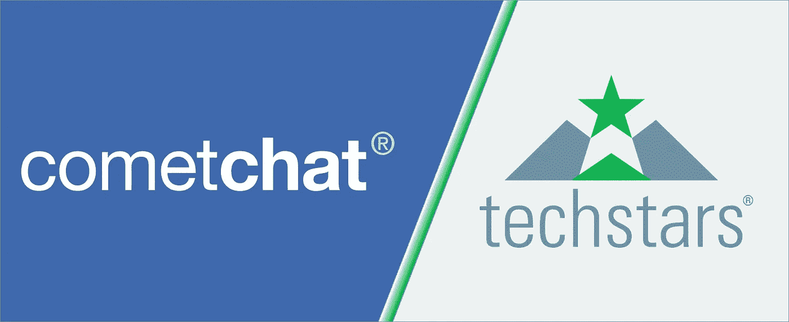

# 加入 Techstars、CometChat Pro 和未来之路…

> 原文：<https://medium.com/hackernoon/joining-techstars-cometchat-pro-and-the-road-ahead-310669920df5>

我非常激动地宣布，CometChat 已被 Techstars 博尔德加速器计划选中！作为第一家入选为期 3 个月的 Techstars Boulder 计划的印度初创公司，我们深感自豪。

由于 Techstars 的接受率不到 1%，这对 CometChat 来说是一个非常大的里程碑。Techstars Boulders 是最精通的加速器项目之一，旨在解决企业的问题，从内到外建立最好的公司，从创始人到领导团队，到公司和他们的社区。他们的校友包括 Sendgrid、DigitalOcean 和 Sphero 等公司。

作为该计划的一部分，Techstars 将在其美国所在地孵化该公司。根据该计划，CometChat 将获得 Techstars 的资源，如导师、财务和终身基础设施资源。这将包括访问由 1 万多名企业家、2700 名投资者和 1200 家校友公司组成的 Techstars 网络。毫无疑问，在我看来，获得如此丰富的人才和产品智慧将有助于使我们的产品对开发者社区非常有用。这是有先例的——数字海洋和 SendGrid 从 Techstars Boulder 毕业后，已经成为开发人员工具箱中最受欢迎的工具。

**等等，还有……**

这一消息恰逢我们将 CometChat 重新设想为两个产品变体——comet chat Go 和 [CometChat Pro](https://www.cometchat.com/pro) 。CometChat Go(我们目前的产品)是一个即插即用的聊天解决方案，适用于随时可用的软件平台，如 WordPress、BuddyPress、SocialEngine 等。鉴于 CometChat Pro 为开发者提供高度可扩展的&模块化聊天 SDK&API。除了节省开发人员在移动应用程序和网站中添加语音、视频&文本聊天的数百个小时之外，CometChat Pro 还帮助开发人员使用他们自己喜欢的技术堆栈和编程语言创建自定义聊天体验。

随着决策权逐渐从公司的首席信息官手中转移到开发者手中，B2D (Business to Developer)初创公司市场正在蓬勃发展，这些公司希望增强开发者的能力，并从不断增长的开发者思维空间中分得一杯羹。我们一直有一种以开发者为中心的心态，这也反映在我们的产品理念中。我们希望帮助开发者在学习曲线的每个阶段，从初学者到专家，在他们的应用程序中实现实时聊天和高清语音/视频通话。

我相信我们正处于 CometChat 旅程中一个重要里程碑的尖端。一方面，Techstars 计划将帮助我们进入美国市场，建立公司渠道，并大幅扩大我们的业务，另一方面，推出 CometChat Pro 和 CometChat Go 将确保我们为高度发展和注重质量的客户做好准备。

展望未来，我们计划通过贡献和对话在开发者社区中变得非常活跃。各种各样的事情正在进行，以满足，交谈和教育世界各地的开发人员。我们希望作为代表他们的声音和为他们服务的产品，在他们心中留下持久的印象。壮大社区将把我们从卑微的自举根基转变为注重增长的企业。

对我们来说，我们的使命很明确- **如果您需要在应用中聊天，请考虑 CometChat！**

**Anant Garg**
创始人，CometChat

*原载于***。**