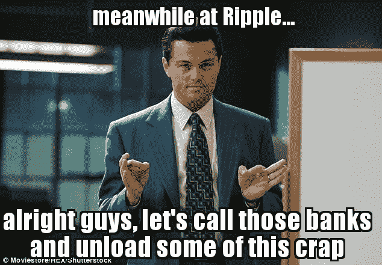

# JPM 币和比特币

> 原文：<https://medium.com/hackernoon/jpm-coin-bitcoin-e3820b925c6>

一个土豆是如何试图与特斯拉竞争的

Roughly accurate

在“加密”的游戏中，有许多噪音、花招和混乱。它既带来了机遇，也带来了挫折，还有很多……嗯:这类废话。

我想花 5 分钟，对两周前的 JPM 硬币新闻发表我的看法。我本想早点发表的，但是我很忙。

在接下来的播客中(前 5 分钟),我确实对此大放厥词，所以想知道“我的真实感受”,听听这里:

加密晒衣绳播客:阿列克斯·斯维茨基

现在……我没有时间对 JPM 币这件事进行真正的深入研究(我正忙着建立一个真正的企业)，所以我会警告下面的内容:“我的假设可能完全错误”，但除非戴蒙公司已经创建了一个开放的、公有的货币网络，可证实是可靠的——我要大胆地说他们没有——然后将 JPM 币与比特币进行比较，甚至暗示它们是类似的东西，就像将特斯拉(比特币)与比特币进行比较一样准确

他们甚至不是一个级别的。

所以……因为我是个大嘴巴，而且我想利用我等待航班延误的时间——我会在下面陈述我的想法:

# 1.JPM·柯恩=戴蒙孤注一掷地试图保持相关性

当我听到“JP 摩根”在“区块链”上发行他们自己的“硬币”时，我不禁笑了。

Surely he’s got fingers in both pies..

Lol。

让我想起了电信公司曾经讨论的“信息高速公路”,它是一种新的通信网络，我们都可以在上面进行视频通话。

他们试图假设人们想要什么，这确保了互联网；一个由公众拥有的网络，不做任何假设，提供数据包路由服务——*最终成为所有创新发生的地方。*

值得注意的是:因为电信公司不能“拥有”互联网，因为他们只能是这个新通信网络的入口和出口，所以他们试图建立自己的网络。

尝试过的。
又失败了。非常好。通信大多是自由的，作为自由的一部分，开放社会通常更难控制和编造虚假的故事。

信息，或者我们今天称之为数据，想要免费，我们对它的渴望是无限的，正如我们称之为互联网的事物的广度所证明的。

> “那些想拥有互联网并依赖互联网的人，现在依赖互联网了”

30 年后的今天，我们在做着同样的事情。只是这一次，有了一个新的社会层面:金钱。

现在，钱是一个全新的交易——而且争议更大。这是一个建立在沟通基础上的合作网络，沟通是一种资源。

它在许多方面比沟通更强大，因为它的核心原则已经随着时间的推移被遗忘了(或者被方便地掩盖了)，所以用它来玩游戏要容易得多。

运行错误的叙事——货币是政府和央行的领域——要容易得多，在这个过程中，在社会中制造不对称，有利于寻租者，而不利于真正的进步和创新。

**但是** —物理就是物理。你只能在一条河流上筑坝这么久，直到大自然接管并吞没它。

维系当前金融基础设施的虚假叙事将会土崩瓦解。不是一个“如果”，而是一个“什么时候”。

就像我们重新发明通信和信息一样；我们现在正在重塑金钱、价值和广泛合作的概念，真正的零到一的创新需要彻底的改革——而不仅仅是一个小的、增量的更新。

这就是为什么听这个 JPM 硬币新闻，我听到了 30 年前 AOL & Telco 的回声。

无论你有多少钱或影响力，你都无法与零比一竞争——因为零比一的设计(很大程度上)是为了将你从等式中移除，并改变平衡。JPM &现有的一群人不会这样对待自己，不管他们怎么说“区块链”、“颠覆”或“创新”。

比特币和 JPM 币毫无相似之处，JPM 币也不是什么“新闻”。

**如果你想确保戴蒙的财务前景，那就买 JPM 硬币吧。**

**如果你想确保你拥有——买比特币**

# 2.涟漪…Lol

我从来就不喜欢里普、跛子、XRP——不管这些天你想怎么称呼它。

JPM 硬币最有趣的部分是我们现在可以说:

**爆料:JPM 币**

**沃克:比特币**

**跛子:涟漪**

他们一直在宣布关于公告的“公告”,假装银行真的想使用他们的技术，是时候让 XRP 粉丝俱乐部从银行界得到一些东西来动摇他们的盲目信仰了。

或许这将让比特币制造者有更多的时间专注于将世界金融基础设施改造成合理的东西，而 JPM 和 Ripple 将一决雌雄(尽管我在这里可能过于乐观)。

Multicoin Capital 的男孩们；[Tushar Jain](https://medium.com/u/dbb5ee99b1f8?source=post_page-----e3820b925c6--------------------------------)&[Kyle Samani](https://medium.com/u/2e8de4ec5cc0?source=post_page-----e3820b925c6--------------------------------)写了一份关于 Ripple 的最好的报告(见下文)，所以当他们有时间的时候，也许他们也会对 JPM 币做一次深入的研究。

 [## 涟漪(XRP)分析-多重资本

### 下面是一份执行摘要。下载我们完整的 12 页分析:执行摘要 Ripple 是一个…

多重资本](https://multicoin.capital/2017/08/31/xrp2017/) 

就目前而言；可以说:

一个土豆不能在比赛中击败特斯拉，同样；

***比特币& JPM 币根本不是一个档次的。***

戴蒙将利用短暂的术语“区块链”来帮助营销他的新产品，并肯定会在此过程中赚到一些钱；但是真正的创新，没有人预见到的“互联网的 facebook”即将到来，这一切都将建立在一个开放、公开、兼容 lindy、健全、强大的数字货币网络上。

用安东尼·蓬皮亚诺的话说:

> ***长比特币。***
> 
> ***空头银行家***

大声抱怨。该登机了。再见。

像往常一样:

如果你喜欢这篇文章，请给它一点爱，为它鼓掌(或几下),并把它传给任何你认为应该读一读的人。

**阿列克斯**

**CEO &联合创始人@ Amber Labs**

[www.getamber.io](http://www.getamber.io)

你可以在这里找到更多我的作品:

 [## 亚历山大·斯维茨基—中等

### 琥珀实验室的首席执行官+decentralizedpodcast.com.au 的共同主持人。比特币、金钱、哲学、商业、初创企业和企业家精神的出口

medium.com](/@AleksandarSvetski)  [## 亚历山大·斯维茨基——黑客正午

### 阅读《黑客正午》中亚历山大·斯维特斯基的文章。CEO @ www.getamber.io + Co 主持人@decentralizedpodcast.com.au…

hackernoon.com](https://hackernoon.com/@AleksandarSvetski) 

您可以在这里联系我:

 [## 亚历山大·斯维特斯基|职业简介| LinkedIn

### 查看 Aleksandar Svetski 在 LinkedIn 上的职业简介。LinkedIn 是世界上最大的商业网络，帮助…

www.linkedin.com](https://www.linkedin.com/in/alekssvetski/)  [## 亚历山大·斯维茨基(@亚历山大·斯维茨基)|推特

### Aleksandar Svetski 的最新推文(@AleksSvetski)。对金钱、BTC、人类学感兴趣的无毛黑猩猩…

twitter.com](https://twitter.com/AleksSvetski)