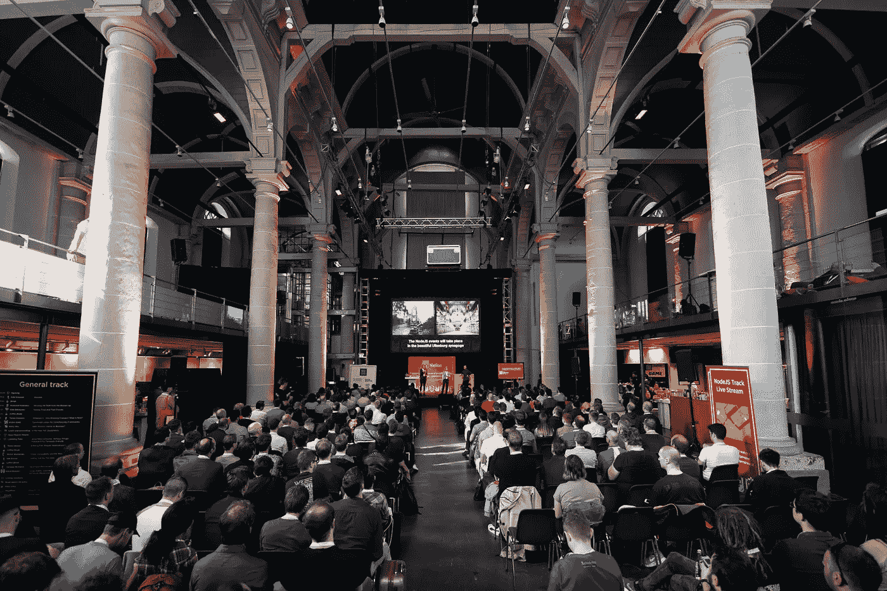
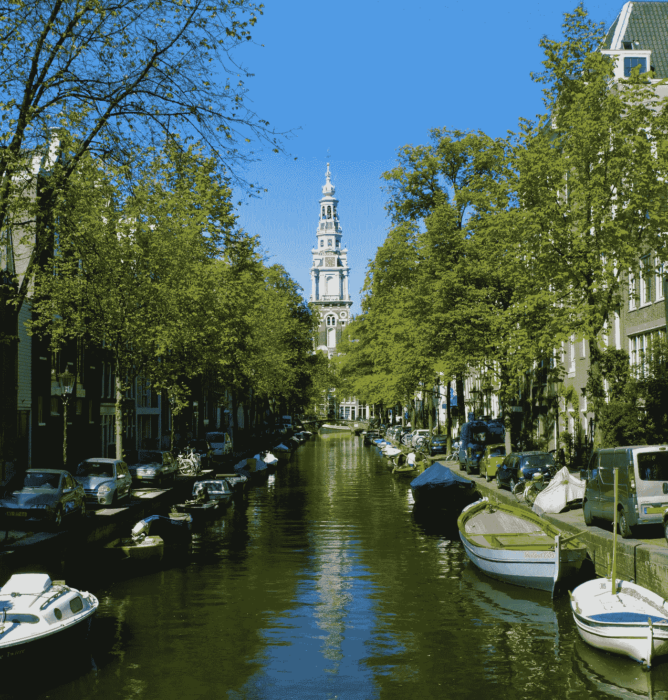
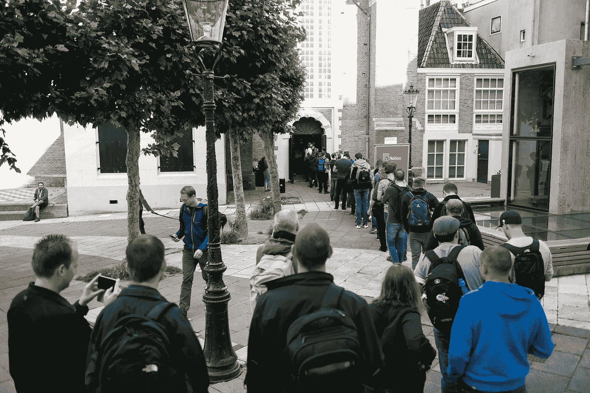
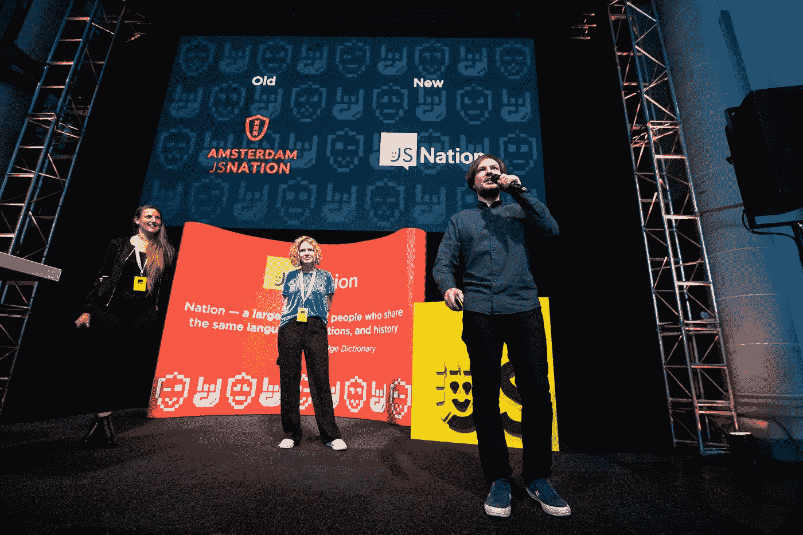
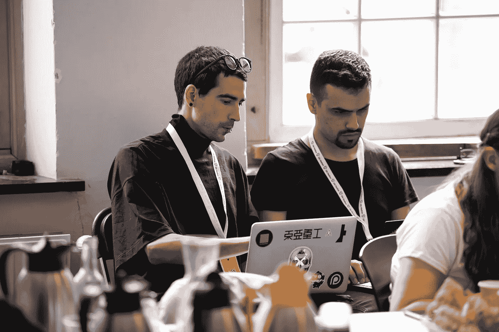
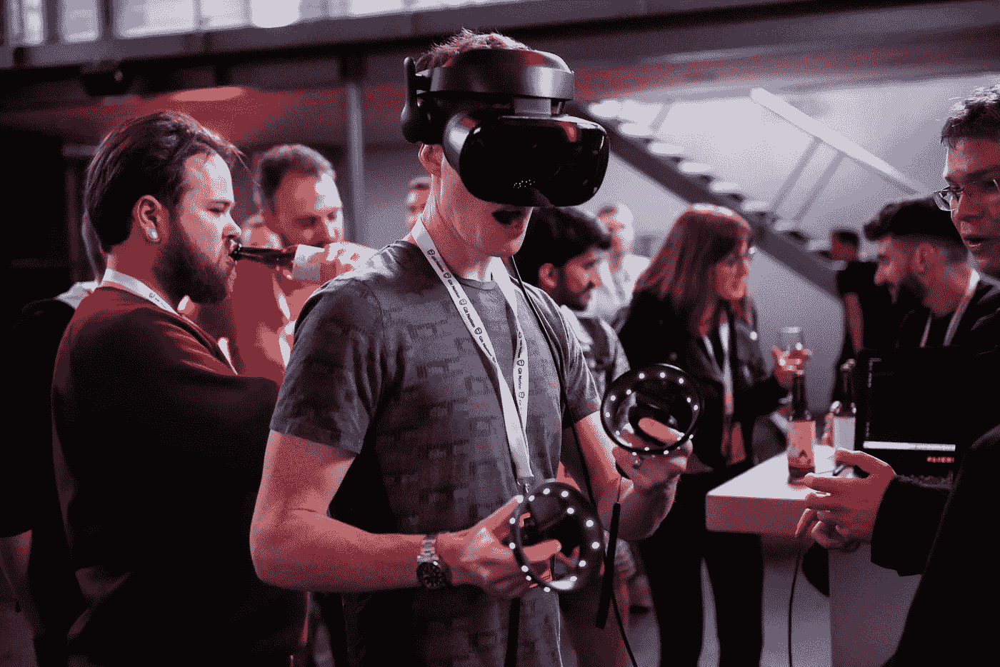

# JSNation 感想:不确定是否值得参加 JS 会议？别多想，走就是了！

> 原文：<https://medium.com/hackernoon/jsnation-afterthoughts-not-sure-if-its-worth-visiting-a-js-conference-don-t-think-much-just-go-aeb7785b936e>

## 在阿姆斯特丹发生的一切——都留在阿姆斯特丹。虽然有些事情当然应该这样，但其他事情，比如上周举行的 JSNation 会议，确实值得分享。

JSNation, Amsterdam, June 5–8, 2019

*上周末，我在阿姆斯特丹呆了三天，与欧洲和美国一些最进步的网络开发者交谈。这是一个事件的总结，从一个广告文案的角度来看，他恰好就是我。我在 Soshace.com 的***工作，我们帮助 JSNation 在活动之前和期间进行了* [*采访*](https://blog.soshace.com/en/2019/05/17/soshace-becomes-an-informational-partner-of-js-nation-in-amsterdam/) *。**

*皮肤上感觉像天鹅绒般柔软的新鲜空气；雨，当它来的时候，像芭蕾舞者的鞋子一样淅淅沥沥；流向四面八方的水装点着这座城市，让它焕发青春——这是我对阿姆斯特丹的第一印象，一直持续到我旅行的最后。*

*6 月 7 日，会议当天，早上 7 点左右，我们和几个演讲者从我们住的船上被船长接走，当他听说我们没有时间游遍运河，而是必须尽早直接去参加会议时，他似乎有点沮丧。尽管如此，他还是设法绕了一圈，谈论我们经过的建筑，这些地方的历史，电影博物馆，希区柯克的鸟在那里得到了修复，还有石头脑袋，等等。*

**

*Amsterdam canals (source: [depositphotos](http://depositphotos.com))*

*我们几乎是在教堂周围，当我们进入一条非常狭窄的运河时，那里有一棵在昨晚的风暴中倒下的大树。我们认为这是把船长留在身后，准备自己出发的信号。我们出发了，用谷歌地图四处漫游，直到我们找到了镇上最美丽的教堂。原来就是那个地方。*

**

*waiting to get in*

*场地太棒了。Zuiderkerk 建于 17 世纪，是古老的石头和彩色玻璃，有一种 G-d 的神圣笼子的氛围。正如一位发言者所说，它感觉像一个 JavaScript 寺庙。至少对 6 月 7 日来说，这的确是最进步、最引人入胜的会谈。*

*这场秀绝对是以我见过的最好的主持人开始的，来自“阳光”奥斯陆的 Max Salnikov ，走上舞台，让观众热身，介绍主持人和阵容。真正让我惊讶的是 Max 似乎总是保持着超级好的心情——即使在会议结束时，他仍然充满了积极的能量和令人感动的强大的氛围，这种氛围感染了人群。*

**

*Max on stage*

*会议以[凯尔·辛普森](https://twitter.com/getify)作为主题发言人开始，他的演讲题目是“继续押注 JS”这是一个令人惊叹的演讲，充满了对美国航天历史的典故和参考，以及开发人员社区如何从航天工业的困难中吸取教训，并改变 web 开发的未来。JavaScript 的反对者们早在那时就预言，JS 将有一天无法满足现代发展的需求，但 Kyle 确信 JS 已经到来并会继续存在。然而，Kyle 说，JS 的发展方向和方式完全取决于社区、生态系统和开源技术的扩展。*

*Kyle 简要地讲述了他自己的 JavaScript 之旅，以及他如何感觉到总是缺乏关于该语言的适当和清晰的信息:权威指南和 cliffnotes 要么太短，要么太大，要么太枯燥。他意识到他的目的可能是弥补现有的知识差距，并感到有必要写这个系列，他后来命名为“你不知道 JS。”当他谈论 ES5、ES6、es 2016-es 2019 之间的差异时，我一直在观察观众，这绝对是一种美丽的体验:人们被凯尔的魅力迷住了，有一个人坐在我旁边，张着嘴听了凯尔的讲话，持续了大约 40 分钟。*

*在演讲的间隙，我设法和这次活动的一些赞助商聊了聊，比如 [DAZN](https://twitter.com/daznglobal) 和[Reaktor](https://twitter.com/ReaktorNow)；来自 DAZN 的家伙虽然是一名技术招聘人员，但对开发并不太感兴趣，他说 Kyle 的演讲是他完全可以理解的:他对 Kyle 的愿景和魅力以及演示的总体信息感到惊讶，即未来取决于并属于我们每一个人。*

**

*Kyle and the future*

*然后是 Krzysztof Kotowicz 关于可信类型的演讲， [Gleb Bahmutov](https://twitter.com/bahmutov) 关于 Cypress 的测试， [Tobias Koppers](https://twitter.com/wSokra) 关于 Webpack 即将到来的变化，以及 [Henry Zhou](https://twitter.com/left_pad) 关于他的开源之旅；我很高兴在会议前后采访了这三个人。如果你有兴趣在活动结束后听他们说，你必须等到所有的采访和电影都结束了。所以耐心点，慢慢来，你自己会明白的。*

*当 Gleb Bahmutov 在台上台下开着玩笑，拿测试开玩笑的时候， [Andre Staltz](https://twitter.com/andrestaltz) 对他选择的演讲主题功能性镜头非常认真。我后来采访的人，包括 Reaktor 的代表，都对 Andre 谈到的一切的实用性和适用性感到特别惊讶。*

**

*Andre (on the right) unexpectedly prepares for the afterparty performance*

*在午餐休息和一些闪电般的谈话后，明科·格切夫登上了舞台，并完全搞定了。我已经提到过，虽然我之前看过的 Minko 的其他演讲都因为他的语速而难以处理，但 JSNation 2019 的演讲是他有史以来最轻松的演讲。这非常令人兴奋，也非常容易理解。Minko 谈到了构建快速 Angular 应用程序，这个主题让 MC Max 非常兴奋，因为他在 Angular 工作，实际上他还在 JS Nation 2018 上发表了关于框架性能问题的演讲。*

*然后，有 [Michel Weststrate](https://twitter.com/mweststrate) (因 Immer 获得 OSS 奖)谈论不变性和代理；Mat Groves ，他凭借 PixiJS 创造出的所有东西让观众震惊不已； [Christian Bromann](https://twitter.com/bromann) 讲述 WebDriver 的自动化性能测试，最后， [David Rousset](https://twitter.com/davrous) 讲述如何使用 WebGL 和 PWA 为触摸、鼠标和 VR 设备构建适应性游戏。*

*Mat Groves 和 David Rousset 的演讲让每个观众都粘在了屏幕上，因为他们做的工作有太多精彩的视觉效果和有形的表现:观众在欢呼，每个人都忘记了他们的手机，只是盯着舞台上发生的所有壮丽的美景。大卫戴上他的虚拟现实眼镜，玩他创造的游戏，而每个人都在看着一个最安静的时刻，完全和绝对的敬畏。在那些视频会谈中，每个人都停止了发微博，甚至格列布·巴赫穆托夫，他在会议期间几乎一直在发微博，所以这真的很值得一看，尽管在一天结束时，除了会后聚会，没有人似乎关心任何事情。结果——不尽然；我们都在看舞台上的其他人玩他们自己的游戏或现场展示他们的创作。*

*我在主厅的整整 12 个小时就像飞越了布谷鸟的巢，这意味着，我感觉就像刚刚进来，走来走去，都超级兴奋。我在会议期间得到的最好(也是最差)的赞美是 Gleb Bahmutov 说他实际上可以通过看我的头发来说出时间，因为早上 7 点的时候一切都很整洁，到了下午 6 点，我完全看起来一团糟。但是我从来没有注意到，因为时间过得太快了。我早上 7 点开始工作，晚上 7 点左右结束，我认为整个过程不超过 3 个小时，因为能够与每个人交谈是一种非常棒的体验。*

*会议结束后不久，我和主持人 Max 走出大楼，他说“天哪，我答应过大家今天天气会很好。”但是雨下得很大，马克斯看起来很难过。然而，在 60 秒完全过去之前，他说:“哦，无论如何，我们都要和每个人去派对。”我说:“好吧，就是这种精神。”*

*庆功宴超级刺激。然而，在派对之前，在演讲者的晚宴上，马克斯提到，如果有人出现在会后派对上，那么这个活动就被认为是超级成功的。你可能不会相信，聚会的大厅超级拥挤。每个人都在喝酒，社交，交换号码和名片，听着超级怪异的音乐，伴随着同样怪异的视觉效果。感觉非常自然。一些你能联想到或感觉到你属于的东西。*

**

*Mat Groves trying out David Rousset’s VR glasses at the afterparty*

*如果你曾经想过是否值得去欧洲或美国参加另一个 JS 会议，不要想太多。快走吧。*

*图片和现场采访将很快公布，但你仍然可以从两个大厅观看录制的直播流。*

*JS 总馆:*

*NodeJS 大厅:*

**我是来自 Soshace.com***的一名文案，一个网站开发者招聘平台。如果你有一个有趣的故事要讲，在 Twitter 上 ping 我@*[*MaryVorontsov*](https://twitter.com/MaryVorontsov)**