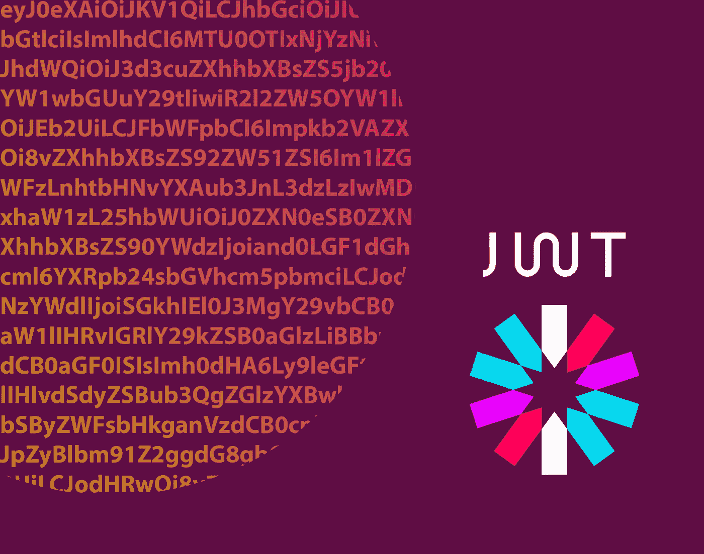
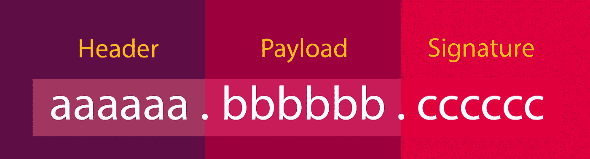
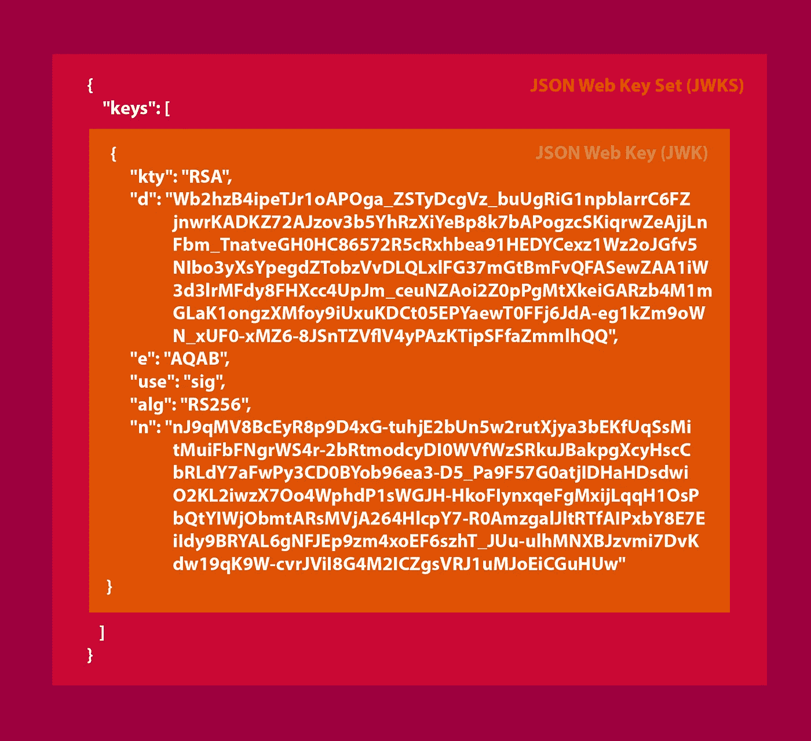
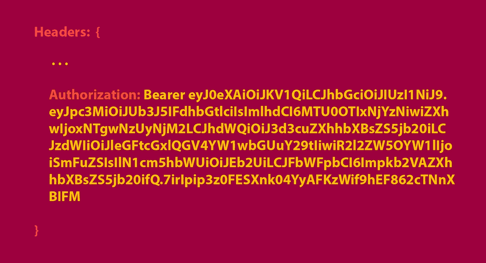
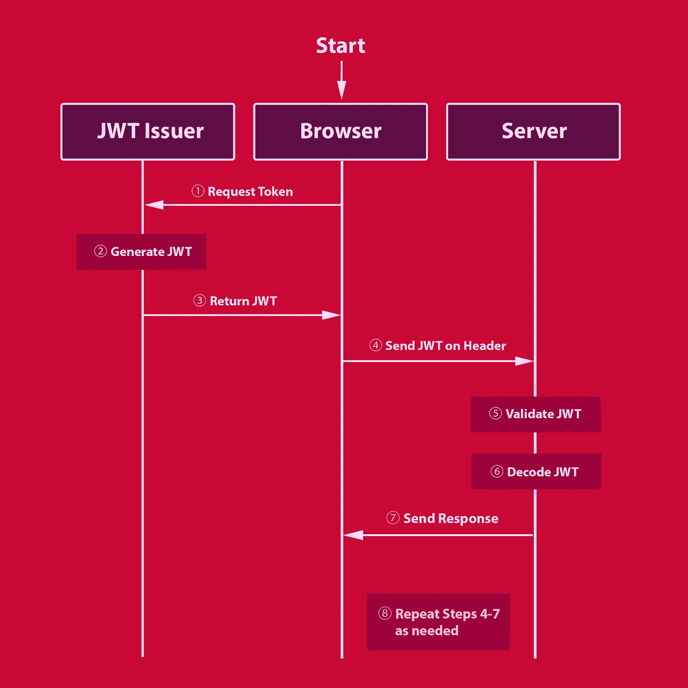

# JSON Web 令牌(JWT)揭秘

> 原文：<https://medium.com/hackernoon/json-web-tokens-jwt-demystified-f7e202249640>



JSON Web Token (JWT，通常读作“jot”)是一个强大的工具，可以通过令牌在双方之间可靠地传输数据。这些团体可以由用户、服务器或任何其他服务组合组成。基于开放标准(RFC-7519)，jwt 使用加密算法进行数字签名，因此接收方可以信任其中包含的信息。在计算机安全中这个概念被称为*数据* *完整性。*

使用 JWT 的一个主要好处是它非常紧凑(假设发行者使用 *JWS 紧凑序列化*，这是推荐的)。它们通常足够小，可以通过 POST 请求、在 HTTP 头中发送，甚至作为 URL 中的查询字符串发送。然而，你添加到 JWT 的声明越多，它就变得越臃肿。您*可以*在理论上创建一个超过 URL 最大长度的 JWT(大约 2000 个字符)，但是不要这样做！最好只添加接收方*需要*的信息。

JWT 也是自包含的，这意味着 JWT 可以巧妙地包含:

*   关于用户的识别信息
*   用户可以访问的内容
*   截止日期
*   用于内容验证的签名
*   *任何其他可序列化的信息*

请记住，任何人都可以在不知道私钥的情况下解码 JWT 中包含的信息。由于这个原因，你不应该把密码或密钥这样的秘密信息放在 JWT 中。JWT 的目的不是加密数据，使其无法在传输过程中被读取(这就是 SSL)，而是让接收方相信接收到的数据在传输过程中没有被更改。这样一来，我们就可以深入了解 JWT 的构成了。

# JWT 的结构

每个 JWT 都是用相同的结构生成的。有三个部分，中间用句号隔开。每个部分都由包含该令牌特定信息的`base64url`编码的 JSON 组成。让我们来分解下面的各个部分:



**表头:**

第一部分被称为*割台*。这是包含一些关键信息的地方:

*   `alg`:用于令牌签名的算法(例如`HS256`用于 *HMAC SHA-256，或者* `RS256`用于 RSA SHA-256)。建议使用`RS256`,因为它使用非对称(公共/私有)密钥，而不是依赖共享的私有密钥。
*   `x5t`:可选的证书指纹，包含对应于所使用的加密密钥的`X.509`证书的`base64url`编码的 SHA-1。
*   `jku`:JSON Web Key(JWK)URL。我们将在下面的 JWK(S) 小节中介绍这一点。
*   `kid`:可选参数，表示使用了哪个加密密钥。这可以用作向接收者发出密钥已被更改的信号。
*   `typ`:令牌的类型。该参数是完全可选的，但是如果是预置的，建议该值为“JWT”(总是大写)

这并不是您在本节中可以找到的所有参数的完整列表，而是您可能会遇到的一些更常见参数的重点。你可能已经注意到这一部分的主题是加密——这也是为什么你可能会看到这一部分被称为 *JSON Web Encryption (JWE)头*。

**有效载荷(索赔):**

第二部分是*有效负载*(也称为*声明*)，JWT 发行者可以在其中为接收方存储自定义信息。有效载荷中可以使用三种类型的声明:*公共*、*私有*和*注册*。

*   公共声明必须是抗冲突的——所以它们应该是非常独特的，以确保没有两个公共声明有相同的名字。所有公共声明都应该在 *IANA JSON Web 令牌注册中心*中定义，或者定义为包含唯一名称空间的 URI。
*   **另一方面，私有声明**不必是抗冲突的，并且可以被命名为任何名称，只要发布方和接收方双方同意声明的使用。由于显而易见的原因，它也不能与公开的或注册的权利主张相冲突。
*   **已注册的权利要求**是为特定目的保留的通用定义的权利要求。一些常见的注册索赔是:
*   `aud`:代币受众(代币面向谁)
*   `exp`:numeric date 格式的令牌过期。
*   `iat`:令牌发布时间(发布时间)
*   `iss`:令牌发放者
*   `jti`:令牌的唯一标识符
*   `nbf`:不接受令牌之前的时间(不是之前)
*   `sub`:令牌的主题

**签名:**

最后一部分是*签名*。这使得 JWT 安全，并确保您的 JWT 在运输过程中的完整性。签名只是用 JWT 生成的所有内容的散列。这意味着，如果 JWT 的任何部分发生变化，签名将失效，从而导致 JWT 的畸形。一个 JWT 用一个 *JSON Web 算法(JWA)* 签名。生成`RS256`签名的算法如下所示:

```
RSASHA256(
  *base64UrlEncode*(**header**) + "." + *base64UrlEncode*(**payload**),
  **secret**
)
```

正如您所看到的，该算法将经过`base64url`编码的*报头*和*有效载荷*与一个句点连接在一起，并用一个`secret`密钥对其进行签名，该密钥只有生成 JWT 的服务才知道。你也可以看到这被称为 *JSON 网络签名(JWS)* 。

*   **重要提示** : *总是*在接收端验证你的 jwt。假设 JWT 中的声明只是简单的`base64url`编码，您可以解码 JWT，而不需要实际验证它来自哪里，或者它是否被正确签名。如果在解码时不验证 JWT，任何人都可以向您的应用程序发送定制的 JWT，从而使安全性变得无用。大多数 JWT 包和中间件会自动为您处理验证，但不要认为它们都会。

如果您的发行者使用`RS256`(或另一种不对称算法)来签署令牌，您将需要一个公钥来验证令牌。但是如何获得公钥呢？很棒的问题！也是我们下一个话题的完美引子。

# JWK

JSON Web Key (JWK)是一个 JSON 对象，它包含一个众所周知的公钥，可用于验证已签名 JWT 的签名。

如果您的 JWT 的发行者使用非对称密钥来签署 JWT，它可能会托管一个名为 JSON Web Key Set (JWKS)的文件。JWKS 是一个包含属性`keys`的 JSON 对象，该属性反过来保存一个 JWK 对象数组。请参见下面的 JWKS 示例:



该服务可能仅使用一个 JWK 来验证 web 令牌，但是如果该服务轮换签名证书，则 JWK 可能包含多个密钥。检索 JWK 的端点可能会有所不同，应该为您的发行者记录下来。例如，auth0 的标准位置是:`https://YOUR-TENANT.auth0.com/.well-known/jwks.json`。另一方面，Okta 利用`jwks_uri`元数据来存储端点。其他人可以利用上面讨论的`jku` JWE 报头参数。

每当您的应用程序验证一个 JWT 时，它都会尝试从发行者那里检索 JWK，以确保 JWT 签名与内容匹配。像`node-jsonwebtoken`这样的开源包使这个过程变得简单。

# JWT 用法

JWT 通常通过 HTTP `Authorization`报头作为承载令牌附加到 HTTP 请求上。请参见下面的示例(为便于阅读，添加了换行符):



每个请求都必须将 JWT 发送到后端，这是一个需要考虑的权衡。这种方法的最大好处是，它提供了一种无状态的身份验证形式，因为服务器不必记住会话存储中的用户信息，从而大大减少了在后端管理该状态所需的工作量。一个缺点是，由于 jwt 是无状态的，如果不存储会话状态，就不能使它们无效。jwt 在过期后会自动失效，但是根据过期时间的长短(通常为 10 小时)，用户可以在删除后保留对服务的访问。

# 把所有的放在一起

理解生成和使用 JWT 背后的理论是很重要的，但我总是发现一个实际的例子有助于巩固理解。因此，我将为大家展示一个使用 JWT 的典型流程图:



我想通过指出仅仅为了发送 JWT 而向服务器发送 JWT 是很奇怪的来澄清步骤 4-7。JWT 应该伴随实际的协议请求，如 HTTP 请求(`POST` / `PUT` / `GET` / `DELETE`)，作为该特定请求的凭证。此外，通过使用`Authorization`头，它使您的查询字符串和有效负载没有多余的数据，因此它们可以保持整洁和集中。

感谢阅读，如果你觉得有用，请留下一些掌声！