# 朱莉娅:未来网络安全的语言

> 原文：<https://medium.com/hackernoon/julia-a-language-for-the-future-of-cybersecurity-76f13b869924>

## 2018 年发布了 Julia 1.0。这是一种既有 python 的高级简单性，又有 c 的低级性能的语言。

Julia 是一种相对较新的语言，旨在拥有 C 的性能和 Python 的简单性。Julia 能够毫无困难地执行数据分析，同时以具有竞争力的性能发布代码，有望成为金融科技行业的强大工具。但是我认为就目前 T2 网络安全的趋势来看，它也有很大的潜力。


Julia, Image from [Medium](/syncedreview/julia-1-0-released-b13916e61b7)

在这篇文章中，我将解释为什么 Julia 也可以成为**网络安全**未来的一个伟大工具。同时，我会分享我是如何在我的 **Mac** 电脑上写了一个 Julia 脚本来破解一个用**凯撒码移位**和**列换位**加密的密文。最后，我将在附录中分享一些性能比较和该项目的代码。

# **密码学，从凯撒密码转移到生物认证**

首先让我们回顾一下网络安全的一些基础知识。我们如何加密信息和认证用户。我们将回顾一下代码示例中涉及到的老式的凯撒码移位和列换位。然后，我们将讨论生物认证，以及为什么 Julia 可以成为未来网络安全的重要工具。

## 凯撒码移位和列换位

作为人类，我们彼此交流，但有时我们不希望每个人都知道我们在交流什么。自古罗马以来，朱利叶斯·凯撒就一直通过在信息中转换密码字母来发送秘密军事信息。例如,“A”将被转换为“B”,“Z”将被转换为“A”。“HAL”一词将被转换为“IBM”。这项技术后来以他的名字命名，被称为凯撒密码。

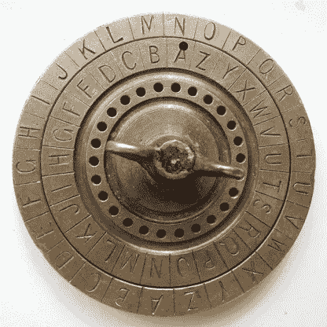

A Caesar cipher disk, image from [Wikipedia](https://en.wikipedia.org/wiki/Caesar_cipher)

这种基于代码转换的加密存在巨大的漏洞。在第二次世界大战早期，数学家们分析了每个字母在德国出现的频率。通过比较频率条形图，他们能够计算出这种变化。这个故事延伸到德国人如何发明了“谜”,以及艾伦·图灵(T21)如何设法用他的巨型计算机破解了它。


Enigma, image from [BT.com](http://home.bt.com/tech-gadgets/enigma-machine-cracking-artificial-intelligence-11364235568160)

我们还使用了许多其他技术来加密信息。还有一个是 [**柱状换位**](http://practicalcryptography.com/ciphers/columnar-transposition-cipher/) 。其中包括将文本放入表格，然后重新排列各列并读回文本。

A video demo of columnar transposition

其他加密方法如 **RSA** 、 **ECC** 和 **MD5** 被广泛用于在互联网上安全地发送信息。例如，RSA 是一种**非对称加密**，它利用了**素数**的特性。

## 生物识别认证和人工智能

我们的祖先第一次利用**生物识别认证**可能比他们开始玩代码转换要早得多。人们通过看不同的脸来区分彼此。再比如，指纹被广泛用作一个人的身份证明。后来，技术公司使用它来提供简单快速的设备认证用户体验。例如，iPhone 上的**触控 ID** 。


Touch ID illustrated, image from [Cult of Mac](https://www.cultofmac.com/498052/ios-11-lets-quickly-disable-touch-id-prevent-forced-unlocks/)

**生物特征分析**作为**人机交互**的一个子分支，广泛应用于各种应用中。众所周知 [**趋势**](https://thenextweb.com/artificial-intelligence/2017/05/10/artificial-intelligence-revolutionizing-human-computer-interaction/) 将会有更多的人工智能应用于人机交互领域，这在相关 [**会议**](https://iui.acm.org/2019/) 中被广泛鼓励。根据我对数百份出版物的调查，机器学习、计算机视觉和数据分析已被证明对生物识别认证领域有很大影响。数据科学和人工智能将成为**网络安全**中 [**防御者**](https://www.cnbc.com/2016/04/05/biometrics-future-of-digital-cyber-security.html) 和 [**攻击者**](https://gizmodo.com/ai-can-now-fake-fingerprints-that-fool-biometric-id-sca-1830464777) 双方的有用工具。

## 为什么朱莉娅很重要？

作为一门为**数据科学**、**机器学习**和其他流行技术设计的语言，Julia 让研究变得更容易，同时又不会牺牲太多性能。这是一种专为我们设计的语言，可以让我们不用用另一种语言重写就能发布我们的数据科学算法。

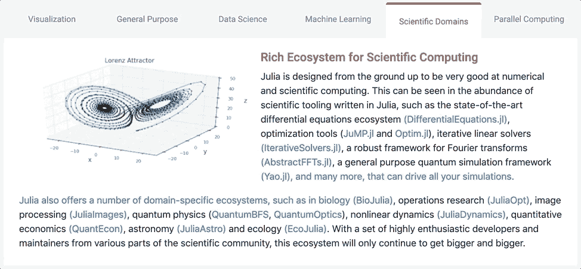

Julia is a powerful tool for Data Science and Machine Learning

随着数据科学和人工智能越来越多地涉及网络安全，这也需要在其相关应用程序中有良好的表现，Julia 肯定会成为一个得心应手的人选。想了解它是如何工作的吗？让我们马上看一个例子！

# 用朱莉娅破解凯撒码移位和列换位

> kuhpvibqkvoswhxbpofuxhrpvlddwvoskpredvvidwqrbbgllbbpkqunrvohqeirlwokkrdd

我被要求破译上述密文。暗示是它是用**凯撒码移位**和**柱状换位**加密的，密钥长度小于 10。解密这些秘密消息通常涉及某种暴力方法，这在计算上可能是昂贵的。为了降低它的一些复杂性，与字典的碰撞也是必要的。

为了让它更快，我首先想到的是 **C** 。但是这些头文件和内存管理可能会很难处理。另一方面，Python 有强大的库和极简语法支持，但是牺牲了很多速度。经过一番考虑后，我最终和茱莉亚做了这件事。

## 1.入门指南

现在让我们开始吧！

首先，我们将不得不下载 Julia 的一个 **Mac 版本**的下载可以在 [**这里**](https://julialang.org/downloads/) 找到。其他版本和信息也可以访问官方 [**下载页面**](https://julialang.org/downloads/) 。

下载完成后，我们可以通过双击应用图标打开**命令行控制台**。


Opening Julia’s Command Line Console

要运行任何保存为本地文件的脚本，我们可以使用**命令行控制台**中的 ***include()*** 命令:

```
include("<PATH_TO_YOUR_JULIA_SCRIPT>/hello_world.jl")
```

文件名的扩展名为 ***。jl*** 。

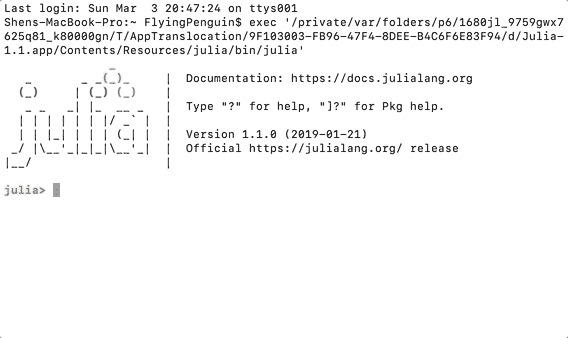

Running Local Script in Julia

现在为了完成这个项目，我们还需要**导入**两个包:

*   我们将需要使用**组合学**来为列转置生成置换
*   我们需要显示解密进度的**进度条**。

我们可以用下面的命令做到这一点。

安装**组合学**:

```
#import Pkg; Pkg.add("Combinatorics")
```

安装**进程表**:

```
import Pkg; Pkg.add("ProgressMeter")
```

我们还需要一个字典文件，可以从 [**这里**](https://github.com/first20hours/google-10000-english/blob/master/google-10000-english.txt) 下载。字典中包含了常用的英语单词，我们可以在未来使用这些单词来与我们的密文进行冲突。

## 2.导入密文和英文词频

我们可以像在任何其他语言中一样在 Julia 中定义一个字符串，并且我们不需要指定类型。 ***println()*** 函数像 Java 等其他语言一样将字符串打印到新的一行。字符串用逗号**而不是加号**连接**。**

```
cipherText = "KUHPVIBQKVOSHWHXBPOFUXHRPVLLDDWVOSKWPREDDVVIDWQRBHBGLLBBPKQUNRVOHQEIRLWOKKRDD"
println("Begin to decrypt cipher text: ", cipherText)
```

每个字母在英语中出现的频率不同，在这里可以找到一个列表 [**这里**](https://code.activestate.com/recipes/142813-deciphering-caesar-code/) 。不同来源的统计数据可能略有不同。我们可以用下面的命令在 Julia 中定义一个浮点列表。

```
println("Initializing frequency array for ENGLISH...")
ENGLISH = [0.0749, 0.0129, 0.0354, 0.0362, 0.1400, 0.0218, 0.0174, 0.0422, 0.0665, 0.0027, 0.0047, 0.0357, 
           0.0339, 0.0674, 0.0737, 0.0243, 0.0026, 0.0614, 0.0695, 0.0985, 0.0300, 0.0116, 0.0169, 0.0028, 
           0.0164, 0.0004]
```

现在我们要对每个字母进行计数，所以我们必须创建一个 0 的列表，其大小与英语中的字母表相同。我们可以用下面的命令做到这一点。列表的长度可以用***【length()***来检索。我们可以用 ***Int()*** 将一个字符强制转换为整数。可以使用 ***"+="*** 运算符增加数值。Julia 中的 for 循环如下所示:

```
counts = zeros(length(ENGLISH))
for letter in cipherText
 code = Int(letter) - Int('A')
 if code < 1
  code += 26
 end
 counts[code] += 1
end
```

英语中的字母表有多少种，我们就做多少种转换，总共 26 种转换，包括无转换。我们可以用 ***circshift()*** 函数来实现。

```
variances = zeros(length(ENGLISH))
for shift in 0:length(ENGLISH) - 1
 println("Applying inverse caesar shift: ", shift)
 shiftedCounts = circshift(counts, -1 * shift)
 variance = sum(broadcast(abs, ((shiftedCounts / length(cipherText) - ENGLISH) / ENGLISH)))
 variances[shift + 1] = variance;
end
println("The variance for each shift is calculated to be: \n", variances)
minshift = argmin(variances)
```

在 for 循环中，我们计算每个字母表的计数频率和它们在英语单词中的频率之差。减法和除法可以直接在列表级完成。函数 ***boardcast()*** 将 ***abs()*** 函数映射到类似于 **Scheme** 或 **Java Script** 的列表内的每个元素。 ***sum()*** 函数求出列表的总和。每个字母的方差除以它们在英语中的频率，因此方差不受字母出现频率的影响。

```
variance = sum(broadcast(abs, ((counts / length(cipherText) - ENGLISH) / ENGLISH)))
```

列表操作工作类似于 ***Python*** ，而 ***。****用于乘法运算。还不支持从数组中减去整数这样的功能。更多信息可以在 [**官方文档**](https://docs.julialang.org/en/v1/base/arrays/index.html) 中找到。

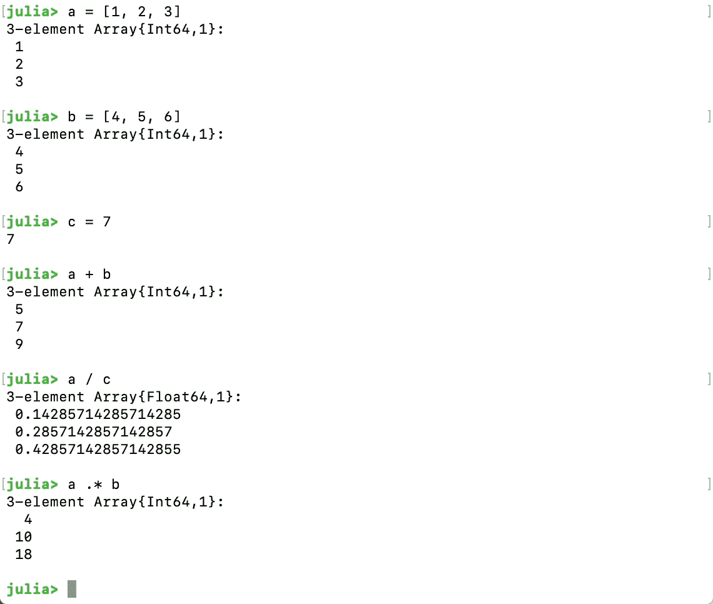

Array Operations in Julia

现在，如果我们运行代码，我们应该得到以下结果，程序计算出**最合理的移动是 3** 。

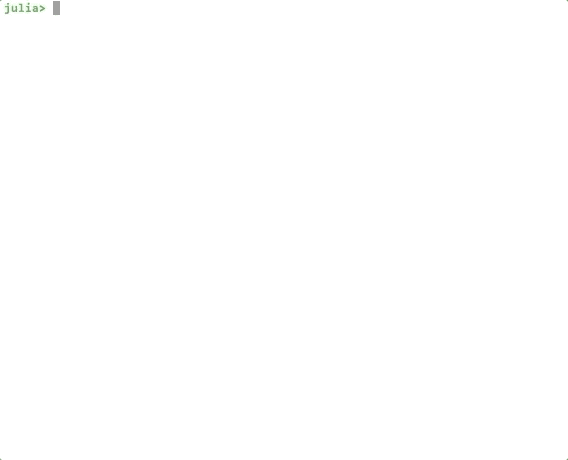

Finding the Best Shift

现在我们可以用下面的脚本打印移位后的字符串。 **Char()** 函数将整数代码转换回字符， **append！()**函数将字符追加到列表中， **join()** 函数将**字符列表**连接成一个**字符串**。

```
shiftedTextList = []
for letter in cipherText
 code = Int(letter) - minshift
 if code < Int('A')
  code += 26
 end
 append!(shiftedTextList, Char(code))
end
shiftedText = join(shiftedTextList)
println("Deciphering minimal variance shifted text: ", shiftedText, " with columnar transposition...")
```

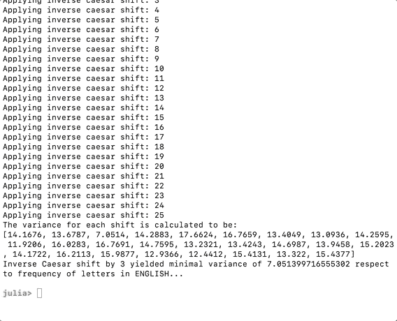

Most Plausible Shift String Printed

## 3.应用列转置&利用字典冲突

首先，我们必须引用我们在前面几节中安装的必要的包，我们可以用下面的代码这样做。这些声明可以在使用之前放在任何地方，而不是必须放在代码的顶部。

```
using Combinatorics
using ProgressMeter
```

然后我们可以用下面的代码导入我们的字典。

```
filename = "<PATH_TO_YOUR_DICTIONARY_FILE>/google-10000-english.txt"
println("Loading common words DICTIONARY from: ", filename)
DICTIONARY = readlines(filename)
```

在我们保存并运行代码之后，这应该会打印出字典的一个片段。

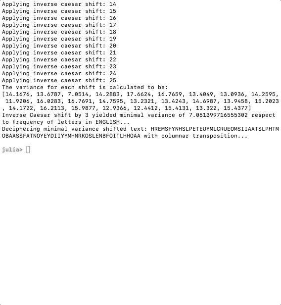

Loading Dictionary File In Julia

现在我们要**构造列矩阵**和**遍历每个排列**。下面的代码将完成这项工作。

```
for width in 2:3
 println("Applying columnar transposition with width: ", width)
 matrix = []
 height = Int(ceil(length(shiftedText) / width))
 total = width * height
 for index in 1:total
  if index <= length(shiftedText)
   append!(matrix, shiftedText[index])
  else
   append!(matrix, "?")
  end
 end
 matrix = reshape(matrix, (height, width))
 orders = collect(permutations(collect(1:width)))
 println(matrix)
 println(orders)
end
```

***ceil()*** 函数**将数字向上舍入到最接近的整数。我们用 ***“填补空白？”*** 。 ***reshape()*** 函数**将矩阵**整形到**指定的尺寸**。我们用***permutations()***生成订单，它将一个元素列表作为输入，并返回所有可能的排列。输入是用***collect(1:width)***生成的，其中 collect 将***【1:width】***范围转换成一个集合，换句话说就是一个列表。**

现在，在**保存并重新加载**之后，我们应该会看到重新构建的列表打印出排列。**分号**表示一个**新行**。

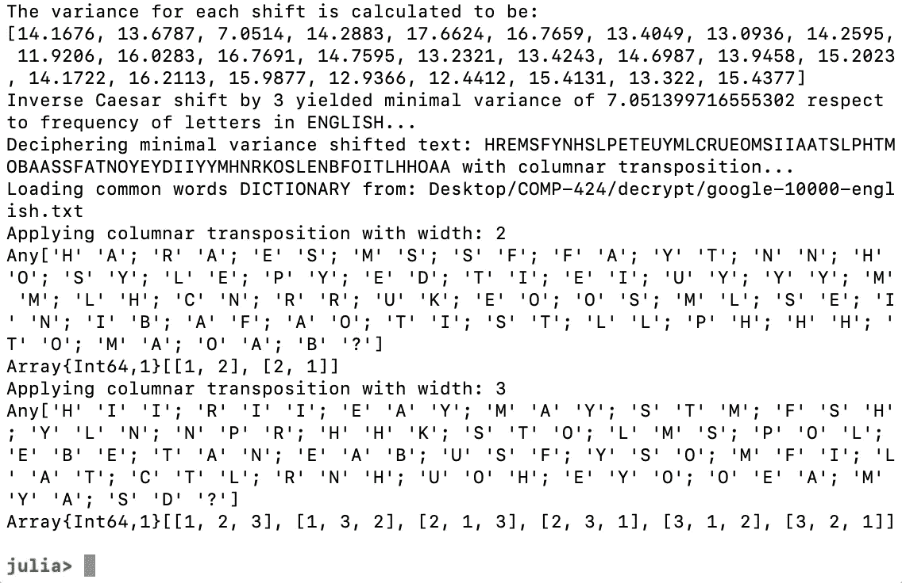

Columnar Tables and Permutations printed in Julia

在我们进行排列之前，我们应该显示一个**进度条**，因为这个任务需要一些时间。我们不想坐在那里怀疑这个项目是否还在运行。对于我们已经导入的包，循环之前的代码**将初始化进度条。**

```
n = length(orders)
p = Progress(n, 1, "Computing all permutations:", 50, :black)
```

我们把这个放在循环的最后，让**更新**进度条。关于如何使用 **ProgressMeter** 的更多信息，请看这里[](https://github.com/timholy/ProgressMeter.jl)**。**

```
next!(p)
```

**字典冲突的完整代码可以在下面找到。其中它使用 ***大写()*** 将字典中的单词大写， ***occursin()*** 查看它是否出现在重新排列的文本中。一旦常用词在重新排列的文本中占了很大一部分，它就会将它们打印出来，并跟踪常用词比例最高的排列。**

```
completed = 0
n = length(orders)
p = Progress(n, 1, "Computing all permutations:", 50, :black)
bestPlainText = "?"
bestPlainTextCommonPercentage = 0
for permutation in orders
 plainTextMatrix = []
 for row in 1:height
  for columnIndex in 1:width
   char = matrix[row, permutation[columnIndex]]
   if char != '?'
    append!(plainTextMatrix, char)
   end
  end
 end
 plainText = join(plainTextMatrix)
 wordCount = 0
 wordLengthSum = 0
 words = []
 for word in DICTIONARY
  if length(uppercase(word)) > 3 && occursin(uppercase(word), plainText)
   wordCount += 1;
   wordLengthSum += length(word)
   push!(words, uppercase(word))
  end
 end
 percentageCommon = wordLengthSum / length(plainText) * 100
 if percentageCommon > 50
  println("\rColumnar transposition with the order of: ", permutation, " yielded a string containing ", wordCount, " common word(s) which makes it ", percentageCommon, "% common words, below is the string:\n", plainText, "\ncontaining the words:\n", words)
  if percentageCommon > bestPlainTextCommonPercentage
   bestPlainText = plainText
   bestPlainTextCommonPercentage = percentageCommon
  end
  println("Currently, the best plain text is:\n", bestPlainText, " which is ", bestPlainTextCommonPercentage, "% common words...")
 end
 next!(p)
end
```

**这个算法并不完美，如果有重叠的单词，这个百分比可能会超过 100%。让它变得完美需要做太多的工作，因为你必须考虑所有的单词排列，所以现在让我们坚持快速和肮脏的方法。这里的百分比也只是作为参考。**

**在我们进行测试之前，我们还必须**将表的最大宽度**增加到 10，因为我们从提示中知道这是键的最大长度。**

**我们改变:**

```
for width in 2:3
```

**变成:**

```
for width in 2:10
```

**我们应该**删除**之前的测试代码:**

```
println(matrix)
println(orders)
```

**现在我们应该能够保存并启动代码了。**

**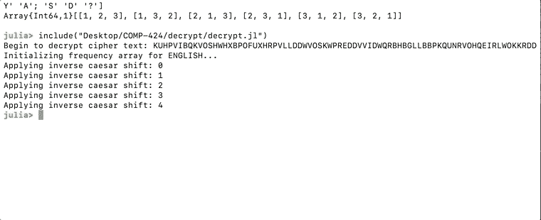**

**Deciphering with Julia Scripts**

**一段时间后，我们应该会看到纯文本被打印出来，因为它包含了最高比例的常用词。该文本被破译为:**

> **behappyforemmentthismonentisyourlife by khayyamahandalsothisclassisreallyfun**

**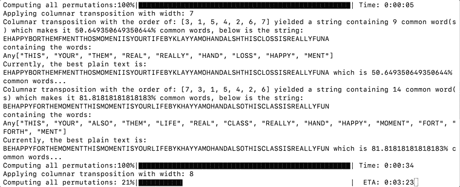**

**Julia Script Successfully Decrypted the Text**

**恭喜你！！！你刚刚学会了如何在 Julia 中编写一个密文破解程序！希望这是你探索这门语言的一个良好开端。**

# **最后…**

**Julia 是一种简单而强大的数据分析语言。您可以通过下面的链接了解有关其性能的更多信息:**

*   **[**Python、Julia、Matlab、IDL、Java 基础对比(2018 版)**](https://modelingguru.nasa.gov/docs/DOC-2676)**
*   **[**Python、Julia、R、Matlab 和 IDL 的基本比较**](https://modelingguru.nasa.gov/docs/DOC-2625)**
*   **[**一个 C、Julia、Python、Numba、Cython 对 LU 因式分解的速度比较**](https://www.ibm.com/developerworks/community/blogs/jfp/entry/A_Comparison_Of_C_Julia_Python_Numba_Cython_Scipy_and_BLAS_on_LU_Factorization?lang=en)**

**你会看到 **Julia** 的性能在更大的输入规模上远远领先于 **Python** ，在矩阵计算上甚至超过了 **C** 。矩阵计算广泛应用于机器学习和数据科学，输入大小一般会变得非常大。**

**我是一个充满激情的程序员，喜欢学习新的东西并与社区分享。如果你有什么特别想看的，请告诉我。我现在主要关注**人工智能**、**人机交互**和**机器人**，但是我可以写很多东西。**

**我可以继续写关于 Julia 的文章，可能还会写一点关于数据科学的文章。我的许多研究工作是保密的，但一旦它们被公开，我将有很多东西可以分享。我还可以在 **Julia** 中重新创建**数据科学模型**，就像我在 **Unity C#** 中如何在他们的机器学习模块构建好之前编写一个**人工神经网络**。希望你和我一样喜欢学习这些很酷的新东西！**

**我已将该项目的完整代码附在附录中。**

# **附录(该项目的完整代码):**

**Complete Julia Code for decrypt.jl**

**我的代码在总共 16 个小时后完成了所有的排列:**

**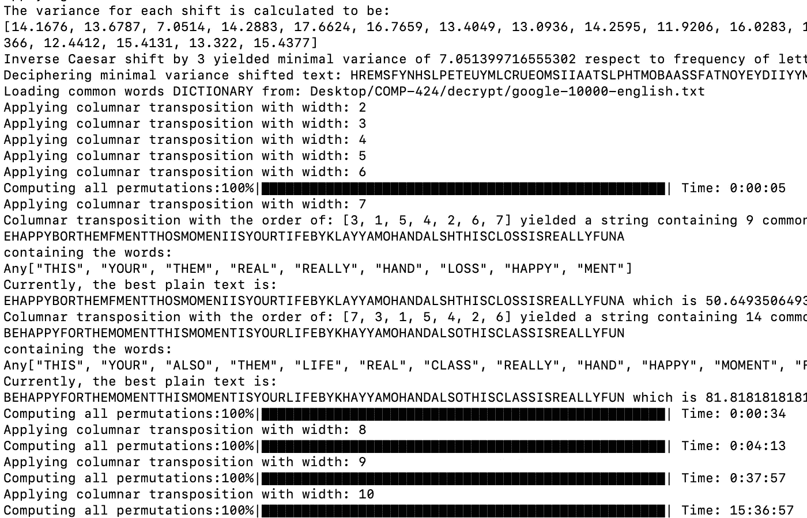**