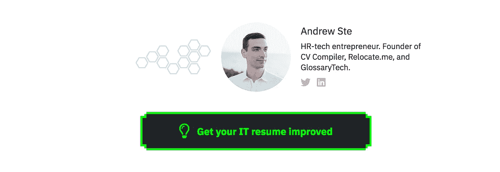
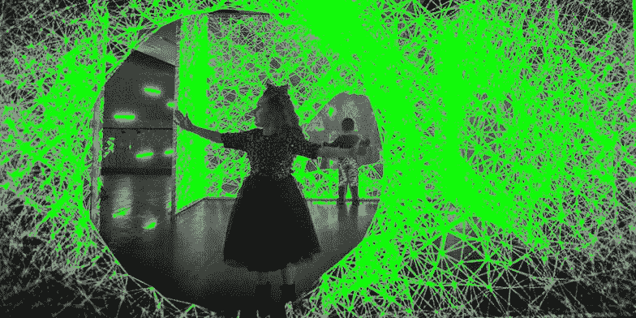
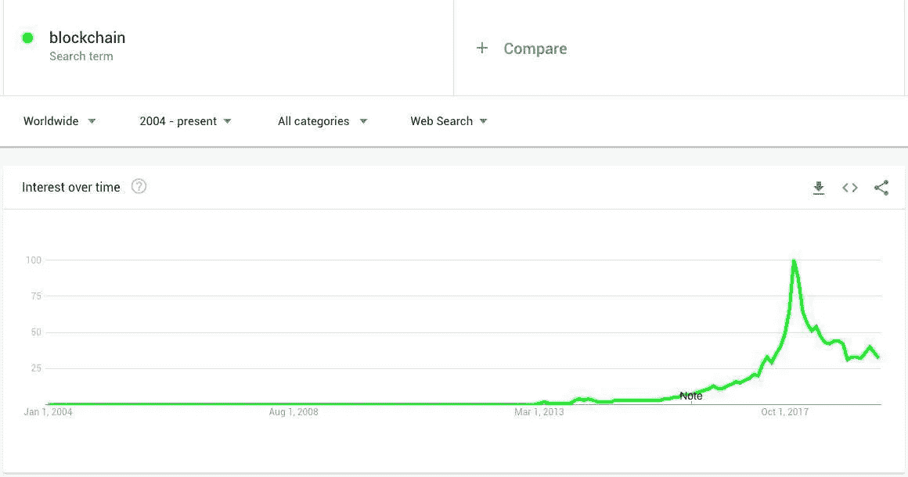
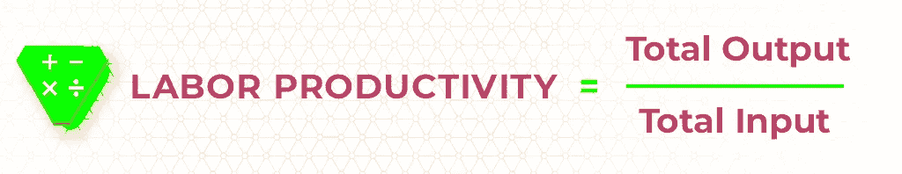
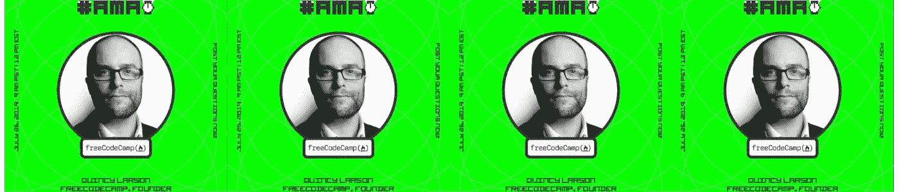

# 七月最佳科技故事

> 原文：<https://medium.com/hackernoon/julys-best-tech-stories-b35ebfa6838e>

## 顶级技术阅读 07/2019

## 论脸书的《天秤座》和隐私之死：适应性神经系统；月亮；次经济学；黑暗数据；还有更多。七月最佳科技故事

# 嘿黑客们，

这周我为你准备了一些非常好的科技读物*。*

## *但是首先！*

***让我们从 5 个你可能还不知道的关于** [**黑客正午 2.0**](http://hackernoon.com) **的趣事开始吧:***

*   ***对于我们永远的读者来说，** [**黑客正午**](http://hackernoon.com) 誓言**无付费墙**，**无弹出广告**，以及——永远——有趣、有见地、 ***见多识广*内容**。*
*   ***为我们撰稿** *(还有——****嘿还有*** 👋**——那些还没有自认为是《黑客正午》特约撰稿人的人——*[***为什么不是***](https://help.hackernoon.com/app/page/1gRbkfKlrfqztzZDQzHGp4v2U0G36alVmE7iODP4d9rg) ***..？？*🤷‍♀️ *)* 我们提供**优质内容分发**、**社区访问**和**编辑专业知识。******
*   **另外:一个有趣的新 [**可定制作家简介召唤一个**](https://help.hackernoon.com/app/page/1HNTGwm_UAfdEv9nEKmZHjQHRJtYgLnMIEZ6Vw_ZRZvQ)**action**！🔊下面是一个 Andrew Ste 使用 CTA 为他的软件增加流量从而改善简历的例子:**

****

*   **哦，你完全拥有自己的所有内容。 [*当然是*](https://help.hackernoon.com/app/page/1GIKv2WAa7ojJ7aepSh_-A8g_C19EocBxexe3p3vkc8I) 。**
*   **黑客正午靠赞助运行。[我们希望直接与打造塑造我们世界的技术的品牌合作](http://sponsor.hackernoon.com)。我们不会通过个性化广告将 Hacker Noon 的[技术发布平台](http://hackernoon.com)货币化。我们出售[网站广告牌](https://sponsor.hackernoon.com/#billboard)和[品牌作为作者帖子](https://sponsor.hackernoon.com/#brandasauthor)。**

# **重要的是…以下是 7 月份最热门的科技故事。**

## **👉[脸书的天秤座意味着隐私的死亡](https://hackernoon.com/facebooks-libra-means-the-death-of-privacy-6q1wg3a6u)**

****

> **想象一个反乌托邦社会。你看到了什么？用《银翼杀手 2077》的审美想象一个世界？**想得更深。什么能推动这样一个社会，把权力借给掌权的人？或许可以是比特币。或者，更具体和准确地说，**一种由垄断和专制实体运营的许可加密货币**用于控制所有购买和互动。****
> 
> ****<** [**阅读更多**](https://hackernoon.com/facebooks-libra-means-the-death-of-privacy-6q1wg3a6u) **>****

**—by[**joa Kim hjnnevg**](https://hackernoon.com/@Joakim):*区块链 Lead @ aXpire***

**🏆**脸书的《天秤座》获得了 2019 # noones 年度定义密码时刻** **和** [**诱饵与开关奖**](https://noonies.hackernoon.com/award/cjxvroowo6fry0b408hu8xcos) **的提名。** [**愿互联网上最优秀和最差的人和产品胜出！**](https://noonies.hackernoon.com/)**

## **👉自适应神经系统的下一步是什么？**

> **自深度学习革命开始以来，神经网络中就存在一种趋势，这种趋势可以用一个词来简洁地概括:**规模。****
> 
> ****<******>**阅读更多****

****——by[**曾 Seddiqi**](https://hackernoon.com/@hadsed) : *科学家；工程师*****

## ****👉[接受加密货币捐赠的五大非营利组织](https://hackernoon.com/top-5-nonprofits-ngo-that-accept-cryptocurrency-as-donation-eu2u8381d)****

> ****由于全球交易的不可逆性、透明性和安全性，加密货币已经成为国际捐赠的最佳方式。为了帮助**鼓励个人把他们的密码给那些正在改变世界的组织**，这里列出了一些接受密码的非营利组织。****
> 
> ******<** [**阅读更多**](https://hackernoon.com/top-5-nonprofits-ngo-that-accept-cryptocurrency-as-donation-eu2u8381d) **>******

****— by [**大卫·史密斯**](https://hackernoon.com/@davidsmith) : *企业家；CEO 区块链爱好者*****

## ****👉[为什么我要与“风投界的女性”全球社区一起推出 She-VC？](https://hackernoon.com/why-am-i-launching-she-vc-with-women-in-vc-global-community-b8e933487823)****

********

> ****风险投资通常被称为“兄弟行业”——原因有很多。有人告诉我，我可能是体育风险投资基金中的第一位女性普通合伙人——我很震惊**我们仍然在谈论 2019 年的第一次。******
> 
> ********<** [**阅读更多**](https://hackernoon.com/why-am-i-launching-she-vc-with-women-in-vc-global-community-b8e933487823) **>********

******—by[**Gayatri Sarkar**](https://hackernoon.com/@GayatriSarkar)**:***风险投资人；前美联储，IBM，惠普；两个创业公司的创始人。*******

********🏆**[**SHE-VC**](https://women-in-vc-staging.herokuapp.com/)**——全球最大的风险投资领域女性寻找彼此、联系、协作的全球目录——已获得 2019 #**[**noones**](https://noonies.hackernoon.com/)**中** [**最精彩创业**](https://noonies.hackernoon.com/award/cjxvr21986dum0b40dbq83ew6) **的提名。** [**今日投票**](https://noonies.hackernoon.com/award/cjxvr21986dum0b40dbq83ew6) **！********

## ******👉科技繁荣带来的意想不到的挑战******

************

> ******(a+b) = a + b + 2ab。还记得这个古老的数学公式吗？如果我在这个等式中添加另一个变量/维度，会发生什么？结果改变；展开的规则不再有效。规则和法律必须随着新变量的引入而改变和完善。******
> 
> ********<** [**阅读更多**](https://hackernoon.com/technology-an-added-dimension-03pj3jps) **>********

******— by [**阿迪提**](https://hackernoon.com/@aditiBhatnagar) **:** *科技爱好者；活动家；工程师*******

## ******👉[暗数据的电源状态](https://hackernoon.com/the-power-state-of-dark-data-vm1mm3yo0)******

> ******暗数据是组织不知道和/或找不到的数据；别介意使用。******
> 
> ********<** [**阅读更多**](https://hackernoon.com/the-power-state-of-dark-data-vm1mm3yo0) **>********

******— by [**埃马姆**](https://hackernoon.com/@Elimam)**:***Analytics @ Jajja Media Group*******

## ******👉[数据如何让我们登上月球](https://hackernoon.com/how-the-humans-of-data-landed-man-on-the-moon-1i2nb3j4h)******

************

> ******2019 年 7 月 20 日，我们完成了自 1969 年人类首次正式登上月球以来的五十年。这一历史性的成就常常是两个名字的同义词——尼尔·阿姆斯特朗和巴兹·奥德林。但这还不是全部情况。******
> 
> ********<** [**阅读更多**](https://hackernoon.com/how-the-humans-of-data-landed-man-on-the-moon-1i2nb3j4h) **>********

******—by[**Ayswarrya**](https://hackernoon.com/@ayswarrya):*Atlan 数据发布负责人*******

## ******👉[人工智能炒作如何让我们停留在“美好的旧时光”](https://hackernoon.com/a-modern-romance-how-ai-hype-keeps-us-in-good-old-daysfor-men-6mra38zo)******

> ******人工智能对科技行业的贡献就像“超自然浪漫”类型对浪漫书商的贡献一样。******
> 
> ********<** [**阅读更多**](https://hackernoon.com/how-the-humans-of-data-landed-man-on-the-moon-1i2nb3j4h) **>********

******—by[**docstefflbauer**](https://hackernoon.com/@docstefflbauer)**:***数字化转型从 Y2K 开始在 tech 战壕里的 PhD，MBA。Founder @FrauenLoop.org*******

## ******👉[次经济学，以及人工智能在驾驭它方面的作用](https://hackernoon.com/hyponomics-and-the-role-of-artificial-intelligence-in-harnessing-it-d31g72fq6)******

************

> ******次经济学的文化也带来了新的分析文化。走进今天所有的主要科技公司，他们会告诉你他们的业务是如何专注于确保客户参与的。客户参与的范式本身就是次经济学的一个子集。******
> 
> ********<** [**阅读更多**](https://hackernoon.com/hyponomics-and-the-role-of-artificial-intelligence-in-harnessing-it-d31g72fq6) **>********

******—由 [**坦维尔·扎法尔**](https://hackernoon.com/@tanveerzafar) **:** *记者*******

## ******👉[实现无限团队生产力的 11 种技巧和 5 种工具](https://hackernoon.com/how-to-increase-team-productivity-tu17438dc)******

> ******由于团队绩效是一个相对的衡量标准，因此没有唯一的计算公式。这就是经理们经常使用通用劳动生产率公式来衡量个人和团队绩效的原因:******

************

> ********<** [**阅读更多**](https://hackernoon.com/how-to-increase-team-productivity-tu17438dc) **>********

******—by[**Lina**](https://hackernoon.com/@linor)**:***害羞作家&Epom DSP 数字营销专家*******

## ******👉[关于 10x 开发商和傲慢的混蛋](https://hackernoon.com/on-10x-developers-and-arrogant-jerks-pm13t38d2)******

> ******多样性是人类的一部分。我们彼此不同。句号。但是人性的另一部分是互相比较。******
> 
> ********<** [**阅读更多**](https://hackernoon.com/on-10x-developers-and-arrogant-jerks-pm13t38d2) **>********

******—by[**Steve Konves**](https://hackernoon.com/@stevekonves)**:***软件架构师 at GPS Insight by day 夜间开源贡献者*******

## ******👉[永远不要做假设:网络应用开发的 5 条黄金法则](https://hackernoon.com/never-make-assumptions-5-golden-rules-for-your-web-app-development-h37l438k9)******

> ******API 是你的 web 应用开发中最重要的部分，因为它们让你**通过操作来自其他 web 应用的数据来构建智能应用********
> 
> ********<** [**阅读更多**](https://hackernoon.com/never-make-assumptions-5-golden-rules-for-your-web-app-development-h37l438k9) **>********

******—作者:[**Shifa Martin**](https://hackernoon.com/@shifa-martin):*博主，ValueCoders.com IT 采购分析师*******

************

********🏆为推特上的** [**最佳开发者**](https://noonies.hackernoon.com/award/cjxrbsx1ln7yo0b42vlw8f1mw) **投票；** [**顶级 Dev 老师**](https://noonies.hackernoon.com/award/cjxr9strtn2hg0b42ny6okjwq)**；** [**最好打开启动**](https://noonies.hackernoon.com/award/cjxr8od59mzix0b42w7e7kw57)**；** [**CMS 你离不开**](https://noonies.hackernoon.com/award/cjxtg1688jfdu0b12w7vi0z7b) **更多尽在 2019 #**[**noones**](https://noonies.hackernoon.com/)**的#**[**dev**](https://noonies.hackernoon.com/#development)**类别，与**[**Stream**](https://getstream.io/?ref=noonies)**合作呈现！********

## ******⚠ ️UPCOMING [在 7 月 25 日，太平洋标准时间上午 9 点/美国东部时间下午 12 点，与自由代码营](https://community.hackernoon.com/t/im-quincy-larson-the-teacher-who-founded-freecodecamp-org-ask-me-anything-july-25-2019/5539)的创始人昆西·拉森一起问我任何问题！******

> ******我是一名 30 多岁的教师，学习编码，并最终在 2014 年创立了 freeCodeCamp。我现在全职在非营利组织工作，帮助扩展这些学习资源。我正在 Hacker Noon 的社区论坛上做一个 AMA—**我将在美国东部时间 7 月 25 日周四中午现场回答问题。你可以在这里** [**就这个帖子**](https://community.hackernoon.com/t/im-quincy-larson-the-teacher-who-founded-freecodecamp-org-ask-me-anything-july-25-2019/5539) 提前问我问题。******

************

******从现在起到美国东部时间周四中午，任何时候都可以向自由代码营的创始人昆西·拉森提出你的问题。******

*********欢呼，*** [***娜塔莎***](https://hackernoon.com/@natasha?source=post_page---------------------------) ***从*** [***骇客正午***](http://hackernoon.com/?source=post_page---------------------------)*👩‍💻*******