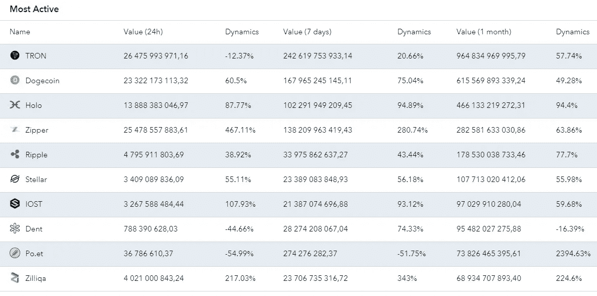
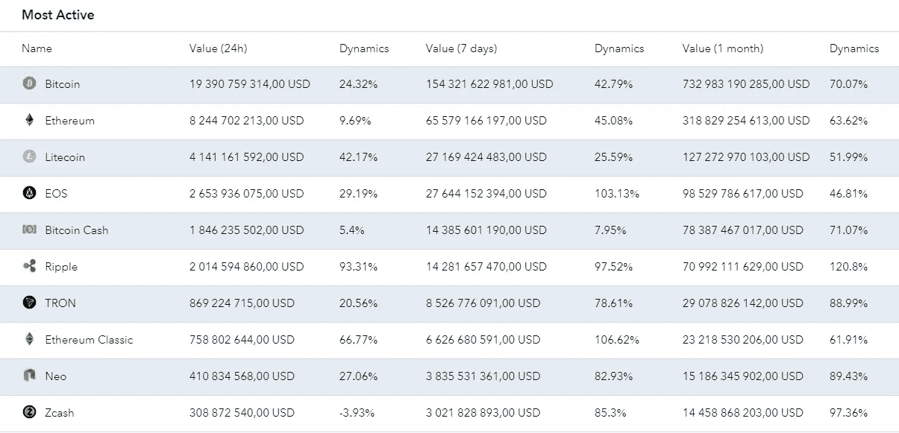

# 2019 年 6 月加密货币交易所报告，其中包含交易所运营的关键数据

> 原文：<https://medium.com/hackernoon/june-2019-cryptocurrency-exchange-report-featuring-the-key-data-on-exchange-operations-e4b985b21f60>

[https://corindex.com/reportRating/2019/June/07](https://corindex.com/reportRating/2019/June/07)

*Corindex 发布了 2019 年 6 月的加密货币交易报告，其中包括关键的加密交易数据以及对分析期间硬币实际价值的一些见解。*

在加密货币领域，一枚硬币的实际价格往往与加密货币价格聚合器显示的价格不同，有时甚至相差很大，甚至与你选择的加密交易所显示的价格不同。并且这种差异的增加仅仅取决于两个主要因素。通常，你越想买或卖，你提供的价格就越诱人，所以交易量是第一因素。第二个是你正在使用的交易所中你感兴趣的硬币或代币对的当前交易量。当然，有一些东西，比如目前市场的主导方向，但它们对你所得到的价格的影响远不如上述两者。现在，我们已经注意到加密货币的月平均价格和大多数交易的价格之间存在实际差异，让我们来看看平均加权货币/美元汇率，将已执行交易的数量和这些交易的执行价格考虑在内。

因此，莱特币在 6 月份的价值是 104.72 美元，与前一个月相比几乎增长了 41%。币安币表现出类似的结果，涨幅为 40.18%，达到 30.92 美元。以太坊紧随其后，在 6 月份实现了 39.72%的增长，比特币现金排名第四，月增长率为 35.89%，比特币的平均月加权美元汇率为 7 738.26 美元，比 5 月份增长了 35.64%，达到 388.00 美元。最后一个涨幅超过 30%的是 Zcash，其在评估期内的涨幅为 32.28%。Byteball Bytes 以-22.31%的跌幅脱颖而出，跌至 32.23 美元，考虑到整体强劲的积极趋势，这确实令人震惊。

*哦，如果你想知道这些数字是如何得出的，公式如下:平均加权货币/美元汇率= [(汇率 t1 x 交易量. t1) x(汇率 t2 x 交易量. t2) x，…，x(汇率 tN x 交易量. tN)] /(交易量. t1 +交易量. t2 +，…，交易量. tN)*

**反映围绕特定硬币的交易量的另一个重要指标是货币交易量，它揭示了在分析期间有多少货币易手。**

根据这份报告，6 月份有近 1 万亿 TRX，准确地说是 96483496999579 枚硬币易手，激增了 57.74%。Dogecoin 紧随其后，积极动态几乎达到 50 %,月销量为 615 569 893 339，24 件。赫萝取得了巨大的成绩，交易量增长了 94.4%，达到 466，133，219，272.31 枚硬币。拉链和波纹的交易量分别为 282，581，633，030，86 和 178，530，038，733，46 单位，表现出 63.86%和 77.7%的月度正动态。本章值得注意的另一个硬币是 Po.et，它的月度货币交易量增长了 2394.63%。6 月份易手的硬币总数为 7382646539561 枚。

[https://corindex.com/reportRating/2019/June/07/3](https://corindex.com/reportRating/2019/June/07/3)

*货币细化交易量也表示总的交易量，现在用美元和 USDT 表示，计算公式为:货币交易量= (Vtransaction。货币/美元和货币/USDT 汇率 1) +(交易。货币/美元和货币/USDT 汇率 2) +，…，+(交易。货币/美元和货币/USDT 汇率 N)。*

根据该报告，在评估期内，所有 TRX 交易的总价值略超过 755 亿美元，即 51.65%的正变化。尽管下降了负一个百分点，Zipper 仍保持第二的位置，售出了价值近 600 亿美元的 Zipper。赫萝以接近 500 亿美元排名第三，这是一个 208.1%的巨大积极趋势。丹特排名第四，下跌了近 11%，但仍保持在 39 201 079 791.42 美元/USDT 的水平。Dogecoin 以 21.73%的月涨幅收盘于前 5 名，总成交量为 33，135，729，193.22 美元/USDT。

**сcurrency USD 交易量讲述了加密货币如何与法定货币紧密相连的故事。**

2019 年 6 月，比特币操作的价值达到 732 983 190 285.00 美元，与上月相比增长了 70.07%。加密/法定运营的第二大价值属于以太坊，其每月法定交易价值为 318 829 254 613.00 美元，激增 63.62%。莱特币是最后一种月法定/加密交易量超过 1000 亿美元的货币，其增长率几乎达到 52%，月交易量达到 127，27 2，970，103，00 美元。Ripple 是这一类别中的最大受益者:120.8%的正变化，它拥有每月近 710 亿美元的交易量。Zcash 是 fiat-crypto 类别中的第二大收益者，在分析期内增长了近 100%,月交易量达到 14，458，868，203，00 美元。

[https://corindex.com/reportRating/2019/June/07/5](https://corindex.com/reportRating/2019/June/07/5)

与任何市场一样，加密货币更是如此，资产易手极其频繁。这导致了巨大的交易量，而事实上，实际使用的货币数量可能并没有那么可观。本章通过提供加密货币/美元和加密货币/USDT 精炼交易量的数据来解决这个问题。

根据其中的信息，6 月份所有比特币交易中使用的美元和 USDT 的总和仅为 35 600 568 404.74 美元——比未经精炼的交易量少 20 多倍，增长了 87.76%，而不是 70.07%。同样，与以太坊相关的所有交易中流通的美元和 USDT 的总额为 15 903 701 600.93 美元，与之前的月度结果相比上升了 96.73%。EOS 和 Litecoin 公布的数字相似:分别为 10，686，084，738.09 美元和 10，570，903，977.53 美元，月增长率分别为 70.19%和 157.13%。