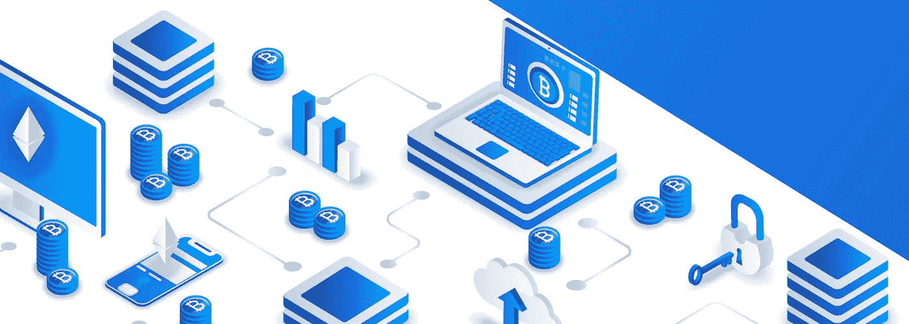
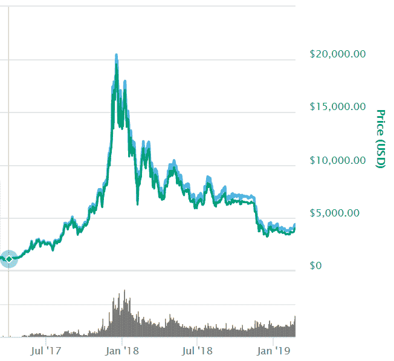
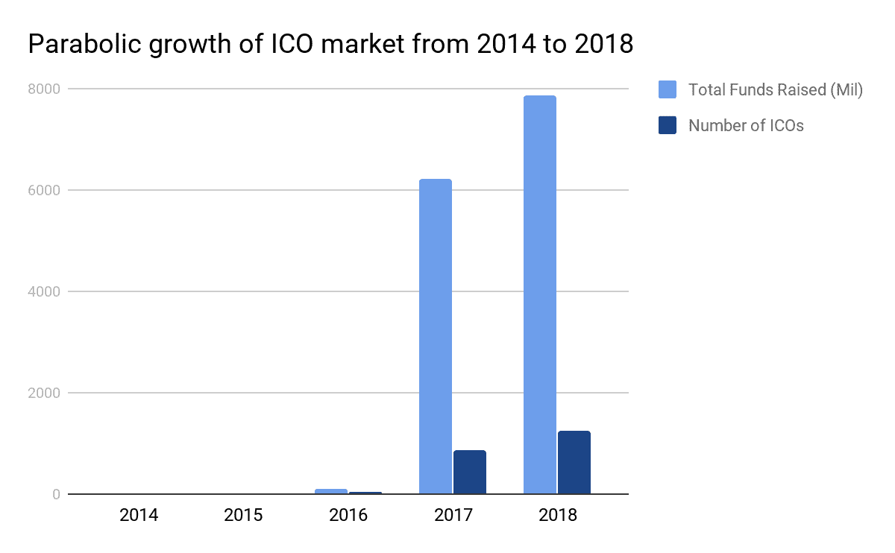
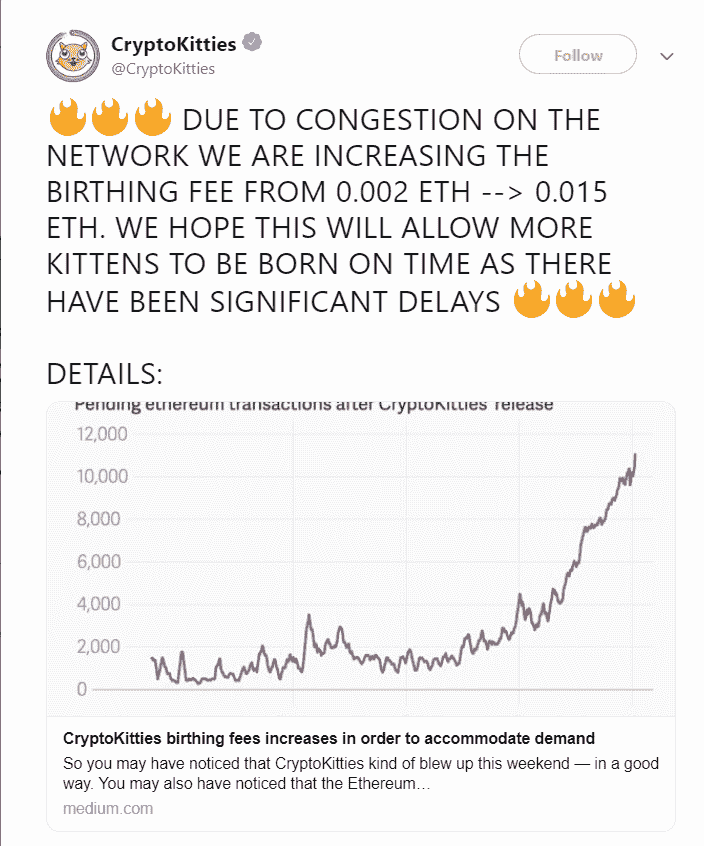

# 预计只有 1%的区块链采用率。另外 99%在哪里？

> 原文：<https://medium.com/hackernoon/just-1-blockchain-adoption-expected-where-is-the-other-99-53b3b225c46b>

比特币在 2017 年的牛市[从 900 美元到 20，000 美元的峰值](https://www.coindesk.com/900-20000-bitcoins-historic-2017-price-run-revisited)引起了世界的关注，使曾经默默无闻的分布式账本技术成为主流。

许多行业新来者有一种误解，认为区块链是一种新兴技术。然而，事实是，加密货币和底层区块链技术早在十年前就已经存在，当时中本聪在 2008 年首次发布比特币白皮书，并在一年后开采了比特币的 genesis 区块。

*Source:* [*Coinmarketcap*](https://coinmarketcap.com/)

抛物线价格行为所带来的炒作和关注也吸引了更多的玩家进入这个行业。

就在三年前，ico 的总数为 29 个，筹集的资金总额为 9000 万英镑。相比之下，2018 年的 ico 总数为 1257 个，筹集的资金总额为 78.52 亿美元-这意味着分别增长了 4.234%和 8.624%。

*Source:* [*ICOData.io*](https://www.icodata.io/stats/2018)

尽管十多年来一直有积极的消息和方向，区块链技术仍然远远没有被实际采用。Gartner 在[进行的 2018 年调查显示，区块链的采用率仍然很低——目前仅为 1 %,接受调查的首席信息官预计短期内仅为 8%。](https://www.gartner.com/doc/3882898?ref=mrktg-srch)

与此同时，以太坊(T4 市值第二大的加密货币)的用户分散应用程序(dApps)采用率仍然低得惊人。所有 dApps 的日均用户数[不到 1 万](https://dappradar.com/charts)。然而，以太坊的市值高达 140 亿美元，突显出这些加密货币的价格主要是由投机而非使用推动的。

那么到底是什么阻碍了区块链技术被主流采用呢？我们在这篇文章中探讨了一些可能的因素。

**技术的可扩展性**

当前的技术限制，如可扩展性，仍然是区块链技术所面临的一个重大问题。

以太坊创始人 Vitalik Buterin 提出的[可扩展性三难困境](https://github.com/ethereum/wiki/wiki/Sharding-FAQs#this-sounds-like-theres-some-kind-of-scalability-trilemma-at-play-what-is-this-trilemma-and-can-we-break-through-it)指出，区块链系统只能有效地拥有三个组成部分中的两个——要么是去中心化，要么是可扩展性，要么是安全性，因此取舍几乎是不可避免的。

使玩家能够在以太坊网络上购买和繁殖数字小猫的 ERC 20 dApp CryptoKitties 就是一个突出区块链技术当前技术局限性的主要例子。仅这一个 dApp 就导致了整个以太网的拥塞，凸显了分散化在可扩展性方面的困难。2017 年 12 月，据报道，未处理的以太坊交易增加了*六倍*，导致 Cryptokitties 不得不增加其“分娩”(交易)费用，以最大限度地减少网络拥塞。

*Source:* [*CryptoKitties Twitter*](https://twitter.com/cryptokitties/status/937794977848897536?lang=en)

值得注意的是，对当前技术限制的改进正在积极探索中，例如最近的[以太坊君士坦丁堡硬分叉](https://www.coindesk.com/ethereum-upgrades-as-hard-forks-constantinople-and-st-petersburg-activate-on-blockchain)和像[有向无环图](https://www.coinspeaker.com/directed-acyclic-graph-blockchain/) (DAG)这样的新结构，旨在解决区块链技术的当前限制。

**期望超过效用**

ICOs 的现状与臭名昭著的 Fyre Festival 传奇相似，魅力非凡的千禧一代创始人通过“出售梦想”实现了过多的承诺和不足。*“80%营销，20%产品”*框架似乎适用于许多项目，最近的一份 [E & Y 报告](https://bravenewcoin.com/insights/ey-study-initial-coin-offerings-icos-the-class-of-2017-one-year-later)显示，2017 年只有 29%的 ico 曾经交付过产品。

因此，投资者和公众在评估任何机会时，做好自己的尽职调查非常重要。[反向 ico](/arcadierx/reverse-ico-a-better-deal-for-investors-5ef3c55dd027)，由已经成立的企业创建的 ico，拥有成熟的团队、社区和用例，可能会被证明是一个有效的过滤器。

在一个不信任的系统中缺乏信任

公众对该行业的情绪和看法一直很低，尤其是在当前的熊市和该行业的不良行为者。在最近的新闻中，在日本交易所创始人、[交易所死亡后，投资者被锁定 1 . 9 亿美元，其 9.4%的总持股被盗](https://www.coindesk.com/hacked-exchange-cryptopia-discloses-estimate-of-stolen-crypto)，到去年日本[洗钱案件激增 20%](https://www.coindesk.com/crypto-money-laundering-reports-spiked-in-japan-last-year-police-say)。随着监管和安全问题的频繁出现，目前对该系统缺乏信任也就不足为奇了。

**缺乏教育助长了误解**

可以理解的是，投资者和公众很难真正了解加密货币和区块链技术是怎么回事，技术术语和不断发展的格局。这导致了常见的误解，例如:

***误区一:比特币=加密货币=区块链技术***

*事实:比特币、加密货币和区块链技术不可互换。比特币是一种加密货币，而加密货币是作为交换媒介的数字资产。区块链技术是一种分布式账本，是一种支持点对点交易的加密货币技术。*

***误区二:区块链技术只针对加密货币和支付***

*事实:区块链和加密货币可能会像花生酱和果冻一样消失。然而，这并不是区块链的唯一用例，这是一种跨多个行业和用例的分布式账本技术。*

***误区三:价格波动，熊市反映技术进步现状***

*事实:区块链技术作为底层分布式账本技术，不应该与公共区块链的激励层，即加密货币混为一谈。正如苹果联合创始人史蒂夫·沃兹尼亚克在一次* [*CoinTelegraph 采访*](https://cointelegraph.com/news/apple-co-founder-steve-wozniak-on-bitcoin-weve-seen-massive-value-creation) *中分享的那样，人们应该专注于比特币的价值创造，而不是全神贯注于价格。*

**没有 moonbois 或 lambos，但未来是光明的**

尽管这些因素阻碍了区块链技术的采用，我们仍然相信区块链技术的巨大潜力，它有能力影响和改善不同的行业。

根据美国市场研究公司国际数据公司(IDC)最近的一份报告，2019 年全球区块链支出将达到近 29 亿美元，比 2018 年增长 88.7%。

有了这种积极的预期增长和大企业和机构的参与，如最近推出数字资产平台 [Bakkt](https://www.bakkt.com/index) 的纽约证券交易所，以及 IBM 众所周知的积极参与区块链技术的企业，该行业仍有长期增长和机会。

为了行业的成熟和发展，我们认为教育是关键。投资者、项目、用户和更广泛的社区应该超越宣传，更多地了解区块链技术的真实状态和优点，并探索如何将其用于解决问题或增强不同行业的现有解决方案。随着时间的推移和坚实的发展，信任可以慢慢建立起来。

*我们如何加快区块链理工大学的采用率？我们很乐意在下面的评论中听到您的观点，或者点击* [*继续与我们讨论 Telegram。*](https://t.me/ArcadierX)

*免责声明:ArcadierX 代表、其社区经理或社区成员撰写、发布或说的任何内容都不应被解释为、视为或构成投资建议。所有书面评论都是个人观点，任何投资都是个人承担的风险。*

***

*我们的区块链发烧友团队背后是*[*ArcadierX*](http://www.arcadierx.io/)*，领先的市集建造商*[*Arcadier*](http://www.arcadier.com)*的区块链主动为板载用户提供一个区块链增强平台。*

欲了解更多关于区块链和电子商务的见解和发展，请访问 https://medium.com/arcadierx。