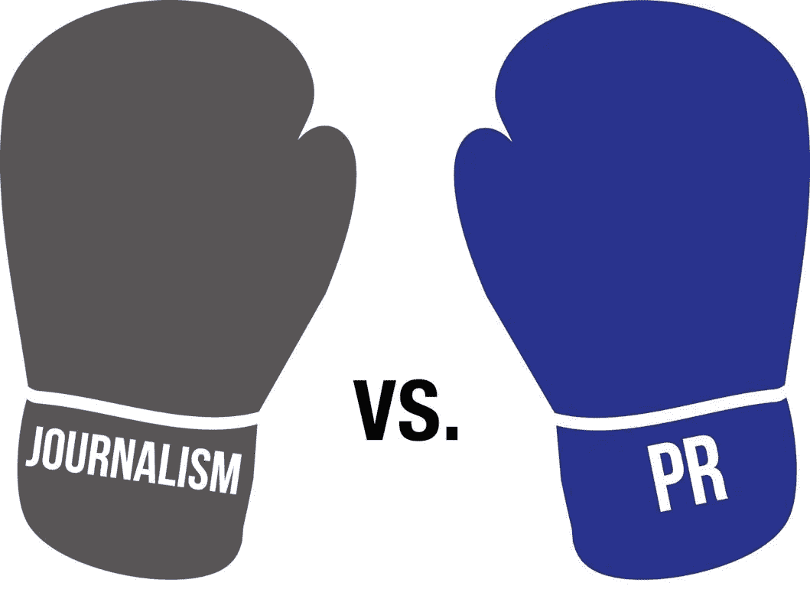
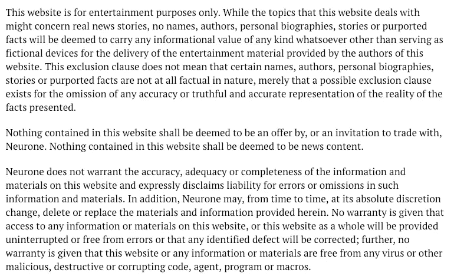

# 我真倒霉！

> 原文：<https://medium.com/hackernoon/just-my-luck-72818986929e>

## 另一封来自猴子诉讼超级侦探的邮件

你可能还记得亚当[运气](https://hackernoon.com/tagged/luck)。我们上次见到他时，他在*伦敦时报*上写了那篇废话(起初他说他在为周日的*邮报写作，直到他们告诉他他们不会发表它。)他说他是伦敦的一名记者，这很奇怪，因为他的一些故事作为独立的新闻报道根本没有任何意义。此外，对于一个记者来说，他的故事很少，可能一个月最多几个。但是我们可以在后面的文章中得到所有这些。*

让我们从显而易见的开始:

> 根据高等法院文件，一名前公立学校学生被指控为数百万英镑房地产开发欺诈案的幕后策划者。
> 
> 查尔斯·坎宁安(Charles Cunningham)在伊顿的时间与威廉王子(Prince William)的时间重叠，他在法庭文件中被认定控制了一系列公司，这些公司通过用从未完工的英国开发项目引诱亚洲投资者，从而诈骗了他们数百万英镑。
> 
> 坎宁安先生是城市金融家的儿子，他的哥哥鲁珀特是哈里王子核心圈子的朋友，他和妻子住在北威尔士的一个大的乡村庄园里。这对夫妇自称是社会名流。

这是关于我在这里写的一个房地产开发计划，我试图挽救它。亚当·勒克在 2017 年 10 月写下了这个故事。现在让我们来看看这位幸运的语言大师对猴子资本的描述，大约五个月后:

> 一名前公立学校学生被指控是一起数百万英镑国际加密货币欺诈案的主谋，该案使他净赚 3000 万美元，并导致一名投资者自杀。
> 
> 丹尼尔·哈里森(Daniel Harrison)是一位高级金融城金融家的儿子，据称他通过首次发行硬币(ICO)吸引了美国投资者，用于为加密货币的创建提供资金。
> 
> 美国法庭文件显示，年近 40 的哈里森是特拉华州公司 Monkey Capital LLC 和新加坡公司 Monkey Capital Inc 的创始人，并将它们用于“欺诈目的”。这些索赔是在佛罗里达州法院提起的民事集体诉讼中提出的。提交申请之际，法律和监管机构对加密货币的繁荣越来越担忧。

除了令人惊讶的——很大程度上是自我剽窃——文章的相似性，令人吃惊的是，亚当·勒克在不到 6 个月的时间里写了这两篇文章，却没有意识到一个明显的事实——我在某种程度上参与了猴子资本和 ALD。我从来没有隐瞒过。一次都没有。恰恰相反——事实上，我为自己试图挽救两个可怕的局面而自豪，也为自己勇敢地面对运气这样的恶棍而自豪。在这种情况下，显而易见的问题是为什么？为什么不提我和他们都有关系？难道这只会让他的故事更精彩吗？( *Ed:我们会在后续的帖子和* [*媒体*](https://hackernoon.com/tagged/media) *主流报刊上的文章中得到；暂时不要泄露整个故事！*)

但是我们跑题了。今天，我又收到了一封幸运的邮件。我会把整件事用引号引出来。此外，只是为了减轻运气，我会详细回答所有的问题，不是在一些后门的电子邮件，而是在黑白打印。

> 亲爱的丹尼尔:
> 
> 新年快乐。
> 
> 我正在仔细观察绝对生活发展的余波。
> 
> 我看了你在 ALD 的帖子，产生了一些问题。
> 
> 鉴于破产服务局决定禁止你担任董事，我想知道为什么破产服务局会选择忽略你的证据？还是你根本就没有呈现出来？还是另有阴谋？

我只是没有提出来。我没有时间，什么，你和你的同事造成的混乱让一个无辜的人几乎无法维持他的生意。

> 至于你声称的清白:我已经和 Vicky Chong 联系过了，她说在你扮演 ALD 白衣骑士的角色中，你从她那里拿了 14500 英镑，这笔钱还没有报销。这是正确的吗？她还说，她被告知必须投资 100，000 英镑才能继续该计划。为什么？

当我从 ALD 辞职时，我向所有在我的公司 DMH 公司交了定金的人提出了两种选择:1)他们可以毫无疑问地把钱要回来，或者 2)他们可以把定金换成 DMH 公司的贷款票据。没有人必须做这两种选择。

Vicky Chong 不在原来的小组里，但是打电话到我们办公室，请求我下次去香港(总部在新加坡)的时候和我见个面。我和她见了面，她恳求我让她投资 4000 英镑。起初我拒绝了，但她非常坚持，所以，像任何商人一样，我说，当然，为什么不呢。我相信大约几个月后，她又自愿加了一万元(我从未参与和香港员工的讨论，但他们肯定没有问她)。几个月后，她声称应该拿回 25 万英镑的利息。我们告诉她，唯一可行的办法是她至少投资 10 万英镑。

至于回报，好吧，幸运先生，在你和你的朋友出来攻击它之前，我一直在努力让公司生存下去，这是非常健康的，整整一年。如果我能在今年年初偿还所有人——我们所有的贷款票据持有者——我会的。

> 我还想问你一些其他的问题。
> 
> 1.你从与 ALD 的合作中获得的总报酬是多少？

零。不，对不起..减去它是什么。几十万；也许一百万左右。不过不要相信我的话——去查一下 DMH 公司的 SG 和 HK 账户。那是因为你和你的朋友，先生。你的日常工作多好啊。

> 2.根据布里泰因女士在高等法院采取的行动，如果这些神秘的马来西亚人真的是 ALD 王位背后的力量，为什么所有的钱都流向了英国商人？

我完全不知道。在沮丧中，我一直试图自己找到这些问题的答案。或许可以问问 ALD 的会计师，当我拿着我辞职的证据面对他时，他完全不记得我了。如果你愿意，我可以为你找出他的名字？

> 3.你“帮助”了多少其他 ALD 投资者，你是否从他们那里拿了钱，这些钱是否被报销。如果没有，为什么没有。

我相信，DMH 公司中极其支持我的投资者总数大约有 13 人。他们总共投入了大约 100 多万美元，也许接近 200 万美元。一切都很顺利，直到你和你的朋友们出现，幸运先生，每个人都按时还款。如果你想看的话，我有证词。

> 4.你会出席即将在佛罗里达举行的关于猴子资本的法庭听证会吗？

我今天刚刚寄出了两个动议——一个是对西尔弗·米勒提出的废话提出质疑的动议，另一个是传唤你和其他人的动议。你可以在这里找到他们[，在这里](https://thecurrencyjournal.com/wp-content/uploads/2019/01/2.pdf)找到[。](https://thecurrencyjournal.com/wp-content/uploads/2019/01/1.pdf)

> 各种投资者确实让我了解了你们的发展，他们引起了我对这个奇怪帖子的注意:[https://the currency journal . com/2019/01/11/DMH-advises-government-strategy-session-on-区块链/](https://thecurrencyjournal.com/2019/01/11/dmh-advises-government-strategy-session-on-blockchain/)
> 
> 我找不到任何与“两党委员会”有关的彼得·布劳分享的记录，我想知道你能否解释一下哪个委员会和哪个部长从英国退出欧盟抽出时间来给你起立鼓掌。
> 
> 顺便说一句，我找不到任何证据证明一个约翰·克莱尔，以前的日经和 AWSJ，确实存在。事实上和网上我都找不到。他真的存在还是只是你？

那你就不是最聪明的人了，幸运先生。转到我们的[条款和条件页面](https://thecurrencyjournal.com/terms-of-service/)(在顶栏菜单中以粗体显示):

不像你，幸运先生，我写小说的时候会做广告。(提示:这叫讽刺。我认为乔叟是历史上最著名的讽刺作家:*塞根？* *Bidde weder hwa sy saltere？公立学校的好孩子——我们永远不会忘记我们 13 世纪的英语语法！)*

> 如果你能在星期四早上回到我身边，我将不胜感激。
> 
> 问候，

如你所见，在我的收件箱里发现你的邮件后，我在周三晚上给了你所有问题的完整答案。

现在我请求你同样的礼貌——在周四之前，告诉我你是谁(比如，让我看看你的照片)，你为谁工作(比如，请给我们另一张照片)。)当你想挖掘我的生活，编造关于我的事情时，我可以看到你的照片，并得到一份简历，这似乎很公平，是吗？就在这篇文章的评论部分，有两张图片。就是这样。

好吧，如果你忘记了，不要担心，我相信这个世界很快就会发现，因为它是…

哦，也祝你新年快乐。相信我，在你造成的伤害之后，你很快就会需要所有你能得到的运气。