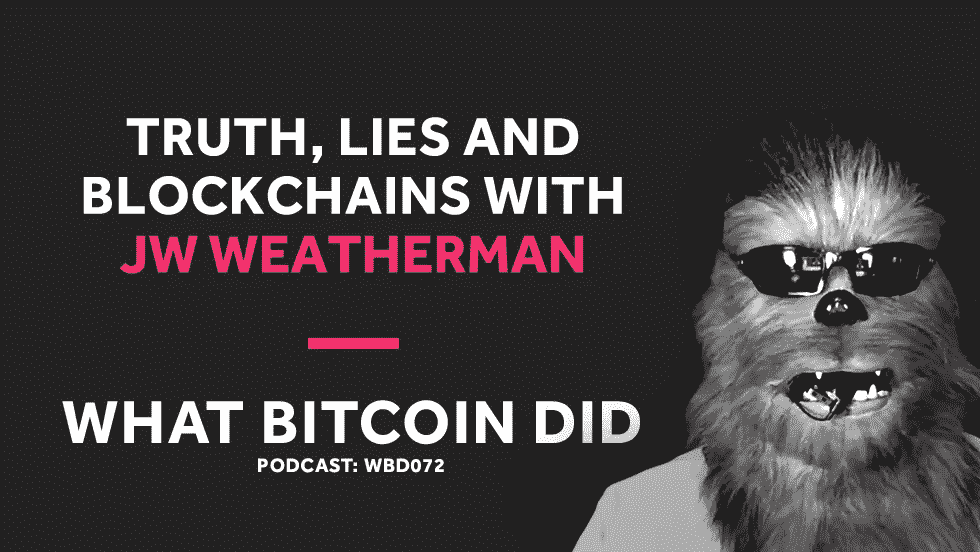

# JW·韦瑟曼谈真理、谎言和区块链

> 原文：<https://medium.com/hackernoon/jw-weatherman-on-truth-lies-and-blockchains-a7fb71b10914>

## 音频采访转录— WBD072

***注:*** *以下是我采访 JW 天气预报员的转录。我从翻译中使用 Rev.com，他们删除了嗯，错误和半句。我已经检查了转录，但如果您发现任何错误，请随时发送* [*邮件给我*](http://hello@whatbitcoindid.com) *。可以* [*在这里*](https://www.whatbitcoindid.com/podcast/jw-weatherman-on-truth-lies-and-blockchains) *听原声录音。*

*你可以在这里订阅播客* [*听所有剧集*](https://www.whatbitcoindid.com/podcast/) *。*

在这一集里，我和 JW·气象员谈论骗局和比特币教育。我们讨论了为什么这个领域如此充斥着骗局，着眼于莱特币和以太坊等具体项目，我们还讨论了 JW 的在线课程比特币 10 小时。

联系比特币做了什么:
听:[**iTunes**](https://itunes.apple.com/gb/podcast/what-bitcoin-did-podcast-bitcoin-crypto-trading-strategy/id1317356120?mt=2)|[**Spotify**](https://open.spotify.com/show/0mWUJuONiilW5JSBBFZ0s7?si=5qcbjpjYSRyKpi8wycEZUw)|[**Stitcher**](https://www.stitcher.com/podcast/what-bitcoin-did)|[**SoundCloud**|](https://soundcloud.com/what-bitcoin-did)[**YouTube**](https://www.youtube.com/whatbitcoindid)|[**TuneIn**](https://tunein.com/radio/What-Bitcoin-Did-p1079869/)关注: [**网站**](https://www.whatbitcoindid.com/)

# **采访记录**

**面试日期:2019 年 2 月 3 日星期日**

> **“我认为我们低估了这个领域里有多少人通过诈骗获得报酬。”**
> 
> **—JW·气象员**

**[**彼得·麦科马克**](https://twitter.com/PeterMcCormack) **:** 嘿，JW。你好吗，伙计？**

**[**JW 气象员**](https://twitter.com/JWWeatherman_) **:** 好，好，伙计。我一直期待着这个。**

**[**彼得·麦科马克**](https://twitter.com/PeterMcCormack) **:** 是的。很高兴终于和你通话了。你绝对是最铁杆的比特币玩家之一。我几乎觉得尴尬，我对你来说不够比特币，因为我看过你的一些视频，是的，你不接受任何囚犯。这是怎么回事？你为什么这么铁杆比特币？**

**[**JW 气象员**](https://twitter.com/JWWeatherman_) **:** 我甚至不知道我会说……我知道每个人都这么说，对吗？就像，我不确定我是不是一个铁杆比特币玩家。我认为我只是在技术上有能力，这显得非常非常傲慢，但很多人都像这样，“嘿，你知道你只来了一年。你不应该有这么强烈的观点，”但是我已经做了二十年了。这是软件安全性的一部分。这是密码学的一部分。很长时间以来，我一直在设计系统，不是电子现金系统，而是使用所有这些相同的构件来解决问题的系统。**

**对我来说，有了这样的背景，观察这个领域正在发生的事情就容易多了，把事情称为欺诈就是欺诈。对我来说，如果某个东西宣称它的能力或技术，那显然是一派胡言，尽管如此，我还是很有耐心。即便如此，我也不会称某人为骗子。可能直到我和他们交谈，有一点点的来回，并意识到他们只是公然决心撒谎的技术，以欺骗无辜的人。但是从那以后，是的，我很习惯用骗子、诈骗犯和骗子这样的词。**

**[**彼得·麦科马克**](https://twitter.com/PeterMcCormack) **:** 这个星期对我来说很有趣的是，我在这次采访中做了一些我以前从未做过的事情。我从来没有进行过面试前的谈话，但我和你进行了，因为有几件事我想弄清楚我的结构。你可能已经注意到，在准备这次采访时，我发了几条挑衅性的推文，因为在准备这次采访时，知道我们将要谈论什么，我想测试一下反应。我不一定完全同意他们的观点，但是你可能已经注意到了，因为我已经在一些帖子里给你加了标签，对吗？**

**[**JW 气象员**](https://twitter.com/JWWeatherman_) **:** 你知道吗，实际上我确实注意到你在几篇帖子里给我加了标签，但我也很喜欢屏蔽别人，所以我猜你指的是某个人的某种煽动性反应，我已经确定听到他的回应是没有用的。**

**[**Peter McCormack**](https://twitter.com/PeterMcCormack)**:**好吧，也许吧，但是我发布了一些事情，比如，我发布了一条推文说，“区块链只有两种用途，一种是比特币，一种是稳定的硬币，”这是为了准备这次采访。我只是想看看人们的观点有多顽固，有多根深蒂固。这是一次真正的考验，可能是我所收到的最不友善的回应之一，来自各种各样的指责，说:“你不知道你在说什么。废话，废话，废话。”**

**然后我还拿出另一个，“我怀疑任何描述自己有一个伟大社区的硬币或代币。”为了准备这次采访，我故意在本周开始挑衅，看看为什么人们如此根深蒂固，因为显然我们已经讨论过我是如何从一个多重铸币者变成一个比特币创造者的，理解比特币的旅程真的很难。我还差得很远。**

**这真的很有意思，尤其是那些持有以太坊包的人，他们的观点是多么根深蒂固。这是一个很大的增长，但为什么人们如此根深蒂固？因为你可以识别出那些制造诈骗硬币的人是骗子，但是那些热情支持这些项目的人呢？**

**[**JW 气象员**](https://twitter.com/JWWeatherman_) **:** 嗯，我认为有多种因素在起作用。有人认为，我们低估了这个领域中有多少人通过诈骗获得报酬。当我第一次接触比特币时，有一个我过去实际上捐过款的慈善机构，我发现他们从 Roger Ver 那里拿钱来推广比特币现金。一个自由主义的反战团体。这让我很失望，但这是我最初的经历之一。**

**我会说大多数人还是不太相信。我是一名安全研究人员，并在早期建立了一点声誉…人们会给我发东西，所以有人基本上是在向我泄露这个组织正在发生什么的信息。在公开场合，我与他们对质，他们从不否认，因为他们知道一旦他们否认，我就会提供证据。但是仍然有人会说，“那里一定有别的什么东西。”正常人真的很难。**

**我认为这是另一件让我更容易表现出对欺诈非常适应的事情，如果你已经在软件安全领域工作了很长时间，你已经处理了很多欺诈，你已经处理了执法相关的事情，并且处理了骗子，甚至仅仅是在硅谷你就接触到很多欺诈和软件中的大量软件之类的东西。所以我想这些年来我已经变得脸皮厚多了，但这是我见过的最糟糕的地方。我从未见过如此充满欺诈的事情，我也不确定为什么。**

**我认为这可能是比特币领域的叛逆性的结合，这将带来一个边缘群体，然后我认为会有很多钱。如果你是一个骗子，你在南非经营着某种可疑的进口业务，并且你听说了加密货币正在发生的事情，那么这就是你应该来的地方。我们在尼日利亚王子骗局的中心。所有在过去五年中被发明的尼日利亚王子骗局，我确信它们都发生在这里。**

**这是一个非常糟糕的地方，我认为普通人真的很难相信有这么多的欺诈行为。所以我想说的第一件事是，我只是认为有更多的人拿着钱骗你，骗你买垃圾，比大多数人想象的要多。**

**另外就是一旦被骗了，真的很难承认自己被骗了。我认为也有很多这样的事情在发生。一旦你在情感上和精神上投入了，尤其是如果你投入了资金。当你是一个提包党人时，你不仅仅是一个提包党人，因为你已经把钱放进去了，你是一个提包党人，因为如果你从一开始就说这是一个骗局，你就必须承认你是愚蠢的，或者被欺骗了。对吗？受骗了。但是人们很难做到这一点。我认为这两件事在这里发挥着更大的作用，可能比任何行业都要大，你知道，赛马博彩或传统上属于黑手党的东西。**

**彼得·麦考马克 **:** 我也认为，创造一个突然在交易所交易的东西，然后你可以脱手换钱，这很容易。虽然这是非法的，但它仍然是合法的，有些是灰色地带，对吗？像瑞特·克雷顿这样创造了许多硬币叉的人可以很容易地争辩说，他的所作所为并不违法，这只是资本主义之类的，但其他人认为这是诈骗，但这有点像灰色地带，很容易做到。**

**[**JW 气象员**](https://twitter.com/JWWeatherman_) **:** 我觉得其实没那么灰。我认为这种投资欺诈已经存在很长时间了。我认为，现在正在发生的数字化能力使它们在某些方面更容易出售给人们，监管机构正在经历一段更艰难的时期，其中一些刚刚得到回报。有足够的钱来支付监管机构，因为任何庞氏骗局，如果你能获得足够的动力，那么你真的不必担心后果，因为你只是润滑正确的车轮。**

**我认为其中很多已经超过了滚雪球的门槛。但是，作为一个在技术上有能力的人，我可以告诉你一个事实，那些告诉你 ripple 是一种加密货币并以有趣的方式使用加密技术的人，或者以太坊提供值得使用的安全智能合约的人，我可以明确地告诉你，他们只是在撒谎。这是一种技术上的东西。这需要技术能力才能说这些是非常明显的虚假陈述。**

**然后，如果你对此感到满意，如果你确信这些都是虚假陈述，那么说这些家伙完全是在撒谎就不为过了。我是说，他们不是偶然出错的。他们并不是偶然掉进这些钱里的。那是不合理的。他们在做虚假陈述，这让他们赚了很多钱。他们可能在骗你。**

**[**彼得·麦科马克**](https://twitter.com/PeterMcCormack) **:** 你知道另一件事是什么吗？奇怪的是，没有人…我最近提起过几次。没有人，或者几乎没有人，会改变他们的想法，诚实地说，“啊，你知道吗？我弄错了。是的，我认为这是完全错误的。”**

**例如，最近出现过几次的一个例子是查理·李。我的意思是，我认为越来越明显的是，莱特币几乎没有任何用途。他有机会解释这件事，但我认为他几乎不可能真正回头同意这是浪费时间。因此，现在他加倍努力增加隐私，并表示这将是一个隐私硬币。几乎就像他试图击败比特币，因为它拥有不受约束的隐私。**

**[**JW 气象员**](https://twitter.com/JWWeatherman_) **:** 是的，我认为这是真的，但我认为这是真的有几个原因。第一，他从第一天起就是个骗子。我这么说没人会觉得舒服。他们现在比一年前舒服多了。一年前，当我第一次说查理·李是个骗子时，所有比特币的人都感到不安。不仅仅是骗子，所有“比特币最大化主义者”都会说，“不，不，你不明白。查理是个好人。”**

**六个月后，我对 FluffyPony 做了同样的事情，当时人们说，“好吧，好吧。Litecoin 看起来是骗局，但是 Monero，Monero 是实心的。”我们仍然在等待这股浪潮的结束。但他是个骗子。当他说莱特币将成为比特币黄金的白银时，他并没有那么愚蠢。这家伙为比特币基地工作，他知道这里发生了什么。他知道他所做的是无意义的，他知道 ASIC 抵抗是不可能的。他知道，要想出一种无法用专业硬件更快解决的算法是不可能的。**

**这就像是宇宙的法则，对吧，而这家伙不是…他不是上个月刚从大学毕业。他一直在这个行业，所以他知道 ASIC 的阻力是一个谎言，他知道这是一个谎言，我们需要一个比特币的黄金银。那只是一句没有任何经济或技术含量的流行语。这完全没有道理。他知道。**

**他还知道，通过减少阻塞时间和摆弄东西，他实际上并没有提高莱特币的速度。他知道他在假装莱特币更快。但在现实中，如果你想要同样的安全，让我给你寄钱，让你知道你有这笔钱，他知道你在莱特币上等待的时间要比你在比特币上等待的时间长得多。他从第一天起就知道这些，所以他从第一天起就是个骗子。**

**随着人们慢慢意识到他们被骗了，他们愿意说，“好吧，现在他是个骗子，”或者，“他应该在这一点上道歉，因为事情已经很清楚了。”但是对于那些在技术上了解这个东西的人来说，在他推出 Litecoin 之前，他和人们进行了讨论，他们向他解释了为什么他所有的设计决策都是愚蠢和欺诈的，他还是继续做下去了。**

**[**彼得·麦考马克**](https://twitter.com/PeterMcCormack) **:** 但是，为了唱反调，即使我们谈论的是一种货币形式，你也可以说莱特币是一种产品。在那里，每天都有公司开始创造和发布在某些方面不如其他产品的产品，他们都只是利用营销来销售。白银转比特币黄金只是营销。我们能不能不要在这里唱反调？**

**[**JW 气象员**](https://twitter.com/JWWeatherman_) **:** 问题是当你用一些不真实的东西来欺骗人们购买你的产品时，你是在撒谎。如果他推出了 Litecoin，并说:“听着，我不想欺骗你，让你认为数字资产就像实物资产一样。我们有一个营销短语，我们是比特币的小兄弟，或者我们是比特币的白银，但归根结底，数字货币是一个要么赢要么赢的游戏。**

**“莱特币最终将归零，因为莱特币没有什么比比特币更好的了。不是更快，不是更便宜，不是更安全。我们甚至没有任何设计想法，我们只是用比特币调整了几个参数。我们真的什么都没做，但是不一样。所以，如果你想玩它，如果你想参与它，我们有一个很棒的社区，“好吧，随便。**

**他或许可以推销这个。他是一个非常好的人，他可能会让很多人对他感兴趣。他甚至可以说这样的话，“我们只是在莱特币上打转。就像，莱特币没有理由在未来存在，因为如果我们做了什么好事，这都是开源的，比特币会复制它。即使我们没有任何天赋，与所有从事比特币工作的天赋相比，我们没有任何天赋，我们可能会很幸运，我们可能会做一些聪明的事情。如果我们这样做了，那将会被比特币复制，所以我们最终还是会归零，但与此同时，我们会玩得很开心。”**

**我对那家伙没有任何意见，因为他没有欺骗任何人。但相反，他采用了一些关于银和金工作方式的经济学谬误，他采用了一些关于 ASIC 电阻概念的误解，他采用了一些彻头彻尾的技术谎言；经济方面的技术，技术方面的技术，技术方面的技术；他欺骗人们，让他们对世界的本质感到困惑，这样他们就会买他的垃圾。这不仅仅是营销，这是欺诈的定义。**

**[**彼得·麦考马克**](https://twitter.com/PeterMcCormack) **:** 好吧，听着，瞧，这里有一大堆东西要打开，因为我有一大堆问题要问你。但是在我们深入讨论之前，我知道你对你的身份和你的职业保密的非常严密，但是你能解释多少你的背景或者你的经历，所以至少观众理解为什么你在讨论这个的时候有可信度？**

**[**JW 气象员**](https://twitter.com/JWWeatherman_) **:** 是的，我的意思是，最终我有可信度的原因是，如果你对我所说的有任何疑问，我有很多参考资料。最好的去处之一是看看比特币威胁模型。这就是我带着比特币系统地浏览它的地方，我说这些都是我想出的尝试破解它的方法，这些是安全措施。这些是内置在比特币中的对策，我认为可以防止我作为攻击者破解它。**

**所以，如果你把它应用到莱特币和其他任何东西上，你不必基于可信度相信我。如果你认为 ASIC 抵抗是可能的，当我告诉你这是不可能的时候，你不应该相信我，但是你应该考虑一下，听听我要说的话，然后得出你自己的结论。我可以给你一些类比来帮助你度过难关。我有一个三小时的课程，我们稍后会谈到，关于比特币和经济学。**

**但是到了最后，我所说的所有可信的东西都可以回到一些非常基本的基本原则。例如在 ASIC 电阻上，我真的不想说，嘿，相信 JW。我想说，想象一个问题，人类无法发明工具来使这个问题变得更容易，因为这就是你们在谈论 ASIC 阻抗时所谈论的。你在谈论发明一个问题，无论人们做什么，他们都无法发明硬件或优化来更快地解决这个问题。这很疯狂，对吧，你真正要做的就是给它那种层次的思考，然后你意识到销售的人一开始就知道这是个谎言。**

**撇开免责声明不谈，关于我的背景我能说的是…我用假名工作的原因是这在某种程度上只是一种习惯。从事软件安全的人很少以他们政府的名义做他们所有的工作，原因是如果你发现一个安全漏洞，或者如果你发现欺诈，那将是非常危险的。我们很早就了解到，这是一个很好的主意，可以采用 cypherpunk 精神，对很多东西使用笔名，然后在你的咨询演出中使用你的公司名称。这是一件可以追溯到很久以前的事情，不仅仅是为了比特币的人或者你的 JW。几乎所有你认识的从事软件安全工作几十年的人都会说，是的，我在工作中使用了几个笔名。**

**大约 20 年前，我开始从事密码学工作，从事软件安全工作，做攻击和笔测试之类的事情，做安全设计工作，在过去的 20 年里，我已经为许多不同的公司做过这些工作。大约 10 年前，我从只做咨询转变为做很多咨询工作，所以我跳槽去了很多不同的公司，拥有了一家相当大的咨询公司，是业内比较受尊敬的咨询公司之一。然后我开始做全产品的东西或创业，所以从那以后我自己做了几个软件创业。**

**目前，我正在为一个名为 mathbot.com 的项目尝试一种新的软件创业方式。任何对学习数学或编程感兴趣的人都应该去看看，这对于孩子和成人来说都是很好的过渡，但这是我从一开始就构想的产品。我设计了编程语言，我设计了用户界面，我完全自费。这可能是我对这里发生的事情有所了解的最好的可信度了。**

**[**彼得·麦考马克**](https://twitter.com/PeterMcCormack) **:** 好了，这么说涵盖了软件方面，但是你不是有奥地利经济学或者不同方面的经济学背景吗？**

**[**JW 气象员**](https://twitter.com/JWWeatherman_) **:** 是的，这有点冒险，但我在大学里教过奥地利经济学。这就有点难了。如果我在这里说得太详细，那么我肯定会自我欺骗。**

**[**彼得·麦科马克**](https://twitter.com/PeterMcCormack) **:** 好的。没错。我该从何说起呢，因为我有太多想打开的东西。上周，你知道，我在旧金山，一件非常有趣的事情是，我从与人们的接触和交谈中得到了这种感觉，那就是风险投资，风险投资有一种“一切皆有可能”的心态。硅谷内部似乎对以太坊很感兴趣，实际上，这是我现在一直在纠结的事情。似乎也有这种斗篷…这不是保密的斗篷。有一种不成文法，你不能批评 a16z。**

**这是怎么回事…对我来说，我觉得比特币是风险投资的一个问题，我已经把这一点摆在那里，其他人说，“嗯，是的，但他们会投资比特币，所有的风险资本家，”我就像，当然。但我认为这是一种对冲。我看到他们无法从比特币中获得他们想要的回报，因此，比特币是一种对冲，但他们实际上是在投入任何他们认为可以获得大规模回报的任何特定项目或想法。比特币对风险投资来说是个问题吗？**

**[**JW 气象员**](https://twitter.com/JWWeatherman_) **:** 是的，我想是的。不过，我认为那里没发生什么事情。一个是安德森·霍洛维茨，他们有很多…嗯，有两件事。一个是，参与其中的一些人，在他们的早期，确实对互联网产生了很大的影响。你可以看到很多风险投资基金。有一两个灰头发的家伙真的有很高的声誉，他们值得尊重，因为他们对我们现在的世界产生了很大的影响。**

**你知道，参与网景的人，或者参与雅虎早期版本的人，或者参与谷歌早期版本的人。很难拒绝这些人，因为他们是这个行业的巨头，他们已经证明了他们非常有能力。**

**然而，另一件正在发生的事情是，这些人利用了大量的优势，他们可以声称他们是脸书等公司的早期投资者，或者他们是优步或所有其他公司的早期投资者，这就产生了一个非常严重的错误，哦，你是一个有远见的人。你是某种巫师，因为你看到这些公司将会成功。如果你投资 Airbnb，你一定很聪明，因为这看起来是个坏主意，但你这么做了，你很早就这么做了，现在你已经从中赚了 10 亿美元。**

**这很有欺骗性，因为风险投资的真实情况是，他们只是想尽可能多地参与交易。我尽可能向人们推荐的人是保罗·格拉厄姆，他是另一个行业巨头，是一个了不起的人。他还创建了 Y Combinator，这是一个早期投资，孵化器启动资金机制。他这样做的原因是他说，“看，我看了我做的一堆交易，我被认为是硅谷最好的投资者之一，我的记录比随机机会好不了多少。”**

**他意识到，这里发生的很多事情基本上都是套利。加油站里那个有 20 年管理加油站经验的家伙，他不被允许投资加油站。他可以拥有世界上所有的专业知识，他可以走进一个加油站，说，这个商品柜台设置得很好，员工得到了他们应该得到的报酬，所有的利润都设置好了。我想投资这家公司，因为我知道它将帮助我建立我的储蓄。对那个家伙的回答是不，你不能，因为你不是一个合格的投资者。除非你和你的配偶之间有 200 万美元，或者在美国的这个时候有 200 万美元，否则你是不允许这么做的。**

**你能做的就是把钱投入 401K，我们会鼓励你这么做。在它最终落入硅谷风险投资公司手中之前，它将通过五层中介机构，然后他们会，比随机机会好不了多少，投资几乎所有看起来可信的初创公司。而且，因为他们在竞争中有很多进入壁垒，因为任何人都不能投资下一个 Airbnb，所以只能是这些运营风投公司的小团队，他们看起来像天才，即使他们投资一些东西……他们会说，如果他们的成功率是 20 分之一，那就非常非常好。**

**我认为如果有机会，有很多人可以做得更好，但有很多原因是不可能的。比特币是专门为打破监管壁垒而设计的。这整个系统的很大一部分是建立在能够印刷钞票的基础上的，所有的裙带资本主义，监管，所有的恩惠，以及进行的见不得人的交易，比特币就是为了摧毁所有这些东西而建立的。你不能付钱给比特币的创始人，让他们做出某种改变，或者实施一项糟糕的政策，或者其他什么。比特币就像一头野兽，这个开源项目有太多的眼睛盯着它，它只是朝着一个非常诚实的方向前进，在很多地方粉碎了很多中间人。**

**因此，在这种情况下，如果你坐在硅谷，你对比特币并不那么兴奋，这是有道理的。这不会真正解决你的任何问题，而且可能会给你带来很多问题。但如果你能得到类似以太坊的东西，那就是你可以与维塔利克会面，你可以与他成为好朋友，你可以与他会面，并了解他与普京的会面情况，所有这类给你洞察力或信息的东西，对你来说都是非常好的情况。你可以从这些知识中获益。你可以从这些关系中获利。**

**你也可以促成这样的事情，我们将确保参议员们认为这不是一种保障，或者联邦贸易委员会说这不是一种保障，因为联邦贸易委员会的主席，当他从政府退休时，他正在硅谷找工作。我们在很多这样的地方都有旋转门。我们与国防部有合作，但我们也与硅谷有合作，所以像以太坊这样的东西对这些人来说很有吸引力是很有意义的。以太坊是一个社会正义战士的故事，基本上是围绕着不存在的技术，这个愚蠢的蒸汽制品，但它拥有他们想要的所有东西。**

**举个例子，它没有上限。没有上限供应。他们以每年 10%的速度增长，谁来决定他们要印刷多少，减少多少呢？原来是维塔利克。那么，为什么人们喜欢靠近美联储呢？因为如果你能发现美联储会改变利率，或者他们不会改变利率，那就是一台印钞机。你可以做得很好。**

**比特币不具备这一点，但很多这种骗局绝对具备，如果你已经非常非常根深蒂固，那么从这些欺诈中获利的机会会多得多。对于普通人来说，我认为投资比特币是一个不可思议的机会，但如果你已经有 10 亿美元，并且你把吸管卡在交易流程的一边，它就不会提供太多东西，实际上它有很多方式可以伤害你。**

**[**彼得·麦科马克**](https://twitter.com/PeterMcCormack) **:** 好的，好的。让我们来谈谈以太坊，因为我看到了各种各样的叙述，取决于你是比特币创造者还是以太坊的人，似乎有一大群人都在谈论以太坊的创建，“这很大程度上是一个基于虚假承诺的骗局，什么都没有实现，这一切都很复杂，未来的承诺，”等等。与此同时，正在被使用的以太坊上建造东西。不管我们喜不喜欢，那里已经建造了可以使用的东西，所以你对以太坊的立场是什么？**

**JW·韦瑟曼:看，我认为人们对智能合约有很大的兴趣。比特币有智能合约，但更通用的智能合约平台。那里可能会发生很多非常有趣的事情。以太坊上为什么没有真正有趣的事情发生？答案是，尽管人们非常希望构建不可逆的智能合约，但构建强力球会非常有趣。我不知道美国每年有多少亿美元的彩票收入流向强力球彩票。英国实际上对赌博更感兴趣，所以有很多钱进入这些彩票。**

**理论上，有人可以建立一个非常简单的智能合同，完全按照强力球的方式来做，像强力球这样的东西的利润率是非常非常疯狂的。我认为你花在门票上的每一美元中，大约有 95%被截留，只有 5%被支付。你可以创建一个强力球的竞争对手，我不知道，支付 20 倍，比如 20 倍，所以如果每个人都对新的强力球感到兴奋，它最终超过 7 亿美元或什么的…它可能是 20 倍。我们可以谈论 20 乘以 7 亿，仍然工作，仍然非常，非常有利可图。**

**为什么没有人考虑在以太坊做这样的事情？好吧，答案是我们已经知道以太坊并不是它所宣称的那样。一旦你建立了一个导致不受欢迎的交易的智能合同，我们已经知道它将被逆转。这种事已经发生不止一次了。我们还知道，甚至不可能以任何可靠的方式在以太坊上编写一些最简单的智能合约，因为他们设计编程语言的方式对于营销来说是完美的，对于诈骗来说是完美的，对于让人们认为他们有东西来说是完美的，但是对于实际实现安全的智能合约来说是糟糕的。**

**现在在以太坊上做一个多签名钱包甚至都不是一个好主意，那可能是我能想象的最简单的智能合约，所以这东西就是这么 scammy。是的，你知道，有像 CryptoKitties 这样的东西建立在它的基础上，使网络屈服，因为除了假装安全，它还假装可扩展。它实际上并不做这两件事。**

**我认为有很多潜在的真正有趣的应用，比如赌博之类的，但它们不会在以太坊上实现，因为有技术能力来构建有趣东西的人知道，试图在以太坊上实现它不是一个好主意。但这并不意味着他们不能用代币和玩游戏赚很多钱。**

**[**彼得·麦考马克**](https://twitter.com/PeterMcCormack) **:** 但是 Eth 2 就要来了，有了分片，还有很多我听说过的其他东西，这将解决伸缩问题。你调查过 Eth 2 吗？**

**[**JW 气象员**](https://twitter.com/JWWeatherman_) **:** 我想我看了他们路线图的截图。我不打算在以太坊上花太多时间的原因是，一年前我做了比特币威胁模型，我花了大概六周的时间痴迷于比特币，并找出破解它的方法。我一发布这个，很多人就说，“嘿，你能为以太坊做这个吗？”我已经对以太坊有了足够的了解，知道它是胡扯，但我还是屈服了，我想，好吧，我真的要看看这个。**

**我想在一天结束之前，就像八个小时过去之前，我已经知道它没有上限。以太坊的总数没有上限。这是疯狂的，因为你可以可靠地保护工作证明网络的唯一方法是，如果人们想要长期持有令牌。一旦你意识到令牌没有上限，你就不会想要长期持有它，所以我联系了很多对以太坊感兴趣的人，我说“嘿，你意识到这个东西没有上限吗？你有没有意识到，这些家伙每年印刷的以太币比美联储多两到三倍，而且没有时间表，没有强制性的时间表来降低他们生产新以太币的速度。”**

**以太坊的粉丝们认为我疯了，所以这告诉我人们持有这些东西的唯一原因是出于无知，当无知持续的时候，随着无知的消退，你将最终与不想持有这些只是被膨胀的代币的人在一起。为什么我还要做更多的安全分析呢？没用的。然后我就顺着列表往下看，嗯，所有的大骗局是什么？ASIC 电阻。哦，是的，他们在做那件事。他们仍然假装他们有足够的工作证明来保护链条。**

**你知道为什么没有 51%的人攻击以太坊吗？因为这都是安全剧场。因为一旦一群黑帽子，或者一群投资比特币的人，或者只是不喜欢以太坊的人花足够的钱实际上 51%攻击它，或者阻止它确认任何交易，我们已经知道这将会发生。维塔利科会发邮件告诉所有人改变算法。因为这是一个安全剧场，所以你甚至不能像攻击实际上依赖于工作证明的安全性的东西那样攻击它。当然，他们说他们将转移到州证明，这是另一个骗局。**

**以太坊的人做的聪明的事情是他们做了太多明显愚蠢的事情，以至于任何有技术能力的人都不想花时间在这上面，因为在几个小时内他们就像，“哦，这太愚蠢了。”就庞氏骗局而言，这确实很有效，但这是暂时的，他们知道这是暂时的。老实说，我认为以太坊存在的唯一原因，2.0 存在的唯一原因，是 Vitalik 和所有运行这个计划的人，他们不想进监狱。这不像是给了他们一张免罪卡。到了某个时候，这个庞氏骗局就要爆发了。**

**如果你已经从庞氏骗局中赚到了钱，你能做的最好的事情就是尽你所能让它慢慢死去，因为如果一个庞氏骗局在 10 年内消亡，没有人会有麻烦。没有足够的愤怒，没有足够的证据证明这是一个骗局。我想这就是事情的全部。这东西快死了，但是如果你有你的钱，这是一个很好的保险政策，继续扔多一点，试图让它死得更慢，让你的屁股不进监狱。**

**[**彼得·麦科马克**](https://twitter.com/PeterMcCormack) **:** 好的。创客道呢？现在已经被广泛报道了。每当我批评以太坊，首先会发生的是有人会跳出来说，“是啊，但看看制造商道，看看他们的成功，有 200 万以太锁起来，”或其他什么。我听了 Laura Shin 的采访，我想他的名字是 Rune，我不记得他的名字了，但是 Maker Dao guy，和我所关心的每一个问题，她都有类似的问题，他给出了相当坚实的答案。你查过刀客了吗？**

**[**JW 气象员**](https://twitter.com/JWWeatherman_) **:** 我稍微调查了一下，但这是另外一件事情，我不想在这上面花太多时间，因为它并不那么有趣。但是让我带你走一遍我认为你在考虑任何新技术时应该有的思考过程。**

**你要问自己的第一件事是这解决了什么问题。在你了解…扳手是由这种钢制成的，它有 3.5 英尺长，在它的末端有一个曲线或什么的…你必须知道这里的工作是我们要转动这个螺母。这个螺母大概有这么大，我们只是想转动它。在你大致了解问题之前，试图理解解决方案是没有意义的。**

**那么创客道要解决的问题是什么呢？据我所知，这是为了解决稳定物价的问题。你有类似比特币的东西，它会非常不稳定，因为人们正在了解它是如何工作的，他们变得兴奋，也许他们变得过于兴奋，他们将价格抬高了不少，然后他们变得失望，因为它发生得不够快，或者他们变得困惑，因为像以太坊的人正在说服他们，它没有智能合约，他们假装他们有，无论如何。因此，随着人们了解到它有多有用，它将变得非常不稳定。**

**如果你能解决这个问题，这显然会让货币变得更好。我认为很明显，任何新技术都是不稳定的，任何被当作货币的新资产都是不稳定的。我认为，认为你可以在它被完全采用之前解决这个问题是疯狂的，因为这就是价格。它们代表了人们对新技术的极大信心。通常这是初创公司的股票，顺便说一句，这些股票也非常不稳定，直到你拥有大量客户并主导市场。**

**我认为，当世界对比特币效用的理解完全不稳定时，像比特币这样竞争成为货币的东西应该在某种程度上或者可以想象是稳定的，这种想法是无稽之谈。但是这个问题是一个合理的问题，所以我们如何创造一种稳定的数字货币呢？你要做的第一件事是认识到稳定是相对的，所以当我们说稳定时，我们可能是指与美元等东西挂钩，因为美元变化很大。你看，如果你用英镑或加拿大元工作，你会看到汇率波动。宇宙中没有什么是真正稳定的，但至少我们可以创造一种与美元挂钩的数字代币，它与美元具有相同的价值。**

**显而易见的解决办法就是在银行账户里存上美元，让某人发行数字代币，让他们可信地承诺，如果你出示数字代币，他们就会给你美元。我们到处都有，你知道，双子座美元和各种各样的东西。2018 年，有许多非常可信的 stablecoins 来与 Tether 竞争，令人惊讶的是，对于一些我无法相信对创始人来说没有足够吸引力的事情来说，这些 stable coins 相当可信，只是带着钱跑了。看来他们还没有携款潜逃。**

**所以，我们确实有解决这个问题的例子，甚至以非常可信的方式解决。如果我在美国银行账户上有 100 美元，我认为这可能并不比我有价值 100 美元的双子座代币更安全，甚至可以说更不安全。因为我可以移动那些代币，你不能没收它们。如果你知道他们是谁，你可以把他们列入黑名单，这里还有一些其他的东西，但可以说这比只是把它们存在银行账户里要好，所以我们有一些非常可信的方法来解决这个问题。**

**现在，我们来看看道创客提出了什么。他们的想法是，我们要通过这些非常复杂的系统来创造稳定性。如果你曾经是天使投资人，你会注意到关于加密或安全，甚至合法软件公司的一件事，如果你不能理解问题和大致的解决方案，你可能应该在第一个五分钟内走出房间。**

**你不需要会写代码，但如果你不明白 Airbnb 将会把人们的家庭办公空间作为酒店空间转售，尽管这是非法的，因为他们认为他们将能够复制优步，并在被关闭之前迅速完成并流行起来……你应该明白，在任何类型的软件启动后的五分钟内。**

**这同样适用于以太坊，制造者道之类的东西。如果你不能在五分钟左右的时间里理解问题和大致的解决方案，那很可能就是一大堆 BS。这些人所做的是他们制造了一个又一个的复杂问题，但在花了一点时间之后…他们的解决方案大致是，“我们要拿一堆以太币，我们要把它放在一个篮子里，也许我们会抓一些其他的垃圾币，一些其他的欺诈币，所以看起来我们是多样化的，但最初它只是以太币。”**

**嗯，举例来说，如果以太坊的价格变为零，你就不可能从它身上得到你的美元价值。对吗？**

**[**彼得·麦科马克**](https://twitter.com/PeterMcCormack) **:** 对。**

**[**JW 气象员**](https://twitter.com/JWWeatherman_) **:** 所以，这不是个好主意。但这并不是一个坏主意，因为它可以迷惑人们，使其看起来像一个智能签约平台，但事实证明，这个平台非常不安全，你甚至不能编写基本的智能合同。就像我之前说的，我会很担心，我不知道是否有人愿意这样做，在以太坊上创建一个多签名钱包。《刀客》是我见过的最复杂的东西了，就逻辑而言，他们假装要用这个东西做什么，他们要用以太坊来写？我们甚至还不能在以太坊上抽奖，这似乎太冒险了，但我们要做这件疯狂的事情？**

**相比之下，Dao 项目要可信得多。我们只是要接受一大笔钱，然后如果你有一些这种道令牌或以太坊，或者他们想出的任何东西，你就可以对它进行投票，我们将像虚拟风险投资公司一样发行资金。很简单。你理解了问题，你马上就明白了解决方案。当然，他们实际上不能做到这一点，因为这是所有的安全剧院，而那些实际上试图建立一些很酷的东西的人并没有意识到这一点，但在这种情况下，我认为这种复杂性告诉你，那些正在制作 Maker Dao 的人，他们也参与其中。他们知道他们需要创造一些难以理解的东西，因为它是一种蒸汽制品。**

**[**彼得·麦科马克**](https://twitter.com/PeterMcCormack) **:** 好的。我又想起了几件事。我们似乎有一个庞大的区块链产业。我们有区块链的公司，区块链的顾问，我看到的每个地方都有区块链的专家，但是区块链应该在哪些方面有用呢……我采访过的每个有能力的技术人员都说，“你知道，区块链在很多方面都不太好。”就像我和彼得·托德交谈时，他的名言是，“区块链是一串积木。”你对所有这些区块链产业有什么看法？**

**[**JW 气象员**](https://twitter.com/JWWeatherman_) **:** 是的，我认为彼得·托德的节目很有趣。他会说 Git 是一个区块链，因为它是一个包括最后一块数据的数字签名链，所以你有这个所有的链…他提出了一个有效的观点，你可以称之为区块链，但我认为采取这种方法的问题是它只会引起更多的混乱。根据这个定义，我们在比特币之前就有了区块链。我更愿意说区块链是使用工作证明来保护一组事务的东西。**

**可以想象，除了金钱以外，还有更多应用可以通过这种方式解决，但它们可能必须建立在金钱之上或使用金钱，原因是为了保护这些交易，为了确保它们处于正确的顺序，你正在破坏大量有用的资源。你使用了大量的计算能力，也消耗了大量的电力。这就是这里的安全模型。对于攻击者来说，为了覆盖这些交易而销毁那么多真实的东西是不值得的，所以这些交易的价值必须非常重要，很明显，全球货币符合这一要求。**

**我们或许可以拿出全球能源资源的 10%,每天摧毁它，以创造安全可靠的货币，这对环境来说是有史以来最好的事情，对人类的繁荣来说这是显而易见的，因为货币真的很有价值。但是，如果你要采取同样的模式，你要把它应用到一些可以集中的东西上，你绝对是疯了。例如，如果比特币不存在，有人说，“嘿，我们要做这种工作证明的事情来保护房屋契约。我们要毁掉不可思议的电量来证明鲍勃把房子给了汤姆。”**

**这将是疯狂的，这将是疯狂的，因为你真的不想花那么多钱来解决这个问题。在一天结束的时候，你要去一个政府办公室，他们会派带枪的人出去，他们会踢走鲍勃或汤姆。所以你已经，至少在我们现在所处的世界里，信任一个集中的第三方来执行法律，他们会非常高兴地说，“看，我们会跟踪这是属于鲍勃还是汤姆的，”这就便宜多了。**

**我的意思是，令人惊讶的是，我们已经想出了一种方法，使政府看起来成本效益和效率，这是试图采取类似区块链技术，并将其应用于房地产。可能还有其他应用，但它们可能需要利用比特币。就像彼得·托德的东西，OpenTimestamps，是这样吗？**

**[**彼得·麦科马克**](https://twitter.com/PeterMcCormack) **:** 耶。**

**[**JW 天气预报员**](https://twitter.com/JWWeatherman_) **:** 它利用所有正在做的工作来获得资金，以便说，“嘿，顺便说一句，把这个东西的散列扔在区块链，作为这一套事情发生的证据。”这真的很酷，很有趣，值得一试。另一种可能性是，有些东西我不会称之为区块链，我会称之为类似数据库的东西。**

**一年前我会说，看，有两件事。有数据库，然后有区块链，如果你想花惊人的钱来确保一些交易成为全球货币，也许你可以看看区块链，区块链，也就是比特币，作为一个解决方案。否则，你只是想要一个数据库，也许你想要数字签名，也许你想要加密，也许你想要将这些数字签名链接在一起，但所有这些东西都不是新的。**

**我们拥有彼得·托德所说的区块链和数据库已经有 30 年了。你采访了迪菲，他很久以前就开始研究这个了。那里没有什么真正新的东西，但现在有一些东西介于两者之间。你有液体，液体是比特币的侧链，基本上是保管的。基本上是 10 或 15 家公司说，“是的，我们同意这是交易的顺序，”所以在我看来，它更像是一个数据库，而不是比特币。它没有使用工作证明来以令人难以置信的成本保护这些交易，但它也允许你进出比特币。**

**因此，我们在数据库和比特币之类的东西之间发现了一些有趣的灰色地带，但所有其他区块链的东西都是绝对的垃圾。它只是利用了一个流行词，做了硅谷最擅长的事情，迷惑了很多投资者，拿走了他们的很多钱。**

**[**彼得·麦科马克**](https://twitter.com/PeterMcCormack) **:** 耶。好的，然后我想提出的另一件事是 Web3 的这个总括术语，它现在似乎被用来围绕去中心化的应用程序、区块链技术以及它们与加密货币的关系对一大堆想法进行分组。我开始纠结于此的原因是，回到…不管怎样，10 年前，当我在数字营销领域工作时，每当 Web2 出现时，感觉并没有人坐在那里定义 Web2 是什么。**

**感觉就像是事情开始改变的这个阶段。我们有更多的互动网站，人们用 Ajax 构建东西，你有一种流动的网页，我们有社交媒体开始发挥作用。它不像这种定义的架构，不像网络的重新架构，它只是一套新的更具互动性的技术，如果有什么不同的话，它感觉 Web2 几乎就像一个…它几乎就像人们回顾它时说，“这就是互联网从 Web1 迁移到 Web2 的地方。”**

**是的，有了 Web3，似乎现在已经有人在定义 Web3 到底会是什么了。“它将走向这个堆栈，它将成为这些技术，这就是它的工作方式。”我在想，真的吗？真的是这样吗，还是会有一些技术被采用，一些不会，可能不会是一个全新的分散堆栈，而 DAPS 在它的前面？我刚刚开始认为这是潜力，几乎本身，我不想说另一个骗局，但这有点像，开始定义 Web3 是什么有点自大，因为谁真的知道？**

**JW 气象员:不，我认为你说得很对，伙计。我认为你在这个行业有足够的经验，你可以看到这是不协调的，这是不协调的。是的，有了 Web 2.0，或者有了云，你可能记得的是事情变得更快了。你只是看到不同的服务。你看到像 Dropbox 这样的东西出现，就像是，“哇，这太酷了。我有惊人的存储量。我可以放在 Dropbox 里。我现在可以买一台更便宜的笔记本电脑，因为我可以把我所有的东西都放在 Dropbox 里，”对。**

**所以你会看到真正的技术出现，真正的更好的体验，然后营销人员做他们的工作，他们应该这样做，四处奔走，他们试图找出推销的方法。他们试图想办法说，“嗯，我们不想只说我们在数据中心出租硬件。听起来真的很无聊。这就是 IBM 的销售方式。”**

**所以微软的人会说，“好吧，我们为什么不把它叫做云，”或者“我们为什么不把它叫做 web 2.0”，或者其他什么，这是完全合法的。这是围绕经验和不断发展的技术的现实，创造一个叙事和故事，这是实际存在的。我欣赏营销人员这样做，因为这有助于人们理解像我这样的人所带来的价值，而我只是无法传达它。这种魔法非常非常好，但你是绝对正确的，Web 3.0 或去中心化应用程序或其他什么正在发生的事情是倒退。**

**这些都不存在。没有分散的应用程序。CryptoKitties 实际上已经不存在了，如果不是因为这是典型的事实，这应该会让 Andreessen Horowitz 完全震惊。他们几乎总是投资那些愚蠢或者更糟糕的东西。这些东西都不存在，但叙事在那里。我认为正在发生的是…我的意思是，在很多方面，你可以说骗局和真正的营销之间的区别是，营销是销售卡车上实际上的东西，或者未来六个月内卡车上合法的东西，而骗局是销售人员，特别是投资者…**

**如果你现在四处奔波，试图为一家准备在火星上种植番茄的初创公司筹集资金，我会说，“什么，这是个骗局。”这远远超出了你目前的技术能力范围，当你向投资者展示时，就像你下个月就能做到一样，你在欺骗他们，然后你在拿他们的钱。这完全符合 Web 3.0 的要求。**

**也就是说，他们在做的是，他们在看真人正在研究的技术。像 Nick Szabo 和 Adam Back 这样的人已经在这方面工作了 20、30 年了，我们离成功越来越近了。埃隆·马斯克(Elon Musk)最终可能会登上火星，但如果你今天在火星上跑来跑去推销农业，你就是一个骗子，那些家伙就是这么做的。**

**我们没有，现在…我们非常非常接近液体。简单和流畅真的非常非常令人兴奋。我认为将有可能在智能签约平台上构建人们一直兴奋的所有实际上并不愚蠢的东西，我认为一旦准备就绪，这将能够在流动和简单的基础上发生。它可能会在未来几年内准备好，他们在这方面取得了非常非常好的进展，但这不会在以太坊发生，因为那里没有真正的技术。**

**除了比特币，这可能不会发生在任何其他工作证明链上，因为所有其他工作证明链可能都必须是蒸汽软件，但肯定是蒸汽软件。我不能告诉你，不可能有人会提出比比特币更好的工作证明，我认为这是一种可能性，但我现在可以告诉你，没有人可信地接近这一点，每个说他们正在做的人都是在撒谎。**

**[**彼得·麦考马克**](https://twitter.com/PeterMcCormack) **:** 哇，我们已经做了 52 分钟，我们还没有谈论 Minero 或 Grin，我知道你也想谈论这些，我还有一些关于比特币的问题要问你。我是说，你想不想快点谈谈米内罗，因为我知道你对此有特殊的看法。那一直是我喜欢的那个，即使我感觉到了比特币的引力，我还是喜欢米内罗。顺便说一下，我还有一些，我一直想保存起来，因为我想，嗯，比特币没有链上隐私，Minero 有，所以对于想要私人交易的人来说，这是一个用例。但你有不同的看法，对吗？**

**[**JW 气象员**](https://twitter.com/JWWeatherman_) **:** 我喜欢 Minero …我喜欢谈论 Minero，特别是因为我认为它可能是最后一个从这个领域中诚实和勤奋的人的心中根除的人，但它也是这些骗子策略生命周期的完美缩影。事情是这样的，像 Greg Maxwell 这样的人想出了保密交易的想法，像 Adam 这样的人回来了，它还没有准备好。它太大了，它会把区块链吹得太大，它会让交易变得太大，所以他们说，“好吧，我们还有一些工作要做。”**

**然后他们开始研究，不久前他们提出了防弹证明，他们还在继续研究。事实上，他们已经在液体中实现了它，尽管他们现在才开始思考，“嗯，也许我们应该开始讨论在比特币上实现它。”但是在那段时间里，诚实、勤奋、聪明和有能力的人正在解决这个问题，你有了一个好的古老的福禄普妮的入口。他所做的是，他出现了，他说，“是的，它不会为钱工作，但它会为一个骗局。”**

**所以他提取了机密交易，用环形交易包装起来，他创造了这种骗局货币，它之所以是骗局货币，是因为它完全没有机会与比特币竞争。现在，你可以知道的一个方法是你可以直接问它。“这个东西比比特币更好吗，它有合理的机会成为比特币或比比特币更好吗”，他会直截了当地说没有。**

**但他会接着说，“不一定是这样的。钱可以是很多很多不同的东西。我们可以有钱进行私人交易，我们可以有钱进行公开交易，也许我们会有不同的钱用于高尔夫球场，不同的钱用于女童子军。”他创造了这整个无意义的叙事…实际上，安德烈亚斯·安东诺普洛斯也很擅长支持和创造…钱不需要是单一的东西。**

**这是一个经济学谬误，任何经济学家都会告诉你，“不，你只是重新定义了货币这个术语。”货币是我们用来作为交换媒介的东西，是一种储存价值，也是一种记账单位，记账单位意味着我们实际上可以进行利润计算。实际上，我可以知道，如果我今年开始时有 300 只鸡，而结束时有 100 只羊，我是更富还是更穷。我该怎么做？我如何计算我现在是一个更富有的人还是一个更贫穷的人？**

**我需要第三种资产。我不需要其他五种资产，这解决不了我的问题。我需要第三项资产，这样我就可以测量该资产中鸡的价值，然后还可以测量该资产中牛的价值。为了让它成为一个可靠的衡量标准，我非常需要在我的地理区域内与我交易的每个人都使用同样的东西。这就是我们所说的钱。**

**他们做得非常非常好，利用了人们对金钱的困惑，并假装从长远来看可以有多种货币。这是任何这些诈骗硬币的基本成分，这就是为什么在我在 10hoursofBitcoin.com 开设的比特币课程中，它花了很多时间来帮助你理解什么是钱以及钱的历史，因为如果你知道钱必须是一样东西，大多数这些诈骗硬币马上就会变得索然无味。因为你知道他们打不过比特币。**

**这些家伙没有一个真的想说他们比比特币更好，或者他们可以与比特币竞争成为货币。甚至以太坊会说，“嗯，我们不是想成为金钱，我们是想成为一台世界计算机。”这是手的快速切换，误导之类的事情必须发生。我觉得这些都不重要了。我花了一年的时间与他们抗争，因为我觉得人们在火上浇油，他们把毕生的积蓄都投入到公然欺骗的事情中，我觉得我真的必须尽我所能在 Twitter 和其他地方告诉人们，“嘿，这就是为什么这是不合法的。”**

**在这一点上，这是一个被烧毁的地区。所有的事情都结束了，一系列的攻击也结束了，庞氏骗局也终结了。如果你在这些东西上还有剩余的钱，我建议你离开。在我看来，你不太可能在它们身上看到另一个泵。但更重要的是，我不必再关心他们，因为他们可能处于正常水平的流氓水平，我不认为他们会再推迟采用健全的货币。**

**我对这种东西充满热情的原因是，如果人类有一种安全的货币，如果我们有一种健全的货币或安全的货币，一种政府很难从我们这里窃取和勒索的货币，一种允许我们彼此交易的货币，我们都会更有生产力。如果我们都更有效率，我们会有更少的痛苦。我们将能够解决很多问题，死亡和疾病将会减少，就像一百年前一样。如果我们能有一笔安全的钱，50 年后会少很多。但是现在，所有这些都结束了。他们没有可行地减缓健全货币的采用，所以他们只是另一个骗局。**

**我对试图关闭华尔街的每一个骗局和每一个出售电子发射器来消灭害虫的人没有超级热情。那真的不是我的事情。但当谈到试图为采用安全货币辩护时，我对此充满热情。现在，我认为他们只是，他们完成了，但他们作为攻击比特币的例子很有趣，但他们中的任何一个都不是真正相关的。**

**[**彼得·麦科马克**](https://twitter.com/PeterMcCormack) **:** 好了，让我们继续谈比特币和教育。实际上，我在圣诞节和新年做了几个播客。一个是与 Meltem，我想另一个是与…可能，我想是与 Marty Bent，我有点反思过去的一年并展望未来，我说我的新年决心之一是我们需要更多的加密教育。很明显，我知道你的课程，这就是我们谈话的原因。**

**是的，我花了将近，我想将近两年的时间，才到达我真正开始理解比特币的地步……我说开始理解比特币，还有很长的路要走，但我开始理解为什么它与其他东西如此不同，为什么值得在它身上投入时间和精力，为什么值得远离所有其他替代硬币和代币，但这花了我两年的时间。**

**你总是会有新人进入这个空间，他们会进来，他们会看到各种各样的硬币和代币。很难理解为什么一个比另一个更重要，但是你可以通过制作你的课程来尝试一下。给我讲讲这个课程的背景，你为什么要这么做，这个课程的结构是什么，是为谁开设的。**

**[**JW 气象员**](https://twitter.com/JWWeatherman_) **:** 对，没错。大约一年前，当我涉足比特币并创建了威胁模型时，我开始在 Twitter 上与人们接触。起初，我想，“我就在推特上聊天吧。我会向人们解释钱是一回事，我会解释工作证明是极其浪费的，除了钱之外，它可能不太可能有意义。我会破除区块链神话。我会在推特上回顾所有这些事情。”**

**我遇到的问题是，你说得对，这太难了。通过几条推特和一点文字交流让某人完全跟上进度太复杂了，尤其是如果他们既没有经济背景也没有技术背景的话。我的意思是，你们正在走进一个最充满骗局的投资技术的机会，也许是世界上从未见过的，你没有技术或经济背景，而我们正在努力创造金钱。这将会很艰难。**

**所以我意识到推特并不是一条出路，我最终创建了一个在线课程，但它就像是八个小时的面对面课程，所以会有一系列的讲座，然后中间会有一些问答时间。效果真的非常好。我们让大约 50 个人通过它，我们筹集了大约 15000 美元来投资 Mathbot。Saifedean Ammous 和 Eric Lombrozo 参加了一些问答活动，这真是一段美好的时光。**

**参加课程的每个人都像彻底改过自新的骗子一样离开了。不仅仅是没有比特币格言的人走进来，事实上，我们有很多人是自由主义播客或类似的人，但他们甚至还没有真正进入比特币。所有的 50 个人在一整天后都离开了，基本上，他们说，“好吧，我明白了。我明白钱是什么，我明白比特币试图解决的问题，现在很明显，这些其他东西都是废话。”**

**但比特币的问题尤其在于，它是如此极端，要么是盛宴，要么是饥荒，所以在事情降温后，继续开设课程并每周引入两三个人，实际上没有意义。特别是因为如果有另一个类似于上一个的球跑，能够抓住两三个人并让他们完成一整天的课程是没有意义的，所以课程的新版本基本上是百分之百免费的。我对这些东西收费，但这样做没有意义。**

**不会有同样的一对一问答，不会那么亲密，但希望它足够好，让人们从零开始，至少理解比特币的使命和重要性，以及比特币背后的一些主要设计决策，这样他们就不会被骗。**

**你现在可以去 10hoursofBitcoin.com，你可以看到，基本上，它是什么。这个想法是，让某人在一个小时内熟悉比特币是不合理的。太多了。要求某人投入 100 个小时也是不合理的。如果你只是一个普通人，你正在考虑购买一些比特币，你不会预先投资 100 个小时。如果我问你这个问题，你可能最终会投资以太坊或 Ripple 或其他什么。**

**所以这个想法是，如果有人愿意投入 10 个小时，这是一段相当长的时间，对吧，人们没有太多的空闲时间，但是在播客和 YouTube 视频以及一点阅读之间，如果你愿意投入 10 个小时，我相信这个课程将带你从零开始接种到至少 98%的欺诈和骗局。**

**[**彼得·麦科马克**](https://twitter.com/PeterMcCormack) **:** 哇，好吧。这很大胆。我的意思是，我只是浏览了一下，对于刚接触比特币和加密的人来说，里面有一些相当沉重的东西。但是，如果你要把它卖给别人，就比特币而言，人们需要了解和学习比特币的哪些关键点，这让它与其他任何东西都如此不同？**

**[**JW 气象预报员**](https://twitter.com/JWWeatherman_) **:** 嗯，我认为很多真的是经济学。比特币的使命是创造更好的货币，大多数人，甚至比特币的大多数人，并不真正知道我说的统一账户是什么意思。罗杰·弗是一个典型的例子，他利用了人们听说过的“统一账户”、“价值储存”和“交换媒介”这一事实。他们真的不知道用它有喙、有羽毛、会飞来描述一只鸭子是什么感觉。我们不是在谈论三种不同的动物，我们是在谈论三种不同的属性，这三种属性有助于我们理解钱是什么，它是如何运作的，以及为什么它对人类有用。**

**你真的需要很好地理解货币的本质，在一个非常基础的层面上，所以这门课基本上是这样开始的，好的，让我们想象一个物物交换的世界，让我们继续理解为什么货币会有帮助。金钱是一种技术，是一种工具。那么是什么样的问题呢……首先，我们来了解一下问题，对，是一个螺母，它需要被转动。**

**当我们谈到扳手时，我们将谈到钱。我们会讨论钱是什么，为什么它能为这两个穴居人解决问题，然后我们会慢慢积累说，好吧，钱的历史是怎样的。嗯，由于这些原因，我们最终相当多地使用了黄金，黄金有这些优点，但也有这些缺点，所以我们引入了白银，这带来了一系列其他问题。**

**最终，我们有了中央银行，这导致了法定货币，这导致了所有这些问题。我认为如果你有那段历史，如果你了解…那不会花很长时间。我现在不能做，但我可以在一个半小时内完成，我在 10hoursofBitcoin.com 就是这样做的。如果你经历了这个过程，你最终会说，“好吧，我理解我们需要发明比特币的原因。我不知道为什么我们需要发明以太坊。这根本说不通。哦，等一下。Ripple 是一枚硬币，但工作证明呢？如何防止重复花费的问题？”没有回答，只有蟋蟀的叫声。**

**所以这是可能的，但这需要在 Twitter 上发几条推文。这肯定需要 10 个小时的投资，我想说有很多人已经在 crypto-Twitter 周围，已经在比特币周围有一段时间了，他们仍然有一些小漏洞，我认为这个网站会很好地填补这些漏洞。**

**彼得·麦科马克 **:** 好吧，伙计。挺难熬的。我肯定会贯穿整个课程，我认为这真的很重要，我会努力在节目结束前完成，因为当我做介绍和结尾时，我希望自己已经完成了。**

**我认为入职培训很棒，我认为这真的很有价值。不过，我确实认为，人们还是会把手伸进饼干罐里。我想，即使听了这些，我想人们还是会花更多的时间，但是我还是要称赞你，伙计。我完全赞扬你。**

**好的，听着，告诉人们如何找到课程，在哪里可以找到，在哪里可以找到你，如何跟踪你。**

**[**JW 气象员**](https://twitter.com/JWWeatherman_) **:** 是啊，刚去 10hoursofBitcoin.com，刚开始走课程。都布局好了，真的很好，用户友好，移动友好。它是播客和 YouTube 视频的结合。我们有几篇尼克·萨博的文章，但是我们也有阅读的播客版本。比特币威胁模型在上面，人类威胁模型。你会很快看到，只要走出去，按下第一个收听按钮，你会很快看到你被吸引住了，这是非常有策划性的高价值、高质量的内容，我认为你会从中获得很多价值。**

**[**彼得·麦科马克**](https://twitter.com/PeterMcCormack) **:** 缺德，男人。好吧，听着，听着，很高兴能和你在一起。我们已经解决了，这太不可思议了。我们可能还有很多可以讨论的。毫无疑问，会有一些反应，但我期待看到人们会怎么说。**

**[**JW 气象员**](https://twitter.com/JWWeatherman_) **:** 耶。是啊，真的很开心，我很感激你邀请我。**

**彼得·麦科马克 **:** 好吧，伙计。保重。**

**联系比特币做了什么:
听:[**iTunes**](https://itunes.apple.com/gb/podcast/what-bitcoin-did-podcast-bitcoin-crypto-trading-strategy/id1317356120?mt=2)|[**Spotify**](https://open.spotify.com/show/0mWUJuONiilW5JSBBFZ0s7?si=5qcbjpjYSRyKpi8wycEZUw)|[**Stitcher**](https://www.stitcher.com/podcast/what-bitcoin-did)|[**SoundCloud**|](https://soundcloud.com/what-bitcoin-did)[**YouTube**](https://www.youtube.com/whatbitcoindid)|[**TuneIn**](https://tunein.com/radio/What-Bitcoin-Did-p1079869/)关注: [**网站**](https://www.whatbitcoindid.com/)**