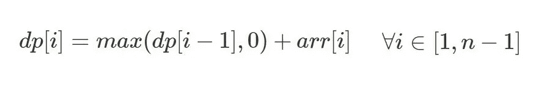

# 卡丹的算法解释了

> 原文：<https://medium.com/hackernoon/kadanes-algorithm-explained-50316f4fd8a6>

给定一个数组，求最大子数组和的算法称为 Kadane 算法。
数组可以是任意维度。为了简单起见，让我们从 1D 数组开始。

让我们来看一个索引为 0 的数组:

arr: [5，7，-3，2，9，6，16，22，21，29，-14，10，12]

我们可以在任何时候启动子阵列。
假设我们从索引 2 开始，即 arr[2] = -3。现在，在索引 3 处，和将是-3 + 2 = -1。如果我们从索引 3 开始子数组，索引 3 处的和是 2，大于前面的和。

所以我们有两个选择:要么从当前索引开始，要么将当前元素添加到前面的总和中。

因为我们想要最大的子数组和，我们把当前元素加到 0 和先前和的最大值上(这里的 0 表示我们从当前元素重新开始)。

这个问题属于动态编程范式。

让我们取一个数组 dp[]，其中每个 dp[i]表示结束于索引 I(包括 I)的最大子数组和。

我们可以这么说

基本条件:
*dp[0] = arr[0]*

答:
DP[]数组中的最大元素

时间复杂度:O(N)
空间复杂度:O(N)

我们可以通过将 dp[i-1](之前的总和)放入一个变量来优化空间复杂度，从而消除对 dp[]数组的需要。

时间复杂度:O(N)
空间复杂度:O(1)

我们还可以找到具有最大和的子阵列的索引。

我们也可以将 Kadane 的方法应用于 2D 矩阵，在这里我们必须找到子矩阵的最大和。请随意尝试卡丹的 2D 矩阵。感谢您的阅读！😃