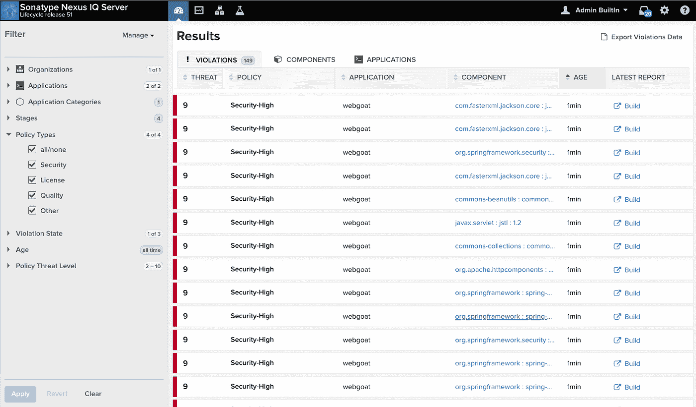
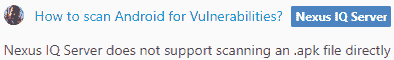

# 检测贵组织第三方依赖关系中的漏洞。

> 原文：<https://medium.com/hackernoon/keeping-third-party-dependencies-in-check-e9f5d1467039>

在这篇文章中，我将解释第三方依赖的风险以及如何用合适的工具来减轻它们。

# **如果你不做就该死**

无论你是一名开发人员、首席技术官还是一名技术主管，我敢打赌你在某个时候都面临着为你的软件添加第三方依赖的困境。尽管有这么多好处，但它们确实伴随着一些明显的权衡，如下所示:

*   **众所周知的漏洞**:有这么多的人在使用这个代码，肯定有一些聪明人已经找到了破解它的方法
*   许可限制:许多库和组件在某些情况下不能使用，除非你精通不同类型的许可，否则你会陷入法律纠纷
*   缺乏灵活性:因为你不是代码的所有者——你不是决定必须包含什么特性以及它们应该如何工作的人

检测第三类问题是微不足道的，但是如何检测属于前两类的问题呢？如果你的公司很小，只有几个依赖项，你可以进行手动检查，但是当你开始扩展你的业务，工程师的数量开始增加到几十或几百人时，你也必须扩展你的方法、流程和工具。

# **输入 Sonatype Nexus IQ**

你可能听说过**Nexus**repository——这是一个你可以上传二进制文件并与组织内外的其他人分享的地方。有了 Gradle 或 Maven 这样的工具，任何有权限的人都可以毫不费力地依赖你的代码。这里有一篇[很棒的文章](http://www.vogella.com/tutorials/Nexus/article.html)如果你想了解更多，以及它与 **jcenter** 和 **Maven Central** 的区别。

当你在 **Nexus** 上发布任何东西时，你只需按一下设置中的开关，就可以检查你的代码是否存在已知的漏洞或违反许可的情况。然而，如果你决定不发布，你仍然可以使用他们的[Nexus IQ server](https://help.sonatype.com/iqserver)——一个强大的引擎，允许你创建自己的公司关于第三方依赖关系使用的政策，以及一个扫描工具，它将生成关于你的代码遵守这些政策的报告。生成之后，可以在一个仪表板上找到这些信息，其中非常详细地描述了发现的所有漏洞、相应的常见解决方法和最佳使用实践。



Dashboard of Nexus IQ server

# **进修课程**

简单浏览了一下官方教程后，你会发现你需要以下内容

*   Nexus IQ 服务器的已部署实例
*   已部署实例的可访问 URL
*   用于存储报告的用户凭据和应用程序 ID
*   Nexus IQ CLI 工具和运行它的 Java8
*   你要分析的二进制，我就叫它**神器**

```
*java -jar <NEXUS_DIR>/nexus-iq.jar -i <APPLICATION_ID> -s <NEXUS_IQ_SERVER_URL> -a <USERNAME>:<PASSWORD> <ARTIFACT>*
```

转眼间。现在，如果你去你的仪表板，你会看到在你的*工件的名字*下面有它的扫描结果。当然，你可以将整个文件夹提供给 Nexus IQ CLI，让它分析里面的所有内容，而不是单个文件。

Nexus IQ *能*分析的一切那就是。

它支持的格式包括 *jar、war、ear、tar、tar.gz、zip* 甚至 *Docker 图像。*官方帮助说支持的多了很多，像 C-style *。o* 文件，然而有一个明显的遗漏。



Oh well.

这是一个强大的工具，任何技术领导者或 CTO 都会喜欢，但是有一个问题。

它不是为移动应用程序而构建的。

弄清楚如何将 Android 和 iOS 依赖项添加到这个仪表板可能会让你头疼。结果是非常值得的——您公司代码安全的唯一来源，在下一篇文章中，我将教您一些技巧，帮助您将其与 Android 集成。

*您是否使用其他工具进行漏洞扫描？你听说过 Nexus IQ 的任何缺点吗？请在下面评论——欢迎任何反馈。*