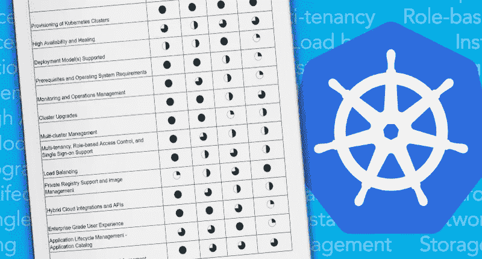

# 评估企业 Kubernetes 解决方案时要考虑的主要特性

> 原文：<https://medium.com/hackernoon/key-features-to-consider-when-evaluating-an-enterprise-kubernetes-solution-f6e988defe90>

跨行业的数字化转型推动了 IT 支持云原生应用的需求。这导致企业采用 Kubernetes 作为支持云原生的、基于容器的架构的最有效方式，并实现其应用和 IT 基础设施的现代化。

各种规模的组织都在寻求利用 Kubernetes——既用于绿地应用，也用于传统应用的重构和现代化。虽然许多组织都在寻求利用 Kubernetes，但 Kubernetes 专家的人才稀缺，加上大规模运营 Kubernetes 的复杂性，阻碍了成功采用。

**众所周知，Kubernetes 难以大规模部署和运营** —尤其是对于管理内部和公共云基础架构的企业而言。行业中出现了许多 Kubernetes 解决方案和产品(来自初创公司和老牌传统供应商)，旨在解决 Kubernetes 面临的一些挑战。空间变得拥挤，组织很难浏览和比较各种产品。

下面，我们确定了 [18 项技术和运营能力](https://platform9.com/blog/key-features-to-consider-when-evaluating-an-enterprise-kubernetes-solution/)，在评估各种在企业中大规模支持 Kubernetes 的解决方案时要考虑这些能力。在本系列的下一篇文章中，我们将比较一些领先的商业解决方案，以及它们在这些关键特性上的表现。

# Kubernetes 集群的高可用性:

Kubernetes 不提供高可用性集群的现成部署，HA 必须由 Kubernetes 管理员进行配置。建议在负载平衡解决方案后配置至少三个主节点，集成或独立集群部署 etcd，存储所有集群状态信息。任何高可用性解决方案还必须考虑故障场景以及自动修复和恢复。

# 2)支持的部署模型

Kubernetes 解决方案的部署模型定义了它将如何集成到您的企业环境中，以及它可以为第 2 天的操作提供什么级别的支持服务级别协议(SLA)。

Kubernetes 解决方案的三大部署模式是:

1.  传统的本地部署:用户自行下载 Kubernetes 并将其部署在基础设施上，或者使用供应商提供的专业服务和支持
2.  托管的 Kubernetes 即服务(KaaS):供应商将在云或托管提供商托管的基础设施上提供 Kubernetes 即服务
3.  混合云 Kubernetes 即服务:Kubernetes 作为服务在您选择的基础架构上提供，无论是您自己的内部数据中心，还是跨公共云基础架构。

# 3)先决条件和操作系统要求

企业 Kubernetes 解决方案的先决条件定义了在使用 Kubernetes 之前需要满足哪些基础设施需求。一些解决方案需要购买昂贵的底层基础设施许可，如虚拟机管理程序，或者投资托管的 Kubernetes 解决方案。

# 4)监控和运营管理

必须随时监控生产 Kubernetes 集群，以便在不严重影响集群和应用程序对用户的可用性的情况下处理任何问题和停机。企业 Kubernetes 解决方案必须提供这种现成的功能。

# 5)集群升级

Kubernetes 有一个庞大的贡献者社区，每 3 个月就有一个新版本。企业级解决方案将支持集群的滚动升级，这样，即使集群正在升级，集群和集群 API 也始终可用。此外，它将提供在出现故障时回滚到先前稳定版本的能力。

# 6)多集群管理

单个 Kubernetes 集群可以水平扩展以支持大型工作负载集。但是，在生产环境中运行 Kubernetes 需要能够运行多个 Kubernetes 集群，因为您希望通过将开发/测试/试运行应用程序部署在单独的集群上，将它们与生产应用程序完全隔离开来。

# 7)多租户、基于角色的访问控制和单点登录支持

Kubernetes 使用名称空间抽象在集群级别支持多租户。然而，在多集群环境中，您需要一个更高级别的多租户抽象来补充 Kubernetes 的多租户，并在不同的用户团队之间提供适当的隔离级别。它应该与企业最常用的单点登录(SSO)解决方案集成，如 Active Directory 或 ADFS、俄克拉荷马州和其他流行的 SAML 提供商。

# 8)负载平衡

Kubernetes 自动对 Kubernetes 集群内的应用服务请求进行负载平衡。但是，有些服务需要对外公开，供外部客户使用。Kubernetes 没有为这类服务提供现成的负载平衡解决方案。企业 Kubernetes 解决方案应该包括强大的外部负载平衡功能，或者与现有的商业负载平衡器无缝集成。

# 9)私有注册表支持和映像管理

在 Kubernetes 集群上运行容器化的应用程序需要能够访问存储应用程序映像的容器注册中心。大型企业组织通常需要一个安全的私有容器注册表来存储其专有的应用程序映像。企业 Kubernetes 解决方案应该提供开箱即用的映像管理功能。

# 10)混合云集成和 API

如今，每个企业都希望通过投资多种云解决方案来构建云中立战略。将多个私有云和/或公共云作为您的云战略的一部分，可确保您不会受限于单一提供商，在定价方面没有任何优势，从而在您的整个基础架构中实现高可用性，并满足您独特的业务策略。

# 11)企业级用户体验

企业级用户体验就是拥有一个完美的用户界面，使企业能够通过单一用户界面管理其混合环境。这提供了全面的可见性，简化了整个环境中的通信。这个 UI 应该允许跨多个集群的操作:例如，在不同区域、数据中心和云提供商上运行的所有集群中，全局搜索特定类型或标记有特定标签的工作负载。

# 12)应用生命周期管理—应用目录

应用程序目录为一组基于 Kubernetes 的预打包应用程序提供了简单的一键式部署。它还为最终用户提供了一种工具，让他们可以通过目录构建和发布自己的应用程序，让他们团队或组织中的其他人通过单击方式进行部署。应用程序目录使组织能够基于一组应用程序部署方案或蓝图实现标准化，从而避免配置的蔓延。

# 13)生产级服务水平协议(SLA)

随着越来越多的组织在 Kubernetes 上运行他们的业务，IT 必须确保它能够支持业务所需的 SLA。它必须确保 Kubernetes 可供开发人员和企业使用，以支持关键计划。大多数组织需要 99.9%的正常运行时间。

# 14)易于设置、安装、连续、使用、管理和维护

一个成功的 Kubernetes 平台必须易于实现和维护，这样组织才能持续利用容器。仅仅这一点就是许多组织没有克服的主要障碍。

# 15)网络支持和集成

网络集成是在生产和大规模运行 Kubernetes 集群的关键组成部分。企业通常会希望 Kubernetes 与他们目前标准化的软件定义网络(SDN)解决方案或 calico 或 weave 等容器原生解决方案集成，从而为他们提供更多隔离选择。

# 16)存储支持和集成

与网络类似，与企业级存储的集成是在生产中运行 Kubernetes 集群的一个重要组成部分。Kubernetes 提供了一个称为持久卷的抽象来保存有状态应用程序持久化的数据。对于 Kubernetes 企业产品来说，将 PVs 映射到实际的高可用性存储技术非常重要。企业通常希望他们的 Kubernetes 部署能够与他们已经部署的存储解决方案(如 NetApp、Pure、SolidFire 等)集成。或者他们可能希望与诸如 Portworx 之类的容器本地存储技术集成。

# 17)自助服务供应

开发人员必须能够自助访问一个或多个 Kubernetes 集群，并具有适当的隔离级别，因此只有具有适当权限的成员才能访问生产工作负载。

# 18)内置 CI/CD 支持

开发人员运行的最关键的工作负载之一是持续集成/持续交付。强大的 CI / CD 管道对于确保敏捷开发和向客户快速交付新软件版本至关重要。