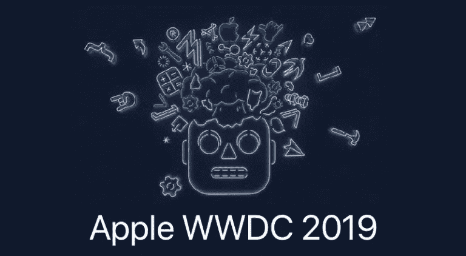

# 苹果 WWDC 2019 的主要亮点

> 原文：<https://medium.com/hackernoon/key-highlights-from-apple-wwdc-2019-6315ece8d4c4>

2019 年 6 月 3 日，对 igeeks 来说是有趣的一天。就像九月的特别活动一样，苹果在 2019 年年度全球开发者大会(WWDC)上带来了很多进步。苹果在 2019 年 WWDC 展会上推出了一些令人惊叹的应用和智能手表更新。以下是 2019 年 WWDC 主题演讲的主要亮点。

[*developer.apple*](https://developer.apple.com/wwdc19/)

# iOS 13——最期待的更新

*   黑暗模式是这次更新的官方版本
*   信息是启用了可滑动的短信。还附带经常联系的人的建议联系方式
*   音乐带来了实时歌词模式，在歌曲旁边显示歌词
*   Memojis 变得更加个性化，例如新的化妆选择、发型和配饰。
*   提醒大大刷新。例如，当您在提醒中标记某人时，下次您给该联系人发送消息时，您也会收到提醒。
*   地图现在提供 360 度视角。iOS 13 带来了一个更详细的地图，在启动页面上有一个快捷方式，显示你要寻找的地点。只需轻轻一点，你就可以得到一张街景照片，这张照片可以放大，让你可以 360 度环视四周。当您再次点击时，您可以沿着道路行驶以获得详细的视图。
*   照片应用程序有全新的分类模式，将照片分为天，月和年，使浏览图像变得容易。
*   该更新带有辅助语音控制。

测试版面向开发者，将于 7 月面向公众开放。最终版本将于秋季推出。

# Siri 在 CarPlay 和 AirPods 上获得了新功能

*   Siri 现在是由神经文本到语音技术生成的，而不是基于人类的记录
*   Siri 现在可以读取你收到的信息，让你立即回复
*   如果你需要和朋友分享音乐，AirPods 可以拆分
*   HomePod 上的扬声器现在可以识别不同的声音，并给出个性化的响应
*   CarPlay 支持现在与 Pandora 等第三方应用程序兼容，Siri 可以根据活动和连接的应用程序建议自动快捷方式

# 更新了 HomeKit 和 App 权限的安全协议

*   你现在可以选择让应用程序每次都询问你是否要共享你的位置。其他时候，iOS 会切断对这些数据的访问，直到应用程序需要这些数据才能运行
*   苹果还推出了单点登录功能，将使用 Face ID 认证来登录不同的应用和服务
*   您也可以选择共享或隐藏您的电子邮件地址。如果你想隐藏它，苹果会创建一个随机的电子邮件账户，将信息转发到你实际的电子邮件 id
*   苹果 HomeKit 增加了对某些新型设备的支持，包括家庭安全摄像头和路由器。引入了一种新的安全视频模式，在将视频片段发送到云端之前，先在本地对其进行加密

# iPad 有自己的操作系统

*   新操作系统为 iPad 提供了多窗口功能
*   文件视图看起来像是 macOS 的视图，可以在分栏视图中浏览
*   iCloud 上的共享变得更加简单，因为它允许文件夹共享
*   iPads 现在可以支持 USB 拇指驱动器或直接从两台设备之间的 USB 电缆导入相机
*   引入了新的文本编辑手势。.例如，用三个手指挤压/展开来复制、剪切和粘贴，用三个手指左右滑动来撤销和重做

# MAC OS Catalina v 10.15——告别 iTunes

*   苹果将把 iTunes 应用分成三个应用，如音乐、播客和电视，以满足各自的需求
*   Mac 也将支持 iPad 作为第二台显示器，以提供一种变通办法。这个功能被命名为 SideCar。它可以让你以有线和无线方式连接 iPad
*   新的更新带有辅助语音控制，包括控制从打开应用程序到调节音量和编辑文本的一切
*   这一更新来自 Project Catalyst，通过它，开发者现在可以将 iPad 应用移植到 Mac 上

# 苹果手表拥有自己的应用商店

*   watchOS update 6 自带应用商店，可以通过 Siri、scribble 或语音听写找到。
*   它带来了苹果计算器，可以快速分割账单并给设备小费。该设备还配备了语音备忘录应用程序，可以随时随地进行录音。
*   WatchOS 还带来了一些健康和健身方面的长期活动趋势，可以显示您在几个月和一年内的健身水平变化。苹果为女性健康手表带来了月经周期跟踪功能，以接收即将到来的月经警告。

# TvOS 支持多用户

*   除了多用户支持，TvOS 还根据用户观看的内容显示节目和音乐的个性化推荐。
*   全新的 TvOS 带来了重新设计的主页，可以显示电视节目和电影的预览。
*   Apple Tv 现在将支持第三方游戏配件，如 Xbox One 和 PS4 控制器。
*   就像 iOS 13 一样，音乐播放 UI 也显示跟随歌曲的现场歌词。

# 新款 Mac Pro 上市了

*   与 2013 年 Mac Pro 的圆形垃圾桶不同，新款 Mac Pro 看起来像一个笨重的塔，功能完全不同。
*   它包括一个 28 核处理器和高达 1.5 TB 的内存。
*   它包含六个内存扩展插槽和八个 PCI 插槽，三个 Thunderbolt 端口，两个 USB-C 和两个 USB-A 端口。
*   该模块支持 AMD 镭龙 Pro 580X 或镭龙 Pro Vega II，并可配置为添加多达两个 Vega II。
*   新的处理卡最多支持 3 个 8K 流或 12 个 4k 流。
*   Mac Pro 的显示器是 32 英寸的 LCD 屏幕，配有 Retina 6K 显示屏。
*   这种显示器被命名为“极限动态范围”(XDR)，可以连接六个显示器，每个显示器的像素高达 1.2 亿。

Mac Pro 的 8 核英特尔至强处理器、32GB 内存和 512GBSSD 售价为 5999 美元，Pro Display XDR 的售价为 4999 美元。该支架单独出售，售价为 999 美元。

这些是 2019 年 6 月 3 日苹果 WWDC 公司的亮点和重要公告。

敬请关注更多更新！

*注:这篇文章之前发表在我们的博客上:* [*这里*](https://www.spec-india.com/blog/key-highlights-from-apple-wwdc-2019/)