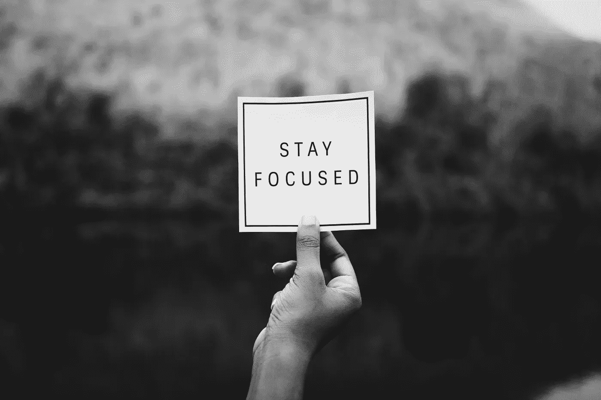
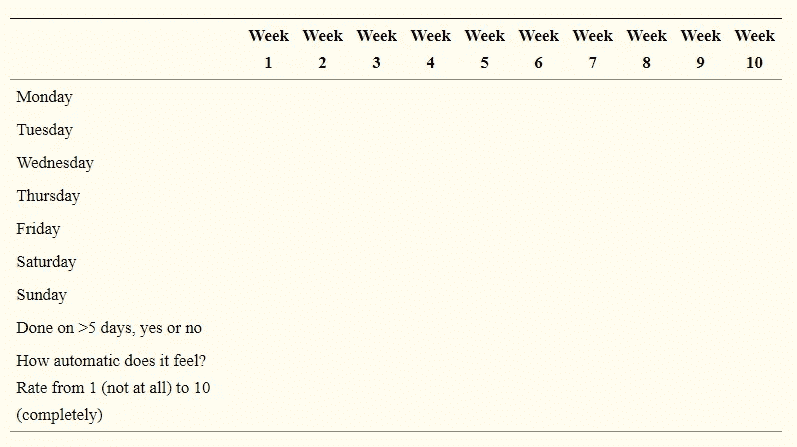

# 成功的关键:自律

> 原文：<https://medium.com/hackernoon/key-to-success-self-discipline-ab45bb05a08a>

## 你永远不会有动力。你必须学会遵守纪律。


Photo by [Eberhard](https://www.pexels.com/@eberhardgross) on Pexels.

当我厌倦了高中的学习时，我的家人会说，当你进入大学时，你会有足够的时间去做。

它发生了，祝贺你！

在大学的第一年，我有足够的时间睡觉、玩电子游戏、吃垃圾食品。一开始，一切都很好。但当它变成一种瘾时，我的灵魂开始被吸走。疲劳、无聊、眼袋、关系不好等等。

直到有一天，我有五门考试不及格，面临着大学延期的风险。我终于明白了形势的严重性。我意识到我考试迟到了，关系迟到了，生活也迟到了。

那么我是如何熬过艰难困苦，成为一名数据科学家的呢？

这是我所遵循的方法和道路，它给我带来了成就。

## 自律

我想花一点时间来定义自律到底是什么，我想从问和回答两个问题开始。

*   第一，“自律到底是什么？”
*   第二，“它和动机有什么不同？”

因为我认为很多人把这两个术语搞混了。首先，我想引用作家塞缪尔·托马斯·戴维斯的一段话。因为它以一种非常简洁的方式回答了这两个问题。

> “自律就是倾向于抵制。不顾你的感受采取行动。过设计好的生活，而不是默认的生活。但最重要的是，这是按照你的想法行事，而不是你的感觉。”

换句话说，动机是你想做某事的总体水平，而纪律是你不顾自己感受去做的能力。如果你们中的任何一个人醒来后想，我不觉得这是你们所有人，包括我自己，你现在可以看到自律是多么重要。不管你感觉有多积极，你都要建立一个基线，让你按照你的长期目标行动。

我将从一个起初看起来不太实际或不太可行的问题开始。但是请坚持我的观点，因为这是一种思维方式的转变，我发现它比我最近尝试过的任何一种自我提高的方法都更有帮助。

# 关注身份

简而言之，当你试图改变自己的行为时，忘记你试图实现的目标，外部结果，而是专注于你希望发生的身份改变。这是我第一次在詹姆斯·克利尔的书《原子习惯》中读到的概念，顺便说一下，我强烈推荐这本书。这本书的开头有一段话很好地概括了这一点:

> 想象两个人抗拒一支烟。当有人给你一支烟时，第一个人说，
> 
> “不，谢谢，我正在努力戒烟，”
> 
> 这听起来像是一个合理的反应，但这个人仍然相信他们是一个吸烟者，正在努力成为其他人。他们希望自己的行为会有所改变，同时保持同样的信念。第二个人拒绝说，
> 
> 不，谢谢，我不抽烟。
> 
> 这是一个很小的区别，但这些声明标志着身份的转变。吸烟是他们以前生活的一部分，而不是现在的生活。他们不再认为自己是吸烟者。

所以，这里的总的想法是，一旦你接受了身份的改变，你会发现自己的行为与这种改变一致。如果你想知道为什么会发生这种情况，罗伯特·恰尔迪尼的书《影响——说服心理学》的第三章对此有很好的解释。从本质上讲，人类感受到这种与他们过去的决定保持一致的自然冲动。正如他在书中写道:

> “一旦我们做出选择或表明立场，我们就会面临个人和人际压力，要求我们的行为与承诺保持一致。这些压力将促使我们做出反应，证明我们先前的决定是正确的”

在过去的几个月里，以这种方式改变我的思维方式非常有帮助。我实现的第一个方法，是开始把自己当成一个作家。现在，我一直是一个对写作很好奇的人。但是我从来不认为自己是一个作家。这其中有一些冒名顶替综合症的原因。但是，在读了书中的那一段后，我决定迈出这一步，开始把自己当成一个作家，而不仅仅是一个写散文的人。这种心态的转变对我在许多不同领域的自律水平产生了奇迹，从更持续地阅读到更努力地写作，甚至改善了我的饮食，这比过去几个月好了很多。所以，说真的，如果你没有从这篇文章中得到什么，我把它放在第一位是有原因的，从你想要体现的身份而不是你想要实现的目标的角度来考虑行为改变。



Photo by [rawpixel](https://www.pexels.com/photo/person-holding-stay-focuseds-paper-1496146/) on Pixebay.

# 创建提醒

经常提醒你自己为什么你会在第一时间受到惩罚。在一天结束的时候，如果你想坚持不懈地去做，你必须有一个强烈的“为什么”去做。每当我想到这个概念，我就会想起一个关于演员金凯瑞的故事，就像[这个](https://www.youtube.com/watch?v=DXwVD2ncqfE)，

> 在他到达好莱坞后，他仍然是一个贫困的演员，有一天他拿出一张餐巾纸，给自己开了一张 1000 万美元的支票，并注明了未来 5 年的日期。然后把支票放进了他的钱包。所以每次他拿出钱包时，他都能看到它，提醒自己为什么这么努力工作，他的目标是什么。

你可能会发现这样做很有帮助。试着写下你的目标或你想要的身份，把它放在你桌子旁边或电脑旁边的便利贴上，这样你就可以每天都看到它，并且知道这就是为什么我要建立自律，这就是我投入所有工作的原因。

# 拥抱不适

拥抱你对做一些不愉快的艰苦工作的抗拒是一个重要的概念。就像去一个真正的健身房举重会让你将来更擅长举重，并且在下次去的时候能举起更多的重量。每次你拥抱不适的时候，你实际上是在做一种自律的练习，因为这是一种可以学习的技能，是一种可以日积月累形成的肌肉。这就是为什么一些成功人士支持洗冷水澡，因为大多数人不想洗冷水澡。站在那股冰冷的水流下不是很舒服，这才是重点。

[研究](https://www.ncbi.nlm.nih.gov/pmc/articles/PMC4049052/)表明水疗法被广泛用于提高免疫力和治疗疼痛、焦虑、肛门直肠疾病等等。

每天早上你去淋浴，你选择把把手转得太冷而不是太热，你在拥抱不适，你倾向于抵抗，这让你在未来更好地这样做，不管任务是什么。别忘了路德维希·范·贝多芬过去常常在作曲前将头浸入冷水中以保持清醒。

所以，当你度过你的日常生活时，找到拥抱不适的方法。可能是洗冷水澡，可能是报名参加健身班，可能是走楼梯而不是坐电梯。基本上，每当你的大脑吐出我不喜欢它的借口，这是一个建立自律的机会，你应该抓住它。

# 瞄准基本面

我们单子上的第四项是首先针对基本要素，我说的基本要素是指生命的生物必需品:

*   睡眠
*   营养
*   锻炼习惯

这些都是需要注意的关键。因为你大脑中处理执行功能的部分，即控制你的欲望和冲动的部分，需要大量的能量和规律的休息才能达到最高水平。永远记住，你首先是一个生物系统的集合，如果你想得到最好的输出，你需要正确的输入。

我知道，很容易把大脑想象成与所有这些相分离，存在于这个形而上学的领域中，在那里唯一需要的燃料来源是动机、决心和有益健康的迷因。但是大脑需要休息，它需要锻炼，它需要正确的营养平衡，就像你身体的其他部分一样。所以，如果你是，或者你没有得到足够的锻炼，或者你的饮食是垃圾，这就是你应该首先关注你的纪律。


Photo by [Selover](https://www.pexels.com/@spencer-selover-142259) on Pexels

# 沉思

说这句话让我很痛苦，因为我个人不能很好地集中注意力做这件事，但是你可能想尝试冥想。你可能想这么做的原因是，科学证明冥想有助于人们提高自律水平。

事实上，斯坦福大学 2013 年的一项研究表明，经历过有特定冥想项目的同情心训练的人能够更好地调节自己的情绪。

这对于保持纪律性和能够做出理性的决定是至关重要的。现在，一个简单的开始方式是使用引导冥想，你可以通过 Headspace 和 Calm 等应用程序或 YouTube 上的许多免费视频来使用它。但是我一直练习的冥想形式，我认为对自律的发展更好，是一种所谓的禅坐形式，我只是坐着，闭上眼睛专注于我的呼吸。当我的注意力不可避免地被一个随机的想法吸引时，我努力去注意它，让那个想法离开，然后把我的注意力带回到我的呼吸上。长期这样做有助于自律和专注。如我所说，我不太喜欢冥想。大概是我做的最少的自我发展练习吧。但是这样做的好处是不可否认的。

# 养成习惯

就像我之前说的，在改变你的行为的整个过程中，培养新习惯是一种独立的训练。但是，培养新习惯的初始阶段通常需要自律。因为这种行为还不是自动的。所以，这可能是一个很好的方法，不仅可以建立一个新的习惯，还可以在这个过程中变得更加自律。

例如，我希望写作成为我的下一个习惯，并决定每天写作。为了永久养成这个习惯，我创建了我的网站，并开始每天写作。

无论你选择建立什么样的习惯，从小处着手，跟踪你的进展，也许可以使用一个像 Android 上的 Habitica 或 Strides 或 HabitBull 这样的应用程序。庆祝你的胜利，也记得不要太关注纯度，完美的条纹。相反，集中精力确保你的趋势总体上是积极的。记住，当这样做的时候，当行为变得更加自动的时候，你的自我弟子在这个过程中也在进步。

根据[的研究](https://www.ncbi.nlm.nih.gov/pmc/articles/PMC3505409/)，习惯的形成在“稳定阶段”达到顶点，在这个阶段，习惯已经形成，其强度已经达到稳定状态，因此只需很少的努力或考虑就能持续一段时间。

研究人员建议你应该有一个简单的自我监控表，如下图所示，

```
**Make a new healhy habit:**1\. Decide on a goal that you would like to achieve for your health.2\. Choose a simple action that will get you towards your goal which you can do on a daily basis.3\. Plan when and where you will do your chosen action. Be consistent: choose a time and place that you encounter every day of the week.4\. Every time you encounter that time and place, do the action.5\. It will get easier with time, and within 10 weeks you should find you are doing it automatically without even having to think about it.6\. Congratulations, you’ve made a healthy habit!My goal (e.g. ‘to eat more fruit and vegetables’) _________________________________________________My plan (e.g. ‘after I have lunch at home I will have a piece of fruit’)(When and where) ___________________________ I will ___________________________Some people find it helpful to keep a record while they are forming a new habit. This daily tick-sheet can be used until your new habit becomes automatic. You can rate how automatic it feels at the end of each week, to watch it getting easier.
```



[Source](https://www.ncbi.nlm.nih.gov/pmc/articles/PMC3505409/)

# 结论

我知道，重新开始是每一次失败后最难的一步。因为人们需要一个强有力的触发器来加强他们自己的动力。你应该探索你的动力来源，成为一个主动的人。积极主动是克服困难的最好方法。

最后，根据我在这条路上的经历，我能给你的建议是，

*   不要花太多时间去想过程。在你的生活中实施方法时，比起完美的计划，更喜欢体面的执行。
*   尽量不要和别人分享你的目标。因为当我分享我的目标时，我听到很多次‘你做不到’，甚至是从大多数亲密的朋友那里。可能会让人失望。相反，当你取得成就时，让他们大吃一惊！