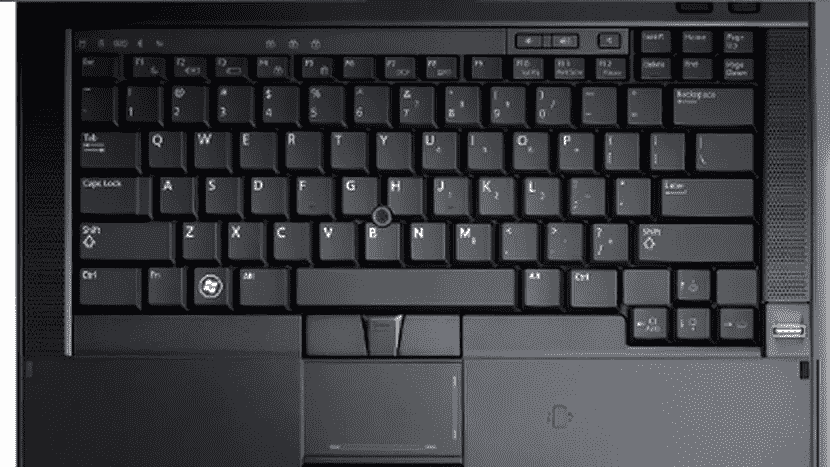
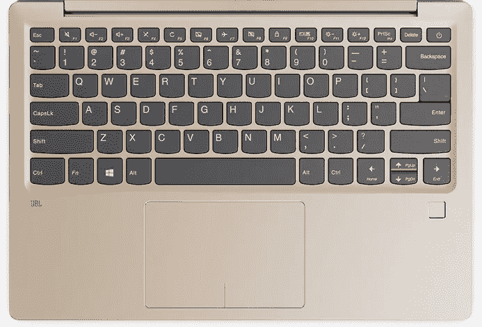

# 开发人员的键盘，第 1 部分——让我们来谈谈笔记本电脑的键盘

> 原文：<https://medium.com/hackernoon/keyboards-for-developers-part-1-lets-talk-about-laptop-keyboards-6b992982d2c6>

我喜欢痴迷于键盘——我拥有许多机械键盘(我将在本文第二部分谈到这些)，我也喜欢在[笔记本电脑](https://hackernoon.com/tagged/laptop)上编码时有良好的打字体验。

当谈到[苹果](https://hackernoon.com/tagged/apple)时，几乎没有选择——Macbook/Macbook Pro 键盘就是你能得到的。如果你在技术行业工作，你很可能没有笔记本电脑可供选择；你只是得到了一台苹果电脑。那里没什么好谈的。

对于个人用途，我喜欢有一台 PC 笔记本电脑；现在我倾向于用它来双启动 Windows 和 Linux。我写过关于在不同的 PC 笔记本电脑上安装 [CentOS](/@bigilui/installing-linux-centos-7-on-an-older-windows-laptop-c8d07cae689f) 和 [Antergos](/@bigilui/installing-antergos-linux-on-a-lenovo-ideapad-720s-amd-ryzen-dual-booting-with-windows-10-1ac8e2bd94a6) 的文章。

在寻找这样的超极本笔记本电脑时，除了笔记本电脑的重量之外，键盘布局是我主要关注的问题之一。显然，你不可能要求在笔记本电脑键盘上有机械键盘的感觉。我可以接受笔记本电脑为了保持它的外形而去掉内部开关或薄膜。事实上，我甚至可以接受许多人抱怨的最新 Macbook Pro 键盘的打字感觉。

不过，键盘布局是我不喜欢妥协的东西。不幸的是，在 PC 膝上型电脑行业中，有一种向越来越紧凑的键盘发展的趋势。作为一名程序员，导航键，尤其是 Home 和 End，是我编码时最常用的键，而肌肉记忆要求它们大致位于箭头键上方的区域。我特别讨厌他们藏在 Fn 修改器后面！

正如我之前在 CentOS 文章中提到的，我曾经拥有一台 [Dell Latitude E6410](https://www.amazon.com/gp/product/B01D7SWQBW/ref=as_li_tl?ie=UTF8&camp=1789&creative=9325&creativeASIN=B01D7SWQBW&linkCode=as2&tag=blmed-20&linkId=8825a045b48de4beecf228b64a78902e) 笔记本电脑。这绝对不是最好的笔记本电脑——笨重、过时的外观，轻薄的屏幕转轴。然而，它确实拥有迄今为止我用过的所有笔记本电脑中最好的键盘布局:

注意全尺寸的箭头键，以及顶部的全套导航键，包括 Home/End/PgUp/PgDown！一个程序员对笔记本电脑键盘布局的梦想。我不太关心 TrackPoint 或 3 键触控板。我甚至不需要专用的音量按钮，它们可以藏在我所关心的 Fn 修饰键后面。但是给我专用的 Home/End 键！

有趣的是，这种布局甚至没有比现代超极本上的许多紧凑型键盘占用更多的空间。例如，我们来看看[联想 Ideapad 720s](https://www.amazon.com/gp/product/B07B38S3MH/ref=as_li_tl?ie=UTF8&camp=1789&creative=9325&creativeASIN=B07B38S3MH&linkCode=as2&tag=blmed-20&linkId=a649eb53d0cabb23818b8c623f3cbe83) 的键盘，我在 Antergos 的文章中提到过:

这可能是所有现代超极本键盘中最不奇怪的，但你会看到所有的 Home/End/PgUp/PgDown 都隐藏在 Fn 修饰键+箭头键后面。看看为触控板区域预留了多少空间。我希望能把一些空间还给键盘，换成一套合适的导航键。我渴望有一个更大的触控板，但我肯定会为导航键牺牲一点触控板空间。

找到一款键盘布局好的超极本变得如此糟糕，如此不可能，以至于我曾短暂地考虑过创办一家笔记本电脑生产公司，生产一系列开发人员笔记本电脑，开箱后一切都可以在 Linux 中正常工作，并拥有对开发人员友好的键盘布局。希望像这样的帖子能引起一些笔记本电脑制造商的注意，高层会决定设计一款键盘布局合理的笔记本电脑。

这篇文章的下一部分将是关于我用过的各种机械键盘，以及我对它们优缺点的看法。

 [## 开发人员键盘，第 2 部分—机械键盘

### 在这篇文章的第一部分，我谈到了笔记本电脑键盘。我真的需要把这件事说出来。我…

hackernoon.com](https://hackernoon.com/keyboards-for-developers-part-2-mechanical-keyboards-5b5795e8f8ad)