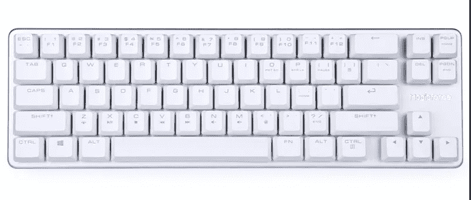
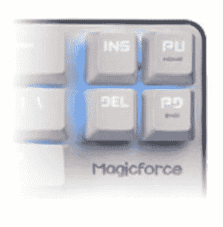
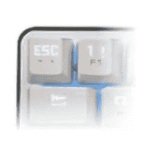
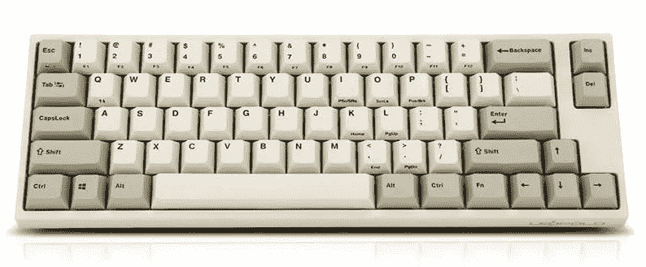
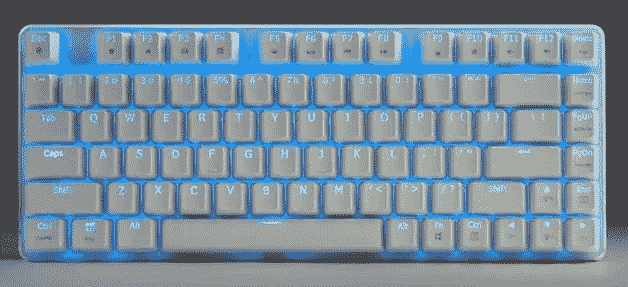
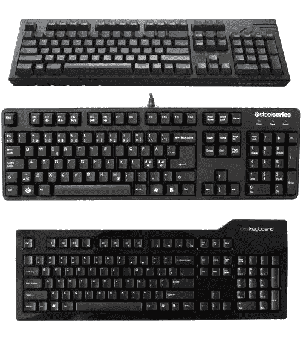
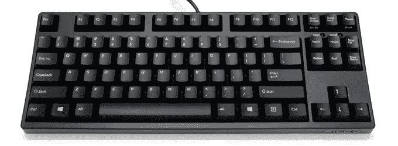

# 开发人员键盘，第 2 部分—机械键盘

> 原文：<https://medium.com/hackernoon/keyboards-for-developers-part-2-mechanical-keyboards-5b5795e8f8ad>

在这篇文章的第一部分，我谈到了 T2 笔记本电脑的键盘。我真的需要把这件事说出来。我对超极本笔记本电脑的键盘[设计](https://hackernoon.com/tagged/design)趋势感到恼火，并希望笔记本电脑公司能发布一款真正好的。

现在，进入我真正想写的主题——真正的键盘。

机械键盘曾经是一个相当小众的感兴趣的项目。大约在 2010 年，我开始接触机械键盘。我这么做的原因主要是为了游戏——我是一个狂热的星际争霸 2 玩家，机甲键盘是职业玩家的最爱。

几年后，机甲钥匙变得相对主流(至少在像软件工程师/程序员这样的计算机超级用户中)，并且围绕它建立了一个完整的爱好者社区。我以前的雇主，Massdrop，在建立这个社区的过程中发挥了作用，作为在那里工作的结果，我也尝试了更多的键盘。

我将从我目前的日常键盘开始。

## 一台可以搭配我工作用笔记本电脑的电脑，Macbook Pro



Magicforce 68

奇三的 [Magicforce 68(带 Outemu 棕色开关)是我最新的工作用键盘，我真的很喜欢它。](https://www.amazon.com/gp/product/B01E8KO2B0/ref=as_li_tl?ie=UTF8&camp=1789&creative=9325&creativeASIN=B01E8KO2B0&linkCode=as2&tag=blmed-20&linkId=4b505ed13f755a1fc4716038cabed253)

首先，对于那些还不熟悉机械按键下各种开关的人来说，它们通常意味着不同的打字感觉——通常表现为激活按键所需的不同压力/力度，以及触觉与线性和点击感觉和声音。常见的(Cherry 品牌有售)有棕色(触感、中压)、蓝色(咔嗒声、响亮、低压)、红色(线性、低压)、黑色(线性、高压)，还有其他几个不太常见的。[本页](https://www.keyboardco.com/blog/index.php/2012/12/an-introduction-to-cherry-mx-mechanical-switches/)包含一些有助于理解这一点的动画。Outemu 号称是 Cherry MX 的等价物，我觉得肯定是有这种感觉的。

布局是这个键盘的主要特点。首先，您会注意到缺少 F 行(F1 到 F12 键)。通常这被称为“60%键盘”(尽管大多数 60%键盘也省略了箭头键和导航键)。这些对 Mac 用户来说很受欢迎，因为当你使用 macOS 一段时间后，你会发现人们很少使用 F-row 键。(事实上，这也是苹果在 Touchbar Macbooks 中取消它们的部分原因)

然而，我选择这个的确切原因是因为箭头键和 4 个导航键。[达克·陈美雅 Pro](https://www.amazon.com/gp/product/B07G4HL2CG/ref=as_li_tl?ie=UTF8&camp=1789&creative=9325&creativeASIN=B07G4HL2CG&linkCode=as2&tag=blmed-20&linkId=1874bb8961db420227a0df2d390cbe04) 是另一款布局类似的键盘。就像之前关于笔记本电脑键盘的帖子里提到的，我真的很喜欢用 Home/End/PgUp/PgDown 键，而且我喜欢直接放在箭头键的上方。



关于这个键盘(和鸭子陈美雅)有趣的事情是，他们选择包括 Ins/Del 和 PgUp/PgDown。我其实从来不用`Ins`，也很少用`Del`。我所做的是使用[键盘大师](https://www.keyboardmaestro.com/)并将 Ins/Del 键映射到 Home/End。

最终的结果是一个最小的键盘，完全符合我的需要，而且没有我根本不需要的额外按键。它基本上是最小的键盘，满足我的所有要求，同时尽可能少地占用桌面空间。



您可能必须习惯的一件事是 Esc 和波浪号(``` / `~`)键区域。作为一名开发人员，我经常使用 Esc 和 tilde，所以我真的需要两者都有专用的键。我选择将 Esc 键映射到波浪符号，将 Caps Lock 映射到 Esc(这显然是自 Touchbar Macbook 发布以来的常见用例；甚至有一种系统偏好的方法可以做到这一点，而不需要使用映射软件。)



Leopold FC660M

另一个值得一提的是 [Leopold FC660M](https://www.amazon.com/gp/product/B0759W8P4Y/ref=as_li_tl?ie=UTF8&camp=1789&creative=9325&creativeASIN=B0759W8P4Y&linkCode=as2&tag=blmed-20&linkId=72f1dcfadfb4878e46eee678d1ca015f) ，它的布局非常相似，但少了两个导航键——它只保留了 Ins/Del 键。我也考虑过这一点(当然，Ins/Del 映射到 Home/End)，但最终它只节省了一列空间，而且键也不在向上箭头的正上方，所以我想这可能需要时间来适应。我决定改用 Magicforce 68。

## 我的家用台式机是一台 Windows 电脑


HAVIT Low Profile Mech Keyboard

HAVIT 低调键盘是我尝试的一款，我感到惊喜。大概是我现在最喜欢的键盘了。

布局没什么特别的。这是全尺寸键盘。HAVIT 也有一个 [Tenkeyless (87 键)版本](https://www.amazon.com/gp/product/B0722GG88M/ref=as_li_tl?ie=UTF8&camp=1789&creative=9325&creativeASIN=B0722GG88M&linkCode=as2&tag=blmed-20&linkId=d3e97ec9cc51352879d7575b1f10f96a)可用(基本上是全尺寸减去数字小键盘)，但我选择了全尺寸，因为我可能有时会玩游戏，一些游戏会使用数字小键盘。

低调的键帽和开关是这款键盘的主要特点。值得注意的是，[达人](https://www.amazon.com/gp/product/B075SZ56PD/ref=as_li_tl?ie=UTF8&camp=1789&creative=9325&creativeASIN=B075SZ56PD&linkCode=as2&tag=blmed-20&linkId=bfb4df131a9e52ba6fe9fd17e9adc82d)也有类似的。对于某些桌子设置(例如高桌、矮椅，你必须将手臂放在更高的位置)，薄型键盘是一个受欢迎的变化。

我最喜欢的这个键盘的另一个特点是 Kailh 开关。这种键盘只有 Kailh Blue 开关可用(至少在亚马逊上)，这就是我为什么要冒险的原因。我过去试过 Cherry MX Blue switch 键盘，虽然感觉不错，但在家里舒适使用时声音太大了。(稍后当我讨论我拥有的其他键盘时，我会详细介绍这一点。)然而，Kailh Blue 基本上保留了 Cherry MX Blue 的大部分感觉，同时更加安静。事实上，我想我现在更喜欢 Kailh Blue 的感觉，而不是它的 Cherry MX 对应物。它甚至可能是所有开关中我最喜欢的一个。

## 我过去试过的其他键盘



Magicforce 82

带 Gateron clear 开关的 Magicforce 82 是我认为自己会真正喜欢的一款。

理论上，它似乎满足了我的所有要求——拥有 Home/End/PgUp/PgDown 键(尽管在右边垂直排列)，箭头键，以及非常紧凑的键盘。另一件很酷的事情是有一个 Del 键，但没有 Ins 键(这是唯一一个没用的键)，所以理论上它符合键盘应该有的样子。有一个 F-row，在我买它的时候，是在我确定 F-row 在 macOS 上没有用之前。

但是，仅仅在工作中认真使用了一天左右，整个打字体验就开始崩溃了。有件事我从来没想过——感应键盘右边缘的回车键。当使用这个键盘时，我总是很难准确地按下回车键，因为回车键不在右边。紧挨着它的右边还有一把钥匙！你不得不控制你的右手需要向右移动多远(为了不超过它)来敲击回车键，这种感觉非常奇怪。过了一会儿，很明显我的工作效率下降了，我不能继续使用它了。

作为一个有趣的事实/旁注，我为这个键盘选择的开关是另一个交易破坏者。只是为了尝试一下，我选择了 Gateron Clear 开关(Gateron 是与 Cherry MX 不同的品牌)，因为这应该是目前最轻的开关(35g，线性，没有触觉或卡嗒声)。它轻得令人难以置信，以至于有时当我把左手小指放在键盘的一角(Ctrl 键)时，我并没有意识到我这样做实际上是在激活 Ctrl 键！现在，我确实喜欢电灯开关，但即使对我来说，这也太极端了。

## 我拥有的三个全尺寸键盘，带有不同的开关



CM Storm QuickFire Pro, Steelseries 6Gv2, and Das Keyboard

带有樱桃色 MX 红色开关的 CM Storm QuickFire Pro 是我最喜欢的早期机械键盘之一。这真的不是键盘本身的问题(这没什么特别的)，而更多的是因为开关。樱桃 MX 红色开关打字感觉很棒。它是线性的，重量轻(但没有 Gateron Clear 开关轻)。键盘的构造有点重，整体来说有点太大了。

带有 Cherry MX 黑色开关的 [Steelseries 6Gv2](https://www.amazon.com/gp/product/B0038X3ZVM/ref=as_li_tl?ie=UTF8&camp=1789&creative=9325&creativeASIN=B0038X3ZVM&linkCode=as2&tag=blmed-20&linkId=1f591dc4da843cd8e2bab5ea56766db2) 是我购买的一款，只是为了试用黑色开关。(这是当时唯一的选择)事实证明黑色开关对我来说太重了。此外，这种键盘感觉就像一辆坦克，感觉非常沉重，尽管它没有 CM Storm 那么笨重。

配有 Cherry MX 蓝色开关的 Das 键盘是我之前提到的“太吵了”的那种。虽然蓝色开关打字感觉很好，但它在噪音方面是一个怪物。这是在[减震器环](https://www.amazon.com/gp/product/B00AZQ2OF8/ref=as_li_qf_asin_il_tl?ie=UTF8&tag=blmed-20&creative=9325&linkCode=as2&creativeASIN=B00AZQ2OF8&linkId=286ee2e33caa9637be98a9a1bfb9e0e4)普遍出现之前。声音太大了，以至于如果我在晚上环境安静的时候打字，我的耳朵会受到伤害(不夸张！).诚然，Das 当时确实提供了静音版本(我听说只是稍微安静一点)，但我选择了普通版本，这是我的经验。

## 用一句经典的话来结束这篇文章



Filco Majestouch 2 Tenkeyless

经典的[Filco maje stouch 2 ten keyless](https://www.amazon.com/gp/product/B004WOF7QM/ref=as_li_tl?ie=UTF8&tag=blmed-20&camp=1789&creative=9325&linkCode=as2&creativeASIN=B004WOF7QM&linkId=4bdfeeafab2c91ca41a6ad160b96de75)带有 Cherry MX 棕色开关，对许多人来说是“原始的”机械键盘，也是我的第一个机械键盘。这是我的星际争霸 2 键盘；对于星际争霸 2 玩家来说，它几乎是“权威”的机械键盘。Tenkeyless 是星际争霸的一个要求，因为它缩短了鼠标和有用按键之间的距离。

这个键盘真的没什么好抱怨的。就一切而言，这基本上是一个标准，不多不少。没有花哨的功能(背光等)。)在上面；但它坚固、耐用、可靠。就当时而言，真的没有对手。

我希望这篇文章对那些想进入机械键盘世界的人来说是一篇信息丰富的文章。作为开发人员，我们每天都要在键盘上敲上几个小时。我认为，与仅仅使用免费/廉价的薄膜 USB 键盘相比，为了拥有良好的打字体验，付出代价是值得的。希望我的经验和回顾能帮助你找到你的完美键盘！