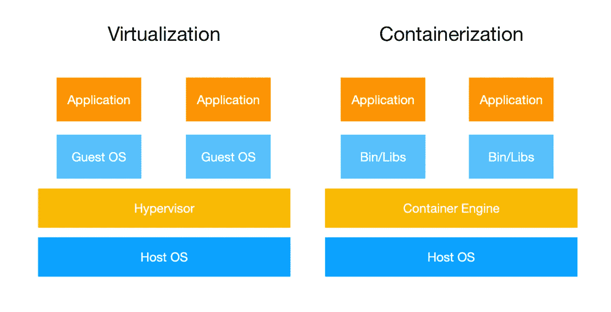
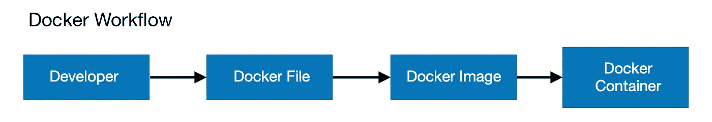
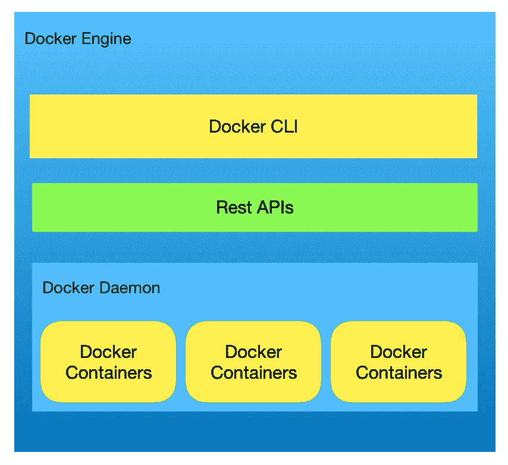

# Kickstarting Dockers —初学者友好型

> 原文：<https://medium.com/hackernoon/kickstarting-dockers-7bf897e45fb7>

我听说码头工人已经有一段时间了，但一直没有机会去探索它，直到最近我被指派了一个与区块链有关的项目。区块链本身就是一个野兽，取决于你正在使用的平台，它需要安装大量的依赖项。由于区块链是基于去中心化的概念，因此很有可能需要设置多个节点，这意味着您必须一遍又一遍地处理所有的依赖关系。因此，现在是启动码头工人的时候了。这篇文章代表了我在 dockers 中的一些理解和学习，我发现它们在我迄今为止的开发过程中非常有用。

所以让我们开始吧。

首先，让我们明确虚拟化和容器化之间的区别。



Dockers 是基于容器化的，这比使用 VM 要轻得多，也快得多。在虚拟化中，创建的任何虚拟机都有自己的操作系统、二进制文件、库或驱动程序。它位于虚拟机管理程序之上，占用虚拟机创建期间分配的固定内存。因此，即使虚拟机实际上只使用了一半的内存，它仍然会占用全部内存。而在容器化中，主机操作系统、驱动程序等在容器之间共享。因此，集装箱的尺寸显著减小，这使得集装箱更轻、更快。在 Docker 中，管理程序的角色由 Docker 引擎承担。Dockers 允许我们在相同的内存量内创建比虚拟机更多的容器。

现在，让我们来看一个典型的 docker 工作流程。



开发人员创建一个名为 Docker 文件的文件，该文件包含一组创建 Docker 映像的指令。当您运行 Docker 映像时，它将创建一个 Docker 容器。同一个 docker 映像可以运行多次，以创建多个 Docker 容器。我们将研究这些组件中的每一个。

啊！等等！如果您想实际运行 docker，您可能需要安装先决条件(git，docker)并克隆这个 repo-[https://github.com/heychessy/nodejs-docker](https://github.com/heychessy/nodejs-docker)

安装 Git—[https://Git-SCM . com/book/en/v2/Getting-Started-Installing—Git](https://git-scm.com/book/en/v2/Getting-Started-Installing-Git)

安装码头工人—【https://www.docker.com/get-started 

**Docker 文件**是一个文本文件，包含构建图像的指令。它自动创建 docker 图像。您还可以从 docker hub 存储库中提取预构建映像。考虑下面的 docker 文件(您可以在上面的 git repo 中找到它)，它将为 nodejs 应用程序构建一个映像

```
#DockerfileFROM node:8 # use node image from docker hub WORKDIR /usr/src/app #create app directory COPY package*.json ./ RUN  npm install #install app dependenciesCOPY . . # copy source files from current directory to docker imageEXPOSE 8080 #expose port 8080 of the docker containerCMD ["npm", "start"] # command to run when container is created
```

要执行上述 docker 文件，请运行

```
docker build -t mydockerimage . 
```

这将创建一个标记为“mydockerimage”的 docker 图像。一个 **Docker 映像**由依赖关系组成，它可能包括系统库、工具或可执行代码所需的其他文件。

要查看系统中所有可用的 docker 映像，请运行

```
docker images 
```

docker 映像在运行时成为 Docker 引擎中的 Docker 容器。换句话说， **Docker 容器**是 Docker 映像的运行实例。

让我们了解一下 docker 环境。



Docker 基于客户机-服务器架构。基于 cli 的客户端用于与充当服务器的 docker 守护程序进行交互。docker 客户机使用 REST APIs 与 docker 守护进程通信。Docker 守护进程负责管理 docker 映像、容器、网络或卷。所有这些组件一起构成了 Docker 引擎。

现在，我们将从上面创建的 docker 映像中旋转出一个容器

```
docker run -p 3030:8080 -d mydockerimage
```

您可以检查容器是否正在运行，使用-

```
docker ps # this will list all the running containers
```

您可以在浏览器中访问 [http://localhost:3030](http://localhost:3030) 来检查您的 nodejs docker 应用程序是否正在运行。

现在，您知道如何创建一个基本的 docker 容器了。让我们看看 docker 的一些功能，比如管理卷、管理网络、为 docker 内部运行的应用程序打开端口。我们还将研究 docker-compose 和 docker swarm。

**Docker 卷**

每当您创建 docker 容器并且没有指定要使用的任何卷时，一旦您停止 docker 容器，docker 容器生成或使用的所有数据都将丢失。默认情况下，在容器内创建的文件存储在可写容器层上。因此，数据不是持久的。为了保持数据的持久性，docker 提供了两种方法——卷、绑定挂载和 tmpfs 挂载。

卷就像创建并安装到 docker 容器中的文件夹或目录。数据存储在这些指定的目录中，并由 docker 管理。不允许非 docker 服务修改这些数据。卷是保存容器数据的最佳方式。

绑定装载类似于主机系统上的卷，也可以是外部装载。tmpfs 安装在主机内存中，而不是文件系统中。作为这篇文章的一部分，我们将只讨论卷。

让我们在容器中装入一个卷。我们将首先停止上述容器并删除该容器。

```
docker stop <container id> # use docker ps to get container id
docker rm <container id>
```

现在，让我们创建一个新容器，其中包含一个已挂载的卷。

```
docker run -p 3030:8080 -v /directory/to/mount:/usr/src/app/output -d mydockerimage
```

检查容器是否正在运行

```
docker ps
```

现在访问 [http://localhost:3030/](http://localhost:3030/) 。您可能会看到在您安装的目录中会创建一个 output.log 文件。每当您访问本地主机 URL 时，该日志文件也会得到更新。这是因为 docker 容器使用这个文件来记录节点服务器请求。现在，即使您停止容器，日志文件仍将存在。恭喜你，现在你知道如何在 docker 容器中持久化数据了。您甚至可以使用卷在 docker 容器之间共享数据。

**Docker 网**

目前 dockers 中有 3 种类型的网络——默认桥接网络、用户自定义网络和覆盖网络(一般用于 swarm 服务，docker 版本≥17.06)。

您可以通过运行以下命令来查看现有的 docker 网络

```
docker network ls
```

默认桥接网络-这是自动设置的。您可以通过运行以下命令来查看此网络-

```
docker network inspect bridge
```

在输出中，您将看到该网络的子网和网关。此外，您将能够查看连接到该网络的容器的详细信息及其 ip 地址。默认情况下，您将创建的每个容器都在该网络上。

为了测试这一点，创建两个容器。现在，在单独的终端中连接到这些容器，

```
docker exec -it <conatiner id> /bin/bash
```

要查看该容器的 ip 地址，请使用，

```
ip addr show # run this inside the container
```

使用 ping 命令，您应该能够检查与其他容器的连接。

```
ping -c 2 <ip of other container> # pinging other container
```

要获取其他容器的 ip，请检查网络或连接到正在运行的 docker 容器，然后运行“ip addr show”命令。现在，您已经了解了默认网桥网络。

用户定义的网络—使用自定义桥网络，您可以创建自己的桥并连接在同一主机上运行的容器。这更适合生产环境。

让我们创建一个自定义网络。

```
docker create network --driver bridge custom-network # '--driver bridge' part is optionaldocker network inspect custom-network
```

当您检查新创建的网络时，您会发现该网络上没有容器。要启动自定义网络使用的容器，

```
docker run --network custom-network -d <image name>#ORdocker run --name container1 --network custom-network -d <image name>
```

同样，您可以启动其他容器，这些容器将出现在您定义的同一个网络上。您还可以将容器同时连接到用户定义的网络和桥接网络。假设您的容器连接到自定义网络，现在您还希望它连接到默认桥接网络，请使用以下命令

```
docker network connect bridge <name of the container>
```

太好了，现在你对 docker 网络的工作原理有了基本的了解。

我不想让你过量服药。我将在下一篇文章中讨论其他与 docker 相关的主题，比如 docker compose 和 docker swarm。

希望这篇文章能帮助你从码头工人开始。有很多很酷的东西可以用 Docker 来实现。所以继续探索，记住不要迷路。干杯！快乐的一天！

欢迎在 [LinkedIn](https://www.linkedin.com/in/pranjal-baweja/) 和 [Instagram](https://www.instagram.com/h3ypb/) 上加我！

参考资料:

[](https://docs.docker.com/storage/volumes/) [## 使用卷

### 卷是保存 Docker 容器生成和使用的数据的首选机制。当绑定挂载时…

docs.docker.com](https://docs.docker.com/storage/volumes/) [](https://docs.docker.com/network/network-tutorial-standalone/) [## 与独立容器联网

### 本系列教程讨论独立 Docker 容器的网络。对于群服务网络…

docs.docker.com](https://docs.docker.com/network/network-tutorial-standalone/)