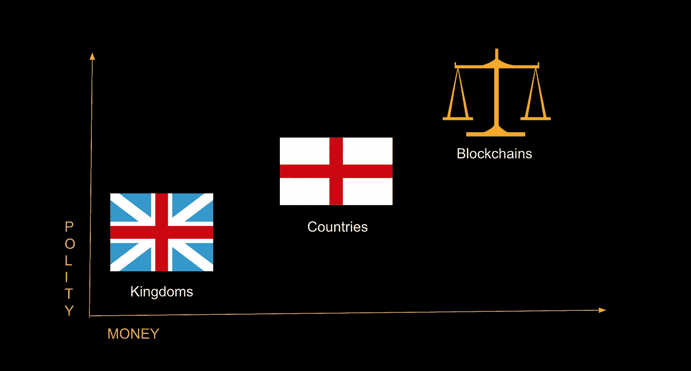

# 王国、国家和区块链。

> 原文：<https://medium.com/hackernoon/kingdoms-countries-and-blockchains-be90174f0179>

> ***“刺激和反应之间有一个空间。在那个空间里，我们有能力选择我们的反应。我们的回应是我们的成长和我们的自由。”* —维克多·弗兰克**

我们正在开会，突然想到了这个主意。毕竟，我们正在努力解决今天的问题，同时牢记未来的可扩展性。开展这项工作是为了更好地了解未来的趋势和做法。预测未来的最好方法是什么？

就像我的搭档 Sumit 说的，“预测未来的最好方法是发明它，”我们正在为我们的发明寻找灵感。从那时起，我们开始观察社会的历史和演变。人类已经走过了漫长的道路，我们从狩猎采集开始，现在已经进入了数字资产和交易的后工业时代。

真正吸引我们注意力的是使用不同形式货币的社会和政治的演变。

当我们开始在易货经济下交换商品和服务时，政体被限制在个人或小团体的范围内。这些群体的规模不断扩大，变得半定居，不再像狩猎采集者那样频繁迁徙。新的货币形式现在是商品货币——由这些团体内部新成立的政治组织发行。

真正有趣的是观察这些不同形式的货币对政治及其不同形式的演变的影响。

尽管商品货币加快了结算过程，但在用于较大的群体时，它也有自己的局限性。进入，金属形式的货币或更好地被称为硬币。历史学家认为，硬币的首次使用始于公元前 5000 年。难怪正式和有组织的政府的最初迹象只是在萨尔贡大帝(统治于公元前 2334-2279 年)将美索不达米亚统一在他的**阿卡德帝国**的统治之下，并为美索不达米亚未来的政府形式设定了标准之后才开始出现。

是货币的进化推动了政体的进化，还是反过来推动了政体的进化，这是一个没有定论的争论，但可以肯定的是，货币和政体这两者的进化之间存在着显著的相关性。

硬币货币有其自身的局限性，特别是当它涉及到贵金属的重量和纯度的一致性时，这最终导致国家不仅从事这一活动，而且将它作为其主要职能之一。不同国家发行的代表不同政体的硬币。商业的进一步发展需要一种更方便的货币形式。很难携带过多重量的黄金或白银，因此，纸币被引入。这个想法起源于金匠，他们经常为人们的黄金存款出具收据，这些收据可以在以后兑换成黄金。这对于纸币的引入是一个重要的刺激，因为它意味着货币代表了在其他地方存在的等量的黄金或白银。

20 世纪见证了政治和货币领域有趣的发展。虽然世界见证了共和主义的空前崛起，导致主权国家开始从外国统治者那里获得独立，但与此同时，在本世纪后期，美国决定从黄金支持的纸币转向现在被称为法定货币的货币。法定货币是法定货币，其价值由发行它的政府支持，当我们进入 21 世纪时，这成为了一种规范。技术以银行货币或塑料货币的形式让位于它的用途，然而它由国家政府支持的基本原则仍然是一样的。

同样，要确定是政体及其地位的变化推动了法定货币的变化还是相反是一项困难的任务，但可以观察到两者之间存在明显的相关性。

> ***“滥用自由可能危及自由，但滥用权力也可能危及自由。”-* 詹姆士·麦迪森**

The Evolution of Polity and Money

尽管改变法定货币的理由是经济稳定，但许多人认为其意图是获得更大的权力。独立国家现在比以往任何时候都更有力量推进他们的议程，尤其是在对金钱有更大控制的情况下。

历史表明，法定货币的生命周期总是以失败告终。罗马人最早在 1 世纪就开始使用欧元，并以欧元的最终贬值和崩溃而告终，以至于欧元也总是随着拥有相同法定货币的经济的崩溃而终结。

法定货币肯定不符合其稳定经济的基本原理，这时候技术给了我们一个选择。2009 年 1 月，中本聪以开源代码的形式发布了比特币软件，并创造了首批 50 枚比特币，被称为“创世纪区块”。永久嵌入数据中的是一行简短的文本:

《泰晤士报》03/01/2009 财政大臣濒临第二次银行救助 指的是《T4 时报》一篇关于英国试图支撑其经济的文章的标题。

中本聪所做的实质上是给了人们一种新的货币形式，加密货币，一种摆脱了其前身所有限制的货币。有史以来第一次有了一种统一的、耐用的、可携带的、可分割的和可接受的货币。事实上，它付出了额外的努力，以使其不受我们所知的国家政府的控制。

世界正变得越来越小，**互联网**已经通过使沟通变得更容易和更快捷而影响了沟通，导致了**地球村**的概念。在交易和价值交换方面，比特币现在也发生了类似的转变。我们正在稳步走向一个更加统一的全球政治概念吗？我们所知的国家会停止存在吗？我们最终会看到一个去中心化的世界吗？请在下面评论分享你的观点。