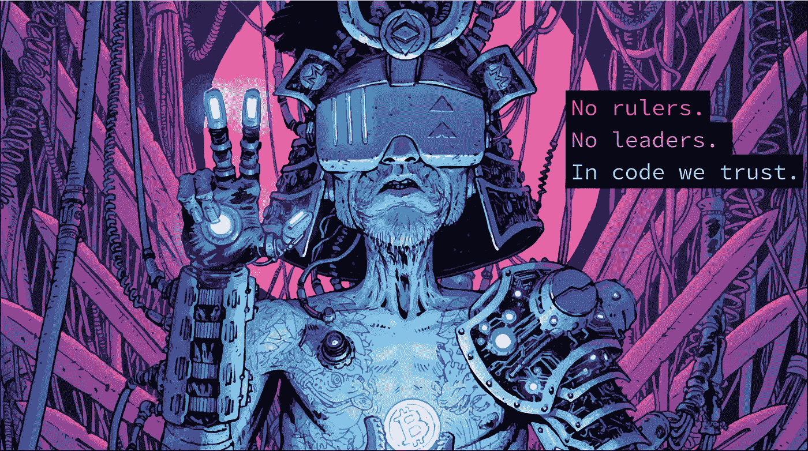
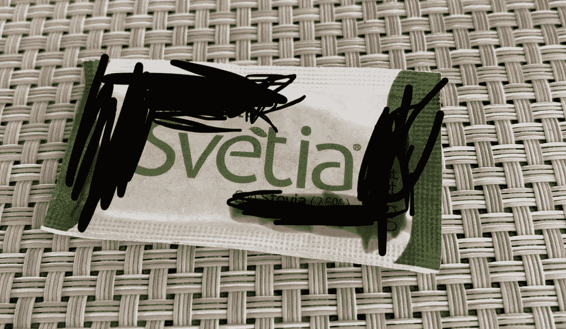
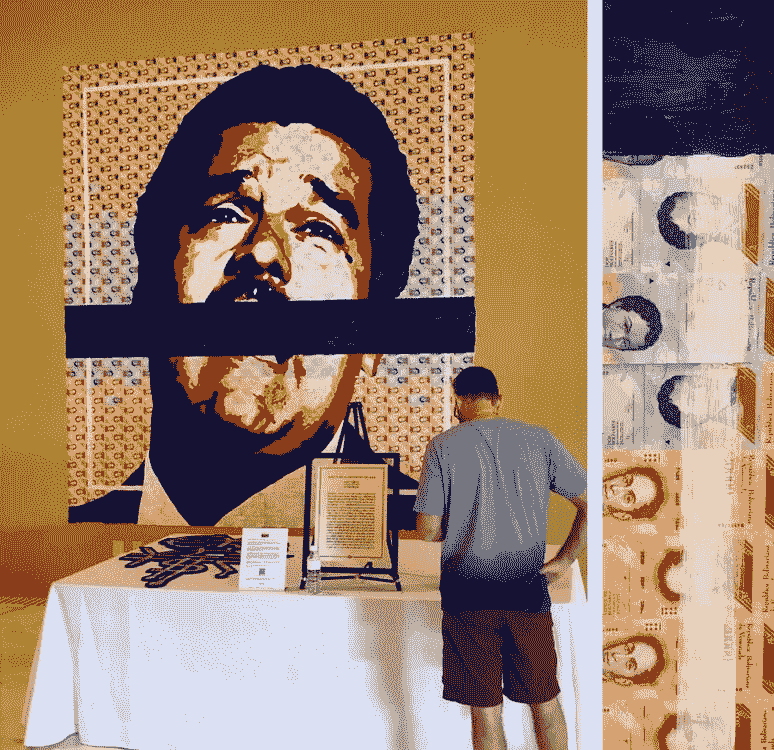
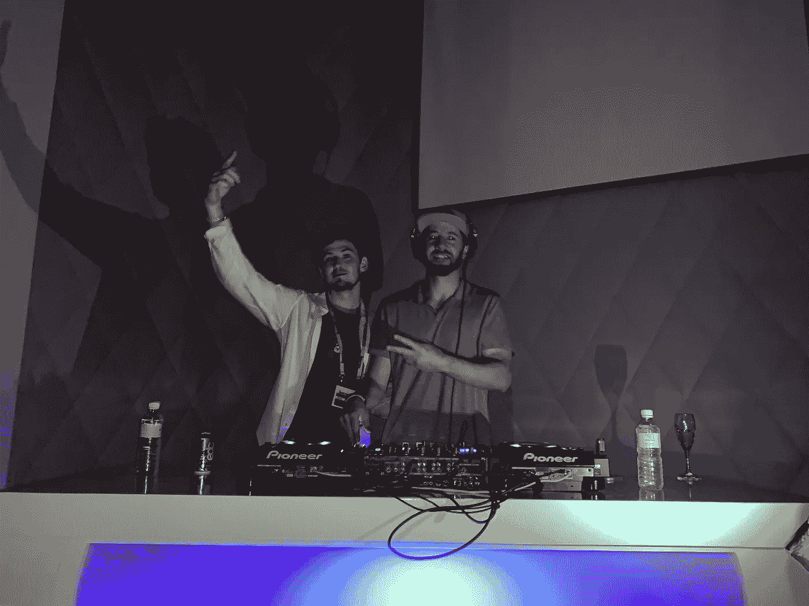

# 第五圆桌会议

> 原文：<https://medium.com/hackernoon/knights-of-the-satoshi-roundtable-v-2845ccc7fde>

## 行业巨头如何在幕后应对熊市

轻柔的晚风带着海浪的声音穿过热带度假村的露台，进入大堂。被玻璃的叮当声和扑克筹码的噼啪声所掩盖，一辆银色的食品车披着亚麻布从人群中走过，停在院子里。服务员把手伸到手推车底下，拿出总共有 T2 番茄和意大利香肠的披萨。人头在旋转，整个观众爆发出一片欢呼声。

在周六晚上的凌晨 4 点，不管你是一家大型加密交易所的首席执行官，还是一位刚刚从近 9 点的 BTC 扑克游戏中脱身的基金经理，或者是一位幸运地成为该行业早期参与者的开发人员(🙋‍♂️).重要的是每个人都有一块奶酪，深夜，全包披萨。

> 在一个被低于标准的会议蹂躏的行业，Satoshi 圆桌会议是例外，因为它感觉像是为微笑而不是销售而设计的；友谊胜过伙伴关系。

对于许多返回的与会者(其中一些人已经完成了所有 5 次)，没有目标或期望。这是一个与杰出人士共度美好时光的机会。

## 在 SRT 发生的事留在 SRT

让 SRT 在公众人物面前如此自在的很大一部分原因是对查塔姆大厦规则的理解。说的话可以在活动之外分享，但没有提到的人的明确许可，任何名字或照片都不能分享(这条规则我很快就特别熟悉)。

Attendees joked that even this Svetia packet asked to have some personal information redacted

## 在“非正式会议”上讨论了什么

我是“无会议”式活动的忠实粉丝，在这种活动中，与会者提交他们自己的话题进行引导。[有一些去年议程的照片漂浮在](https://cdn-images-1.medium.com/max/2600/1*NYKVxGFNvl7b_xLObixduw.jpeg)周围，但不幸的是今年的包含了会议领导人的名字。以下是讨论主题的一个很小的例子:

*   👨‍👩‍👧‍👦主流采用集思广益会议
*   🤫微笑和隐私硬币
*   📜安全令牌提供和交换
*   💵稳定的硬币
*   🛰区块链卫星节点
*   👩怀俄明州、百慕达等地的‍⚖️法规
*   🌍区块链与气候变化
*   ⛓侧链和缩放
*   🍄迷幻药和密码
*   🃏，当然还有《裸体龙卷风》(今年也没人来看)

## 内幕消息:

可以说，下班后在游泳池里学到的东西比在会议室里学到的要多。我带走的一些有趣的见解包括:

*   大多数要么在顶部附近卖出，要么正在积极筹资。老实说，关于这个行业的现状，这让我有点害怕。感觉上，资金雄厚的 ico 将继续主导这个行业，而较小的集团争夺投资，投资集团则勒紧裤腰带。
*   **区块链开发人才前所未有的丰富。**人们对分布式技术越来越感兴趣，加上行业大规模裁员，许多技术人才都在寻找可以获得稳定收入的出路。
*   [**Quadrigacx 首席执行官**](https://news.bitcoin.com/canadian-exchange-insolvent-after-ceo-dies-with-keys-to-145m-of-cryptocurrency/) **的“死亡”看起来有点像一个退出骗局**，对于加拿大的决策者来说，这是一个非常糟糕的时间。请密切关注事态的发展。
*   STO 市场有点被炒作了。有一个健康的认识，仅仅因为一项资产被令牌化，并不一定意味着它的价值大大增加。听到业内资深人士能够如此理性地谈论这个话题，令人欣慰。
*   **咧嘴笑在泡泡里。** It *是*相当长一段时间内最酷的项目之一，但通货膨胀率绝对疯狂，每天约为*1%*(自己做研究)*。通货膨胀率和激励措施会达到平衡，但在几年内不太可能。你可以随意继续利用这个泡沫，但不要计划持续开采太久。*
*   “创意密码”社区得到了很多支持。有许多才华横溢的秘密主题艺术家和音乐家。推动大规模采用意味着抓住公众的兴趣，SRT 的与会者知道这一点。特别感谢 [Cryptograffiti](https://twitter.com/cryptograffiti) 和 DJ Abstract 帮我上 DJ 台！

[cryptograffiti](https://twitter.com/cryptograffiti)’s art speaks to the crisis in Venezuela and is made of real fiat

## **我个人对 Satoshi 圆桌会议的看法**

我是由单身母亲抚养长大的，因为我父亲在我还是个婴儿的时候就去世了。我们没有太多，但我妈妈把我们搬到了一个富裕的社区，这样我就可以进入一个高质量的学区。我在那里的同事不停地谈论乡村俱乐部、私人牧场和度假胜地。我一生都非常厌恶“上流社会”的经历。

我的蜥蜴脑最初拒绝一切奢华的生活，因为我拒绝认同这种生活。这种骗子综合症让我发了一些令我深感遗憾的伤人的微博。仅仅在第二天，我就感觉疏远了自己，我惊讶于我从其他与会者那里得到的爱、建议和拥抱。

仿佛下定决心要毫不费力地证明我是错的，那些在推特上成为头条新闻的人张开的双臂和理解温暖了我的心，也确实改变了我对世界的看法。他们看到了我，把我当成了一个人，他们中的很多人都不遗余力地同情我。

如果你有幸得到去 SRT 的邀请， ***接受它*** 。代价是高昂的，但我带着友谊离开，我认为这种友谊比任何牛市或熊市都要长久。

The talented [cryptograffiti](https://twitter.com/cryptograffiti) and I back-to-back on the DJ decks

> 如果你觉得这篇文章有价值，请删除一些👏和分享