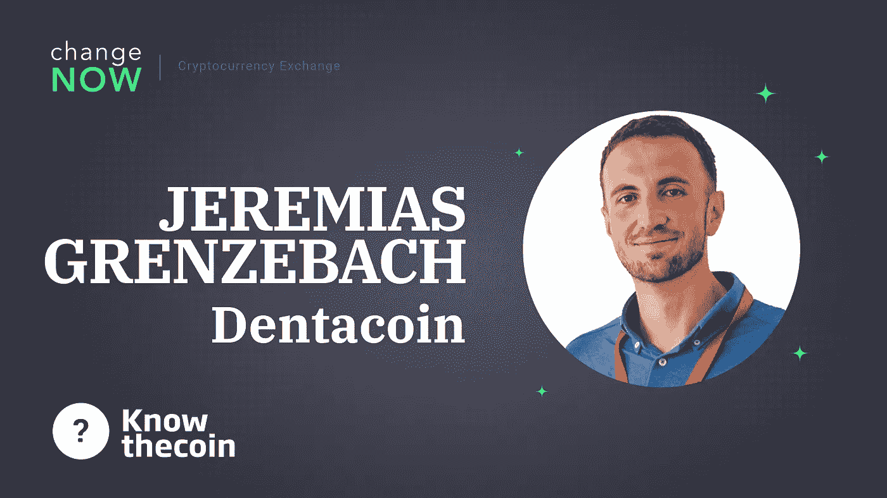

# 了解硬币:Dentacoin 的联合创始人和核心开发者 Jeremias Grenzebach 也参与进来。

> 原文：<https://medium.com/hackernoon/know-the-coin-dentacoins-co-founder-and-core-developer-jeremias-grenzebach-weighs-in-24a6a3c062c0>

嘿，欢迎来到另一集的 [ChangeNOW 的](https://changenow.io/)认识硬币！今天的嘉宾是[Jeremias Grenzebach](https://twitter.com/neptox),[denta coin 基金会](https://dentacoin.com)的联合创始人和首席开发者，这是全球牙科行业第一个也是唯一一个区块链解决方案！

**电梯间距。ELI5 用几句话描述 Dentacoin。**

Dentacoin 是全球牙科行业第一个也是唯一一个区块链解决方案。它由各种应用程序组成，这些应用程序充当智能患者忠诚度计划、基于患者和牙医之间直接合同的牙科保险模型，以及主要由但不限于患者、牙医、供应商、制造商和服务提供商用作支付手段的加密货币。

你介意给读者简单介绍一下你自己、你的背景和你的团队吗？

我叫 Jeremias Grenzebach，是 Dentacoin Foundation 的联合创始人和核心开发人员。我有 IT 领域的背景，主要是作为一个网站开发人员，IT 培训师，各种区块链项目的贡献者。

至于 Dentacoin 团队，我们是一个有趣的混合体，由来自不同国家的开发者、牙科专家和营销专家组成，他们愿意将区块链应用于预防性牙科护理。

**denta coin 是如何开花结果的？你是如何想到在区块链上进行牙齿护理的，谁是发起者？**

几年前，我发现自己在一个由牙医和业务开发人员组成的小型工作组中，我们讨论了当前全球牙科专业人员面临的挑战。不知何故，这自然引发了一场关于应用区块链解决方案来提高患者参与度、改善效率和实现无缝国际交易的讨论。

**项目有多少核心贡献者？**

核心团队加顾问由大约 20 名专业人员组成。此外，我们有数百名社区成员一直在帮助我们完成不同的任务，我们也将他们视为团队的一部分。

**您能向我们的读者介绍一下 Dentacoin 开发的现有应用吗？**

很乐意。我们目前开发了以下应用程序:

*   [denta coin Trusted Reviews](https://reviews.dentacoin.com/)—第一个基于区块链的平台，提供真实的、有回报的、非常详细的患者反馈，在这里可以验证牙医与患者之间的关系。
*   [DentaVox 调查](https://dentavox.dentacoin.com/) —一个网络应用程序，就各种牙齿健康主题调查用户，并向公众提供关键的牙齿统计数据。
*   [denta care App](https://dentacare.dentacoin.com/)——一款手机应用，通过 90 天的游戏化挑战，教用户如何养成和保持正确的口腔卫生习惯。
*   [Dentacoin Wallet dApp](https://wallet.dentacoin.com/) —一个基于网络的钱包应用程序，允许人们轻松创建钱包、购买、发送和存储他们的 Dentacoin 令牌。一款手机钱包应用正在开发中。
*   [denta coin Assurance](https://assurance.dentacoin.com/)—DCN 首个基于患者和牙医之间智能合同的牙科保险计划，该计划使患者以可承受的月费获得终身预防性护理。

面向儿童的 Dentacare 游戏版本目前正在开发中，还有一个用于存储患者记录的分散数据库。

**关于 Dentacoin 的采用，您能告诉我们些什么？你有多少用户？**

大约 90，000 多名用户和 1，800 多名牙医正在使用我们的应用程序。此外，全球超过 90 家组织正式接受 Dentacoin 支付。其中包括牙科诊所、实验室、供应商、制造商、服务提供商(网络开发人员、招聘人员)。

**假设我需要紧急牙科护理。比如说，我能支付在牙科诊所用 DCN 进行根管充填的费用吗？**

当然可以。我们正在开发一个不断扩大的牙医网络，他们不仅使用我们的应用程序，还接受 DCN 作为他们产品和服务的官方支付方式。以下是所有供应商的列表:[https://dentacoin.com/partner-network](https://dentacoin.com/partner-network)

**除了支付牙科保健费用，DCN 还有其他应用吗？**

有一种常见的误解，认为 Dentacoin 仅仅是“牙医的硬币”。是的，我们工具的主要目的是满足全球牙医和患者的需求，但就像任何其他功能货币一样，DCN 还有其他多种用途。

除了支付牙科保健费用，Dentacoin 还可用于:

*   牙医购买牙科用品、设备、网络开发和牙科营销服务；
*   涵盖每月 Dentacoin 保险费用；
*   花在各种商品和服务上(从咖啡和披萨，到书籍和衣服，到机票和酒店预订)——感谢 [Bidali 礼品卡](https://blog.dentacoin.com/dentacoin-expands-horizons-with-bidali-gift-cards/)；
*   与其他加密货币交易或兑换成传统货币；
*   保存它以备后用和/或增值。

**DCN 分布是如何工作的？你的资料上说它相当复杂——具体是怎样的？**

首先，Dentacoin 的总供应量是硬编码有限的，这意味着不可能进一步发行硬币。这使得货币通货紧缩。总供应量的大约 75%被锁定在时间锁合同中，并将按照长期计划(直到 2042 年及以后)逐步释放。

现在是最有趣的部分:人们是如何感染 DCN 病毒的？除了在交易平台上购买 Dentacoin 的明显选项(我们甚至通过银行卡实现了 [0%手续费购买)，人们可以通过各种活动赚取 DCN。例如，他们可以在 DentaVox 上进行不同的调查，在 Dentacoin 可信评论上向牙医提交详细的反馈，在 Dentacare 应用程序上完成 90 天口腔卫生挑战，因此，他们将获得 Dentacoin 奖励。此外，牙医也因其愿意成为合作伙伴、愿意进行测试并做出整体贡献而获得 DCN 奖。](https://blog.dentacoin.com/buy-dentacoin-with-a-0-fee-via-indacoin/)

通过对牙齿生态系统的贡献，牙齿在越来越多的人群中传播。使用这种货币的人越多，其价值增长的预期就越高(“网络效应”)。

**现在，让我们稍微谈一下市场。你认为现在正在发生什么——你认为牛市即将来临吗？也许有你有信心的服务或项目，如那些将被视为进一步市场加速点的服务或项目？**

在我看来，这个市场在过去一年左右的时间里一直在走向成熟。制定国际监管框架也是向前迈出的重要一步。我相信在这段时间(姑且称之为“自然选择”)之后，只有具有真实用例和长期导向的项目才会存活下来。

**你对 Dentacoin 的情况怎么看？你对未来有什么希望？也许，有进一步的扩张计划吗？**

我更喜欢谈论目标和计划，而不是希望和期望。我们正逐步在全球范围内发展稳固的用户和合作伙伴基础，今年我们将改进所有现有产品并推广它们，以便它们能够更好地满足行业需求。向公众推广 Dentacoin 保证计划、开发 Dentacare 儿童游戏以及开发分散式患者记录数据库也是路线图上的重要里程碑。

任何想了解最新动态的人，都可以关注我们的博客或加入[我们的电报小组](https://t.me/dentacoin)进行日常讨论。

非常感谢您的阅读——敬请期待更多由 [ChangeNOW](https://changenow.io) 发布的《了解硬币》剧集！

*原载于 2019 年 5 月 20 日*[*https://change now . io*](https://changenow.io/blog/know-the-coin-dentacoins-co-founder-and-core-developer-jeremias-grenzebach)*。*