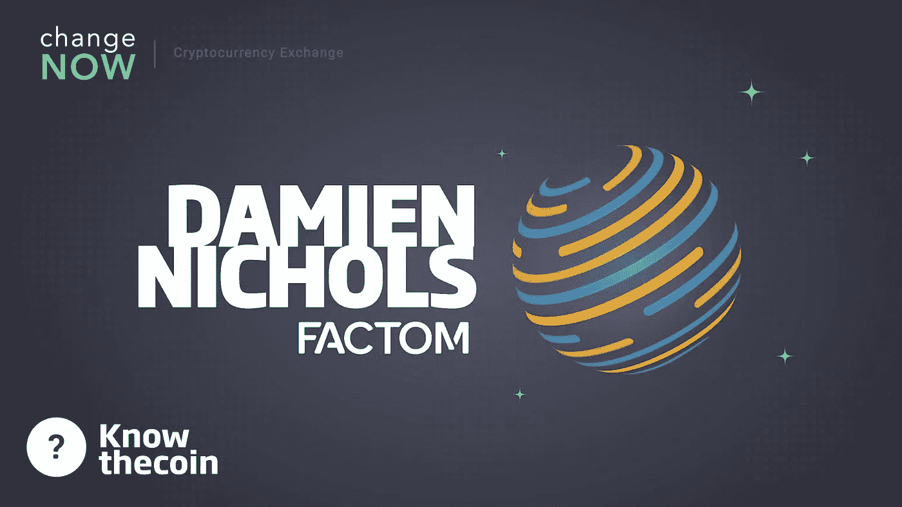

# 了解硬币:Factom 的达米恩·尼科尔斯

> 原文：<https://medium.com/hackernoon/know-the-coin-factoms-damien-nichols-c21ffa4c98>

大家好，这里是 [ChangeNOW](https://changenow.io) 欢迎来到“了解硬币”系列访谈，我们将与各种加密代表、开发者和创始人进行交流。他们都有话要说，我们愿意倾听。今天的嘉宾是 [Factom](https://factom.com) 的代表和[什么叉？！](https://www.dattpodcast.com/what-the-fork)播客主持人达米恩·尼科尔斯！今年 1 月，Damien 与我们的营销经理 Pauline 坐在一起，谈论了 Factom 的所有事情！

非常感谢你收听我们的节目，愿意与我们交谈，并同意与我们交谈，Damien！

嗨，波林，谢谢你！

**达米恩也是“叉子是什么”播客的主持人，所以你可能已经知道他了。而他也是官方 Factom 不和的版主！我们可以开始了吗，戴米恩？**

是的，听起来很棒，我们开始吧！

**第一个问题是我们的电梯间推介。用几句话向我们解释，就像我们是五个人一样，这是最基本的东西。**

当然，很乐意。因此，Factom 协议允许任何人证明他们在特定时间拥有特定的信息。它通过在区块链中输入日期的指纹来做到这一点。这个指纹被称为哈希，你不能从哈希中重建数据本身，就像你不能从他们的指纹中重建一个人一样。但是，任何拥有原始数据副本的人都可以重新创建散列，并对照区块链进行检查，以证明数据与原始数据以及数据输入区块链的时间相同。

哦，是的，那真的很酷。事实上，我们之所以选择 Factom 作为我们的第一个采访对象，是因为我们对这个平台本身非常有信心。我们认为 Factom 协议实际上可以改变我们在区块链上存储数据的方式，我们认为该协议有很多优点，所以…

是啊，很迷人。

**您能否向读者简单介绍一下您自己和您的背景，以及您的团队？我知道有很多团队在研究 Factom 协议——更准确地说，有 25 个团队，但也许有一些团队你真的想告诉我们？**

当然，是的，先说几句我的情况。我从一点政治和经济激进主义的过去生活中来到这个秘密空间。当 Satoshi 的论文在 2008 年末回落时，我正住在马里兰州的巴尔的摩，开发一种叫做 BNote 的当地纸币。所以我看到了这种数字货币的出现，我说，‘哇！’你知道，‘天时地利人和！’—我们正在全球范围内开展这项工作，这非常令人兴奋。

在这一点上，我有一个探索生活，社会和区块链的播客，由 Factom 的权威节点运营商之一 Sphereon 赞助。我还和一个合伙人开了一家名为“街区派对”的小公司。我们一直在探索整个 cryptoverse 的变革性用例，目前主要关注经济创新，但我们不着急，让该领域和底层协议层发展，因为我们会决定关注哪些用例。

我也是 Factom Discord 服务器的版主，我成为这个服务器只是因为对 Factom 协议感兴趣，喜欢他们的一些社交渠道，然后成为他们社区的活跃成员。我真的很喜欢 Factom 社区，它紧密团结、热情友好、乐于助人、积极向上、富有成效。仅仅是因为在那里，并且我自己是一个有生产力的成员，我被邀请到生态系统的更深处，这是我喜欢在分散的项目中看到的。就像你提到的，有 25 个 ano，权威节点运营商，维护着协议，他们现在看起来真的是这个节目的明星。

举几个例子:我的播客的赞助商 Sphereon 正在提供 Factom 协议与 Alfresco 和 SharePoint 等流行服务的企业级集成。另一个真正令人兴奋的项目正在荷兰的一些城市进行，他们正在实施一项非常有趣的政府经济援助交付服务。与标准的纸质优惠券之类的东西不同，它可以在市政府、政府援助的接受者和企业之间以数字方式完成。然后，他们可以交易服务，并交易回城市的货币。这是一件非常有趣的事情。如果成功的话，Factom 似乎非常适合为世界各地和区块链的政府提供各种用途。

另一个是事实上的:他们已经发布了一些真正令人兴奋的 API，既有开源的，也有供私人使用的，并且刚刚将他们的第一个主要客户端发布到 Factom Mainnet 中。

然后，有一个联盟:他们在一个名为 Off-Blocks 的真正令人惊讶的身份解决方案上取得了快速进展；这可以为 Factom 协议提供一些扩展的实用程序。

真正令人兴奋的是，在这个由许多不同运营商组成的分散网络中，有几个 ano 正在致力于名为 Factom Asset Token(简称 FAT)的令牌化层。这实际上使得在 Factom 中实现从稳定硬币到智能合约的所有东西成为可能。这是去年刚刚加入的 ano 公司构想并建立的东西，这超出了 Paul knows 和他在 Factom Inc .的联合创始人提出的最初范围。

所以，我认为这真的很令人兴奋，因为一个分散的系统被公司投票支持他们的真理立场。我看到很多 ano 为了协议的好处走到一起，解决从治理到营销的各种关键问题，以我在任何生态系统中从未见过的方式交换列表。这是一项艰难且费力不讨好的工作，我为他们付出的认真努力感到骄傲，正是他们让我们走到了今天。

Factom 是如何取得这样的成果的？它是怎么出现的，始作俑者是谁？也许一开始就有一批 ano 在那里？

保罗·斯诺是 Factom 协议的主要发明者。他在 2014 年发起了比特币，成立了名为 Factom Inc .的区块链创新公司。保罗和 Factom 的联合创始人认识到比特币的局限性，认为它是企业数据解决方案的实用区块链。一般来说，分布式记录信息和文档很难保护，很难同步，也不可能真正验证，因为需要手动操作。为了应对这些挑战，他们建立了 Factom 区块链作为开源，在 2018 年 5 月选举第一批权威节点运营商时实现了完全去中心化。然后，他们又重新扮演了其中一个 ano 的角色，在这个位置上，他们支持对采用协议的投资。

所以，就像我说过的，这基本上都在 Factom 公司的手中，直到去年 5 月，他们终于准备好激活他们所谓的 M3，他们在那里举行了选举，并引入了第一个 ANOs 来分散协议。就在去年，ANOs 真的走到了一起，做了很多工作。我认为，协议中的一些人可能认为这比我们应该花的时间要长一点，但它正在结出果实，我很高兴看到这一进展。

**嗯，当人们开始谈论一个团队如何花了很长时间来完成一件事情时，这有点适得其反——当你匆忙完成一件事情时，不可避免地会发现有些事情没有被考虑到，有些事情被搞砸了，然后你最终得到了一个未完成的原始产品。这是不对的。**

哦，是的，这对于这种性质的项目来说也是毁灭性的。我们在谈论数据的完整性和分散化这样的事情。如果在你的协议中有一个严重的失败，它不会比我们今天经常看到的数据集中方式更好。

然后你开始进入像钱这样的东西，那里的货币实际上是值钱的。如果有一些像我们在过去两年中看到的严重缺陷，它可能会花费数百万美元，如果不是数十亿美元的话。

我们真的需要慢慢来。此外，最重要的是，人们似乎对自己选择的硬币及其发展速度感到如此焦虑和沮丧，以至于他们不承认，除了可以说是比特币之外，没有人走得那么远。每个人都还在努力构建核心的可用基础，在此基础上，你会开始看到非常漂亮的病毒式应用。我们只需要调整我们的期望，现实一点。

真的很酷，你花了很多时间来真正完善产品，所以你最终得到了一个非常光滑的东西，它实际上是可用的，并且可以工作。没有隐藏的问题需要你去解决。

据我们所知没有。当然，协议需要很多东西。我们仍在致力于扩展解决方案和其他一切。然而，我们非常有信心，Factom 从第一天开始就考虑了分片和扩展解决方案。这意味着我们比大多数人更容易到达那里。我们还没有这样做的唯一原因是协议的其他方面需要准备好。扩展是我们为大客户带来的，现在我们已经有了一个相当不错的协议，我们正在重构代码，以便更容易继续构建未来。大约几个月前，我们将扩展解决方案视为优先事项，我们预计每个季度的交易百分比都会呈指数级增长。我们真的没有看到 Factom 能做什么的上限。

**实际上有多少核心贡献者？那些积极维护代码和引入更新的人？**

所以，目前有 7 个核心开发者。在这一点上，我可能是错误的，但他们要么全部或几乎全部来自 Factom Inc .，在 11 月举行的上一轮大赛中，我们专门向 Sphereon 分配了一些资金，因此他们可以带来一些核心开发人员，因为这是分散生态系统的一个非常关键的阶段。我们预计更多的核心开发人员会在其他时间到来，因为这对我们来说是绝对优先的。如果你想知道这些人是谁，你可以去 Factomize.com/论坛[/主要贡献者/核心开发者](http://Factomize.com/ forums/major-contributors/core-developers)。

至于我们提到的 ano，有 25 个，你可以在[Factomize.com/forums/major-contributors/ANOs.](http://Factomize.com/forums/major-contributors/ANOs.)找到它们

你介意告诉我一些关于双令牌系统的事情吗？据我所知，Factom 是第一个实现这种想法并让它发挥作用的项目之一。你能更详细地解释一下机制吗？

这个系统是真正把我带到这个平台的东西，并告诉我它是以一种令人难以置信的周到的方式为普通企业用户设计的，这与令牌持有者或交易者不是一回事。

因此，Factom 使用两个令牌:第一个是仿真陈述或简称 FCT。仿真陈述是可转让的，即作为网络上价值转移手段的可交易代币。Factoid 的通货膨胀用于支付 Factom 的 ANOs，用于分散协议和管理对区块链的访问。需要燃烧、读取、销毁仿真陈述来创建两个令牌中的第二个令牌，该令牌被称为进入信用。

进入信用或简称 EC 是不可转让的，即用于支付网络使用的不可交易代币。它们是通过燃烧仿真物创建的，它们是不可分割的单元，每个单元可以在 Factom 区块链上支付高达 1 千字节的数据存储。参赛积分一旦被使用就被完全销毁，并且不能转移到任何地方。

FCT 和欧共体之间的汇率是可变的。该汇率由 Factom Inc .目前运营的网络协议决定。可变汇率的目的是始终尝试以 1 美元获得 100 个条目信用的一致成本，而不管仿真币值多少。

以稳定的进入信用价格为目标可以让企业准确地为协议做预算，否则他们根本做不到。这就是为什么许多企业根本不接触加密货币，即使有很好的用途——他们无法准确地为它做预算，这对任何接近许多企业的事情来说都是一个巨大的优先事项。

因此，仿真陈述和参赛作品一起创造了一个全新的系统。与网络相关联的成本是为铸造过程支付的，并且网络资源的使用通过对这些代币进行必要的销毁来确保对这些代币的持续需求。

**所以，如果一家公司或任何类型的公司决定在他们的业务中实施 Factom 协议，他们将使用的货币类型是进入信用，对吗？**

没错。

**所以，它实际上使区块链的使用并不真正昂贵？**

没错。我的意思是，这取决于使用情况，但是，当然，对于指纹数据等大多数事情来说，这是一个非常经济高效的解决方案。并且您不需要担心加密令牌的波动值。无论仿真陈述的价值是每件 1 美元还是每件 10，000 美元，如果企业需要在 1 月 1 日购买全年的协议访问，并且他们需要 10 亿个进入信用，他们可以以每美元 1，000 个进入信用的价格当场购买，而不必担心仿真陈述的价值变化。

事实上，他们可以通过几个 ano 建立的几个在线商店直接这样做，在那里他们根本不需要接触仿真陈述。他们可以从网上商店购买积分，网上商店的经营者可以代表他们刻录仿真陈述，并将积分直接发送到他们的企业钱包中。他们永远不用碰它们。它开始看起来更像一个网上商店，在那里你只需购买一件产品，并最终进入你的钱包或收件箱。

这实际上相当惊人——大多数区块链都没有真正的用例，因为使用它们实在太昂贵了。区块链相当慢而且昂贵——所以当我们谈论在其上存储数据时，它根本不划算。

是的，我们也这么认为。政府或企业不能参与，这不仅是从预算的角度，也是从监管的角度。他们不能玩一些可能被认为不安全的东西，它的价值会波动。就是不实用。

**区块链工厂能存储的数据有什么限制吗？此外，您如何着手存储数据？**

数据本身将在区块链中，如果你想要一个程序偏好，你可以通过其他人开发的产品和服务与区块链交互:例如，Sphereon 的企业级集成或 Facto 的 API。

该协议本身实际上是为了存储小块信息而设计的，这些小块信息就是散列——它们作为在特定时刻你拥有一块数据的证明。实际上，您可以自己存储数据，并随时重新创建散列来检查区块链条目。区块链的条目由两部分组成:组成区块链本身的报头和可以存储数据的有效载荷。每个条目可以存储多达 10 千字节的数据，而每个千字节的成本是十分之一美分。

如果你想在 Factom 区块链上存储数据，你可以像存储文件一样，但这可能会变得禁止，因为你看到的是一兆字节一美元。所以你不会真的想在 Factom 区块链上存储你的 4k 长电影的原版。然而，你可以用指纹识别它，然后看起来我们有一个基于区块链的分散存储解决方案上线了。

其中一个主要的底层协议是星际文件系统。因此，因为 Factom 与其他产品配合得非常好，并且可以集成到更强大的解决方案中，所以我完全希望看到在 Factom 上对大型数据对象进行指纹识别，但是存储它们也是分散的，可能在另一个协议领域。

你能谈谈 Factom 治理吗？谁对阿诺家族的区块链家族负责？

我们也有 5 个选举产生的职位:他们被称为向导。指南是实际上做治理文档的人。指导者被选举担任为期一年的职位，其任务是确定必须解决的最紧迫的政府问题，根据社区的反馈起草文件。

**让我们来谈谈大规模收养。对于这个问题，我想到了仿真陈述，但也许你可以谈谈区块链本身？**

Factom 协议的采用看起来已经相当不错了，尽管可能有点悄无声息，但我们并没有在社区中大肆宣传。

我们在不久的将来期待的一件事，希望是美国家庭安全部拨款的最后阶段，Factom 公司已经工作了几年。有消息称，由于 Factom 与国土安全部的合作，已经有多个政府机构开始关注 Factom。这可是件大事。目前的拨款是关于边境安全的，我很确定他们正在做的是使用 Factom 哈希来获得来自边境摄像头等的数据，这真的是一件大事。这是美国国土安全部的一个 4 阶段资助项目，Factom 是唯一一个真正进入第 4 阶段的项目。看起来很有希望。

另一种很好的采用方式是赤道，这是几个月前宣布的美国主要抵押贷款违约处理器。它将为客户提供 Factom 协议，以实现文件跟踪和完整性。他们与美国 4 或 5 家最大的抵押贷款服务银行合作，因此这里的潜力是巨大的。每份抵押贷款文档都可能包含数千个散列，因为散列需要任何类型的约定，从发起支付账单到发出延迟支付通知，与之相关的每一项操作都需要散列。它乘以数百万的抵押贷款。这可能是一个非常大的应用和采用案例；Spherion 还与荷兰市政府合作实施了一个简化援助交付的解决方案，他们已经在其主要企业软件中构建了 Factom 集成，使实体更容易利用，这些只是世界级区块链解决方案的几个例子，没有任何加密货币和私钥以及价值波动的复杂性。

我们能很快看到任何更新吗？

事情是这样的——就像我说过的，有 25 个 NOD 运营商，我们每隔一段时间就会让开发人员发现他们与我们不和谐的地方，并开始工作——我们不断地得到更新。

就在几天前，我们有一个 ANO 发布了一个开放的 API 我们让营销委员会发布了他们的品牌指南和信息指南；我们有交易委员会告诉我们，他们正式向币安提交了上市仿真陈述的申请；就在几周前，我想是 CNN 的一名记者顺道拜访了我们，谈到了无人机和无人机镜头，我们可以对其进行仿真；就在第二天，疯狂的伦敦机场无人机曲线事件发生了——一些神秘的无人机最终袭击了伦敦机场的一架飞机，突然之间，我们被新闻采访为防止这种事情发生的方法。不断有更新发布——感兴趣的人可以在[推特](https://twitter.com/factom)、[脸书](https://www.facebook.com/factomproject)、 [LinkedIn](https://www.linkedin.com/company/factom) 、 [Reddit](https://www.reddit.com/r/factom/) 、 [GitHub](https://github.com/FactomProject) 上关注我们——你也可以来我们的 [Discord 服务器](https://discord.gg/SxPePjQ)上闲逛，向我们提问！我们非常乐于助人，非常热情，我们爱你！

这样人们就可以走过来，伸出手，或许还可以聊聊天！也许他们会有新的东西要添加或学习！非常感谢——你还有什么要补充的吗？

是的，我要加一点鼓励的话，真的很短。透过大幅缩水的市值、糟糕的文章、粗略的网站、先令和 FUD 的表面来看。找到你能产生共鸣的社区，解决你关心的问题，脸皮厚，有批判的眼光，但最好也有积极的态度。从这里，我们可以迅速建立我们想要的世界。财富是短暂的。我真的很感谢你邀请我，宝琳！我玩得很开心。

非常感谢——你说得真好！我希望我们能听到更多关于 Factom 的消息，我也希望你正在建造的这个大东西能广为流传，所以从现在开始每个人都会喊 Factom 的名字！

我只是希望它不仅对我们有益，而且对每个人都有益。

非常感谢您的阅读——敬请期待更多“认识硬币”剧集！

*这实际上是一月份录制的《认识硬币》的第一集。查看 YouTube 上的完整版本！

*原载于 2019 年 5 月 12 日*[*https://change now . io*](https://changenow.io/blog/know-the-coin-factoms-damien-nichols)*。*