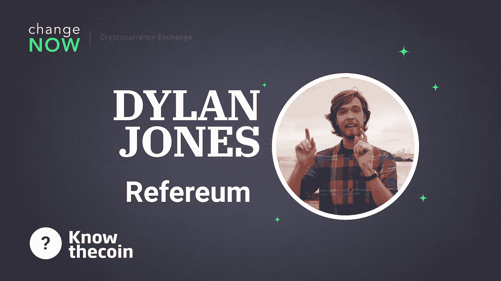

# 了解硬币:采访迪伦·琼斯

> 原文：<https://medium.com/hackernoon/know-the-coin-interview-with-refereum-founder-dylan-jones-1f2a65965077>

大家好，欢迎来到另一集 [ChangeNOW 的](http://changenow.io)认识硬币秀！今天的嘉宾是[迪伦·琼斯](https://www.linkedin.com/in/thedylanjones)，他是 [Refereum](https://refereum.com/) 的创始人兼首席执行官，这是一个位于三藩市的游戏社区平台，汇集了游戏玩家和区块链用户！

很高兴来到这里，非常感谢你的时间和听众对我们的了解。

你能告诉我们的听众一些关于你自己和你的背景吗？你是如何进入加密世界的，Refereum 是你的第一次加密体验吗？

我从事电子游戏已经有 10 年了。我基本上什么都做过:脸书游戏，手机游戏，做过一些平台和分析系统，在游戏行业做过一些营销。我们团队的每个人都来自旧金山的游戏公司或科技公司。Refereum 真正关注的是将营销预算带回给人们。所以，现在视频游戏领域发生的事情是，大部分营销预算被送到了谷歌、脸书和广告公司。我们已经研究了一段时间的想法——可能是最近几年——允许我们将那些集中的营销预算重新分配给人们。例如，最近我们看到 YouTube 和 Twitch 上有影响力的人越来越多。也许，有人在谈论和分享电子游戏，但为什么我们不能让他们获得奖励？为什么我们不能因为分享和成为游戏的超级粉丝而获得个人奖励？这才是 Refereum 真正关注的:解决这个问题。我们利用区块链来解决你在与这样的微小影响者打交道时遇到的许多问题。真正的问题是如何做到这种规模。当然，区块链在小额支付方面很棒，此外，我们正试图给视频游戏市场带来更多的透明度。这实际上是目前最大的问题之一。所以，我们的区块链解决方案保证，如果你想卖 10 件东西，你就卖 10 件。

**基本上，如果我是 Twitch 或 YouTube 视频游戏 streamer，我可以使用该平台接收提示，对吗？**

如果你在流式传输一个视频游戏，这个游戏的创作者很难找到你并奖励你。但他们想让你直播那场比赛，因为它带来了新的球员，对不对？在 Refereum 平台上，他们可以宣布:如果你播放它，我们会给你 1 美元，如果你带来新的玩家，我们会给你更多！

**所以现在，如果你是一个微影响力者，你可以直接从视频游戏中获得报酬，而不仅仅是你的观众？**

没错。

**Refereum 也是为了解决流不太知名的游戏的流民问题，对吧？**

是的，而且不仅仅是。我们与非常知名的游戏以及不太受欢迎的游戏合作。

**你以前曾涉足游戏、管理和分析。你第一次是如何进入密码世界的？**

事实上，我们已经玩了一段时间的视频游戏，并意识到我们都提出了同样的想法:当你想支付流光是很难的。你可能想付 5 美元，但玩家可能只能得到 1 美元。当你想向国外的人付款时，小额支付是一个真正的问题。接触加密是很自然的:当比特币和以太坊兴起时，许多人喜欢透明，我们也喜欢透明，一直持续到你今天认识我们。

**你以前做过哪些游戏？你为我们可能已经知道的任何标题工作过吗？**

至于我个人，我做过一些手机游戏。比如你可能玩过《战地指挥官:流氓突击》。我是那里的游戏系统设计师:设计虚拟经济，硬币如何工作，RTS 机制，策略，诸如此类的东西。现在在 Refereum，我们很高兴能与一些非常棒的开发者合作，比如那些在两周，战场上工作的人。我真的很喜欢和支持独立游戏社区，他们不能这么受欢迎，因为当前游戏营销的不幸系统，所以我们也专注于与他们合作。例如，旗帜传奇，这是一个由斯多葛派制作的可怕的战略游戏。下个月我们还将发布一些重大消息，这些消息会源源不断地涌来，因为我们正在使用区块链技术来解决现实生活中的现实问题。

如果 Refereum 解决了独立游戏开发的问题，那简直太棒了。

在那之前，我在旧金山运营一个游戏合作空间，名为 Game Nest。我们特别专注于帮助独立游戏开发者。我用了大约 3 年。

**您对区块链博彩业的总体看法如何？现在，当人们想到区块链游戏时，他们通常指的是赌博或类似以太坊上的密码猫之类的东西。**

在 2018 年，我们已经看到许多低质量的东西被烧掉了。我现在希望的是，以前种下的树会生长起来，变成区块链电子游戏的这片令人敬畏的森林。我们绝对处于区块链的婴儿期，如果与互联网相比，现在是 1992 年。我希望在 2019 年，我们将开始关注 UX 和一些伟大的力学。看看我们过去玩的纯粹集中式游戏如何与区块链互动将会很有趣。我认为这很有趣，但这不是区块链游戏的发展方向。我们从简单的东西开始，比如 CryptoKitties，你可以输入 2 或 3 个数据。我们正在接近完全连锁的游戏。我现在知道他们中的一些人，这确实是下一次进化。在经典视频游戏中只用密码支付很酷，但又不一样。下一步是我们如何使用区块链作为一个视频游戏的整个数据库。

Refereum 提供的任务呢？这些推荐点是不是不太知名的电子游戏和飘带？

在 Refereum.com，我们有你所说的这些东西。这些被称为任务。如果你完成任务，你会得到积分。你得到的分数就越多。得到的奖励越多。动作是玩游戏，看视频，分享任何东西等等。，每个人都可以跳上去。

【Refereum 采纳者流传的最受欢迎的游戏是什么？

这取决于这些天彩带是什么，变化非常快。

**你和 Telegram 的关系如何？我知道你和做推荐任务的人聊过。具体是怎么操作的？**

我们实际上是第一个在电报聊天中达到最大用户数量的项目。我们达到了 50k。我们让 Telegram 增加，是 75k，然后是 100k。我们是 Telegram 的长期用户，我们有大量的电报请求。我们很高兴与其他平台分享社区发展的技巧。我们有一个工具叫 RefereumGrow，基本上是一个增长引擎。

让我们来谈谈大规模采用。Refereum 有计划与任何大型游戏工作室合作吗？你有未来的合作伙伴吗？

当然，我们有，但不幸的是，我永远不能宣布，直到我们签署了合作伙伴关系的东西。所以在社交媒体上继续关注我们的唯一方法。我们也在那里寻找任何类型的反馈。

**关于 Refereum 令牌的一个小问题:您有没有从以太坊区块链切换到自己的主节点的计划？如果是，什么时候会发生？**

当然，以后会有更多的细节出来。在规划的早期阶段，我们也规划了自己的连锁店。

**Refereum token 可以在你平台之外的其他地方使用吗？除了将 Refereum 令牌交换给其他加密程序之外，您还能对它们做什么？**

2017 年，我们增加了在 Refereum.com 购买视频游戏的机会。这是 Refereum token 最常见的实用案例之一。它也可以用在我们的项目中，就像我上面提到的增长引擎。我们有一些合作伙伴即将到来，这将使消费 Refereum 令牌真的很容易。

你们只有 PC 游戏，还是支持其他平台，比如任天堂 Switch 或 XBOX1？

目前，我们肯定专注于 PC 游戏领域。

**你认为这个神秘的冬天会发生什么，在你看来会很快放晴吗？**

正如我提到的。我希望在 2019 年我们将开始看到一些新的树木，它们将形成一片森林。我永远不会做价格预测，我能说的是，我们将看到现在开始出现的令人敬畏的项目。我在三藩市见过其中一些的创造者，我相信这就是现在的区块链市场。

**我们能很快看到 Refereum 的更新吗？**

我们在 [Medium](/@refereum) 的博客上有很多更新，你可以去看看！

非常感谢您的阅读——敬请期待更多“认识硬币”剧集！