# 知识图表是新的黑色。图表年简讯，2019 年 5 月

> 原文：<https://medium.com/hackernoon/knowledge-graphs-are-the-new-black-the-year-of-the-graph-newsletter-may-2019-6f5ce994d821>

知识图表成为埃森哲和微软工具包的核心。谷歌、脸书、易贝和 IBM 的知识图表经验。Neo4j 和 Nvidia 的图形算法和分析。Connected Data London 和 JSON-LD goodness，构建和可视化知识图表的技巧和工具，使用带有 Elixir 和 Typescript 的图表，以及使用图表的 3D 世界的几何深度学习。

点击下面的图片，了解相关故事。

埃森哲应用智能(AI)首席技术官兼董事总经理 Jean-Luc chate Lin 表示，知识图表是新的黑色。Chatelain 在 Strata London 2019 上展示了埃森哲对知识图表的看法。你会认为没有比这更主流的了。

[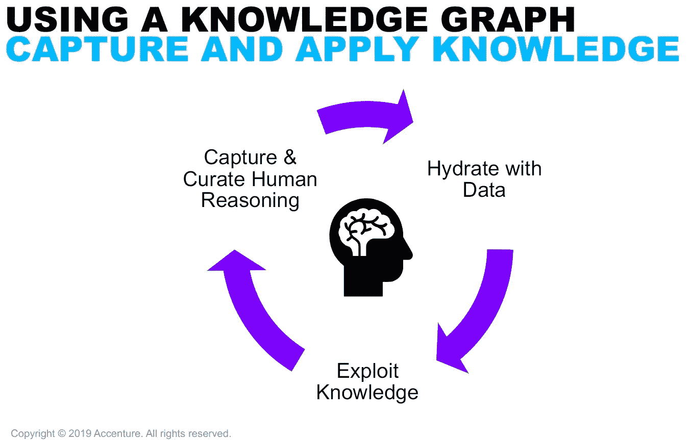](https://www.linkedin.com/feed/update/urn:li:activity:6531419098067324928/)

> 知识图表是新的黑色！更重要的是，它们是由#appliedintelligence 驱动的数据驱动型企业的基础构件。自然语言处理和内容分析技术是水合一公斤，丰富它和真正释放它的力量的关键。附件是我和我尊敬的同事 Teresa Tung 在 Strata London 2019 上对 KG 的介绍。

然而，它确实更主流。Graph 也是微软构建活动的核心。就战略而言，正如托尼·贝尔在 ZDNet 上指出的那样，微软现在强调其知识图，并发出这是其后端的一个关键部分的信息。

在产品发布方面， [Azure Cosmos DB，微软支持 graph 的多模型数据库，现在也完全支持 Spark API](https://azure.microsoft.com/en-us/blog/planet-scale-operational-analytics-and-ai-with-azure-cosmos-db/)。这对 Cosmos DB 是一个重要的补充，极大地扩展了它的分析能力，将其纳入 HTAP(混合分析事务处理)类别

[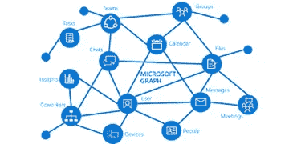](https://www.zdnet.com/article/microsoft-build-2019-postmortem-bring-on-the-graph-but-hold-the-glitz/)

> 很难超越去年由微软图形驱动的新微软 365 体验演示。今年的焦点转移到图形如何打破应用和设备孤岛，使日常应用更加以用户为中心。

显然，这不只是说说而已。在这篇基于由谷歌的 Natasha Noy 主持的 [ISWC 2018 会议的文章中，包括来自微软、脸书、易贝和 IBM 的知识图谱专家，微软似乎是继谷歌之后知识图谱规模第二大的公司。](http://iswc2018.semanticweb.org/panel-enterprise-scale-knowledge-graphs/)

这些图表有不同的大小和形状，用于不同的目的。比较谷歌和微软的图表很有意思，因为它们都用于支持搜索，并在搜索和对话中回答问题。微软的 graph 有更多的实体(20 亿比谷歌的 10 亿)，但连接更少(550 亿比 700 亿)。

举例来说，在比较谷歌和必应的搜索结果时，要记住这一点:联系很重要。但这不是唯一的收获。看到如此规模的图表如何处理覆盖率、正确性、结构和新鲜度的关键要求，有很多东西要教。

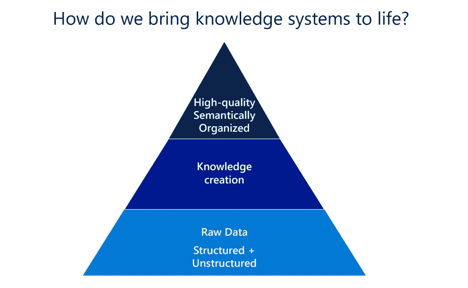

> 知识图对今天的许多企业至关重要:它们提供了驱动许多产品的结构化数据和事实知识，并使它们更加智能和“神奇”。

优步的 Joshua Shinavier 在最近的纽约知识图表活动上总结了图表的主题，谈到了图表的最佳实践和经验教训。

[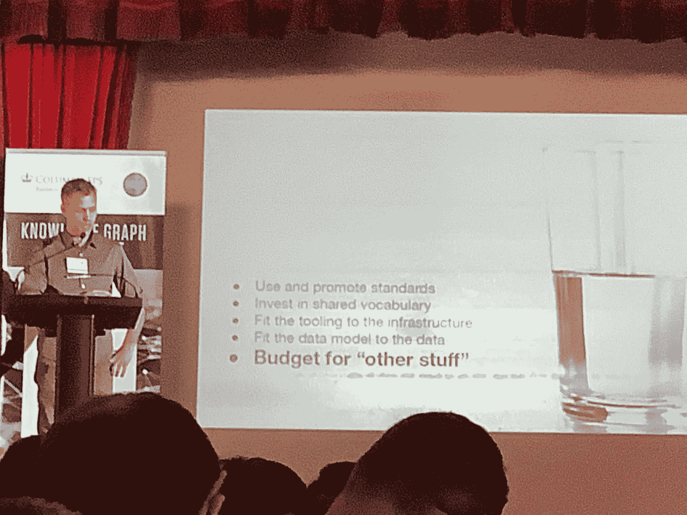](https://www.zdnet.com/article/ubers-graph-expert-bears-the-scars-of-billions-of-trips/)

> 作为优步构建知识图的专家之一，Joshua Shinavier 建议其他数据科学家，“真实的数据是杂乱的，但事实是，如果你想构建企业知识图，你必须处理它。”

图形被如此采用的一个关键原因是使用图形算法进行分析的能力。Neo4j 的 Mark Needham 和 Amy E. Hodler 刚刚出版了一本关于图算法的免费 O'Reilly 书，在 Apache Spark 和 Neo4j 中有实际的例子。

[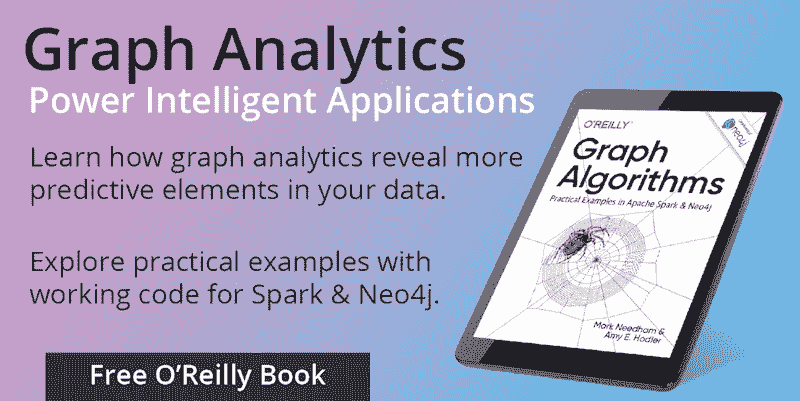](https://neo4j.com/blog/new-oreilly-book-graph-algorithms-spark-neo4j/)

> 我们很高兴地宣布《O ' Reilly Graph Algorithms:Apache Spark & Neo4j 中的实用示例》一书的上市，这是一本帮助您充分利用图形分析的实用指南。

在 GPU 上运行图算法怎么样？Nvidia 发布了新版本的 cuGraph 开源框架，让你可以做到这一点，[宣布与一些顶级研究机构合作，进一步开发其图形库](https://news.developer.nvidia.com/graph-technology-leaders-combine-forces-to-advance-graph-analytics/)。

想从英伟达涉足 graph 了解更多这方面的情况？[领导 cuGraph 工作的 Nvidia 经理| AI 基础设施经理 Brad Rees 将在互联数据伦敦](https://connected-data.london/speakers/brad-rees/)上发表演讲。

[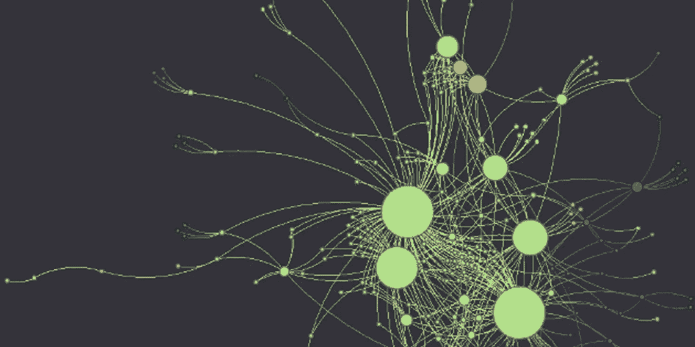](https://medium.com/rapids-ai/rapids-cugraph-1ab2d9a39ec6)

> RAPIDS cuGraph 是一个图形算法库，无缝集成到 RAPIDS 数据科学生态系统中，允许数据科学家使用存储在 GPU 数据帧中的数据轻松调用图形算法。

随着对知识图的需求如此之高，我们可以预期很多人都在寻找一个好的开端:定义、技巧以及如何着手构建知识图。语义艺术提供了定义，[库尔特·卡杰尔讨论了本体的借用、构建或购买困境](https://www.forbes.com/sites/cognitiveworld/2019/05/07/ontologies-borrow-build-or-buy/#68c7a1afdec1)，克劳迪奥·尼切尔根据他第一次使用关联数据的经验，写了一篇文章，讲述了他是如何将它们作为关联数据共享的。最后但同样重要的是，[Data tax 的戴夫·贝克伯格为数据科学家介绍了图形数据库](https://www.youtube.com/watch?v=sFAiOANt4rU&feature=youtu.be)

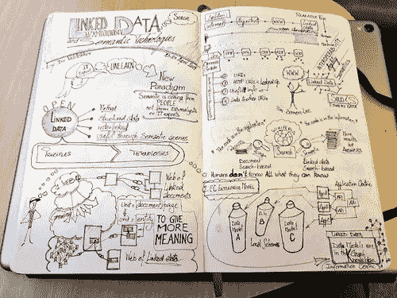

> 最近，我有幸参加了一个关于关联数据和语义技术的课程。我接受了挑战，并在平台上添加了我的图片。我还喜欢用元数据、RDF 三元组和注释来丰富它们。在课程结束后，这是一次很好的锻炼，我将所学付诸实践。

这很好，但是在现实生活中，没有什么比向专家学习更好的了。我们刚刚宣布了 10 月 3 日在伦敦互联数据召开的第一次研讨会，主要从业者展示了如何做到这一点。研讨会将提供基于开源和/或免费工具的基础知识和实践知识。

> 当我们宣布 Connected Data London 2019 时，我们希望我们的第一次研讨会成为我们产品的核心。今天，我们很高兴公布我们的计划和导师。我们挑选了一些最受欢迎的话题，以及一些最有见识的人来展示如何做到这一点。

说到语义 SEO，乔诺·奥尔德逊的集成结构化数据规范已经发布，概述了 Yoast 构建可伸缩、可互操作的 schema.org 标记方法背后的核心原则。

该文档为插件供应商、主题开发者和第三方如何扩展 Jono 的方法提供了指导，以确保他们输出(或贡献)一个有凝聚力的、统一的知识图，以及他们如何与刚刚发布了新版本的 Yoast SEO 插件集成。要了解更多信息，请访问伦敦互联数据的约诺·奥尔德逊。

[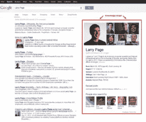](https://developer.yoast.com/schema-documentation/specification/)

> 本文档概述了我们构建可伸缩、可互操作的 schema.org 标记的方法背后的核心原则。

更多 JSON-LD，这次来自 Bob DuCharme。DuCharme 注意到，JSON-LD 的数据量正在激增，我们可以用 SPARQL 查询它，因此它为基于 RDF 的应用程序提供了许多新的可能性。DuCharme 展示了如何做到这一点，在随后的一篇文章中，他继续展示了如何将 JSON-LD schema.org RDF 转换成其他词汇表。

[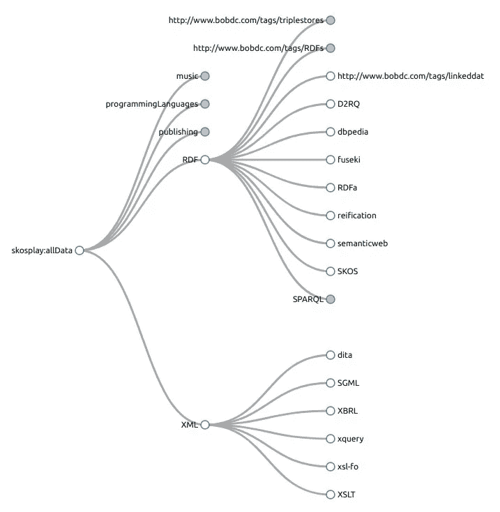](http://www.bobdc.com/blog/json2skos/)

> 有些人担心“一个模式统治所有模式”的方法。我不太担心，因为 RDF 的一个优点是，一旦你用任何标准化的 RDF 语法得到数据，你就可以把它转换成你想要的任何名称空间。

有没有想过将 JSON-LD 与 Typescript 一起使用？Eyas Sharaiha 是一名 Google 软件工程师，他编写了一个开源库，用 TypeScript 对 JSON-LD Schema.org 进行建模，他探索了 TypeScript 类型系统的功能和局限性。

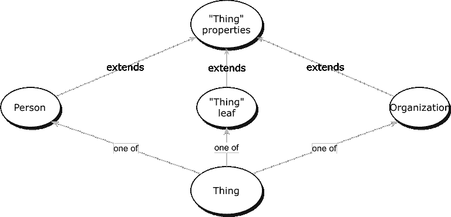

> 最近，我发布了 schema-dts，这是一个用 TypeScript 建模 JSON-LD Schema.org 的开源库。我想做这个项目的一个重要原因是因为我知道一些 TypeScript 类型系统的特性，比如有区别的类型联合、强大的类型推断、可空性检查和类型交集，它们提供了一个机会来模拟符合 Schema.org 的 JSON-LD 的样子，同时也为开发人员提供了符合人体工程学的完成。

如果您喜欢 Elixir，那么 Tony Hammond 一直在使用 Elixir 处理 RDF & LPG 图，他继续展示如何在 Elixir 中从一种图形式转换到另一种图形式。

> 在以前的文章中，我已经展示了如何使用 Elixir 访问和操作 RDF 图，还单独展示了如何访问和操作带标签的属性图(或 LPG 图)。这里我想重点介绍的是在 Elixir 中从一种图形形式到另一种图形形式的转换。

专家知识图构建者 Chris Mungall 讨论了社区中被认为是好的实践:将本体限制为单一继承。

[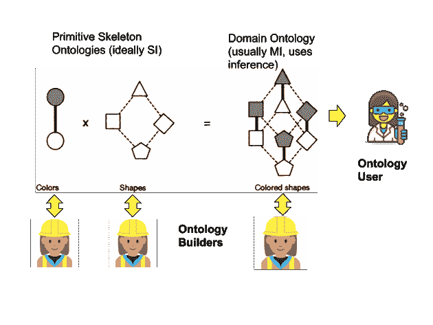](https://douroucouli.wordpress.com/2019/05/10/ontotip-single-inheritance-principle-considered-dangerous/)

> 使用树结构分类的想法可以追溯到公元 3 世纪，希腊哲学家波尔菲里的树描绘了亚里士多德的分类。尽管认识到自然可以沿着多个轴分类，导致多层次或有向无环图(Dag ),但树仍然享有特殊的地位。

知识图可视化怎么样？对此有许多选择，其中许多已经发布了更新:[剑桥智能公司为 React 开发人员推出了 ReGraph](https://cambridge-intelligence.com/regraph-eap-launch/),[Linkurious enterprise 2.7 自动化调查工作流程](https://linkurio.us/blog/linkurious-2-7-automate-investigation-workflows-templates/)，以及 [yFiles for HTML 带来了布局、视图和交互方面的改进](https://www.yworks.com/blog/yfileshtml22)。

在构建知识图表的可视化工具方面， [Gra.fo 在导出、映射和文档方面进行了更新](http://www.juansequeda.com/blog/2019/05/06/gra-fo-six-months-later-what-have-we-been-up-to/)，而 Stardog Studio 也增加了可视化功能。

[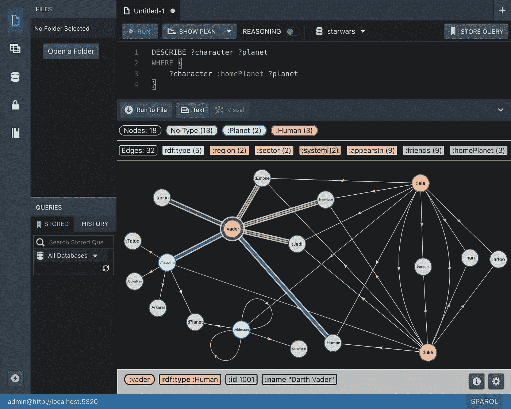](https://www.stardog.com/blog/picture-this-visual-results-in-studio/)

> 数据可视化是 Stardog 非常需要的功能，所以我们很高兴地宣布，我们已经在 Stardog Studio 中构建了可视化结果。通过支持构造和描述查询结果，您可以快速查看和自定义图表的可视化表示，以浏览和研究您的数据。

什么是几何深度学习？这和图表有什么关系？Flawnson Tong 认为，通过建立可以从非欧几里得数据中学习的神经网络，可以将机器学习提高到我们的水平，非欧几里得数据类型的主要例子是图形。

这种抽象的数据结构几乎可以用来建模任何东西。我们希望能够从图表中学习，因为图表允许我们表示单个特征，同时还提供关于关系和结构的信息。

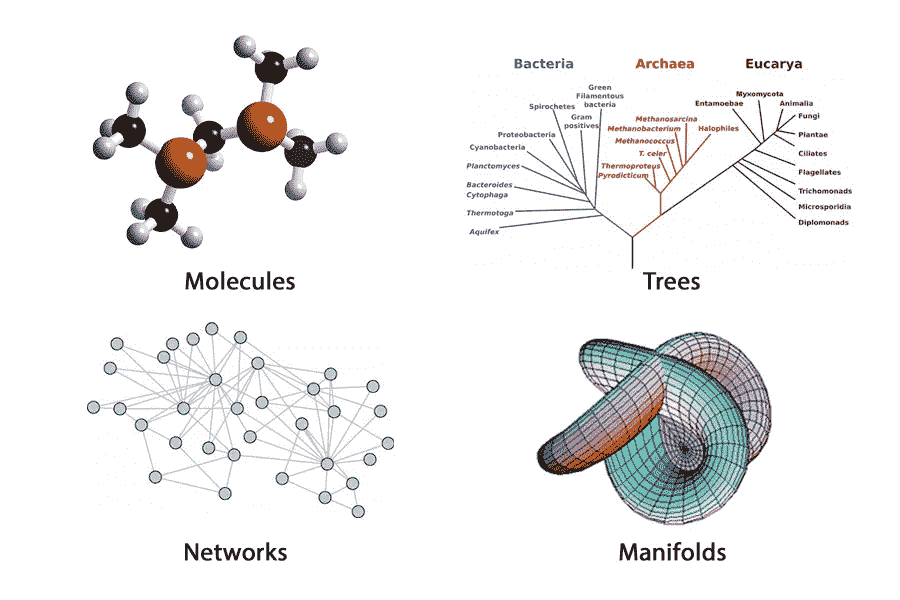

> 绝大多数深度学习都是在欧几里德数据上进行的。这包括 1 维和 2 维域中的数据类型。但我们不存在于 1D 或 2D 的世界。我们能观察到的一切都存在于 3D 中，我们的数据应该反映这一点。是时候让机器学习达到我们的水平了。

要每月在您的收件箱中收到图表年时事通讯:

*原载于 2019 年 5 月 17 日*[*https://linkeddataorchestration.com*](https://linkeddataorchestration.com/2019/05/17/knowledge-graphs-are-the-new-black-the-year-of-the-graph-newsletter-may-2019/)*。*