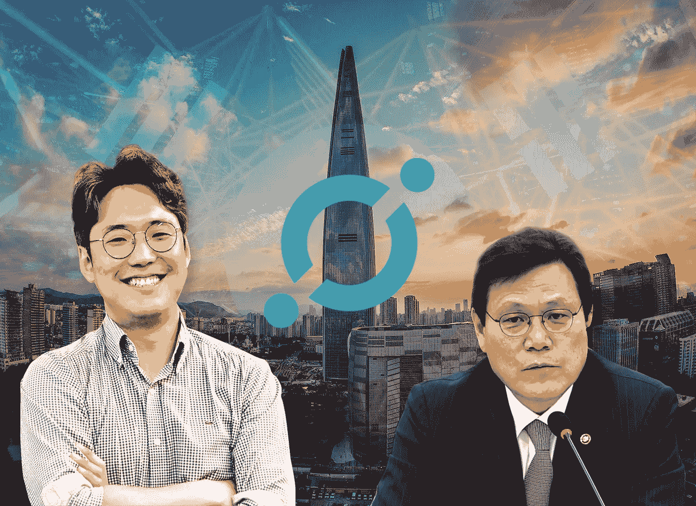
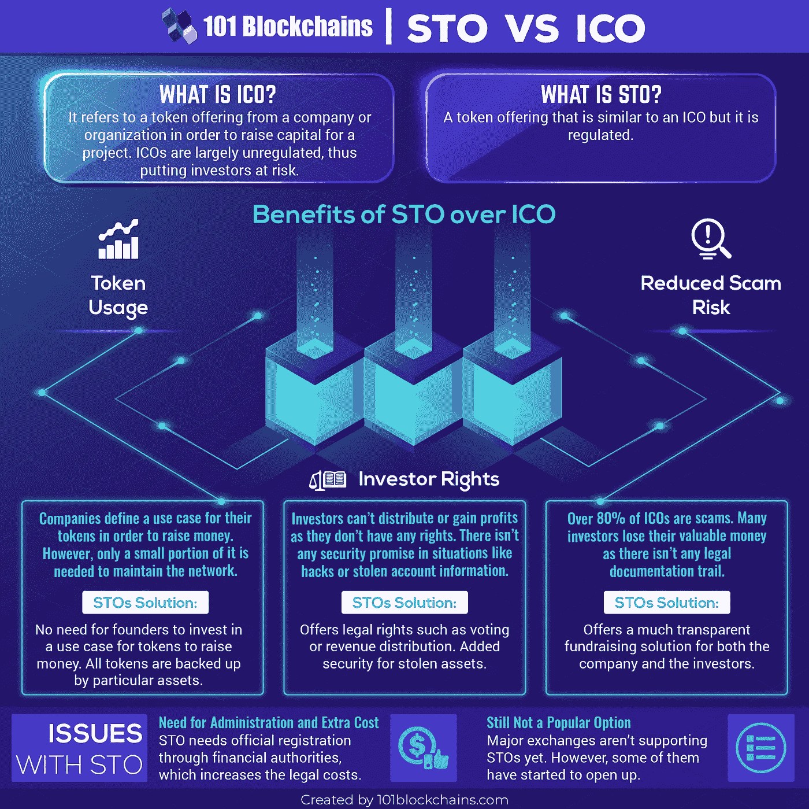
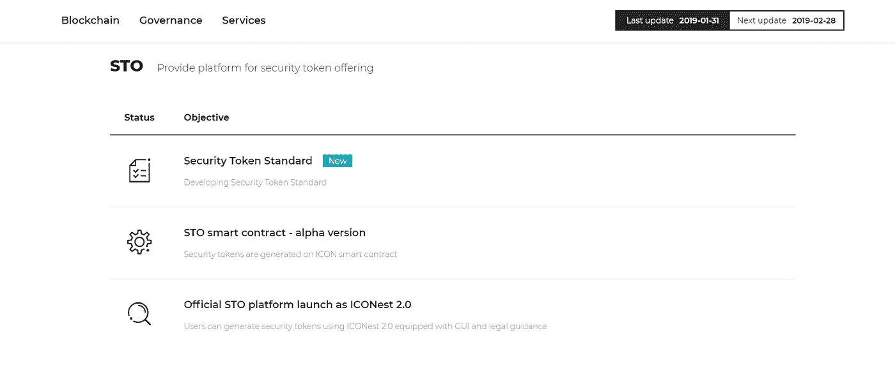

# 韩国的 ICO 禁令:它意味着什么&它如何影响 ICON x 解块

> 原文：<https://medium.com/hackernoon/koreas-ico-ban-what-it-means-how-it-affects-icon-x-deblock-887a525bec10>

由于韩国金融监督院的一项调查结果，以及这对 ICON 到底意味着什么，许多讨论都对韩国维持其对 ICO 禁令[的立场表示担心或担忧。](https://www.fsc.go.kr/info/ntc_news_view.jsp?bbsid=BBS0030&page=1&sch1=&sword=&r_url=&menu=7210100&no=32932)

**南韩为何维持其 ICO 禁令政策？**

鉴于最近有消息称，韩国政府维持了目前对国内公司所有首次发行硬币(ico)的禁令，许多人会认为这对区块链行业来说不是一个理想的局面。

那么，ICOs 当初为什么会在韩国被禁呢？简而言之，ICO 禁令是政府保护投资者免受潜在欺诈的一种方式，直到一个更好的 ICO 法规和政策框架到位。

韩国之所以维持对 ico 的禁令，是因为韩国金融监督院(FSS)对 22 家在海外持有 ico 的本地公司进行了调查。大多数被调查的公司未能提供足够的透明度，不愿向投资者披露基本或准确的信息(公司简介、业务内容、财务报表等)。此外，还发现了韩语营销材料和白皮书，表明一些公司正在向韩国投资者募集资金。

**韩国政府继续支持区块链**

许多人容易忘记的两件重要事情:

*   不是所有的公司、项目和创业公司都需要 ico 来筹集资金。
*   **尽管许多人认为韩国禁止 ICO 是政府反对区块链项目的发展，但 ICO 禁令并不是政府对区块链的立场声明。**

根据 FSS 进行的调查的同一份新闻稿，韩国政府有多项举措来扩大对区块链技术和创业公司的支持:

1.  将公开试点项目从 2018 年的 6 个扩大到 2019 年的 12 个。
2.  加倍投资区块链的研发。
3.  为区块链的研究和发展提供税收优惠。
4.  到 2022 年，通过培训 10，000 名区块链专业人员振兴区块链工业。

**韩国维持 ICO 禁令对 ICON x 解封有何影响？**

[**Deblock**](https://www.deblock.co.kr/) ，由 [ICON Foundation](https://medium.com/u/97957d5f5ab2?source=post_page-----887a525bec10--------------------------------) 创办的风投公司和加速器，主要专注于韩国的项目和团队。根据 FSS 的调查结果，许多人担心 ICON 或 Deblock 是否与违反韩国 ico 禁令的任何团队或项目有任何关联或牵连。 [Deblock](https://medium.com/u/154c82a59361?source=post_page-----887a525bec10--------------------------------) 、 [오현석](https://medium.com/u/d5f875dcc874?source=post_page-----887a525bec10--------------------------------) (Hyun Oh)的管理合伙人能够解决这个问题:

> "**不，我们没有让自己参与任何从事这类实践的团队。**

虽然许多人认为韩国禁止 ico 不利于 ICON 和韩国政府的合作和关系，但 Oh 对这种情况持更乐观的态度，并就 Deblock 未来与韩国政府在韩国区块链初创公司方面的合作计划提供了见解。

> **“de block 将投资区块链的初创公司，而不仅仅是 ico，我们正在计划与政府加速实体合作建立一个加速计划，以投资和加速早期区块链初创公司。”**

虽然 ico 在韩国仍被禁止，但 DApps 等项目在韩国仍可在 ICON 平台上建设，不违反任何法律。证券代币发行(STO)也为区块链公司融资提供了一种可能的合法选择，这种做法不仅在朝鲜，而且在全世界都变得越来越普遍。

同样令人欣慰的是，ICON 团队似乎很好地意识到了令牌产品的这种转变，为 s to 提供了支持，如下图所示:

随着 sto 可能成为全球范围内筹资、加速器项目和合作伙伴关系的新标准，[首尔市政府](/helloiconworld/iconloop-selected-to-demonstrate-seoul-blockchain-platform-42b7701529)和[其他政府实体](/helloiconworld/iconloop-nec-selected-for-the-project-building-the-next-generation-election-system-c701bcfbed7f)已经应用 loopchain，以及韩国政府对区块链的普遍支持，ICON 没有显示出放缓其生态系统增长的迹象。