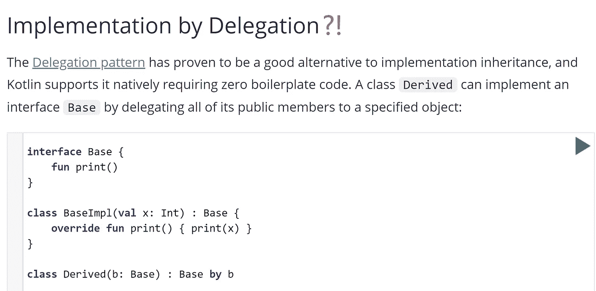

# 科特林的班级代表团

> 原文：<https://medium.com/hackernoon/kotlin-what-is-class-delegation-all-about-683eb543e391>



**TL；你现在这样很好，你可以跳过这篇文章。**

在我们开始之前，让我们看看 Kotlin 中的班级代表是什么样的:

```
interface Flyable {
    fun fly()
}interface Movable {
    fun move()
}class Aircraft(
    liftMechanism: Flyable, 
    propulsion: Movable
): Flyable by liftMechanism, Movable by propulsion
```

那么这段代码是做什么的呢？这个类别代表一种能够移动和飞行的飞行器。这可以通过层级来实现，对吗？那么，为什么要大费周章，用委托来定义它呢？做好准备，因为这是我们在这篇文章中要讨论的全部内容。

## 等级制度

如果您来自 Java 或其他早期语言，您可能对继承有很好的了解。**为了定义模型，我们通常找到它们之间的共性来定义一个基类，然后我们基于差异来定义派生类，创建一个类层次结构。**

简而言之，我们试图根据模型定义一个家谱。例如，飞机是一种移动和飞行的交通工具，而滑翔机则是一种不用任何引擎就能移动的飞机。所以你这样定义你的模型:

```
interface Aircraft {
    fun fly()
    fun move ()
}interface WingedAircraft: Aircraft {
    override fun fly() = *print*("Adjust wing angle..")
}interface RotorCraft: Aircraft {
    override fun fly() = *print*("Start spinning the blades..")
}interface UnpoweredVehicle: Aircraft {
    override fun move() = *print*("Just hanging up here..")
}interface PropelledVehicle: Aircraft {
    override fun move() = *print*("Starting engine..")
}
```

然后我们可以派生出这样的类:

```
class Glider: WingedAircraft, UnpoweredVehicle
class Jet: WingedAircraft, PropelledVehicle
class Gyroglider: RotorCraft, UnpoweredVehicle
class Helicopter: RotorCraft, PropelledVehicle
```

如此熟悉，对吗？借助默认实现的**接口，**我们可以在 Kotlin 中创建类似多重继承的东西。的确是好的；那么真的还有什么问题需要班级委托来解决吗？还有改进的空间吗？要看到这一点，首先我们必须深入到层次结构中。

## 遗传多态性

那么遗传是怎么回事呢？它是多态的，它使你能够定义一个类，通过它是什么或者它是从什么派生的。所以如果一个职业是从 jet 衍生出来的，那么它就是 jet，现在根据它是什么，它可以从 Jet 进化成战斗机或者无人机。这很好，但是你打算在哪个层次上添加这个新特性呢？哪些实体会是你的父母？杰特？有翼推进？

你可能会得到这样一个类:

```
class Fighter: WingedAircraft, PropelledVehicle, CombatAircraft
```

，而其他人也会这样结束

```
class Fighter: Jet()
```

，而其他人(肯定不是我)可能会这样结束

```
class Fighter: Aircraft
```

如你所见，我们已经在看家谱了。

## 问题是

所以让我们引入一个问题，让我们的生活变得更艰难。比方说，我们想要添加一种新的飞行机制。

```
interface AerostatsAircraft: Aircraft {
    override fun fly() = *print*("Start floating..")
}
```

现在我们可以拥有像气球一样利用热空气飞行的飞机。当然，这些飞机如何移动决定了它们的父母:

```
class Balloon: AerostatsAircraft, UnpoweredVehicle
class Zeppelin: AerostatsAircraft, PropelledVehicle
```

因此，通过引入一种新的类型，子类的数量从 4 个增加到 6 个，这对于一个简单的变化来说不是一个合理的复杂性，另一种推进类型会将子类的数量从 6 个增加到 9 个，之后只会变得更糟，单独引入一个新的特性，比如飞机如何驾驶会使复杂性增加两倍。因此，这里我们需要另一种方式来模拟我们的系统。

## 通过合成的多态性

简单地说，组合就是通过行为来定义实体的行为。这确实变得更加容易，因为您通过查看它有什么组件来创建一个类，而不是考虑它是什么(不管上下文是什么，这都是一个困难的问题)。例如，您可以根据飞机的飞行方式来定义飞机:

```
interface Flyable {
    fun fly()
}class FixedWing: Flyable {
    override fun fly() = *print*("Adjust wing angle..")
}class RotaryWing: Flyable {
    override fun fly() = *print*("Start spinning the blades..")
}class Aircraft(private val liftMechanism: Flyable): Flyable {
    override fun fly() {
        liftMechanism.fly()
    }
}
```

或者你可以根据它的运动方式来定义它:

```
interface Movable {
    fun move()
}class Unpowered: Movable {
    override fun move() = *print*("Just hanging up here..")
}class Propelled: Movable {
    override fun move() = *print*("Starting engine..")
}class Aircraft(private val propulsion: Movable): Movable {
    override fun move() {
        propulsion.move()
    }
}
```

现在要把它推广到每一架飞机，你只需说:

```
class Aircraft(
    private val liftMechanism: Flyable,
    private val propulsion: Movable
): Flyable, Movable {

    override fun fly() {
        liftMechanism.fly()
    }

    override fun move() {
        propulsion.move()
    }
}
```

现在，我们已经建立了我们的飞机，让我们看看如何添加新类型的飞行机制影响我们的类:

```
class HotAir: Flyable {
    override fun fly() = *print*("Start floating..")
}val balloon = Aircraft(HotAir(), Unpowered())
val zeppelin = Aircraft(HotAir(), Propelled())
```

没那么多吧。我们在这里所做的是通过定义类的特性来组成类，从而拉平层次树。毕竟是相同的多态性和接口；改变的不是我们使用的技术，而是我们的思维方式。

## 科特林级代表团

那么科特林是做什么的呢？它提供了一个语言关键字，所以你可以跳过所有无聊的部分:

```
class Aircraft(
    liftMechanism: Flyable,
    propulsion: Movable
): Flyable by liftMechanism, Movable by propulsion
```

科特林班委绝不是魔术，它只是作文上面的一个合成糖(我很欣赏)，让作文更快更容易。如果有什么可以称之为魔术的话，那就是让生活和编程变得更容易的合成本身。

**免责声明:**本文不是在比较继承和合成，因为有很多关于合成优于继承的好资源，但这不是其中之一。