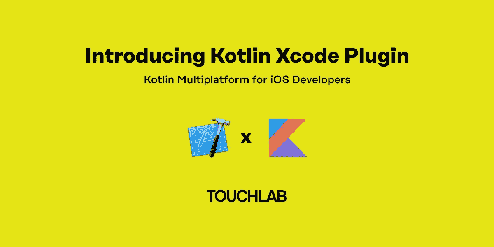
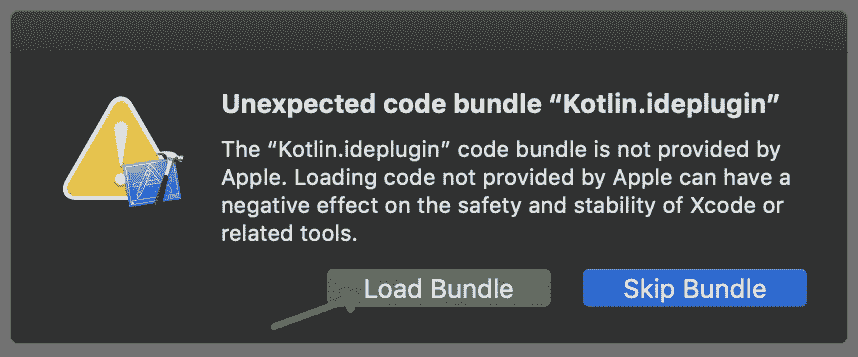

# Kotlin Xcode 插件

> 原文：<https://medium.com/hackernoon/kotlin-xcode-plugin-64f52ff8dc2a>

*凯文是一家移动创新咨询公司* [*Touchlab*](https://touchlab.co/) *的合伙人。*

如果你有兴趣了解更多，我们将在美国东部时间 4 月 26 日星期五下午 3 点举办一场插件的现场演示。你可以在 [*这里*](https://zoom.us/webinar/register/6515562123487/WN_9Bc8heWeSOKxgK9meMFAQQ) *调谐。*

对于使用 Kotlin 多平台的本地移动开发者来说，[iOS 开发体验将是至关重要的](https://touchlab.co/making-kotlin-multiplatform-a-native-experience-for-ios-developers/)。至少在接下来的几个月里，这将是 Touchlab 的 Kotlin R & D 以及我们与 Square 合作的主要焦点。

我们的第一个版本是科特林的 Xcode 插件。安装后，Xcode 会将 Kotlin 文件识别为源文件，提供关键字着色，最重要的是，它会让您交互式地调试在 iOS 模拟器中运行的 Kotlin 代码。

根据项目设置，这包括常规代码以及 Kotlin 单元测试代码。我们将很快提供如何在 Xcode 中运行单元测试的信息。

[在这里下载插件存档](https://github.com/touchlab/xcode-kotlin/releases)

# 活码！

设置插件和 Xcode 可能有点棘手。我们将在美国东部时间 4 月 26 日星期五下午 3 点进行一次现场代码会议。我们将建立一个项目，演示调试功能，帮助其他人进行设置，如果时间允许，还会检查应用程序代码。如果你想看，请在这里报名。

如果您计划使用 Xcode 调试器，并且想要一些实时帮助，请勾选上表中的方框。你需要分享你的屏幕，或者至少有一个我们可以运行的开源项目。我们将挑选 1 或 2 个项目，*尝试*实时配置它们。

# App 代码？

我们仍然是 JetBrains 工具的忠实粉丝，并期待与 AppCode 完全集成的开发体验。[查看关于 v2019.1 更新支持的博文](https://blog.jetbrains.com/kotlin/2019/04/kotlinnative-support-for-appcode-2019-1/)。AppCode 已经开始与交互式调试器一起发布，我们期待着这个产品作为一个平台与 Kotlin 一起成熟。

然而，使用 Xcode 选项更容易说服 iOS 开发者尝试 Kotlin MP。这个插件肯定不是像 [IntelliJ IDEA](https://www.jetbrains.com/idea/) 和 [AppCode](https://www.jetbrains.com/objc/) 那样的全功能工具，但将允许 iOS 开发者单步调试共享代码。

我们的想法是，在许多团队中，专注于 iOS 的开发人员将主要使用 Kotlin。能够在他们的原生工具中导航和调试将对兴趣和学习大有帮助。

# Xcode 插件？

几年前，苹果关闭了 Xcode 的大部分插件功能。然而，这主要适用于可能改变输出的可执行代码。虽然 Kotlin 插件放在“Plugin”文件夹中，但它不做苹果禁止的事情，所以不需要特殊权限。您可以简单地复制语言配置文件并重启 Xcode。

Xcode 会询问您是否想在第一次运行时载入捆绑包。你需要考虑到这一点。

Click “Load Bundle”

# 状态

这绝对是一项正在进行的工作。未来还有许多方面需要改进。然而，一旦配置完毕，这是一个非常有用的工具。非常欢迎反馈和贡献。

# 科特林源

为了在 Kotlin 代码中设置断点，您需要 Xcode 中可用的 Kotlin 源代码。对于那些熟悉 Intellij 和 Android Studio 的人来说，源代码不会简单地“出现”,因为它在您的项目文件夹中。我们需要将其导入 Xcode。

您可以手动导入，但您应该确保文件没有被复制到应用捆绑包中。Xcode“识别”Kotlin 文件，但默认情况下，不会像对待 Swift 文件一样对待它们。在添加/删除代码时，您还需要定期刷新 Kotlin 文件。

作为替代，我们有一个 [Gradle 插件](https://github.com/touchlab/KotlinXcodeSync)，你可以指向一个源文件夹和一个 Xcode 项目，它会导入 Kotlin 文件。这个插件非常新，一些计划中的功能可能会被遗漏。依赖关系的 Kotlin 源代码是最明显的。我们需要一些帮助。

作为另一种选择，如果使用 Cocoapods，有可能将`source_files`添加到您的 podspec 中，但是我们才刚刚开始试验。

# 后续步骤

我们将很快发布更多一般更新。订阅[邮件列表](http://touchlab.co/#newsletter-sign-up)，在 twitter 上关注 [me](https://twitter.com/kpgalligan) 和/或 [Touchlab](https://twitter.com/touchlabhq) ，或者来观看上面提到的直播。

也来听听 [Justin](https://twitter.com/piannaf) 在[引领纽约发展](https://newyork2019.theleaddeveloper.com/talks)！