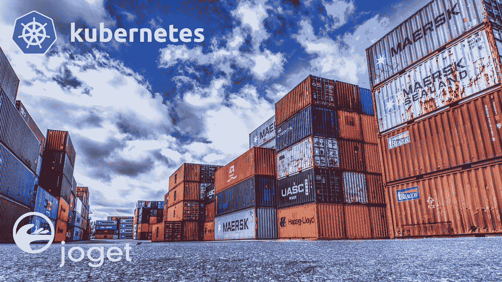
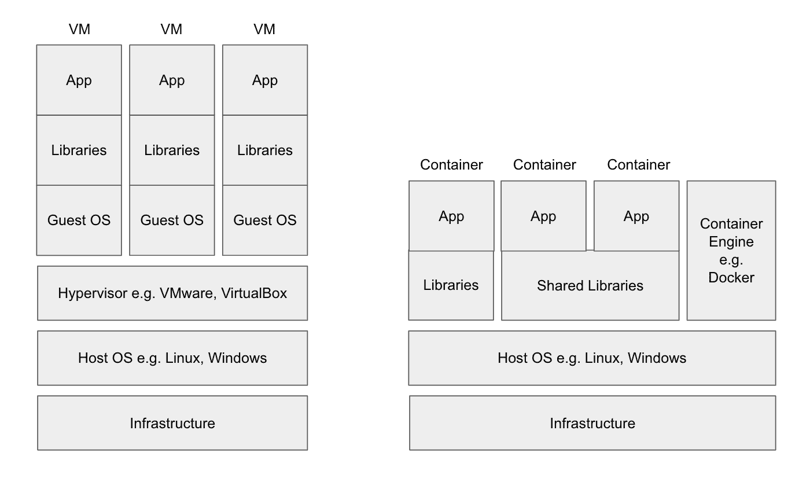
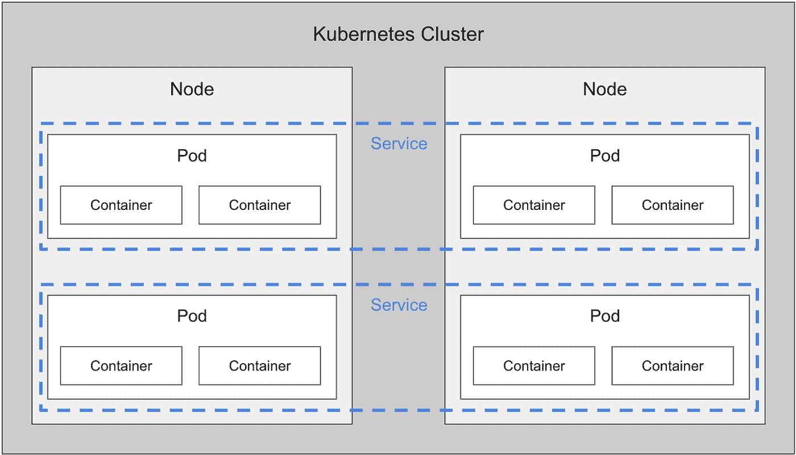

# Kubernetes:炒作到底是为了什么

> 原文：<https://medium.com/hackernoon/kubernetes-what-the-hype-is-all-about-and-a-practical-tutorial-on-deploying-joget-for-low-code-47a8b02e47f5>

## 通过一个关于为低代码应用程序开发部署 Joget 的实用教程



# 容器、Docker 和 Kubernetes 简介

Docker 和 Kubernetes 等容器技术在现代云基础设施中是必不可少的，但是它们是什么，它们是如何工作的？本文将对关键概念进行快速介绍。为了帮助您以更实际的方式进一步理解这些概念，在介绍之后将会有一个教程来设置 Kubernetes 的本地开发副本。然后，我们将部署一个 [MySQL](https://www.mysql.com/) 数据库和 [Joget](https://www.joget.com/) 应用程序平台，为可视化的快速应用程序开发提供一个现成的环境。

# 容器

容器是一种打包软件的方式，以便应用程序代码、库和依赖项以可重复的方式打包在一起。容器共享底层操作系统，但是在独立的进程中运行。

此时，您可能会问，容器与运行在虚拟机平台(称为虚拟机管理程序，如 VMware 或 VirtualBox)上的虚拟机(VM)有何不同？虚拟机包括运行在虚拟硬件上的整个操作系统(OS ),有利于隔离整个环境。例如，您可以在运行 macOS 的 Mac 计算机上运行整个 Windows Server 安装。另一方面，容器位于操作系统之上，可以共享库，所以它们更轻量级，因此更适合更大规模、更高效的部署。下图以直观的方式说明了不同之处，以便于理解。



Difference between virtual machines and containers

# 码头工人

[Docker](https://www.docker.com/) 是一个创建、部署和运行容器的开源工具。在 Docker 中，您实际上定义了一个 Docker 文件，它就像是一个应用程序的快照，可以在任何有 Docker 运行时的地方部署和运行，无论是在云中、在您的 PC 上，甚至是在 VM 中。Docker 还支持像 [Docker Hub](https://hub.docker.com/) 这样的存储库，容器映像存储在这里以便分发。

虽然 Docker 不是唯一可用的容器技术(有 CoreOS rkt、Mesos、LXC 等替代技术)，但它现在是行业中的主导和事实上的标准。

# 库伯内特斯

如果 Kubernetes 对你来说听起来像希腊语，那是因为它确实是希腊语。Kubernetes 是希腊语中“船长”或“舵手”的意思。Kubernetes，缩写为 K8s(将中间的八个字母转换成数字 8)，是一个开源的容器编排平台。在这种情况下，编排意味着什么？虽然容器使打包软件变得更容易，但它在许多操作领域没有帮助，例如:

*   如何在不同的机器上部署容器？当机器出现故障时会发生什么？
*   你如何管理负载？如何根据系统负载自动启动或停止容器？
*   你如何处理持久存储？容器在哪里存储和共享文件？
*   你如何处理失败？当容器崩溃时会发生什么？

编排平台有助于管理这些领域和更多领域的容器。

Kubernetes 最初是由 Google 基于支持大规模的需求而创建的，现在处于[云本地计算基金会(CNCF)](https://www.cncf.io/) 的管辖之下，这是一个供应商中立的基金会，管理流行的开源项目。

Kubernetes 有替代产品(如 Docker Swarm、Mesos、Nomad 等)，但 Kubernetes 似乎已经赢得了容器编排战，几乎所有的大供应商都采用了这种方法，包括 Google、Amazon、Microsoft、IBM、Oracle、Red Hat 等等。

# 开始使用 Kubernetes

到目前为止，您已经了解了 Docker 和 Kubernetes 是互补的技术。您将应用程序打包到 Docker 容器中，这些容器由 Kubernetes 管理。

使用 Docker 非常简单。您基本上需要安装 Docker 环境，之后您将能够使用“docker run”命令启动容器映像。运行 Joget 工作流容器映像的简单教程可从[https://dev . Joget . org/community/display/kb V6/Joget+Workflow+on+Docker](https://dev.joget.org/community/display/KBv6/Joget+Workflow+on+Docker)获得。

理解和安装 Kubernetes 是一个更复杂的命题。有几个基本和重要的概念需要理解:

1.  Kubernetes 集群由一个或多个节点组成。[节点](https://kubernetes.io/docs/concepts/architecture/nodes/)是运行应用程序的机器(虚拟机、物理服务器等)。
2.  一个 [Pod](https://kubernetes.io/docs/concepts/workloads/pods/pod-overview/) 是最小的 Kubernetes 对象，它包含一个或多个容器、存储资源、网络 IP 和其他配置。
3.  一个[服务](https://kubernetes.io/docs/concepts/services-networking/service/)定义了一组 pod 以及如何访问它们。
4.  一个[卷](https://kubernetes.io/docs/concepts/storage/volumes/)是容器的共享存储，支持许多不同的类型。
5.  这些 Kubernetes 对象在。yaml 文件
6.  命令行接口工具 [kubectl](https://kubernetes.io/docs/reference/kubectl/overview/) 用于通过 [Kubernetes API](https://kubernetes.io/docs/concepts/overview/kubernetes-api/) 管理这些对象。



A simplified view of Kubernetes objects

Kubernetes 中还有很多概念，但是上面的基本概念应该足以让你开始使用 Kubernetes。

不同的提供商针对不同的需求提供了许多 Kubernetes 解决方案，从用于本地测试的社区工具到来自云提供商和企业供应商的生产环境。

出于本教程的目的，我们将使用 [Minikube](https://kubernetes.io/docs/setup/minikube/) ，这是一个在虚拟机中运行单节点 Kubernetes 集群的工具，用于本地开发和测试。我们将使用运行 macOS 的 Mac，但是您可以针对您的操作系统修改说明。

## 安装 VirtualBox

第一步是安装一个虚拟机平台。我们将使用开源的 VirtualBox 作为虚拟机平台。遵循[https://www.virtualbox.org/wiki/Downloads](https://www.virtualbox.org/wiki/Downloads)的下载和安装说明

## 安装 kubectl

下一步是安装 Kubernetes 命令行工具， [kubectl](https://kubernetes.io/docs/user-guide/kubectl/) ，它允许您针对 Kubernetes 集群运行命令，例如部署应用程序、检查资源、查看日志等。

1.下载并设置可执行文件:

```
curl -LO [https://storage.googleapis.com/kubernetes-release/release/$(curl](https://storage.googleapis.com/kubernetes-release/release/$(curl) -s [https://storage.googleapis.com/kubernetes-release/release/stable.txt](https://storage.googleapis.com/kubernetes-release/release/stable.txt))/bin/darwin/amd64/kubectl \&& chmod +x ./kubectl
```

2.将二进制文件移动到您的路径:

`sudo mv ./kubectl /usr/local/bin/kubectl`

3.测试以确保您安装的版本是最新的:

`kubectl version`

完整的说明在[https://kubernetes.io/docs/tasks/tools/install-kubectl/](https://kubernetes.io/docs/tasks/tools/install-kubectl/)上

## 安装 Minikube

现在让我们安装 [Minikube](https://kubernetes.io/docs/tutorials/hello-minikube) ，这是一个在笔记本电脑上的虚拟机中运行单节点 Kubernetes 集群的工具。

1.下载并设置可执行文件:

```
curl -Lo minikube [https://storage.googleapis.com/minikube/releases/latest/minikube-darwin-amd64](https://storage.googleapis.com/minikube/releases/latest/minikube-darwin-amd64) \&& chmod +x minikube
```

2.将二进制文件移动到您的路径:

`sudo mv minikube /usr/local/bin`

https://kubernetes.io/docs/tasks/tools/install-minikube/的[有完整的说明](https://kubernetes.io/docs/tasks/tools/install-minikube/)

## 启动 Minikube

1.启动 Minikube 并创建集群:

`minikube start`

输出如下所示:

```
😄 minikube v1.1.0 on darwin (amd64)💿 Downloading Minikube ISO …131.28 MB / 131.28 MB [============================================] 100.00% 0s🔥 Creating virtualbox VM (CPUs=2, Memory=2048MB, Disk=20000MB) …🐳 Configuring environment for Kubernetes v1.14.2 on Docker 18.09.6💾 Downloading kubeadm v1.14.2💾 Downloading kubelet v1.14.2🚜 Pulling images …🚀 Launching Kubernetes …⌛ Verifying: apiserver proxy etcd scheduler controller dns🏄 Done! kubectl is now configured to use “minikube”
```

## 测试 Minikube 安装

1.运行一个示例 HTTP 应用程序

```
kubectl run hello-minikube image=gcr.io/google_containers/echoserver:1.4 — port=8080
```

2.公开服务，以便可以建立外部连接

```
kubectl expose deployment hello-minikube — type=NodePort
```

3.检查吊舱

```
kubectl get pod
```

4.一旦状态为运行，使用 [curl](https://curl.haxx.se/) 测试服务

```
curl $(minikube service hello-minikube — url)
```

5.删除服务和部署

```
kubectl delete services hello-minikube
kubectl delete deployment hello-minikube
```

完整说明可在[https://kubernetes.io/docs/setup/minikube/#quickstart](https://kubernetes.io/docs/setup/minikube/#quickstart)获得

## 在 Kubernetes 上部署 MySQL

为了部署 MySQL 数据库映像，我们将使用 Kubernetes 网站 k8s.io 中提供的一个示例 YAML 文件

1.使用[持久卷和持久卷声明](https://kubernetes.io/docs/concepts/storage/persistent-volumes/)创建持久存储

```
kubectl apply -f [https://k8s.io/examples/application/mysql/mysql-pv.yaml](https://k8s.io/examples/application/mysql/mysql-pv.yaml)
```

2.部署 MySQL 映像

```
kubectl apply -f [https://k8s.io/examples/application/mysql/mysql-deployment.yaml](https://k8s.io/examples/application/mysql/mysql-deployment.yaml)
```

3.检查部署

```
kubectl describe deployment mysqlkubectl get pods -l app=mysqlkubectl describe pvc mysql-pv-claim
```

4.运行 MySQL 客户端进行测试

```
kubectl run -it — rm — image=mysql:5.6 — restart=Never mysql-client — mysql -h mysql -ppassword
```

完整说明可从[https://kubernetes . io/docs/tasks/run-application/run-single-instance-stateful-application/](https://kubernetes.io/docs/tasks/run-application/run-single-instance-stateful-application/)获得

## 在 Kubernetes 上部署 Joget

MySQL 数据库运行后，让我们为 Joget Workflow Enterprise 运行一个 [Docker 映像，它连接到 MySQL 服务。](https://hub.docker.com/r/jogetworkflow/joget-enterprise/)

1.使用 joget 知识库中的[示例 YAML 文件](https://dev.joget.org/community/download/attachments/42599234/joget-deployment.yaml)部署 Joget 映像。

```
kubectl apply -f [https://dev.joget.org/community/download/attachments/42599234/joget-deployment.yaml](https://dev.joget.org/community/download/attachments/42599234/joget-deployment.yaml)
```

2.检查部署

```
kubectl describe deployment jogetkubectl get pods -l app=joget
```

3.一旦状态为 Running，就获取服务的 URL

```
minikube service joget — url
```

4.在浏览器中访问 URL，在路径中添加/jw 以访问 Joget 应用程序中心，例如[http://192 . 168 . 99 . 100:32496/jw](http://192.168.99.100:32496/jw)


Joget App Center

现在你已经有了一个正在运行的 Joget 工作流安装，你将能够在 30 分钟内[可视化地构建一个完整的应用程序，而无需编码](https://blog.joget.org/2017/06/simplifying-dev-in-devops-build-full.html)。

## 扩展 Joget 部署

现在我们可以演示如何使用 Kubernetes 来手动增加和减少正在运行的 pod 的数量。

1.将部署扩展到 2 个单元(称为副本)

```
kubectl scale — replicas=2 deployment joget
```

2.检查 running pods，您应该看到 2 个 pods 运行 Joget

```
kubectl get podsNAME READY STATUS RESTARTS AGjoget-7d879db895-c9sbb 1/1 Running 0 27
joget-7d879db895-wpnsf 1/1 Running 0 37m
mysql-7b9b7999d8-lk9gq 1/1 Running 0 65m
```

3.将部署规模缩小到 1 个单元

```
kubectl scale — replicas=1 deployment joget
```

4.检查 running pods，您现在应该看到 1 个 pod 正在运行 Joget。

```
kubectl get pods
```

# 对 Kubernetes 的警告

这篇使用 Minikube 的教程非常简单，旨在学习容器、编排和 Kubernetes 背后的基本概念。在真实的生产环境中，您需要考虑更多的事情，例如:

1.  如何管理多个节点上的安装？你可能需要一些自动化工具，比如 [Ansible](https://www.ansible.com/) 或者 [Puppet](https://puppet.com/) 。
2.  如何监控 Kubernetes 集群？你需要像普罗米修斯这样的东西。
3.  如何管理真正的持久存储？您将使用共享的持久卷。(例如，使用 NFS 或其他存储解决方案，如 [Ceph](https://ceph.com/) )
4.  您如何管理安全性，例如处理密码？你需要使用[机密](https://kubernetes.io/docs/concepts/configuration/secret/)作为密码。
5.  你如何管理你的 Docker 图片？你会想要运行你自己的[私有 Docker 注册表](https://docs.docker.com/registry/deploying/)。
6.  您如何处理集群并确保应用程序根据负载进行扩展？您需要设置 [autoscaling](https://kubernetes.io/docs/tasks/run-application/horizontal-pod-autoscale/) 并确保 Joget 和/或数据库映像已经为复制进行了预配置。有一篇名为[如何在 OpenShift 上用 Joget 和 JBoss EAP 自动扩展低代码应用的示例 OpenShift 博客文章](https://blog.openshift.com/how-to-automatically-scale-low-code-apps-with-joget-and-jboss-eap-on-openshift/)。

所以实际上，Kubernetes 很难！Kubernetes 并不是一个完整的堆栈，有许多缺失的部分需要您来填充。

这就是 Kubernetes 生态系统中众多产品和解决方案提供商发挥作用的地方。例如，[Red Hat open shift Container Platform](https://www.openshift.com/)被打包为 Kubernetes for the enterprise，提供了许多缺失的组件，如改进的监控、日志记录、容器注册表、web 控制台 UI 和构建自动化以及商业支持。像[亚马逊](https://aws.amazon.com/eks/)、[微软](https://azure.microsoft.com/en-in/services/kubernetes-service/)、[谷歌](https://cloud.google.com/kubernetes-engine/)和其他许多云提供商都提供托管解决方案，因此您只需专注于您的容器映像，而不必担心管理实际的 Kubernetes 平台。

# 结论

在本文中，我们介绍了容器、Docker 和 Kubernetes。我们还介绍了在实际生产环境中使用 Kubernetes 的困难。如果 Kubernetes 这么硬，那你为什么要用它？Kubernetes 可能不适合所有人，但如果做得好，它确实会提供巨大的价值，这就是为什么 it 行业正在围绕它进行整合。Kubernetes 提供了惊人的大规模部署和管理能力，因此它特别适合需要大规模部署应用程序的组织。

我们介绍了安装 Kubernetes 的本地副本和使用 MySQL 部署 Joget 的教程。Kubernetes 处理基础设施部署问题，而 Joget 处理应用程序开发挑战。使用 Kubernetes 上的 Joget，您将能够在几分钟内可视化地构建应用程序。要开始使用 Joget 平台:

*   访问 [Joget 工作流产品页面](https://www.joget.com/joget-workflow.html)
*   使用[知识库](https://dev.joget.org/community/display/KBv6/Joget+Workflow+v6+Knowledge+Base)中的[入门指南](https://dev.joget.org/community/display/KBv6/Get+Started)进行学习。
*   通过 [Joget 学院](https://academy.joget.org/)学习。