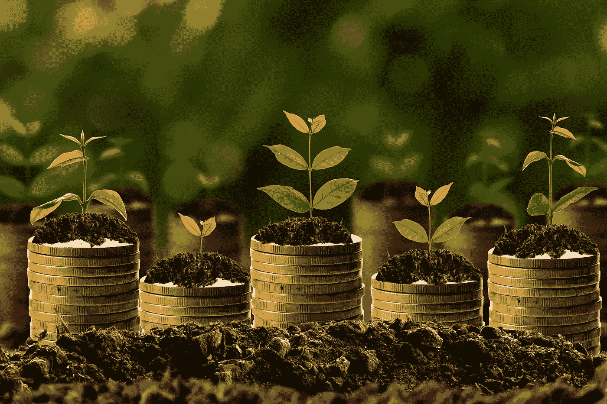
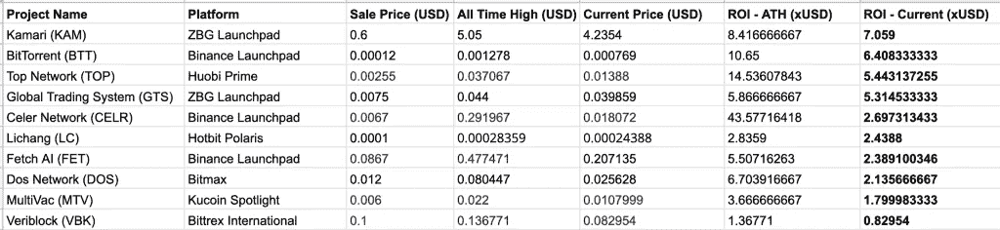
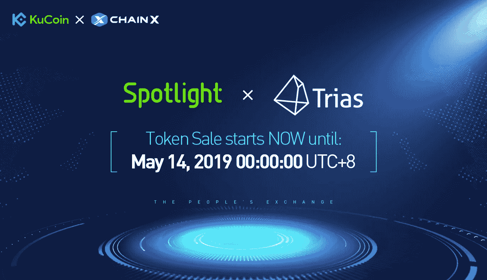
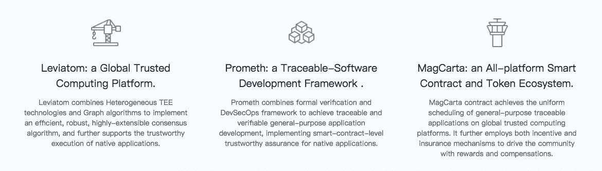
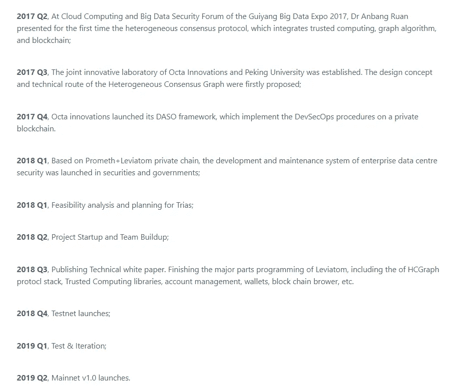
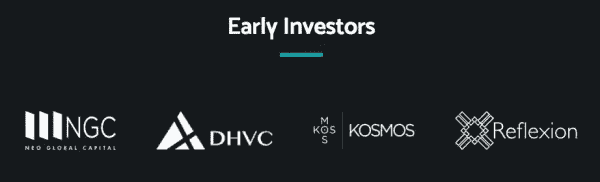
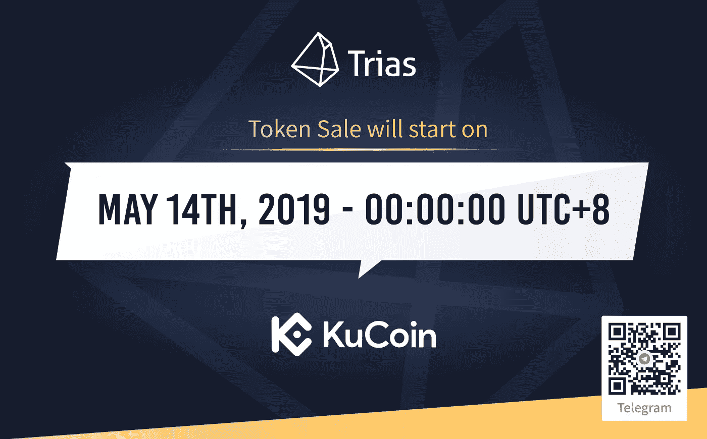

# KuCoin 推出其第二个聚光灯 IEO:评论

> 原文：<https://medium.com/hackernoon/kucoin-launches-its-second-spotlight-ieo-a-review-d6ad19f38066>

ieo 是一种新时尚。这并不是一个新概念，但却是目前市场上的热门趋势，大多数交易所都试图效仿。

除了一个重要的方面，ieo 几乎和 ico 一样。在 ICOs 中，一旦销售结束，购买的令牌将由各自的项目发送到用户钱包。没有具体的时间框架。它可能在一天或几个月内发生。但在 IEO 模式中，代币将由交易所进行销售，一旦销售结束，所有代币都将分发到您的交易所钱包中。这意味着投资者直接在交易所购买代币。

独立评价办公室的主要好处是多方面的。在 ICO 模型中，交易所上市永远不会得到保证。到目前为止，2018 年推出的近 80–90%的 ICO 项目尚未成功在交易所上市。这导致了投资者信心以及投资回报率的巨大损失。

另一个显著的优势是 IEOs 为项目提供了更值得信赖的声誉。没有一家交易所敢将一个有着阴暗背景的项目上市，因为这也会损害交易所的声誉。这有助于保护普通客户免受类似过去发生的可疑 ICO 的抢劫。

在过去的几个月里，我们已经看到了几个来自领先交易所的 IEO，甚至在最初的泵之后，IEO 的大部分股票都是绿色的。也有一些失败的商店，如 Veriblock，其价格低于 IEO 价格。

source:news.bitcoin.com

在我过去在 Hackernoon 发表的一篇文章中，我提到了 [Fetch。Al](https://hackernoon.com/ico-news-why-is-binance-betting-on-fetch-ai-51bf3f714d94) 由币安发射台发射。这篇文章在社区中获得了很高的读者群。因此，我试图涵盖更多的 IEO 将推出的库币聚光灯(库币交易所 IEO 平台)Trias(尝试)。

# 特里亚斯(试一试):下一个库科恩聚光灯下的 IEO。

总部位于北京的 Trias(可信可靠的智能自治系统)正试图建立一个可信、健壮和安全的平台，在这个平台上，任何系统和软件都只实现*预期的行为*。简而言之，在 Trias 中，任何用户都可以对机器产生信任，并坚定地保证机器只会“*做它们被告知要做的事情*”。

根据白皮书，

> *Trias 正在构建一个全平台支持的本地应用兼容智能合同执行平台、开发框架和协作生态系统*。

该平台基于三个子系统构建而成， **Levaitom** (将用于应用程序执行的计算平台) **Prometh** (负责确定软件功能和属性的框架)和 **MagCarta** (定义 dApp 共识策略的智能合约生态系统)。)

# 路标

他们所有的发展进度和路线图都在他们的[中型官方账号](/@Triaslab)中每周更新一次。到目前为止，根据更新，他们表现出良好的进展。

# 组

Trias 项目的最大优势之一是团队。Trias 由联合创始人阮安邦和担任首席执行官兼首席技术官的魏明领导。团队成员主要来自 Octa 创新有限公司，他们带来了正确的专业知识组合。

# 过去的投资者

关于这一点提供的信息很少。根据该网站，早期投资者包括 NGC、DHVC、KOSMOS 和 Reflexion。

# 令牌矩阵

*   令牌名称:Trias (TRY)
*   总代币供应量:10，000，000，000 TRY
*   初始流通供应量:代币供应量的 6.24%
*   私人销售分配:代币供应总量的 0%
*   种子销售分配:代币供应总量的 8%
*   种子销售代币价格:1 次= 0.004 美元(基于代币供应总量)
*   IEO 的报价是:1 块= 0.004 美元

# 象征性销售

根据 [Kucoin 公告](https://www.kucoin.com/news/en-announcement-of-trias-try-token-sale-on-kucoin-spotlight)，将以每*TRY*0.005 美元的价格向用户提供高达 4 亿 TRY。硬性上限定为 160 万美元，出售将遵循新的彩票格式。

用户可以根据交易量、Kucoin 奖金、KuCoin V2 应用程序和 KCS 持有量等各种参数从 [Kucoin](https://www.kucoin.com/) 获得彩票，每个帐户最多只能获得七张彩票。

每张中奖彩票将使我们能够购买价值 500 美元的固定份额。

# 提醒一句

作为一个散户投资者，如果你打算不参与 IEO 投资，小心最初的泵。从历史上看，价格在最初几个小时上涨，随后下降并降温。注意不要进入初泵而遭受损失。相反，等待时机，一旦价格稳定下来就进场。

**有关 Trias 的更多信息，请阅读:**

三人组:[https://www.trias.one/whitepaper](https://www.trias.one/whitepaper)

官网: [https://www.trias.one](https://www.trias.one/)

电报:[https://t.me/triaslab](https://t.me/triaslab)

推特:[https://twitter.com/triaslab](https://twitter.com/triaslab)

***免责声明*** *:本文不作为投资建议。你应该经常做自己的研究，明智地投资。我在 IEO 没有任何既得利益，也不会因为写这篇文章而得到任何形式的回报。*