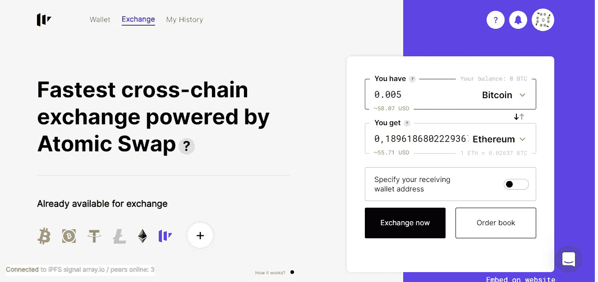
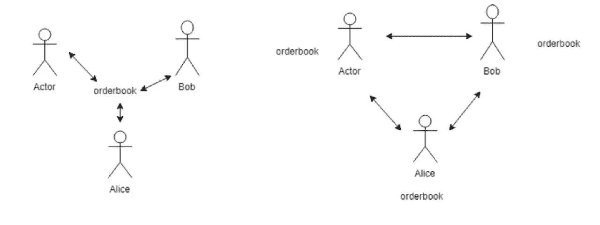

# KYC/反洗钱和隐藏集中化:基于 libp2p 的原子掉期交易协议

> 原文：<https://medium.com/hackernoon/kyc-aml-and-hidden-centralization-a-libp2p-based-atomic-swaps-exchange-protocol-93eec9a876ba>

Photo by [Yung Chang](https://unsplash.com/@yungnoma?utm_source=medium&utm_medium=referral) on [Unsplash](https://unsplash.com?utm_source=medium&utm_medium=referral)

匿名似乎是跨区块链交易所的圣杯。没有那么多用户愿意透露自己的身份，更不用说发送扫描的身份证复印件或收入证明了。

*因此，KYC 中立是去中心化多链钱包的必要条件。但监管机构仍有不同看法，这给市场参与者带来了一系列严峻挑战。*

**KYC vs 交易所:当错觉崩溃**

在这个领域，一些主要平台要么没有 KYC 限制，要么只有非常软的要求。在这方面，世界领先的币安交易所堪称典范。

多年来，他们一直是 KYC 中立项目的领导者之一，与 KuCoin，Mercatox 等一起。2019 年，游戏在 Q2 发生了变化。2019 年 2 月 22 日，金融行动特别工作组(FATF)，金融监督的顶级世界机构，发布了一份新的[建议清单](http://www.fatf-gafi.org/publications/fatfrecommendations/documents/regulation-virtual-assets-interpretive-note.html)。

> 信息是明确的:对加密交易的 KYC 检查必须像对传统金融机构的互动一样严格。

没多久就看到了结果:2019 年 3 月底，[宣布](https://www.coindesk.com/binance-tightens-compliance-turning-to-identitymind-for-kyc)币安将与尖端 KYC 提供商合作。在去年 4 月的交易所黑客攻击导致用户资金、API 数据以及 2FA 代码损失后，币安加快了 KYC 的实施。

因此，众所周知的币安不可知论不再存在:来自包括美国在内的 29 个国家的用户在币安 DEX 上被地理锁定。限制从 2019 年 7 月 1 日开始。币安首席执行官赵昌鹏[在推特上暗示](https://twitter.com/cz_binance/status/1135435526113091584)在限制实施后使用 VPN 进行交易。顺便说一句，那些一丝不苟的记者已经发现，使用 VPN[打破了](https://cointelegraph.com/news/binance-dex-navigating-country-specific-cryptocurrency-trading-restrictions)币安·德克斯·ToS。

不幸的是，这种方案(KYC 不可知服务在最新规定实施后应用更多检查)并不新鲜。同样的[发生在 5 月份的 Poloniex](https://cointelegraph.com/news/poloniex-stops-offering-nine-coins-in-us-due-to-uncertain-regulations)和 6 月份的 [Bittrex](https://bittrex.zendesk.com/hc/en-us/articles/360028996652) 身上。毫不夸张地说，在加密领域，这是 2019 年迄今为止最悲伤的故事——新的管辖区想法给团队和交易员带来了新的头痛。

**(德？)集中**

这与中央集权几乎是同一个故事。在很长一段时间里，IDEX 被认为是分散交易市场的领导者。一年前，在分析了 IDEX 智能合同，密码爱好者，[声明](/@bearle/why-idex-is-centralized-and-why-should-you-care-193180fc5a87)有一些集中化的迹象。

> 紧张局势进一步升级:2018 年夏天，Reddit 上有一场关于 IDEX(去)中央化性质的特殊[讨论](https://www.reddit.com/r/ethtrader/comments/8rpv5m/idex_is_not_actually_decentralized_more_like/)。

于是，2018 年 11 月 1 日，IDEX CEO Alex Wearn 发表了一篇长篇大论的[故事](/idex/pragmatic-decentralization-how-idex-will-approach-industry-regulations-8b109212128a)，讨论了‘对‘去中心化’一词的误解’、‘已知团队’作为中心化的点等等。明确表示:他的项目是集中的。

韦恩发明了“务实分权”这个术语，但有人感觉好点了吗？

这一讨论与加密货币的去中心化相关，特别是以太坊、EOS 等。最后一个问题要复杂得多:区块链的权力下放本身就提出了几个哲学难题。但似乎已经找到了一种完全分散的运作方式。

**基于无服务器 libp2p 的协议，作为跨链 KYC 不可知分散式交换的解决方案**

这种解决方案由即时非托管跨链交互(即所谓的原子交换)提供支持。

在第一次商业互换后的几个月，2017 年 11 月 22 日， [Alexander Noxon](https://twitter.com/noxonsu) ，一位拥有 16 年经验的 web 开发人员，DAO 的技术总监，制定并发布了一种算法，用于在使用令牌的去中心化应用程序中接收比特币。

这种算法允许使用 Bitcoin.js 软件库的应用程序使用 HTML 快速接收来自所有用户的比特币和菲亚特。这排除了中间人以及参与交易的各方相互欺骗的机会。

2018 年 7 月，BTC 联邦理工学院(ETH)推出了分散式跨链服务 [Swap.online](https://swap.online/) 。与 [USDT](/swaponline/atomic-swap-with-usdt-swap-online-solution-in-two-hundred-lines-of-code-c2ddb7b8886a) 和 [EOS](https://www.reddit.com/r/eos/comments/9b11vn/swaponline_performed_the_very_first_atomic_swap/) 的首次原子互换于 2018 年 9 月呈现。

*Simple Swap.online BTC ⇔ ETH exchange interface*

那么，这个协议如何在不违反法律的情况下避免 KYC 呢？

该协议不在服务器上存储用户订单。每个用户存储他或她的订单，并通过 libp2p pubsub 网络直接发送给其他用户，该网络的工作方式类似于 IRC(互联网中继聊天)——一种用于实时消息传递的应用程序级协议。

*Figure 1: How the CEXs process orders. Figure 2: How the Swap.online processesorders.*

如何创建订单？

1.通过界面，用户选择一双进行交换，并表明他想要出售的数量(该数量应该在他/她的钱包上)。

2.用户的浏览器根据该协议创建一条消息，用用户的私钥(用于识别)对其进行签名，然后将其发送到 libp2p pubsub 网络

3.其他用户的浏览器收到消息，并将订单添加到他们的本地订单簿副本中。

4.如果有人决定执行这个命令，他会将消息直接发送给命令的创建者

这项任务需要一个简单的、抗故障的、无中心的信息传递系统。分析了很多解决方案，但唯一有效的是 **ipfs 公共订阅**。以前 ipfs 中使用的是一个中央公共信号服务器，但现在正在开发一个零审查、防攻击的工具。

绝对适合所述任务的是[gossipsub](https://github.com/libp2p/specs/tree/master/pubsub/gossipsub)([https://github . com/libp2p/specs/tree/master/pubsub/gossipsub](https://github.com/libp2p/specs/tree/master/pubsub/gossipsub))。

因此，禁用主域不会停止交易。libp2p pubsub 的使用允许在没有第三方参与的情况下组织用户的非托管交互。

***既得利益:本文作者是 Swap.online 首席分析师***