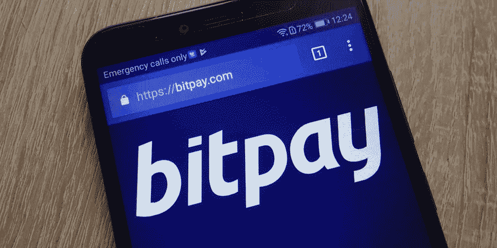

# KYC 并没有损害加密行业——它实际上做了完全相反的事情

> 原文：<https://medium.com/hackernoon/kyc-does-not-harm-the-crypto-industry-it-actually-does-the-complete-opposite-fa0ce9c2704c>

## KYC(了解你的客户)绝不是加密领域的敌人。事实上，如果目标是让加密货币在世界舞台上受到重视，这是非常必要的。

Image source | Shutterstock

当加密货币处于起步阶段时，它几乎是一个完全不受监管的行业。很少有措施来检查谁在交易什么，他们拥有多少特定的加密货币，或者他们是否可以被认为是值得信赖的。

虽然这在今天听起来有些鲁莽，但许多人认为这是加密货币的整体优势。有人甚至声称匿名是这个行业的一个必要方面，就像去中心化一样。

然而，这个想法完全准确吗？

KYC(了解你的客户)绝不是加密领域的敌人。如果我们的目标是让加密货币在世界舞台上受到重视，这是非常必要的。

**KYC 让加密货币更便于使用**

许多加密用户可能永远不会遇到 KYC 障碍，这取决于他们做了什么。例如，只在中央交易所外交易硬币的人可能永远不需要申报身份。

KYC 真正要做的是在买卖双方之间建立一定程度的信任。它帮助企业主与他们的客户建立关系。没有 KYC，卖家对谁是他们的客户一无所知，这意味着他们无法保护自己免受恶意活动的侵害。

支付商 BitPay 似乎在这方面有所作为。在[接受其*合规团队*](https://blog.bitpay.com/is-it-safe-to-accept-bitcoin/) 采访时，他们解释了 KYC 和 AML(反洗钱)工具的重要性:

> “在我们的平台上注册新业务之前，我们希望确保我们已经识别并验证了他们的业务。这样做的原因不是因为监管机构告诉我们这样做，而是因为我们希望确保不让犯罪分子进入我们的平台。通过识别企业并确保我们完全了解他们的业务模式，我们可以确保我们签约的企业是合法的，他们提供的产品或服务符合我们的使用条款。”

BitPay 无疑不是唯一分享这种情绪的加密货币相关业务。Gemini 加密交易所因其严密的金融监控计划而受到称赞，该计划用于:

> “建立…健全的内部政策、程序和控制措施，打击任何将 Gemini 用于非法目的的企图，旨在确保我们的客户受到消费者保护法的基本保护。”

币安和火币网等其他交易所已经聘请了来自 IdentityMind 的外部帮助来满足其 KYC 和反洗钱需求，identity mind 是一家致力于提供监控加密货币用户工具的公司。在一篇[文章](https://identitymindglobal.com/blog/case-management-and-queue-management/)中，该组织解释说，他们*“帮助公司减少客户入职欺诈和交易欺诈，并改善反洗钱合规、制裁筛选和 KYC 合规”*

BitPay hasn’t shied away from compliance | Image source Shutterstock

**KYC 和分权**

加密用户中有一个常见的误解，即当使用 KYC 度量时，分散性会减弱，但这是不准确的。

虽然 KYC 工具通常由集中式组织构建和使用，但在加密方面，它们正被应用于分散式生态系统。谁在监视区块链并不重要；仅仅是监测的行为不会突然使生态系统集中化。

> 事实上，KYC 和反洗钱可以在大多数区块链进行的原因之一主要是因为这些区块链是分散和开放的。

也许 KYC 做的最值得注意的事情是为密码行业提供了一些急需的成熟。事实上，有跟踪用户和交易的系统，这意味着它现在可以作为法定现金的合法和专业的替代品，因为它可以防止犯罪行为的发生。

> 由于这个原因，几乎可以肯定的是，随着 crypto 在未来几年的发展，这些监管工具也将发展壮大，从而让这个行业在公众的视野中蓬勃发展。