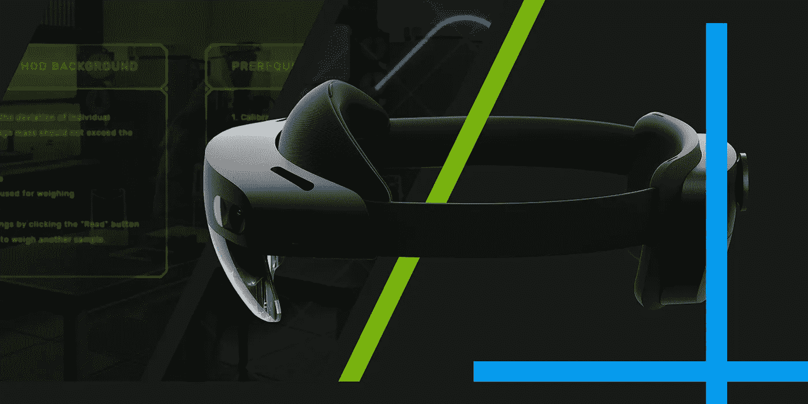
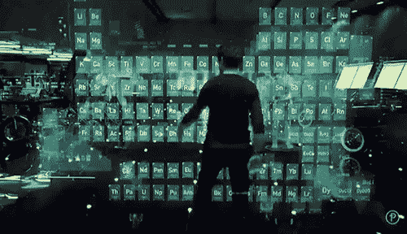

# 实验室技术、现代科学和在混合现实中工作

> 原文：<https://medium.com/hackernoon/labtech-modern-science-and-working-in-mixed-reality-eb25305f7b2e>

[holo4labs.com](http://holo4labs.com/) may revolutionize how labs work.

几十年来，为现实世界提供数字体验一直是人类的梦想。随着[技术](https://hackernoon.com/tagged/technology)的进步，这个梦想变成了我们的[现实](https://hackernoon.com/tagged/reality)。

只用声音和手势控制数字环境的可能性几乎是托尼·斯塔克式的体验。说真的，这多酷啊？

一些创新，如语音命令，已经出现了一段时间。举例来说，这让我们有时间习惯让 Siri 为我们预订机票。或者告诉 Alexa 订购你一直渴望阅读的新电子书。

但是，虽然语音助手改变了我们使用手机的方式，但像微软 HoloLens 这样的设备让人们能够像以前一样方便地在工作中使用电脑——生产工人。

这种情况即将改变。

未来的工作场所给每个员工他们需要的信息，就在他们眼前。这个未来比我们想象的要近。

# 混合现实——有什么好大惊小怪的？

虚拟和增强现实无需介绍。然而，混合现实这个术语甚至让一些科技记者感到困惑。

对于一些人来说，这只是另一种称之为增强现实的奇特方式，而对于另一些人来说，这是融合物理和虚拟世界的又一步，因此需要一个新的术语。

对于那些认为 MR 应该单独处理的人来说，AR 就像是显示在物理对象之上的数字叠加。你可以与它互动，但它远非完美。

然而，混合现实增加了语义理解，使软件能够区分物体、人类或你的手，因此你可以使用越来越直观的手势来控制数字环境。

# **改变实验室的工作方式**

改变人们的工作方式，让他们的日常任务更简单、更安全，是我特别喜欢微软 HoloLens 2 这样的设备的地方。

这个雷德蒙巨人直言不讳地说:

> HoloLens 2 不是消费品。其目的是[改变现代工作场所](https://news.microsoft.com/en-gb/features/the-power-of-mixed-reality-in-the-modern-workplace/)。

这项技术的一个可能实现是使实验室现代化。Holo4Labs 是一款即将改变科学研究方式的软件。这一点尤其重要，因为迄今为止科学给我们带来了繁荣、健康与和平，你不同意吗？

运行在微软 HoloLens 2 上的 Holo4Labs 是一款与赛默飞世尔 LIMS SampleManager 连接的软件。

Holo4Labs 由 SoftwareHut IT 公司开发，由 ExtraHut、UX 和数字工作室设计。得益于 Solution4Labs 在数百个实验室中实施 LIMS 的经验，它非常适合实验室环境。

只需使用手势和语音命令，科学家就可以检查样品，获取所需数据，并上传至 SampleManager。然后，可以在系统中轻松访问数据，以进行进一步分析。

通过 Holo4Labs，科学家可以专注于他们的研究，遵循 HoloLens 上显示的一步一步的过程。

# **还有什么会改变？**

混合现实及其在现代工作场所中的应用前景非常广阔。有了 HoloLens，工业、物流和医学已经能够从访问虚拟数据层来工作和协作的能力中受益。

实验室和制药是下一个目标，因为像 Holo4Labs 这样的解决方案很快就会出现，而且更加普遍。

今天代表着 LabTech 系统化和无纸化的未来。并且是[**holo 4 labs**](http://holo4labs.com/)**授予实验室社区的一个。**