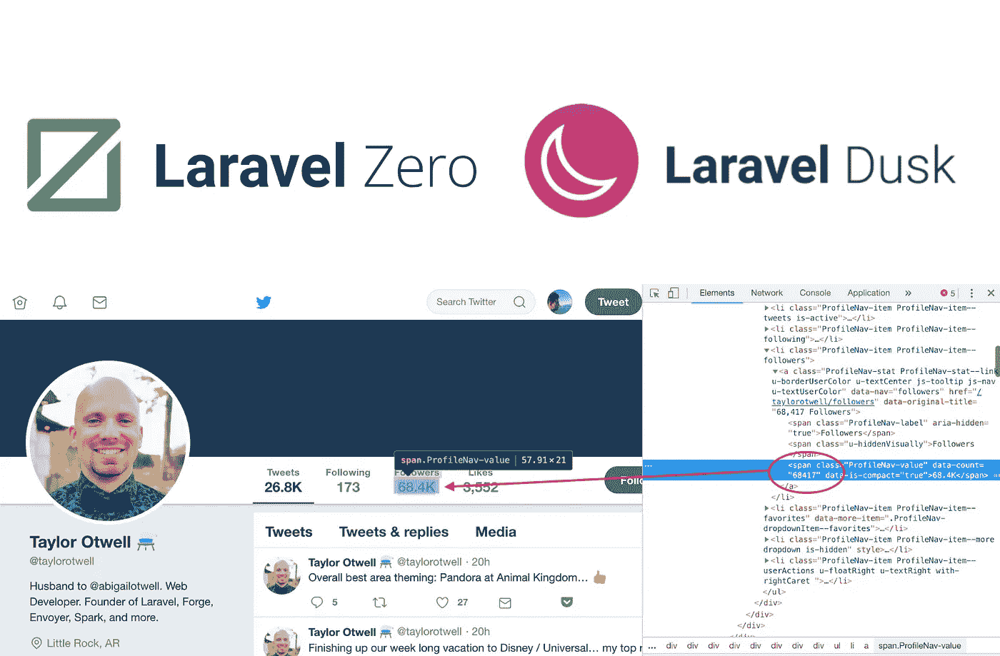
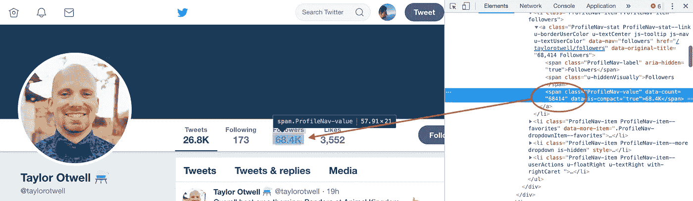
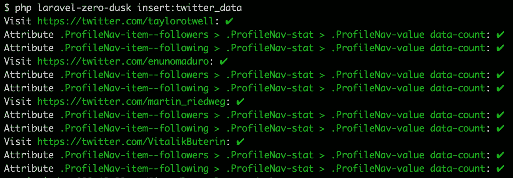

# 结合 Laravel Zero 和 Laravel Dusk 来跟踪#CryptoTwitter 趋势

> 原文：<https://medium.com/hackernoon/laravel-zero-dusk-tracking-twitter-accounts-1100cab8f112>



我一直在寻找一个小的应用想法来最终测试 [Laravel Zero](https://laravel-zero.com) 。
我决定创造一些东西来跟踪加密货币 Twitter 账户，并检测趋势(并在 [Cryptalert](https://cryptalert.com) 上提供关于这些数据的警报)。

因此，我们将创建一个 Laravel Zero 应用程序，并集成 [/laravel-console-dusk](https://github.com/nunomaduro/laravel-console-dusk.) ，这是 Laravel Zero 的定制版本 [Laravel Dusk](https://laravel.com/docs/5.7/dusk) ，以便轻松跟踪 twitter 帐户的演变。

## 什么是 Laravel Zero？

Laravel Zero 由 Nuno Maduro 创建并维护，它是一个微框架，为您的控制台应用程序提供了一个优雅的起点。它是 Laravel 的非官方定制版本，为构建命令行应用程序而优化。

## 什么是拉勒维尔黄昏？

Laravel Dusk 是一款强大的浏览器自动化工具。有了 Dusk，你可以通过编程测试你自己的应用程序，或者使用 Chrome 浏览器访问互联网上的任何网站。Dusk 可以帮助你自动完成重复的任务，或者从其他网站收集信息。

*注意:我在 2018 年 11 月* [*阿尔戈利亚*](https://algolia.com) *的一次聚会上发现了努诺的工作，他为拉勒维尔社区做了一件不可思议的工作，跟随他来到这里:*[*https://twitter.com/enunomaduro*](https://twitter.com/enunomaduro)

# 安装 Laravel Zero 和 Dusk

让我们按照文档开始安装 Laravel Zero:【https://laravel-zero.com/docs/installation/ 

```
composer create-project — prefer-dist laravel-zero/laravel-zero laravel-zero-dusk
```

然后安装 Laravel Dusk:

```
cd laravel-zero-duskphp laravel-zero-dusk app:install console-dusk
```

我们将把我们的数据存储在一个数据库中，在 Laravel Zero 中，Laravel 的雄辩组件是一个附加组件。我们可以这样安装它:

```
php laravel-zero-dusk app:install database
```

*记得在 config/database.php 文件中更改数据库的凭证。*

# 数据库的准备

我们将创建两个表来存储我们的数据:

*   **twitter_account** :保存我们想要跟踪统计数据的账户句柄
*   **twitter_account_data** :保存 twitter_account 表的账户统计

因此，我们创建了两个迁移:

```
php laravel-zero-dusk make:migration twitter_account_table
```

有了这个内容:

并且:

```
php laravel-zero-dusk make:migration twitter_account_data_table
```

有了这个内容:

然后，我们创建一个播种器，将第一个帐户添加到 **twitter_account** 表中:

```
php laravel-zero-dusk make:seeder TwitterAccountSeeder
```

有了这个内容:

我们运行我们的播种机:

```
php laravel-zero-dusk db:seed --class=TwitterAccountSeeder
```

这里我们只是在 twitter_account 表中添加了 4 个 twitter 句柄。你可以用基本的 SQL 请求或者 https://github.com/intonate/tinker-zero 的[](https://github.com/intonate/tinker-zero)**(一个允许在*[*Laravel Zero*](http://laravel-zero.com/)*应用中使用*[*Laravel/tinker*](https://github.com/laravel/tinker)*的桥)来做到这一点。**

# *创建将在数据库中存储 twitter 指标的命令*

*Laravel Zero 中的命令解释如下:[https://laravel-zero.com/docs/commands/](https://laravel-zero.com/docs/commands/)*

*这与拉勒维尔的命令非常相似:[https://laravel.com/docs/5.7/artisan#writing-commands](https://laravel.com/docs/5.7/artisan#writing-commands)*

*创建一个名为 GetTwitterData 的新命令:*

```
*php laravel-zero-dusk make:command GetTwitterData*
```

*以下是该命令的代码(参见下面的详细信息):*

*那我们在这里做什么？*

*   *第 35 行:我们正在获取存储在 twitter_account 表中的每个句柄，如果您创建并运行与我相同的 Seeder，您应该会得到 4 个句柄( [@taylorotwell](https://twitter.com/taylorotwell) 、[@ ennomadoru](https://twitter.com/enunomaduro)、 [@martin_riedweg](https://twitter.com/martin_riedweg) 和 [@VitalikButerin](https://twitter.com/VitalikButerin) )*
*   *第 37 行:对于每个句柄，我们转到相应的帐户页面，例如泰勒特威尔的[https://twitter.com/taylorotwell](https://twitter.com/taylorotwell)*
*   *第 44 和 47 行:我们使用 CSS 选择器检索关注者和关注者的数量:[https://laravel . com/docs/master/dusk #与元素交互](https://laravel.com/docs/master/dusk#interacting-with-elements)*

**

*The exact value is in the **data-count** attribute*

*   *第 50 到 57 行:我们将数据存储在我们的 **twitter_account_data** 表中*

*我们只需要测试我们的命令:*

```
*php laravel-zero-dusk insert:twitter_data*
```

*如果一切顺利，您应该会在控制台中看到以下内容:*

**

*Console output*

*您可以使用 Cron:[https://laravel-zero.com/docs/task-scheduling/](https://laravel-zero.com/docs/task-scheduling/)轻松地自动化这个命令*

*在 GetTwitterData 命令的代码中，我有:*

```
***public function** schedule(Schedule $schedule)
{
     $schedule->command(**static**::*class*)->everyThirtyMinutes();
}*
```

*所以我的命令将每 30 分钟运行一次✌🏻*

*代码可以在这里找到:[https://github.com/MartinRdw/laravel-zero-dusk](https://github.com/MartinRdw/laravel-zero-dusk)*

*欢迎在评论区问我你的问题/错误报告🙂*