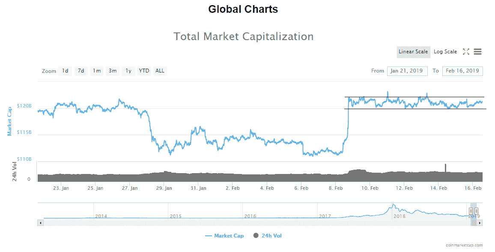
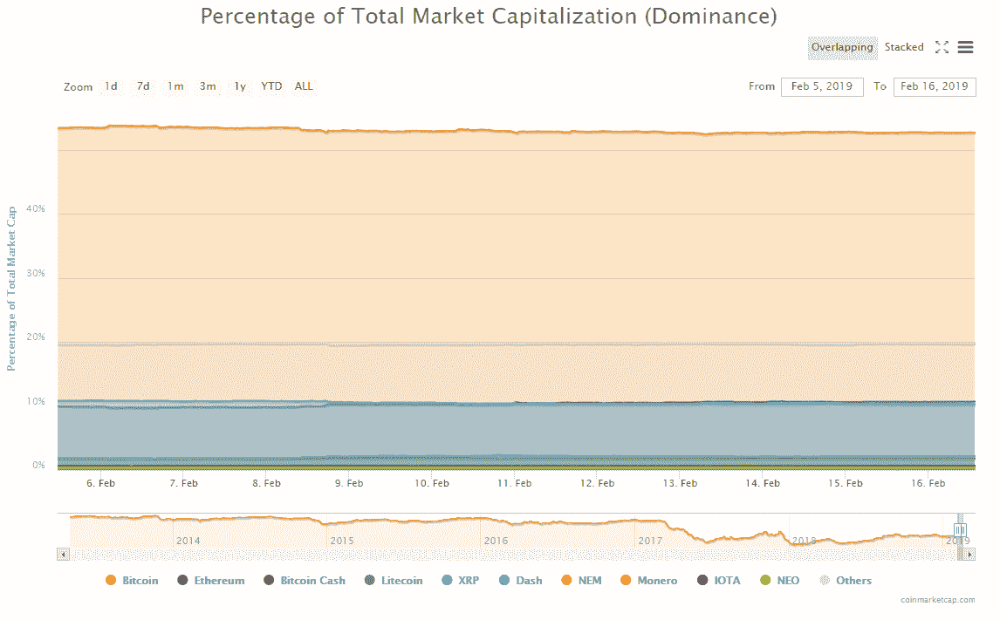
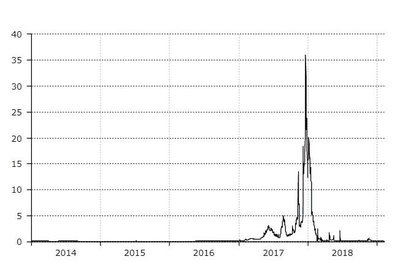

# 上周在加密:牛市的新迹象？

> 原文：<https://medium.com/hackernoon/last-week-in-crypto-a-new-sign-of-bull-run-1f9b275da4eb>

> *这项分析是代表* [*PrimeXBT*](https://primexbt.com) *完成的，它提供高达 100 倍的 BTC/美元杠杆交易和 5 种其他流行的加密对，因此如果你正在寻找底部并在即将到来的时期利用你的多头头寸，请查看* [*网站*](https://primexbt.com) *并注册一个帐户。*

# 市值:

*   $121,161,519,167
*   24 小时成交量:19180751188 美元
*   BTC 优势:52.7%

从周一 11 日开始，加密货币市场的评估在最高点达到 123，118，696，977 美元，这是下方全球图表上通道阻力的第一个峰值，评估一直在横向移动。

正如你从全球图表中看到的，评估一直停留在 122-120 美元水平之间的水平范围内，这是上一个范围的支撑区，现在是阻力区，这就是为什么评估一直停留在这里，很难向上移动。

由于上周五市场评估呈抛物线上升，起初我认为这是一个趋势延续的再追踪，但由于评估并没有在回调后立即开始向上移动，而是在过去 7 天继续横向移动，这个范围可以被解释为买方和卖方都在巩固的停滞。

这种整合很快就会结束，但突破方向仍未出现。如果上周五的走势背后的动力仍然存在，我们将看到上行的延续，但如果买家因为这种停滞而退出，我们可能会看到直接的下跌。

今天市场是绿色的，因为评估从昨天开始增加，当时与渠道支撑线进行了另一次互动，目前处于上升轨道，但由于增加很小，平均变化百分比是微不足道的。

今天最大的赢家是两位数的，如赫萝增长了 10.76%，MOAC 增长了 11.68%，aelf 增长了 12.1%

比特币的市场主导地位也一直停滞不前，自本周初以来一直徘徊在 52.8%左右。

# 新闻

从全球图表来看，从周一开始，没有任何重大消息推动市场的评估。然而，本周有一些重要的头条新闻。

第一个重要的标题来自区块链研究公司 Diar 在周一 11 日发布的文章

**比特币交易费降至 2014 年水平**

>尽管比特币月度总交易量高于 2018 年大部分时间，但中值费用也处于 2015 年以来的最高水平。

(来源:Diar)

这只能说明领先的加密货币及其网络“幕后”发生了什么。

与此同时，根据 Cointelegraph 的报道，以太坊的采矿奖励处于有史以来的最低水平。该报告指出:

> 2 月 10 日，新创建了 13，370 个 ETH，低于 2018 年 12 月的 2 万多个，以及 2015 年 7 月 30 日报告的 3.9 万多个的历史高点。

这种下降背后的原因是新开采的 ETH 明显是由以太坊开采难度的突然增加引起的，这是 Etherscan 数据在 2 月 10 日揭示的

虽然我们正在谈论采矿这个话题，但一个值得一提的标题是关于 NVIDIA 的年度财务报告，其中指出该公司已设法将其收入增加了 21%，但这一增长是“由游戏、数据中心、专业可视化和汽车产品的空前高销售额推动的。”，而不是显卡销量。该公司报告称，与 2017 年同季度相比，去年第四季度的收入下降了 24%。

其中两个标题吸引了绝望欢呼的奔牛者的大量注意力，并在整个加密货币领域引起反响。

**两家美国养老金领投摩根克里克新区块链基金 4000 万美元**

> Morgan Creek Digital 于去年 8 月推出了其数字资产指数基金，并从费尔法克斯县退休系统的三个福利计划中的两个计划中获得了资金。

这个标题引起了很多关注，因为它听起来像是养老基金将获得比特币的敞口，但正如进一步所述，据报道，名为“mor gan Creek block chain Opportunities Fund”的新风险投资基金专注于投资数字资产*行业*，这并不意味着这些基金不一定会用于直接投资特定的加密货币，然而，随着主流社会开始参与进来，这种隐约可见的兴趣看起来很有希望。

第二个也是本周最受关注的标题与之前所说的一致

**摩根大通将推出“JPM 币”，使用加密技术加快结算速度**

> 据《美国消费者新闻与商业频道》2 月 14 日报道，美国银行业巨头摩根大通(JPM)将在美国银行业率先推出自己的加密货币。

这被认为是一个重大事件，因为围绕它的许多炒作要么是积极的——被那些将此解释为采纳迹象的人，要么是消极的——被批评者认为是虚伪的，并试图操纵摩根大通董事长兼首席执行官杰米·戴蒙之前抨击比特币称其为欺诈的市场情绪。

这个标题也在 Ripple 持有者中引起了很大的反弹，因为 JPM 硬币的使用案例与 Ripple 的独特价值主张相似，即国际银行结算与 SWIFT 系统竞争。

最后一个可以归入采用类别的标题是，纳斯达克将推出两个跟踪加密货币价格的新指数——比特币流动指数(BLX)和以太坊流动指数(ELX)

这些指数将为使用纳斯达克全球指数数据服务(GIDS)的客户提供每隔 30 秒的实时价格更新，是美国区块链和加密资产市场数据公司 Brave New Coin 的产品。