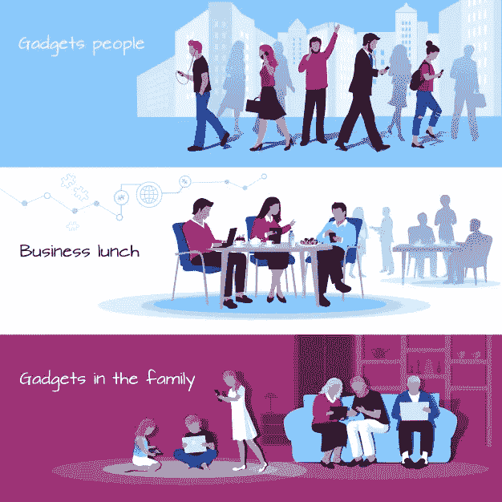

# 塑造应用行业的最新移动应用开发趋势

> 原文：<https://medium.com/hackernoon/latest-mobile-app-development-trends-shaping-the-app-industry-1f471b7fbe1d>

移动应用程序开发行业是增长最快的行业之一，并且没有放缓的迹象。随着 5G 网络的测试计划在全球范围内开始，随着对[雇佣程序员](https://www.valuecoders.com/hire-developers)的需求不断上升，以及更多的企业寻找[定制软件开发公司](https://www.valuecoders.com/custom-software-development-services-company)来构建有竞争力的移动应用，范围只会扩大。

如今，移动应用是一种文化，我们都已经习惯了，因为它们作为基于位置的应用而存在，习惯了它们在增强和虚拟现实领域的发展。

由于移动应用程序的巨大普及性和实用性，它们为企业家和企业提供了重要的机会。根据 Statista 的数据，到 2020 年，移动应用程序预计将产生 1889 亿美元的全球收入。即使是现在，公司也非常热衷于移动应用程序的定制软件开发。

在这篇博客中，我将讨论一些正在塑造应用程序行业的主要移动应用程序开发趋势。

# **以下是列表:**

## **1)手机钱包**

Ethereum has the second-highest market valuation behind the original cryptocurrency Bitcoin, so it is no surprise that loads of people have become interested in investing and trading [Ethereum Wallets](https://www.valuecoders.com/hire-developers/hire-ethereum-developer).

对移动钱包的需求日益增长。事实上，应用程序开发者正在特别关注安全功能，因此移动钱包的使用将在 2019 年增加。

如今，用户大多更喜欢顺畅交易的无摩擦支付方式，他们喜欢在自己的应用程序中看到这一功能。因此，支付网关集成以及移动钱包为您提供了最高级别的安全加密，这已成为所有此类应用的主流。

**优点:**

->高度安全的手机钱包

->手机钱包用户的最大数量

->非接触式支付

## **2)可穿戴设备**

在过去的几个月里，可穿戴设备行业的市场经历了快速而大幅的增长。

 [## 2016-2022 年全球可穿戴设备收入|统计

### 该统计数据显示了 2016 年至 2022 年全球可穿戴设备的收入。可穿戴设备销售收入…

www.statista.com](https://www.statista.com/statistics/610447/wearable-device-revenue-worldwide/) 

> **据 statista.com**，**预计到 2019 年底，可穿戴设备的价值将达到约 330 亿美元。**

因此，可穿戴市场的未来是巨大的，这些将变得像智能手机这个词一样多余。如今，任何便携式设备的主控制面板都是智能手机。这意味着便携设备必须配对，并且必须关闭。

但是，据 UNA 的联合创始人 Ryan Craycraft 称，在不久的将来，智能手机将不再是主要的枢纽。事实上，便携式应用程序的开发将更普遍地直接连接到网络，甚至可能连接到人体。

“Wearable gadgets are everywhere”

**优势:**

->对可穿戴手表而非传统手表的需求增加

-> [这股潮流号称 2019 年健身潮流第一名](https://www.nbcnews.com/better/pop-culture/top-2019-fitness-trends-how-incorporate-them-your-workouts-ncna952441)

## **3)智能物体**

IOT 是智能物体或智能事物中的一个隐藏概念。基本上，它是一个物理对象的网络，集成了传感器、电子元件和软件，所有这些都在网络本身内相互连接。

比如博世、霍尼韦尔、三星、小米，还有其他很多已经占有很大市场份额的大品牌。最近物联网应用开发的一些趋势包括 Kisi 智能锁、Nest 智能家居、Google Home 等。

总的来说，物联网被认为是移动应用开发领域的创新技术之一。事实上，[全球物联网市场预计到 2020 年将产生 13.35 亿美元的收入。](https://www.forbes.com/sites/louiscolumbus/2017/12/10/2017-roundup-of-internet-of-things-forecasts/#8ebd08e1480e)

**优点:**

->自动驾驶汽车

->现代医疗保健应用

->智能家居和智能区域

->路由器配备了更多的安全

## **4)区块链技术**

从现在起，[区块链应用程序开发](https://www.valuecoders.com/blockchain-development-company)在 IT 领域开启了一个充满新的激动人心的机遇的世界。2018 年，我们都见证了区块链在加密货币和智能合约创造中的应用。然而，在现实中，区块链比你想象的更有用。

例如，通过使用区块链，可以开发分散的移动应用程序。去中心化的移动应用或 DApp 基本上是一个不仅不归任何人所有，而且也不可能关闭它并且没有宕机的应用。

简单地说，区块链有望通过使移动应用去中心化而在移动应用行业做出更大贡献，就像比特币区块链对金钱所做的那样。

**优点:**

-> BAAS(区块链即服务)

->游戏和加密空间

->资产令牌化

->在加密货币交易所交易

## **5)点播应用**

按需应用是当前商业世界最成功的商业模式。这是科技世界的未来。2019 年几乎所有行业都在实施这种商业模式。截至目前，42%的成年人至少使用过一次点播服务。当然，没有证据表明这种需求趋势会很快消失。

总的来说，应用程序按需开发的趋势将会持续下去，不适应这种趋势的企业肯定会被他们的竞争压垮。

**优点:**

->非常注重 B2B

->按需应用被所有行业所接受

## **6)艾&毫升**

人工智能和机器学习都深化了移动应用市场。AI 在很大程度上以聊天机器人的形式表现出来，而 Siri，机器学习和人工智能的结合，现在是移动应用创新的一个非常重要的部分，现在已经不能分离。

2019 年，人工智能和机器学习的力量将不仅限于聊天机器人和 Siri。许多组织已经开始采用这些技术，以各种方式提高盈利能力并降低运营费用。

 [## IDC.com 国际数据中心目录

### IDC 通过设备、应用、网络和服务来研究消费市场，为以下领域提供完整的解决方案

www.idc.com](https://www.idc.com/research/viewtoc.jsp?containerId=US41866016) 

> **根据 IDC 的报告，超过 75%使用 ERP 解决方案的员工现在将利用人工智能的能力来扩展他们在工作场所的能力。**

这表明，不仅 AI 和机器学习在今天的移动应用中有着深厚的根基，而且在未来也有着重要的创新机会。

**优点:**

->自动机器学习

->支持人工智能的芯片

->神经网络之间的互操作性

-> AIOps(人工智能自动化开发操作系统)

## **7)AR/VR 时代**

[Augmented Reality Developers](https://www.valuecoders.com/hire-developers/hire-augmented-reality-developers) work like this to make everything real looking.

毫无疑问，AR/VR 都是当前公司之间移动应用开发的酷技术。而且，它们的使用案例不再仅限于游戏应用。科技巨头已经为这两者创新了大量新的用例。例如，谷歌和苹果正在他们的最新设备上推出新的 AR 演示，这证明了 AR / VR 将在不久的将来改变游戏。

事实上，还预测这些技术将在品牌的社交平台上看到，以及通过 AR / VR 应用程序“超越屏幕”为潜在客户看到。

例如，Instagram 和 Snapchat 已经推出了他们的 AR 滤镜，可以将一张人脸变成几个有趣的数字角色。

**优点:**

->医疗保健领域的 AR

->移动增强现实颠覆

->营销和广告中的 AR/VR

->制造业中的 AR/VR

## **8)移动云计算**

这是移动应用的未来。云是当今移动应用程序开发的奢侈选择，它将不再是这样。世界已经开始意识到云提供的好处和可能性。

例如，降低托管成本、提高负载能力和优化业务运营只是云提供的一些好处。如今，有许多与安全相关的问题在云的帮助下得以解决，这使得移动应用程序开发更加安全、快速和可靠。

此外，在 Dropbox、AWS、SlideRocket 等云技术的帮助下，现在可以开发直接在云中运行的强大应用程序。这意味着我们还应该期待更多这种类型的应用程序推出，在 2019 年要求智能手机的最小存储空间。

**优点:**

->混合云应用解决方案

->量子计算

->云服务和解决方案

## **9)信标**

信标不再是一个新的创新。现在有几个行业，比如医疗、博物馆、酒店等。在他们的应用中使用信标技术。

许多企业主认为，可以肯定地说，信标技术已变得更容易为普通用户所理解。但是，2019 年他们的用例不会仅限于这些。信标的容量比这大得多。

例如，信标与零售业的物联网相结合，可以帮助用户获得有价值的销售信息，以及他们可以在附近找到的其他正在进行的促销活动。

**优点:**

->支持人工智能的芯片

->移动支付信标

->烽火寻宝

->自动机器学习

## **结论:**

到目前为止，我认为跟上最新的趋势和技术是跟上客户不断变化的需求以及任何业务竞争的关键。我希望通过这篇博客，我已经分享了许多关于 2019 年移动应用程序发展趋势的信息。

如果我碰巧落下了什么东西，请在下面的评论区告诉我们。此外，虽然很难确定所有这些移动应用程序发展趋势对您的业务的确切好处。