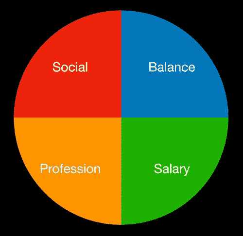
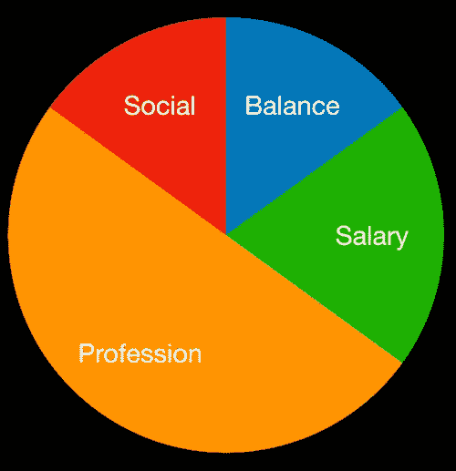

# 领导力黑客:快乐高效团队的披萨模型

> 原文：<https://medium.com/hackernoon/leadership-hack-the-pizza-model-for-happy-and-productive-teams-5708ca3e3ca7>

Photo by [Miguel Andrade](https://unsplash.com/@sr_taquito?utm_source=medium&utm_medium=referral) on [Unsplash](https://unsplash.com?utm_source=medium&utm_medium=referral)

我在一家软件公司担任经理的第一年非常具有挑战性。那一年，我不仅直接管理六个人，而且其中三个人决定辞职。

人们很容易认为他们都是因为我而离开的，但事实并非如此。事实是，他们每个人都告诉我:

> “你是一个伟大的经理，你不是我离开的原因”

第一个队员走的时候，那句话是对我的褒奖。这是因为我们关系很好，我知道在我成为他的经理之前，他就在考虑离开。所以这完全不是我的错。
他离开的原因是因为他没有太多机会创造影响力，而且他通常会得到非常简单的任务，这些任务不属于公司的核心产品。

当第二个团队成员离开时，就更难找到其他人来责怪了。我从我的经理和团队成员那里得到的反馈与人们离开我的团队的现实之间存在脱节。

第三个队员走了，对肚子是一个沉重的打击。没有办法解释为什么三名队员离开了团队，而这与我无关。几天来，我的同事们试图帮助我，给我一些建议，但他们没有适合我的管理类型的实际答案。

这么多的想法开始出现在我的脑海里，我不停地对自己说:

> “我是不是像他们告诉我的那样是个好经理？”
> “我在拼图中遗漏了什么？”
> “也许我不适合管理职位？”

# 自我完善的征服

就在周末假期开始的时候，我发现自己采取了积极主动的行动来提高自己的技能，从阅读有关管理的书籍开始。虽然我真的很有动力开始阅读它们，但我开始忽视一本书又一本书，因为它们倾向于展示高层次的情况，而没有深入细节。

我觉得这是探索我的团队、我自己和工作场所之间的关系以找到实际答案的恰当时机。几个月前，我开始阅读心理学，探索人性，也做了自己的研究，寻找人们辞职的主要原因，之后我的管理观念发生了变化。突然，获得如此多的数据增强了我的信心，使我产生了**的概念，这是为快乐和高效的团队成员设计的披萨模型**。

自从 2015 年勾勒出这个模型以来，我能够提高我的管理能力，并与我钦佩的高效和满意的团队成员一起取得更好的结果。

如果你想成为一名更好的经理，尝试使用比萨饼模式。你很有可能会发现它很有用。

# 模型

披萨模型可以分为四个不同的部分，分别代表员工需求的四个不同方面。

H&P team member pizza slices — aspire for 4/4

## 社交生活:

员工的社交方面在他们的满意度中起着很大的作用。我们应该让人们喜欢周一早上和同事一起工作，可以从每周一起做一些有趣的事情开始。我们还想确保与我们的团队一起吃早餐或午餐。下班后出去喝一杯啤酒或演奏一种乐器将是一种常态。我们应该了解每个成员的兴趣，创造合适的氛围，在我们的团队中实现真正的友谊。

## 平衡:

工作狂不持久！作为经理，我们需要确保我们的员工有一个良好的工作生活平衡**。他们应该享受自己的周末，花时间和家人在一起，并在公司目标的同时追寻自己的梦想。鼓励他们在自己的爱好上投入时间。如果他们没有这样做，问问他们生活中有什么困扰他们，做一个好的倾听者。**

## **薪资和福利:**

**工作理念的一部分是为你对工作场所的贡献获得报酬。**

**虽然有些人对自己的工作有所贡献感到满意，但我们所有人都受到工资和工作场所给我们的额外福利的激励。**

**有很多方法可以补偿我们的员工。作为经理，我们应该提前知道我们的员工对他们的收入感到满意。有些人要求更高的周薪，有些人则希望得到公司股票。
当我们无法以加薪或股票期权的形式获得想要的金钱补偿时，我们需要更有创造力。例如，给努力工作的员工两张电影票。你会看到对他们动力的直接影响。**

****

**Photo by [JESHOOTS.COM](https://unsplash.com/@jeshoots?utm_source=medium&utm_medium=referral) on [Unsplash](https://unsplash.com?utm_source=medium&utm_medium=referral)**

## **职业:**

> **“疯狂就是一遍又一遍地做同样的事情，却期待不同的结果”阿尔伯特·爱因斯坦**

**了解团队成员的技能，了解是什么给了他们动力，并确保向他们展示专业的自我提升愿景。也就是说，每个团队成员都应该围绕既能激励自己又能为公司的成功做出贡献的主题设定目标。如果他的日常工作包含越来越多的舒适和已知的任务，他的动力就会减少。**

**我们生活在一个(害怕错过)的世界里，这意味着如果我们的员工一遍又一遍地做同样的事情，这将导致他们对在其他地方能学到什么产生负面的想法。**

# **将披萨模型投入使用**

**每个人都有不同的动机量表，快乐团队成员的比萨饼切片可能因团队成员而异。例如，你可以在下面看到我为我以前的一个团队成员画的模型:**

****

**example for an individual happy team member**

**我可能会花上几个小时试图与首席财务官谈论增加他的薪水，确保他有一个良好的工作生活平衡，等等…**

**如果我不创造一个让他学习新技能的环境，这些都不重要。我的工作是把他和公司里更有经验的人联系起来，同时给他更多的时间自学。我们一起庆祝小小的胜利，这样他就能真切地感受到，每天他都在学习新的东西，获得更多的知识。这是他的主要动机。**

# **我如何烘烤我的比萨饼**

**在当今的敏捷世界中，我使用这个模型的方式是创建一个适合我的每个员工的年度披萨托盘。**

**请注意，就像我们的环境一样，人们不断地改变自己和他们的优先事项，不时浇头和他们的百分比也会相应地改变。**

**如果你处于领导地位，希望你的所有团队成员都对披萨模型的各个方面感到满意。我和我的团队正在根据这个模型制定年度目标。
询问他们:**

> **"从 1 到 10 分，你起床去工作有多开心？"**

**如果答案是 8 或以下，一起找出差距，用相关的浇头填满披萨。**

**我想和我的朋友们分享我的感激之情，他们给了我关于这篇文章的持续反馈，特别是 [tomerpacific](https://medium.com/u/e97020a2a53f?source=post_page-----5708ca3e3ca7--------------------------------) ，没有你们的指导和你们推动完成它，比萨饼模型可能永远不会出版。**