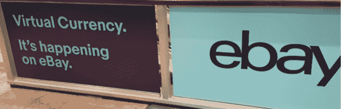
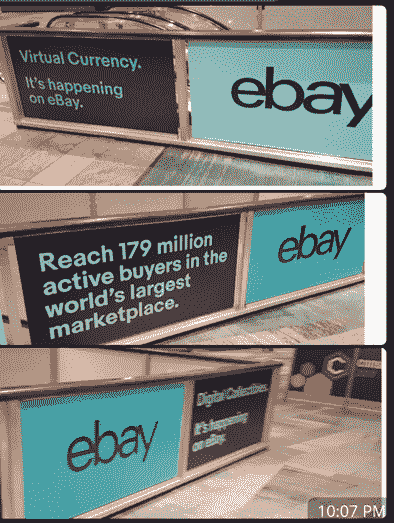

# 从 Consensus 2019 泄露:猜测 Ebay 将很快支持加密货币

> 原文：<https://medium.com/hackernoon/leaked-from-consensus-2019-speculation-that-ebay-will-soon-support-cryptocurrencies-fc22f1d04b80>

在说服主流巨头接受加密货币并公开支持区块链方面，一直存在争议。这场斗争似乎正转向区块链世界的胜利。在最近的一篇文章中，我公布了一份 2019 年与区块链合作的企业名单，名单上有近 1000 家公司。看看你最喜欢的公司是否在那里！

但现在，通过纽约 Consensus 2019 分享的一些照片，Ebay 似乎正在寻求区块链行业内的合作伙伴关系，并在整个活动中特别提到了他们广泛的“1.79 亿买家客户群”和付费广告中的“数字收藏品”。

Source: @ImNotTheWolf — [https://twitter.com/mappopk_crypto/status/1127835349256769537](https://twitter.com/mappopk_crypto/status/1127835349256769537)

Ebay 是 Consensus 2019 的[赞助商之一，加入了其他公司，如:塔塔、德勤、IBM、微软、澳大利亚联邦政府、花旗、AWS 和埃森哲。这表明了组成万亿美元企业集团的许多商业巨头对整个区块链工业的明确支持。](https://www.coindesk.com/events/consensus-2019/sponsors)

Paypal 采取了略有不同的方法，称他们对加密货币的兴趣不如对区块链技术的兴趣大。

这些传言虽然未经证实，但确实符合今年的普遍情绪，其他公司和政府非常积极地支持区块链并与之合作。

> aelf 旨在通过他们的新平台进一步推进区块链的采用，使企业能够轻松构建定制的区块链，只需要很少的时间和资源。看看他们的[企业 Beta 0.7.0 发布](https://twitter.com/aelfblockchain/status/1123259836555075584)