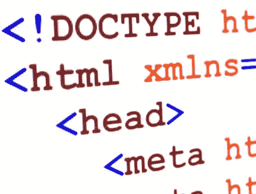
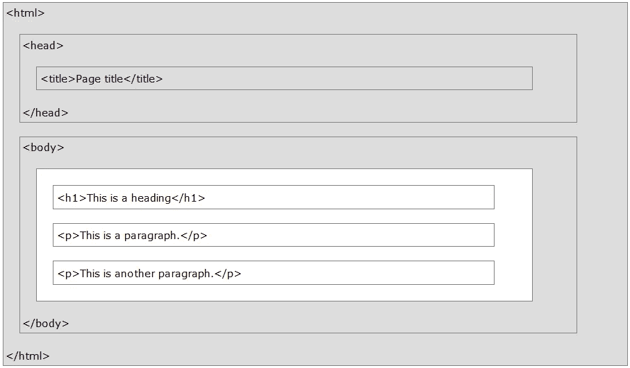
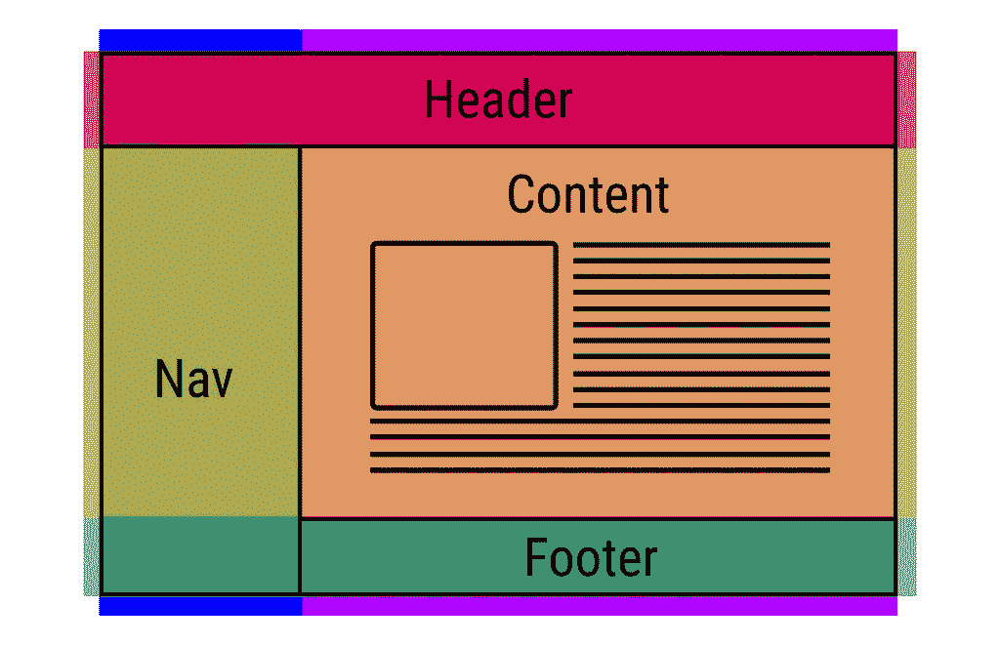
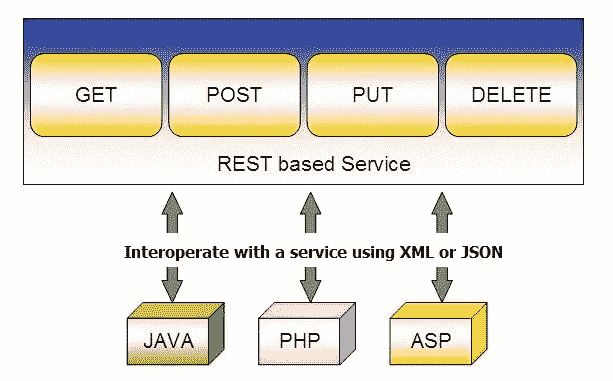

# 学习基本的 HTML

> 原文：<https://medium.com/hackernoon/learn-basic-html-be230361457>

## HTML 是创建网页的语言，而 [HTML 元素](https://www.developermate.com/HTML/elements)实际上是用来构建页面的模块。学基础成为前端专业。

*(本文最初发布于***)**

*HTML 代表超文本标记语言。第一个网页发布于 1990 年，页面仅用于演示。今天，网络是我们日常生活中非常重要的一部分。你可以使用许多不同的网络浏览器来浏览网页，比如:谷歌浏览器、Opera、Internet Explorer 和 Firefox。*

**

*HTML 页面结构*

*理解 HTML 页面结构很重要。*

*`[<head>](https://www.developermate.com/HTML/head)`[用于标题和元标签。](https://www.developermate.com/HTML/head)网络浏览器仅显示`<body>`部分(白色区域)内的内容。*

**

# ***HTML 标签***

*HTML 标签是用尖括号括起来的元素名。*

*HTML 标签通常是成对的，像`<table>`和`</table>.`*

*当你写结束标签的时候记得使用一个正斜杠。*

# *HTML 属性*

*[HTML 属性用来修改 HTML 元素的值。](https://www.developermate.com/HTML/attributes)元素通常会有多个属性。*

****<标记名 attributename = " setting ">html 元素的内容…</标记名>****

*[HTML](https://www.developermate.com/HTML/id)`[<id>](https://www.developermate.com/HTML/id)`[属性为 HTML 元素定义了一个唯一的 id。id 在 HTML 文档中必须是唯一的。](https://www.developermate.com/HTML/id)*

*您可以使用`<id>`来选择 HTML 元素，然后您可以使用 CSS 和 JavaScript 来读取或操作该元素。*

*HTML 积木*

*[HTML 元素也可以称为构建块。](https://www.developermate.com/HTML/building-blocks)这些元素用于构建一个 HTML 页面。元素由开始和结束标签组成，我们在这些标签之间放置文本或图形内容。*

# *HTML 块级元素*

*块级元素总是从新行开始。这种类型的元素也总是占据页面上可用的全部宽度。这意味着它尽可能向左延伸，尽可能向右延伸。*

# *HTML 内联元素*

*与块级元素不同，内联元素不从新行开始。此外，它不会占据整个宽度，而是占据所需的宽度。*

# *空的 HTML 元素*

*也有没有内容的 HTML 元素，这些被称为空元素。一个经常使用的空元素是元素` `。这是一个没有内容的空项目。*

# *小写还是大写？*

*虽然在编写 HTML 时使用大写字母作为标签和属性并没有错，而且实际上是完全有效的，但是约定总是使用小写字母。这是出于历史原因，可以追溯到 XHTML 时代，那时的对话非常严格，大写字母是无效的。*

# *HTML 标题*

*[HTML](https://www.developermate.com/HTML/headings)`[<h1>](https://www.developermate.com/HTML/headings)`[–](https://www.developermate.com/HTML/headings)`[<h6>](https://www.developermate.com/HTML/headings)`[元素代表六个独立级别的节标题。](https://www.developermate.com/HTML/headings)最高段为`<h1>`级，最低段为`<h6>`。你也可以说`<h1>`的重要性最高，而`<h6>`的重要性最低。*

*标题不仅对改变页面的外观很重要。当谈到搜索引擎如何工作时，标题也很重要。为了索引网页的结构和内容，搜索引擎使用标题。*

*用户经常通过阅读标题来快速浏览你的页面。使用标题来查看文档结构很重要。*

# *HTML 段落*

*元素定义了一个段落。*

*段落标签在文本的上方和下方放置一个空行。*

# *HTML 链接*

*[HTML 链接用于页面之间的相互链接。](https://www.developermate.com/HTML/links) HTML 链接也叫超链接。一个网站由几个页面组成，你应该把这些页面链接在一起。链接使用户可以轻松地在您的网站页面之间导航，甚至导航到其他网站。*

# *HTML 表格*

*[元素 HTML](https://www.developermate.com/HTML/tables) `[<table>](https://www.developermate.com/HTML/tables)` [用于表示表格数据。](https://www.developermate.com/HTML/tables)表格数据是我们可以用二维表格呈现的信息。这种表格由包含数据的单元格的若干行和若干列组成。*

*[在 HTML 中有三种不同的方式来定义信息列表。](https://www.developermate.com/HTML/lists)所有现有列表必须包含至少一个列表元素，但也可以包含多个列表元素。*

# *HTML 格式文本*

*为了能够[格式化文本元素](https://www.developermate.com/HTML/quotations)，最好[熟悉在 HTML 和 XHTML 中设置文本格式的可用选项。](https://www.developermate.com/HTML/formatting)
[格式化元素被设计用来显示各种类型的文本。](https://www.developermate.com/HTML/formatting)*

*[在记录计算机代码开发和用户交互时，计算机短语元素非常有用。](https://www.developermate.com/HTML/computer-code)这是通过区分源代码`<code>`、变量`<var>`、用户输入`<kbd>`和终端或其他类似输出`<samp>`来完成的。*

# *保留字符*

*以&号开始，以分号结束的一段文本(字符串)；)称为 HTML 实体。这些主要用于显示保留字符。否则，这些文本将被解释为 HTML 代码和不可见字符。如果您希望书写难以在常规键盘上输入的字符，这也很有用。*

*[有些字符是特殊的，保留给 HTML 使用。这意味着这些字符将被浏览器解析为 HTML 代码。例如，当代码中使用了小于号(<)时，浏览器会将后面的文本解释为标签。](http://Some characters are special and reserved for use in HTML. That means that these characters will be parsed as HTML code by the browser. So when for example the less-than (<) sign is used in the code your browser will interpret the text that follows as a tag.)*

# *HTML 注释*

*[注释是被浏览器忽略的代码部分。](https://www.developermate.com/HTML/comments)为了向看到代码的其他人解释和定义文档的节部分，向 HTML 代码添加注释是一个好的做法。尤其是在复杂的文档中。为了增加代码的可读性，帮助他人理解代码，注释是非常有用的。*

*放置在这些`<! - ... ->`标签之间的文本和内容被当作注释处理，将被浏览器完全忽略。*

*HTML 布局*

*[当你开发一个网页时，考虑布局和页面应该是什么样子是非常重要的。](https://www.developermate.com/HTML/layout)这对整个用户体验和页面的用户友好性都很重要。*

*如今，使用诸如 [CSS](https://www.developermate.com/HTML/styles) 、 [JavaScript](https://www.developermate.com/Javascript/home) 和 Angular 等现代技术来构建页面已经很常见，也非常值得推荐。但是也可以只用 HTML[创建页面。](https://www.developermate.com/Html/home)*

**

# *HTML Iframes*

*[HTML 内嵌框架元素](https://www.developermate.com/HTML/iframes) `[<iframe>](https://www.developermate.com/HTML/iframes)` [，将另一个 HTML 页面嵌入当前页面。](https://www.developermate.com/HTML/iframes)`<iframe>`可以出现在 HTML 文档的任何地方。`<iframe>`可以有单独的滚动条和边框。*

# *HTML 图像*

*[web 的童年，只有文字，没有图片。](https://www.developermate.com/HTML/images)幸运的是，没过多久我们就有机会嵌入图片和其他有趣类型的内容。图像不仅好看，而且对于在你的网页上简单地描述复杂的概念也很重要。*

# *HTML 颜色*

*[使用定义的颜色名称关键字或 RGB、HEX、HSL、RGBA、HSLA 值来指定 HTML 颜色。色调是颜色的另一种说法。](https://www.developermate.com/HTML/colors)*

*[例如，绿色具有十六进制颜色代码#00FF00，也就是 RGB(0，255，0)，即“0”红色、“255”绿色和“0”蓝色。](https://www.developermate.com/HTML/color-names) [色码可以用来改变网页上文本和背景的颜色。](https://www.developermate.com/Honneybagblog/2019-04-15/ultimate-guide-html-colors)*

# *HTML 颜色名称*

*[颜色名称关键字是不区分大小写的标识符，可用来代替 RGB、HEX 等，颜色名称代表特定的颜色，如绿色/绿色、蓝色/蓝色、黄色/黄色或 lightseagreen/LightSeaGreen。](https://www.developermate.com/HTML/color-names)*

# *HTML 类*

*[使用 HTML](https://www.developermate.com/HTML/classes) `[class](https://www.developermate.com/HTML/classes)` [属性为网页中的一个或多个元素定义相同的样式。](https://www.developermate.com/HTML/classes)所有具有相同`class` name 属性的 HTML 元素将获得相同的样式和格式。*

*使用 inline style 为每个元素指定相同的样式既困难又耗时。HTML 类是构建有吸引力的网站时经常使用的属性。这些课程将帮助你花更少的时间写作和担心像字体和颜色这样的风格。*

# *HTML 样式*

*`[<style>](https://www.developermate.com/HTML/styles)`[-元素包含了关于文档或者文档的一部分的样式信息。](https://www.developermate.com/HTML/styles)在`<style>`-元素中，您可以找到应用于内容的 CSS。
`<Style>`-元素可以放在文档的`<head>`或`<body>`中，但通常建议将样式放在`<head>`中。更好的方法是将样式放在外部样式表中，并用`<link>`元素引用它们。*

*当几个`<style>`和`<link>`元素包含在您的文档中时，它们将按照包含在文档中的顺序应用于 DOM。*

# *HTML 文件路径*

*[文件路径指定文件的位置。](https://www.developermate.com/HTML/file-paths)文件路径类似于文件的地址，它帮助网络浏览器找到文件。文件路径用于链接外部文件，如图像、视频、样式表、 [JavaScript](https://www.developermate.com/HTML/JavaScript) ，显示其他网页等。*

*有两种类型的文件路径:绝对文件路径和相对文件路径。*

*HTML 表格*

*[HTML](https://www.developermate.com/HTML/forms)`[<form>](https://www.developermate.com/HTML/forms)`[元素用于收集用户输入并将其发送回服务器。](https://www.developermate.com/HTML/forms)*

*`<form>`是一个块级元素，它定义了网页的交互部分。`<form>`中的所有控件都将被回发到服务器。*

# *HTML 表单元素*

*[HTML 元素定义了 HTML 页面的不同部分。](https://www.developermate.com/HTML/form-elements)一个 HTML 元素由一个开始标签定义，通常它有一个结束标签。大多数 HTML 元素在开始标记和结束标记之间都有内容。*

*`**<tagname>Element content...</tagname>**`*

# *HTML 输入类型*

*[在 HTML 中，最强大和复杂的元素之一是](https://www.developermate.com/HTML/input-attributes) `[<Input>](https://www.developermate.com/HTML/input-attributes)` [元素。](https://www.developermate.com/HTML/input-attributes)原因是输入类型和属性的大量组合。不管是什么类型，所有的`<input>`-元素都基于 HTMLInputElement 接口，这意味着它们共享完全相同的属性集。尽管如此，并不是所有的属性都适用于所有的输入类型，有些输入类型只支持其中的一些属性。*

*[HTML](https://www.developermate.com/HTML/input-types)`[<input>](https://www.developermate.com/HTML/input-types)`[元素用于为基于 web 的表单创建交互控件。](https://www.developermate.com/HTML/input-types)这些用于接受来自用户的数据。对于许多不同类型的设备，有许多不同类型的输入数据和控件。*

# *HTML URL 编码*

*`[URL Encoding](https://www.developermate.com/HTML/url-encode)` [是将一个字符串转换成可以在互联网上传输的有效格式的过程。](https://www.developermate.com/HTML/url-encode)URL 必须使用 ASCII 字符集。ASCII 集之外的字符必须进行转换，以便能够在互联网上传输。*

*`URL encoding`将非 ASCII 字符替换为后跟十六进制数字的“%”，您也可以使用术语“百分比编码”来进行此过程。*

# *Rest 服务的 HTML 方法*

*有许多可用的 HTTP 方法。你有没有想过`GET`和`POST`的请求有什么区别？什么时候应该用`PUT`和`DELETE`？*

*继续阅读，对 RESTful 服务和不同的 HTTP 方法(也称为 HTTP 动词)有一个基本的了解。使用这些 API 时，理解 HTTP 方法非常重要。*

**

*大多数 REST 服务都是基于 CRUD 的。CRUD 模式基于 HTTP 协议。CRUD 服务支持方法`POST`、`GET`、`PUT`和`DELETE`。*

# *HTTP GET 方法*

*`GET`请求是最广泛使用的 HTTP 方法。GET 方法用于从服务器检索数据。例如，假设您有一个带有`/cars`端点的 API。向该端点发出 GET 请求应该会返回所有可用汽车的列表。*

*由于 GET 请求只请求数据，不修改任何资源，所以它被认为是一种安全的方法。*

# *HTTP POST 方法*

*`POST`请求用于向服务器发送数据以创建资源。发送的数据存储在 HTTP 请求的请求体中。*

*最简单的例子就是网站上的联系方式。当您在表单中填写输入内容并点击 *Send* 时，数据将被放入请求的响应主体并发送到服务器。这可能是 JSON、XML 或查询参数(还有很多其他格式，但这些是最常见的)。*

# *HTTP PUT 方法*

*`PUT`请求用于向服务器发送数据，它用于更新资源。多次调用同一个 PUT 请求总是会产生相同的结果。相反，重复调用 POST 请求会产生多次创建相同资源的副作用。*

# *HTTP 删除方法*

*方法将删除一个资源。这个方法是 RESTful APIs 中比较常见的方法之一，所以了解它的工作原理是很有好处的。*

*如果用对`/cars`的 POST 请求创建了一辆新车，并且可以用对`/cars/{{id}}`的`GET`请求检索它，那么对`/cars/{{id}}`发出`DELETE`请求将会完全删除那辆车。*

# *HTML HTTP 状态代码*

*[REST API 使用 HTTP 响应消息中的 HTTP 状态代码来通知客户端它们对服务器的请求。](https://www.developermate.com/HTML/http-status-codes)*

*状态代码的第一个数字指定了五个标准响应类别之一。*

*如您所见，HTML 页面有许多部分您应该掌握。设定你的目标并使用可用的工具，如[www.developermate.com](http://www.developermate.com)和[伟大的 coderunner 工具](https://www.developermate.com/editor/coderunner.asp?content=defaultexample.html)。*

*快乐编码。*