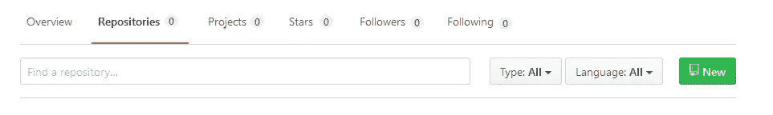
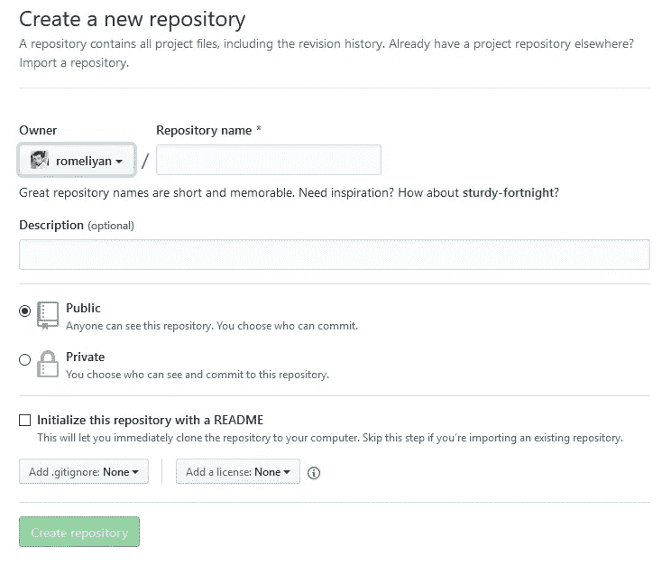
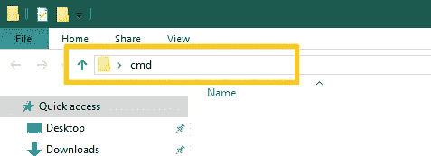
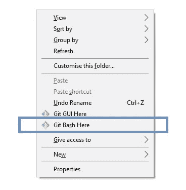

# 在不到 10 分钟的时间里学习版本控制和 Git 命令的基础知识。

> 原文：<https://medium.com/hackernoon/learn-basics-of-version-control-git-commands-in-less-than-10-minutes-9769d3147410>


Introduction to Version Control & Git Commands

# 什么是版本控制？🤔

> "管理同一信息单元的多次修订."

版本控制是管理对源代码的更改。这些更改由修订号标识。每个修订都有其时间戳以及负责更改的人员。

修订版可以恢复、比较和管理。

# 为什么要使用版本控制？

*   更轻松的备份和集中式源代码存储库。
*   轻松协作开发。
*   对文件所做更改的概述。
*   门禁。
*   解决冲突。

# 术语

**存储库** —保存所有文件的中心位置。

**主干**——也称主枝。大多数过时的代码(生产代码)被放在这里。

**阶段** —标记文件以跟踪变更。

**提交** —创建对文件所做更改的快照。

**分支**——在给定点获取的主分支的副本。

**检出** —标记/解锁文件进行更改。

**合并** —将分支合并在一起以更新主分支。

**合并冲突** —干扰其他变更的变更。

# 最佳实践

当进行版本控制时，为了获得最佳结果，应该遵循一些最佳实践。版本控制的一些主要最佳实践如下:

*   使用源代码控制系统。
*   始终确保拥有该文件的最新版本。
*   只检查你需要的。
*   每天至少将代码与开发分支合并一次。
*   始终确保代码按预期运行，并且不会导致任何其他代码中断。
*   合并时遵循正式的审查流程。

# 版本控制系统

有许多版本控制系统。一些流行的版本控制系统有:

*   饭桶
*   水银的
*   CVS
*   SVN/颠覆


figure: 1.1-Git

Git 是最流行的版本控制系统。

它是一个分布式版本控制系统，允许客户获得源代码的完整克隆。

在发生灾难的情况下，可以从客户端恢复完整的源代码以及所有历史记录。

它也是免费和开源的。

它可以包含多个分支和标签。(功能分支，角色分支)。

与其他系统相比，它的速度更快，因为它工作在 Linux 内核上，并且是用 c 语言编写的。它还支持多种协议，如 HTTP 和 SSH。

# 基本 Git 命令

**git init** —初始化本地 git 存储库。

**git 克隆** —将存储库克隆到新目录中。

**git add** —将特定文件添加到索引中。

git 添加。 —将文件添加到索引中。

**git 推送** —推送至远程存储库。

**git pull** —从远程存储库获取最新信息。

**git 状态** —检查工作树的状态。

**git commit -m** **' *您的提交消息* '** —提交对文件所做的更改。

现在我们知道了什么是版本控制，什么是 git，以及它的基本术语，让我们看看如何在 Git 下放置一个文件。

# 创建一个 GitHub 帐户。

如果您没有 GitHub 帐户，您可以在这里创建一个新的 GitHub 帐户[。](https://github.com/)

# 在你的机器上安装 Git。

***如果你用的是 Mac…***

您可以在终端中输入以下命令。

```
git --version
```

如果您的机器上已经安装了 Git，它会显示您安装了哪个版本的 Git。如果你还没有安装 Git，它会在你的机器上安装 Git。

***如果你在 Linux 上…***

您可以在终端中输入以下命令。

```
sudo apt install git-all
```

***如果你在 Windows 上…***

你可以从[这里](https://git-scm.com/)下载 Git 的最新版本并安装到你的机器上。它将安装一个名为 Git Bash 的应用程序，这是一个用于 Microsoft Windows 环境的应用程序，为 Git 命令行体验提供了一个仿真层。


figure: 2.1-Git Bash

# 配置您的 Git 用户名和电子邮件地址。

作为下一步，您必须配置您的用户名和电子邮件地址。这些详细信息将与您创建的任何提交相关联。要配置您的用户名和电子邮件，请在终端上输入以下命令，用您的姓名和电子邮件地址替换 romesh 的姓名和电子邮件地址。(如果您在 windows 上，请在 GitBash 上输入命令)

```
git config --global user.email "romesh@gmail.com"git config --global user.name "romesh"
```

# 在 GitHub 上创建一个资源库。

这可以通过登录你的 GitHub 账户并选择如图 3.1 所示的新建按钮来完成



figure: 3.1-New Button which used to create a Repository

这将引导您进入存储库创建页面。在这里，您可以指定您的名称、描述、存储库类型和其他要求。



figure: 3.2-Create a new Repository

# 找到要放置 git 的文件夹。

可以通过多种方式定位文件夹。您可以使用终端中的“ *cd* ”命令来定位特定的文件夹，如下所示:

```
cd Desktop/NewFolder/NewGitFolder
```

或者，如果您使用的是 Windows，您可以转到特定的文件夹，在路径选项卡上键入“ *cmd* ”，然后按回车键。



figure: 3.3-Inside NewGitFolder

或者你可以转到特定的文件夹，右键选择“ *git bash here* ”选项。



figure:3.4-Inside NewGitFolder

# 初始化 Git。

找到文件夹后，您必须在提示的命令行或 git bash 窗口中使用以下命令初始化 Git 。

```
git init
```

# 将文件添加到临时区域。

现在，您可以在此位置创建或更改您的项目。更改之后，您必须将特定的文件添加到提交的暂存区域。使用以下命令:

```
#to add a specific file
git add <fileName.extension>#to add all the files in the local repository
git add .
```

# 检查状态。

在提交之前，我们可以通过在 cmd 或 git bash 中输入以下命令来检查暂存了哪些文件。

```
git status
```

它将列出所有要提交的新文件或修改过的文件。如果它显示了新的或修改过的文件，您应该提交那些您添加到存储库中的更改。

# 提交更改。

```
git commit -m "initial commit"
```

“”中的消息是为了让其他用户可以看到您所做的更改。此外，如果您想取消对刚才所做的的修改，您可以使用下面的命令，并取消您刚刚添加的文件。

```
git reset HEAD~1
```

# 添加远程原点并推送。

现在，每次你在文件中进行更改并保存时，它不会在 GitHub 上自动更新。因此，要更新对主文件的更改:

```
git remote add origin <remoteRepository_url>
git remote -v
git push -u origin master
```

现在“ *git push* ”命令将本地存储库中的更改推送到您指定为源的远程存储库中。

*瞧。您刚刚将文件添加到 GitHub* 上的新存储库中。🤗

但是，你是如何在 GitHub 上下载和使用存储库的呢？🤔

# 克隆 Git 存储库。

在这种情况下，首先您必须找到要克隆存储库的目录。然后复制您想要的特定存储库的链接，并在 cmd 或 git bash 中输入以下命令。

```
git clone <remoteRepository_url>
```

# Git 拉。

如果两个或更多的开发人员在一个项目上合作，所有的用户都在同一个项目上工作。每当您做出更改并将其推送到主存储库中时，其他人必须提取您所推的更改。这意味着您必须确保所有人都在相同/最新版本的 git 存储库上工作。

```
git pull
```

这就是版本控制和 Git 的介绍。😎

感谢阅读。❤️

如果你对这篇文章有任何疑问，欢迎在评论区发表评论，或者通过 [Twitter](https://twitter.com/romeliyan) 联系我。