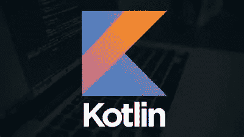
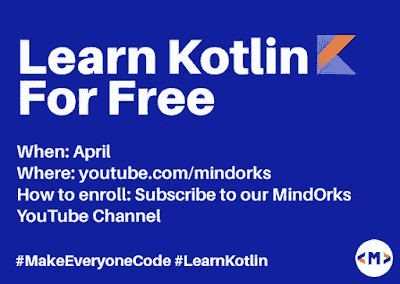

# 免费学习科特林

> 原文：<https://medium.com/hackernoon/learn-kotlin-for-free-3ee37125ff4>

Kotlin 是一种静态类型的编程语言，运行在 Java 虚拟机上，也可以编译成 JavaScript 源代码或使用 LLVM 编译器基础设施。它的主要开发来自俄罗斯圣彼得堡的一个 JetBrains 程序员团队。

从 2017 年开始，Kotlin 被添加为 android 应用开发的语言。与 Java 相比，它的简单性使之成为可能。Kotlin 有许多增强 android 应用程序开发的特性，这在早期的 Java 中是很困难的。

*   简洁:大幅减少样板代码的数量。
*   安全:避免整类错误，比如空指针异常。
*   互操作性:利用 JVM、Android 和浏览器的现有库。
*   工具友好:从命令行选择任何 Java IDE 或构建。

Kotlin 可以用在许多软件开发环境中，

*   智能理念
*   安卓工作室
*   黯然失色
*   编译器和更多

Kotlin 被认为是 JVM、Android、浏览器、Native 等的编程语言。Kotlin 的最大优势之一是，它可以与现有的 Java 代码一起使用。也就是说，您不必再次重写整个代码。您可以使用 Java 从离开的地方继续使用 Kotlin。

Kotlin 被设计为完全与 Java 互操作，其标准库的 JVM 版本依赖于 Java 类库，但类型推断允许其语法更加简洁。Kotlin 主要针对 JVM，但也编译成 JavaScript 或本机代码(通过 LLVM)。科特林由 JetBrains 和谷歌通过科特林基金会赞助。

Kotlin 由 Google 官方支持，用于 Android 上的移动开发。自 2017 年 10 月 Android Studio 3.0 发布以来，Kotlin 作为标准 Java 编译器的替代产品被包括在内。Android Kotlin 编译器允许用户选择 Java 6 或 Java 8 兼容的字节码。

# 学习科特林

网上网下都有很多学习科特林的资源。下面列出了其中的四种。

# 1)乌达城-科特林训练营

它为程序员提供了为期 1-2 周的训练营，涵盖了 kotlin 的基础知识。在此访问— [训练营](https://in.udacity.com/course/kotlin-bootcamp-for-programmers--ud9011)

# 2)面向 Android 程序员的 Kotlin

本课程也由 Udacity 提供。这是一个为期一周的中级课程，涵盖了 android 应用程序开发的基础知识。在这里访问课程[科特林课程](https://in.udacity.com/course/kotlin-for-android-developers--ud888)

# 3)minworks

Mindorks 是印度最大的 android 教学平台之一，旨在培养一批有价值的 android 开发者。他们有两个训练营，一个是为初学者准备的，另一个是为中级开发人员准备的。

有一个好消息给大家。作为对 android 开发者和学习者社区的贡献，他们将免费向所有人教授 Kotlin。他们将通过他们的 [Youtube 频道](https://www.youtube.com/mindorks)来教授它

这是他们最近声明的:

> Android 社区给了我们一切。现在，是时候回馈社会了。这是我们的一点小小贡献。我们将向全世界免费教授科特林。

该计划将于 2019 年 4 月开始，他们要求爱好者通过订阅他们的 [Youtube 频道](https://www.youtube.com/mindorks)来报名参加。订阅频道，免费学习。

# 4)科特林教程

Kotlin 还免费为大家提供了很多学习资料和教程。在他们的[网站](https://kotlinlang.org/)上可以买到。您可以在这里访问资源/文档— [Kotlin 资源](https://kotlinlang.org/docs/reference/)。

这些是学习科特林的一些资源。希望这有助于你学习科特林。