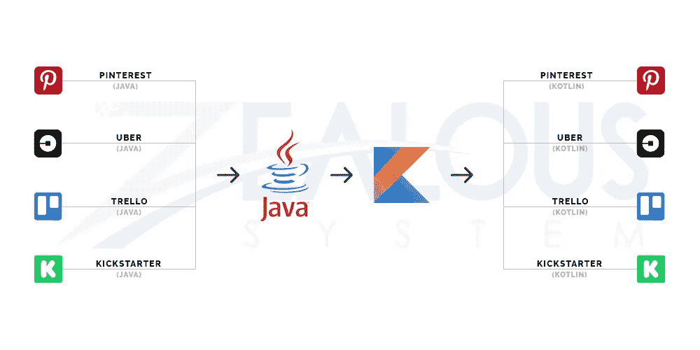
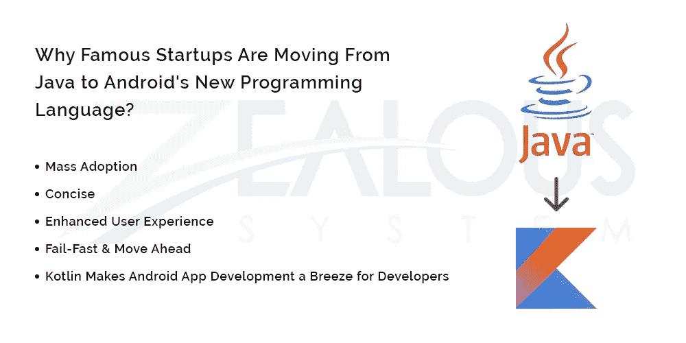
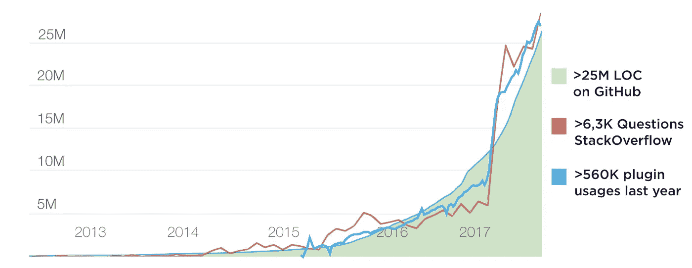

# 了解为什么这 4 家受欢迎的创业公司将他们的 Android 应用程序从 Java 改写为 Kotlin

> 原文：<https://medium.com/hackernoon/learn-why-these-5-popular-startups-rewrote-their-android-apps-from-java-to-kotlin-d60ee01ba7f1>

为什么你也应该这样做！

自从 Google 把 Kotlin 作为 Android 的官方语言以来，有一个问题我们已经被问过至少一百次了！

> "我们应该从爪哇搬到科特林吗？"

对此，我们总是会问一个反问题——***你知道科特林提供什么吗？***

因为知道了所有细节就自动回答了前一个问题——是否应该从 Java 转移到 Kotlin。

但是，如果您对 Kotlin 一无所知，并且想知道是否应该从 Java 迁移到 Kotlin，那么请阅读整篇文章。

在本文中，我们将关注 4 家采用 Kotlin 的著名创业公司，并探讨是否值得效仿。

# 以下是 4 个著名的初创公司的 Android 应用，它们要么是用 Kotlin 开发的，要么是从 Java 移植到 Kotlin 的:

## 1 — Pinterest

Kotlin 推出后不久，流行的照片共享应用程序正式从 Java 迁移到 Kotlin。该品牌开始尝试 Kotlin，并最终在 2016 年纽约 Droidcon 大会上展示了从 Java 迁移到 Kotlin 的好处。

## 2 —优步

作为按需空间的全球领导者，特别是在按需通信市场，优步已经将 Kotlin 用于其内部工具流程，如 gradle 插件和注释处理器。

## 3 —特雷罗

Trello 是当今数百万人使用的流行项目管理工具之一。虽然 Trello 还没有完成从 Java 到 Kotlin 的完整代码转换，也不打算这样做，但是由于 Java 和 Kotlin 之间的良好互操作性，Trello 正在使用 Kotlin 编写新代码。

## 4 — KickStarter

著名的众筹平台也已经使用 Kotlin 进行其 Android 应用程序开发。那些不知道的人，Kickstarter 帮助设计师、电影制作人和其他创意人员获得支持和所需的资源，将他们的想法/项目转化为现实。

**现在我们知道许多热门应用正受益于 Java 到 Kotlin 的迁移，您是否应该将您的应用的名称添加到上面的列表中？**

在你做出任何统一的决定之前，让我们来看看这 4 家著名的初创公司为什么要把他们的 Android 应用迁移到 Kotlin。

Image Credit — [Zealous System](http://bit.ly/2LJU7I2)

# 1 —大规模采用

虽然 Kotlin 自 2011 年以来一直在开发中，但其采用率在谷歌 2017 年 I/O 事件后飙升。Kotlin 是由 JetBrains 创建的开源免费编程语言。

事实上，根据 JetBrains 的说法，Kotlin 的采用率已经变得如此之高，以至于他们预测 Kotlin 今年将在 Android 应用开发方面超过 Java。

Image Credit: [https://blog.jetbrains.com/kotlin/2017/11/kotlin-1-2-released/](https://blog.jetbrains.com/kotlin/2017/11/kotlin-1-2-released/)

在早期，只有专业和有经验的 Android 应用程序开发人员在使用 Kotlin 进行 Android 开发。但是，自从在 2017 年谷歌 I/O 活动中宣布以来，它的使用量在学生和新开发人员中爆炸式增长。

# 2-简洁

Kotlin 是一种非常简洁的现代编程语言。它减少了样板代码的总数，从而提高了生产率。不仅如此，还减少了出错的空间，使代码比 Java 更可靠、更安全。

# 3 —增强的用户体验

Kotlin 不仅简洁，还通过减少应用崩溃和消除 bug，使 Android 应用开发过程更加稳定。这意味着，当你的 Android 应用程序缺少这些常见问题时，用户体验会自动变得更好。

# 4 —快速失败并继续前进

自从谷歌宣布 Kotlin 作为 Android 应用程序开发的官方语言以来，谷歌一直在不时地带来新的变化。这些变化之一包括增加了[故障快速系统](https://martinfowler.com/ieeeSoftware/failFast.pdf)。

Fail-Fast 系统基本上立即报告编码中最有可能导致失败的任何问题。简单地说，当一个问题出现时，快速失效系统当场失效，要求 Kotlin 开发人员在继续他们的开发过程之前立即修复它。

# 5——kot Lin 让开发者开发 Android 应用变得轻而易举

Kotlin 已经成为开发人员开发 Android 应用程序的退路。由于 Kotlin 易于学习，并得到了谷歌及其社区的支持，Kotlin 现在已经成为问题的常见答案— ***“用什么编程语言来构建 Android 应用程序。”***

不仅如此，由于本文前面提到的巨大的采用率，你正在使用的 Android 应用程序中有一个是使用 Kotlin 构建的可能性非常高。

**既然你知道了使用 Kotlin 开发下一个 Android 应用程序的好处，以及为什么著名的初创公司也在使用 kot Lin，我们就到了本文的结尾。**

然而，在我们说再见之前，我们有一个额外的信息给大家。

# 奖励——在将 Java 编码的 Android 应用程序迁移到 Kotlin 之前，您必须知道的事情

而 Java-Kotlin 互操作性是 Kotlin 编程语言最棒的部分。然而，有两个问题我们强烈认为你需要问自己，如果你想把你现有的 Android 应用程序迁移到 Kotlin。

让我们看看那些问题:

## 1 —您的团队是否具备实现转变的深入知识？

让我们明确一件事。—将开发方法从 Java 转移到 Kotlin，或者实际上任何其他编程语言都有一条可学性曲线。这是没有办法的。

因此，在你决定做出改变之前，确保你的 Android 应用程序开发者 100%支持你的旅程。

## 2 —您现有的 Android 应用程序的架构是使用松散耦合的组件创建的吗？

把这件事搞清楚。—如果你的 Android 应用是用松耦合组件构建的，那就更难了(*不是不可能！*)从爪哇迁移到科特林。

为什么？—因为当您对现有代码进行更改时，会导致创建、删除和合并某些类，这最终会使您的应用程序的架构变得一团糟。

因此，先弄清楚 app 的架构是否松散耦合，如果是，我们建议咨询有经验的 [**安卓应用开发公司**](http://bit.ly/2LJU7I2) 进一步处理。