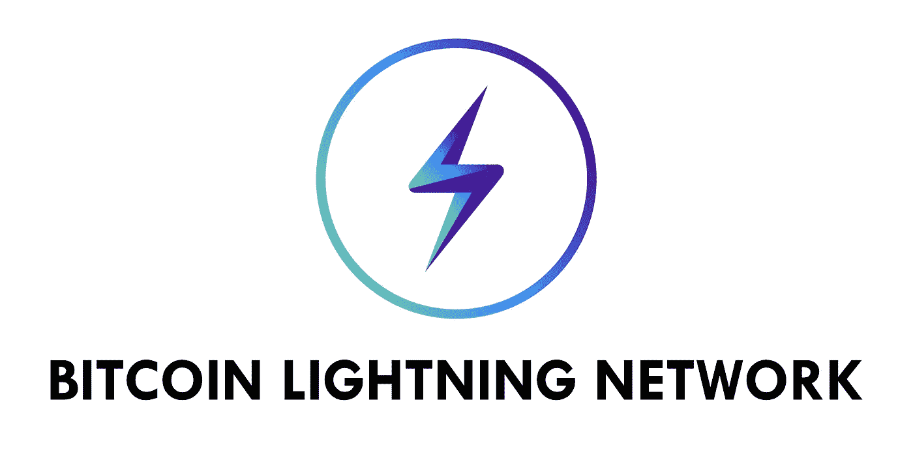

# 用围棋学习比特币的闪电网(设置)

> 原文：<https://medium.com/hackernoon/learning-bitcoins-lightning-network-with-go-set-up-deea944b920e>



这篇文章是为比特币 LND 初学者准备的。

比特币的闪电网络简而言之就是“可扩展的、即时的比特币/区块链交易”。拥有“支付渠道”的概念是，用户可以利用“离链”(意思是不在比特币区块链上)来发送几乎即时和低成本的交易。这里有一个更详细的描述链接:[http://lightning . network/how-it-works/](http://lightning.network/how-it-works/)。

闪电网络守护程序(LND)是“闪电网络节点的完整实现”。你真正需要知道的是，它允许我们在自己的计算机上相当容易地建立一个闪电网络。他们的 Github:【https://github.com/lightningnetwork/lnd】T2

我个人认为学习东西的最好方法是把它们落实到某种项目中。然而，事实证明设置 LND 以便能够用它编程是最困难的部分。所以我们开始吧！

# 在您开始之前…

***这个指南是针对谁的？正如我在本文开头所说，这是为 LND 初学者准备的，你甚至不需要精通围棋。我用 Mac 做所有的事情，但希望你有足够的知识用你的操作系统做同样的事情。为此，我们将使用 **REGTEST** 比特币服务器。***

**第一件事:** [安装 Go](https://sourabhbajaj.com/mac-setup/Go/README.html)<——那个链接里有很棒的教程

**第二件事:**安装 [Bitcoind](https://github.com/bitcoin/bitcoin) ，个人建议你直接运行:

```
brew install bitcoin
```

因为你**需要**在 [ZeroMQ](https://github.com/bitcoin/bitcoin/blob/master/doc/zmq.md) 上安装 bitcoind 才能让 LND 工作，brew install 会为你做*几乎*所有的事情。我说几乎是因为我们仍然需要添加一个配置文件。除此之外，[这里的](https://github.com/bitcoin/bitcoin/blob/master/doc/build-osx.md)是一个关于如何在 mac 上安装 bitcoind 的教程(没有 ZeroMQ)，但它仍然有很棒的文档说明安装后要做什么。

安装 Bitcoind 后，我们可以用这三个命令添加配置文件，

**对于 mac:**

```
mkdir -p "/Users/${USER}/Library/Application Support/Bitcoin"touch "/Users/${USER}/Library/Application Support/Bitcoin/bitcoin.conf"chmod 600 "/Users/${USER}/Library/Application Support/Bitcoin/bitcoin.conf
```

命令 1:创建一个名为比特币的文件夹

命令 2:创建名为 bitcoin.conf 的文件

命令 3:更改文件的权限以允许所有者读/写

**bitcoin.conf** 文件内容:

```
rpcuser=bitcoinrpc
rpcpassword=some_password_goes_here
testnet=0
regtest=1
server=1
daemon=1
zmqpubrawblock=tcp://127.0.0.1:28332
zmqpubrawtx=tcp://127.0.0.1:28333
```

这应该添加到您的 bitcoin.conf 文件中。

此时，您应该能够简单地输入:

```
bitcoind
```

输入您的终端，应该会出现以下内容:

```
Bitcoin server starting
```

您现在有了一个在后台运行的比特币 REGTEST 服务器。

*注意:Regtest 表示您不会下载整个比特币区块链，而是可以手动创建区块并创建比特币。允许我们在没有容纳比特币区块链主网所需的大量空间的情况下进行测试。

要停止比特币服务器运行:

```
bitcoin-cli stop
```

**第三件事:**安装 LND

去这里找他们的[官方安装指南](https://github.com/lightningnetwork/lnd/blob/master/docs/INSTALL.md)，非常容易安装。安装后，您应该有 2 个项目添加到您的 go/bin 文件夹:

*   lncli
*   左颈部清扫术

一旦安装了 LND，我们可以用这三个命令添加配置文件，

**对于 mac:**

```
mkdir -p "/Users/${USER}/Library/Application Support/Lnd"touch "/Users/${USER}/Library/Application Support/Lnd/Lnd.conf"chmod 600 "/Users/${USER}/Library/Application Support/Lnd/Lnd.conf
```

**lnd.conf** 文件内容:

```
bitcoin.regtest=1
bitcoin.active=1
bitcoin.node=bitcoind
debuglevel=debug
```

这应该添加到您的 lnd.conf 文件中。

很有可能你不能简单地在你的终端上输入“lnd ”,然后启动服务器。为此，您很可能想要在您的 **/中创建一个别名。bash_profile** 。

打开。bash_profile 包含:

```
open ~/.bash_profile
```

并将这些行添加到文件的末尾:

```
# LND commands from terminal
alias lnd=$HOME/go/bin/lnd
alias lncli=$HOME/go/bin/lncli
```

这些命令意味着指向你的 go/bin/lnd 和 go/bin/lncli 二进制文件，所以如果你的文件结构与此不同，你必须编辑路径。

最后，您应该能够通过简单地键入以下命令来启动 LND 服务器:

```
lnd
```

当它成功运行时，您应该会得到如下文本:

```
Waiting for wallet encryption password. Use `lncli create` to create a wallet, `lncli unlock` to unlock an existing wallet, or `lncli changepassword` to change the password of an existing wallet and unlock it.
```

要创建钱包加密密码，请在新终端中键入:

```
lncli create
```

记下您创建的密码，不要添加助记符或密码短语。

# 现在一起。

在 1 号终端，启动比特币服务器和 lnd 服务器:

```
bitcoindlnd
```

在 2 号航站楼，打开 lnd 钱包:

```
lncli unlock
```

# 步骤 1: GRPC 设置

LND 将 [LND gRPC API](https://api.lightning.community/) 用于他们的 CLI。你可能听说过 REST API，gRPC 是它的替代品。目前，LND API 文档仅显示了使用 API 的 Javascript 和 Python 示例，因此下面将向您展示如何开始使用 Go。

我们首先用 grpcSetup()方法创建一个简单的 Go 文件。在这里，我们只需找到用户的主目录，然后创建一个到 lnd 目录的路径。

上面我们创建了一个保存 SSL/TLS 凭证的变量。当您第一次运行 LND 服务器时，应该已经为您自动创建了 tls.cert 文件。打印 *creds* 应该只是显示一个内存地址，不用担心这个。

上面我们创建了一个 gRPC 头，里面有我们的杏仁饼。这些是安全凭证，我们每次调用 grpc API 时都会传递这些凭证。

上面，我们通过指定主机/端口和凭证来创建到 gRPC LND 服务器的连接。然后，我们从 grpcSetup()方法返回该连接，并推迟关闭它。

# 步骤 2: LNCLI 设置和使用

让我们一行一行地看一下:

```
lncli := lnrpc.NewLightningClient(grpcConn)
```

这一行创建了一个新的 Lightning 客户端，它包含了许多我们可以调用的方法。[这里的](https://godoc.org/github.com/lightningnetwork/lnd/lnrpc#LightningClient)是可以在这个客户端上调用的所有方法的文档。

```
ctx, _ := context.WithTimeout(context.Background(), 10*time.Second)
```

这一行创建了一个 10 秒后超时的上下文，不太重要。但是，这需要传递给从 Lightning 客户端调用的每个方法。

```
walletBalanceReq := lnrpc.WalletBalanceRequest{}
```

这一行创建了一个请求，我们将把它传递给下一个函数。它是空的，因为没有我们需要提供的信息来获得我们的钱包余额。

```
walletRes, err := lncli.WalletBalance(ctx, &walletBalanceReq, MACAROONOPTION)if err != nil {
    fmt.Println(err)
}
```

这些行实际上调用了 Lightning 客户端来检索钱包余额。如您所见，我们传入了上下文、钱包余额请求和我们在 gRPC 设置中创建的杏仁饼。如果出现错误，我们将打印出来。如果运行此命令时 LND 服务器没有运行，您可能会看到一个错误，提示无法找到连接。

```
fmt.Println(walletRes.TotalBalance)
```

最后，我们打印出钱包余额，以显示我们实际上取回了一些东西，如果您从头到尾都遵循本教程，它很可能是 0。

回应通常有许多您可以查看的属性。具体来说，WalletBalance 具有 TotalBalance、ConfirmedBalance 和 UnconfirmedBalance 这样的属性。点击[这里](https://godoc.org/github.com/lightningnetwork/lnd/lnrpc#WalletBalanceResponse)看文档。

# 现在都在一起

Complete code

这里是完整的代码，将让你开始使用 LND。有了这个基础，你应该能够在此基础上继续你的 LND 之旅。

*如果您发现了任何错误，请在这里* *随意贡献代码* [*！*](https://github.com/jmaldon1/Bitcoin-LND-Go-Setup)