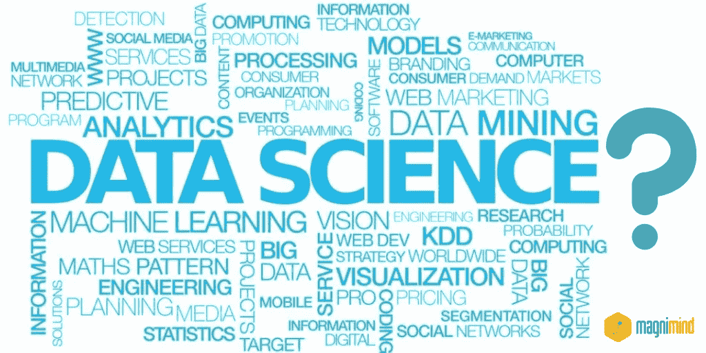

# 在 6 周内学习数据科学—如何做到？

> 原文：<https://medium.com/hackernoon/learning-data-science-in-6-weeks-how-you-can-do-it-d46520c12d43>

W ith [***数据科学***](https://en.wikipedia.org/wiki/Data_science) 作为近年来最热门的职业之一，对数据从业者的需求极高。

> 然而，许多有志成为数据科学家的人都陷入了一个误区，即你需要一个该领域的博士或硕士学位。