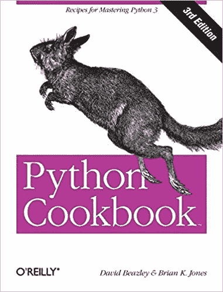
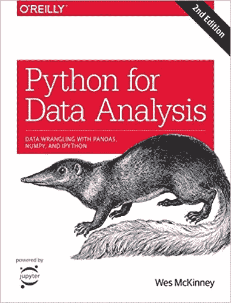

# 学习数据科学:我们最喜欢的 Python 资源

> 原文：<https://medium.com/hackernoon/learning-data-science-our-favorite-python-resources-from-free-to-not-877fca5c92f0>

[原贴于此](https://www.coriers.com/our-favorite-python-books-courses-and-youtube-videos/)

Python 是数据工程师和数据科学家都使用的通用语言。这是因为它可以自动化数据工程师需要完成的操作工作，并拥有数据科学家所需的算法、分析和数据可视化库。

*抬头！—此帖子包含亚马逊服务有限责任公司联营计划的推荐链接，这是一个附属广告计划，旨在为我们提供一种通过链接到 Amazon.com 和附属网站来赚取费用的方法。*

在这两种情况下，只需几行代码就可以简化管理、自动化和分析数据的需求。以至于我们在许多专注于数据的从业者的图书馆中读到和看到的一本书[用 Python](https://www.amazon.com/gp/product/1593275994/ref=as_li_tl?ie=UTF8&tag=buy05cb-20&camp=1789&creative=9325&linkCode=as2&creativeASIN=1593275994&linkId=2d2a66f770b7a104b1b3e13d6ba6fa26) 将枯燥的东西自动化。

这本书涵盖了 python 基础知识和一些简单的自动化技巧。这对于在 Excel 中大量工作的业务分析师来说尤其有用。

奥莱利的一些书也很好地概述了基础知识。

你可以从 [Python 食谱](https://www.amazon.com/gp/product/1449340377/ref=as_li_tl?ie=UTF8&tag=buy05cb-20&camp=1789&creative=9325&linkCode=as2&creativeASIN=1449340377&linkId=b8499e9945e424fe86cc360f3d0f62bf)开始你的书单。这本书涵盖了非常重要的主题，如文件/IO、数据结构、网络、算法等。所有这些话题都是任何技术驱动型职业的良好基础。它内容广泛，将让您很好地理解您可以用 python 做什么，同时还会教您一些常见的编程原则，如对象、类、数据结构和算法。如果你更喜欢这本书，那就没必要买自动化的书。这将涵盖除 excel 以外的大部分主题。如果你真的想学习更多关于 python 和 excel 的知识，你可以随时阅读关于 [openpyxl](http://openpyxl) 的文章。老实说，如果你是一个喜欢阅读技术文档而不是书籍的人，那很可能是正确的选择(我们倾向于书迷)。

# 免费 Python 视频

如果你不喜欢看书，喜欢免费的 youtube 教程，那么这里是我们的最爱之一。

创作者科里·斯查费是一个优步者。有大量关于 Python、Django、GitHub、Linux 等的完整教程。对于有兴趣进入科技领域的人来说，所有这些都是非常实用的技能。此外，他的视频很容易理解。下面的视频是关于对象和类的，可能稍微高级一点。如果你刚开始看这个[视频](https://youtu.be/YYXdXT2l-Gg)。

现在，一些 python 教程只是搞笑而已。好的，实际上这下一个是由技术领导创造的。对于那些不知道的人来说，TechLead 和不是程序员的人，这很难讲，但他很搞笑。他的大部分视频都只是处于某种严肃的玩笑边缘。能够分辨出细微差别……需要在科技行业工作。例如，在这个视频中，他实际上是在模仿 python 教程。身处科技行业的一部分是学习幽默的另一面。它往往是非常利基和迷因为基础的。

# **熊猫资源**

一旦你熟悉了 python，学习更多的库就变得容易多了。

Pandas 是一个数据操作库，允许您对数据集进行转换和基本分析。我们的一条建议是，作为一个用户，你需要考虑 Pandas 与 SQL 相比在哪里提供价值。在 SQL 上使用 Pandas 并不总是有益的。这可能有很多原因。如果你在电脑上运行的 Jupyter 笔记本上运行 Pandas，那么无论你在做什么数据处理，都是在你电脑有限的 ram 上进行的。

大多数大公司或者至少是科技公司会使用某种形式的云计算来运行你的 Jupyter 笔记本。尽管如此，python 并不总是快速数据转换的最佳选择。我们看到有人用 python 开发了一个 date_diff 函数，它花了 5 分钟来运行 100 万行，而如果他们用 SQL 运行它，可能只需要 1 秒钟。这是一个重要的注意事项，因为想象一下，如果不是一百万行，而是十亿行。这意味着运行时间增加了 1000 倍(好吧，说到计算就没那么简单了，但关键是……要长得多)。

熊猫仍然有它的位置，对于准备和分析你的数据非常有用。这里有一些熊猫的好资源:

**用 Python 和熊猫进行数据分析**

Sentdex 是一个很棒的 youtube，他让 python 变得非常简单。除了熊猫之外，他还为多个主题创建了 python 教程。但是我们真的很欣赏他脚踏实地的风格。他假设你从零开始，然后从那里开始。

在我们看来，这使得他的视频可能是 Youtube 上最有效的视频教程之一。另外，他的风格很容易模仿。

**10 分钟内与熊猫进行 Python 数据分析| Udemy 导师，Frank**

我们想分享一个由弗兰克·凯恩创作的免费 Udemy 视频。你会看到我们多次提到这位讲师。他是最专业的课程创作者之一。这个视频是免费的。然而，弗兰克·凯恩确实制作了许多我们付费并喜欢的高质量课程。他有 python 和许多其他现代技术概念的从初学者到免费的课程。他还写了一本关于 Python 和机器学习的书

最后，我们喜欢的长篇视频并不多。很多时候，你很难一次花一个小时看完这些视频。有一个是我们喜欢并想分享的。如果你刚刚开始学习，并且想要一个关于熊猫的速成班，看看下面的视频。我们对下面的视频的一个意见是，你一定要改变视频质量。对我们来说，一开始很糟糕，直到你把它调到 720 便士。

# 熊猫 Python 书籍

网上没有很多我们喜欢的关于熊猫的免费书籍。所以，在这种情况下，我们会推荐一些你可以在亚马逊或奥赖利上挑选的有 10 天免费试用期的书。这实际上至少是找到你可能喜欢买的书的好方法！

在这里，使用经典的 [Python 进行数据分析](https://www.amazon.com/gp/product/1491957662/ref=as_li_tl?ie=UTF8&tag=buy05cb-20&camp=1789&creative=9325&linkCode=as2&creativeASIN=1491957662&linkId=42a9a64770e07dcad65b36017f058970)绝对不会错。

image from Amazon

这本书将涵盖所有基础知识，如数据聚合和时间序列，同时通过基本的 python 练习，帮助您学习如何将 Pandas 应用于实际问题。这是我们在书本或课程中寻找的特质之一。我们倾向于需要实际的问题来应用我们的技能。这使得设计和解决问题变得更加容易。
正如书中所说，这本书将带你了解“用 Python 操纵、处理、清理和处理数据的具体细节”。作为一名数据科学家，这些技能至关重要，因为你的大部分时间将集中在清理和处理数据上。

这可能是我们推荐的少数几本关于熊猫的书之一。我们很快还会将许多其他数据科学和机器学习书籍添加到这个列表中。但是我们不会推荐太多纯粹关于熊猫的书。

到目前为止，Python 还有其他几个我们跳过的库。如果你正在寻求参与机器学习和深度学习，它们是使复杂模型、算法和神经网络编程变得容易的核心库。

# **机器学习和深度学习 Python**

熊猫做很多基本的分析功能。它汇总并运行基本的描述性统计过程。以便更容易地应用更高级的模型。你需要学习 Scikit learn。现在，我们保守地说。仅仅学习库是如何工作的并不能让你成为一名机器学习工程师。它是需要了解的重要库之一，因为它包含了科学家将在 python 中使用的大部分模型数据。

再说一次，Sentdex 有一套很棒的教程，非常实用。

**Scikit 学习机器学习 SVM 教程**

Sentdex 已经存在一段时间了，所以对于更新的内容，可以查看 Simplilearn。它有一些更新的视频，他们做得很好，更加深入。我们真的希望他们能得到更好的音频质量，但除此之外，这是一个学习 Scikit learn 的很好的视频集。

**Scikit-Learn 教程**

**Tensorflow 和深度学习**

Python 的另一个库是 Tensorflow。这个库允许你非常容易地建立神经网络。不需要创建感知器类或任何其他形式的对象/类，如果你是从零开始开发它，这将是必需的

事实上，Ten follow 是用这样一种方法编写的，它在编译时更像一个图形，然后被翻译成 c 代码。

一个伟大的，稍微隐藏的视频系列是由 _Hvass 实验室创建的。这个系列的伟大之处在于，它不仅指导您使用 Tensorflow。它还引用了一个 GitHub，您可以使用它轻松地跟随。他所有的代码都已经写出来了。这让你很容易跟上。

再一次，我们必须对 Sentdex 再喊一次，它是最容易理解的 Tensorflow 介绍。

**Python 机器学习书籍推荐**
对于书籍，我们会推荐[用 Python 学习机器食谱:从预处理到深度学习的实用解决方案。](https://www.amazon.com/gp/product/1491989386/ref=as_li_tl?ie=UTF8&tag=buy05cb-20&camp=1789&creative=9325&linkCode=as2&creativeASIN=1491989386&linkId=24f11e81078746254c7eae13bdbc405d)

image from Amazon

这本书将从线性回归和 KNN 这样的主题开始，然后深入到更深入的学习概念，如神经网络。此外，像许多其他奥莱利的书一样，它有很多很好的解释了伟大的实际例子。

**张量流**

[使用 Scikit-Learn 和 TensorFlow 进行机器实践学习:构建智能系统的概念、工具和技术](https://www.amazon.com/gp/product/1491962291/ref=as_li_tl?ie=UTF8&tag=buy05cb-20&camp=1789&creative=9325&linkCode=as2&creativeASIN=1491962291&linkId=b7606b82f6151571b0ceefbd4b1f95d6)

如果你更喜欢学习张量流，那么跳过上面的书，只用这本书代替。它在机器学习上稍微轻一点(但仍然非常彻底)，但它也有一个 100%专用于神经网络的后半部分。它涵盖了卷积神经网络、自动编码器、辍学和其他非常重要的主题。

# Python 的机器学习课程

我们也有一些课程想推荐这个主题。

我们已经提到了弗兰克，但我们也认为基里尔·叶列缅科是另一位伟大的教练。他们不仅是伟大的老师，他们显然对这些话题有着深刻的理解。

[**Frank Kane 有一个关于机器学习的很棒的课程**](https://www.udemy.com/data-science-and-machine-learning-with-python-hands-on/) ，他将带你从线性回归到支持向量机。他还将讨论集成学习和偏见权衡等等。另外，如果你是一个视觉学习者，这可能会让你受益更多。还有一整节是关于 Apache Spark 的机器学习，它让您可以将这些技术扩展到在计算集群上分析的“大数据”。

弗兰克·凯恩有一份其他课程的清单，没有一门是我们没有购买并喜欢的。所以我们希望你也能喜欢它们！

另一个伟大的课程是 12。 [**机器学习 A-Z:数据科学中的动手 Python&R**](https://www.udemy.com/machinelearning/)..本课程内容全面，讨论了 Python 和 r。本课程不仅关注 Scikit learn，还关注一般的机器学习。此外，本课程的创建者是 SuperDataScience.com 的所有者，这是一个很棒的网站，有播客、课程等。所以如果你不想为课程付费，你可以随时免费收听播客！当然，Python 并不是数据科学的唯一语言。另一种流行的语言是 R(同样，这不是仅有的两种语言，还有其他人们喜欢使用的语言…除了 Matlab..我们不谈 Matlab)。

目前，python 是普通人的语言。它易于编写、实现和使用。是否有折衷，是的，它是否能很好地满足您的几乎所有需求，是的。

我们希望这个列表是有帮助的。请在下面评论一些你喜欢的关于 python 的书籍或免费资源！

关于数据科学、SQL 和 Python 的进一步阅读和视频:
[如何开发健壮的算法](/@SeattleDataGuy/how-to-develop-a-robust-algorithm-c38e08f32201)
[将 CSV 数据动态批量插入 SQL 服务器](https://www.youtube.com/watch?v=2bBsYmQjzSE&t=4s) [SQL 最佳实践—设计 ETL —第 1 部分](https://www.youtube.com/watch?v=sLhInuwdwcc&t=169s) [算法如何变得不道德和有偏见](http://www.acheronanalytics.com/acheron-blog/how-do-machines-learn-bias-data-science)
[4 数据科学家必须具备的技能](https://www.theseattledataguy.com/4-skills-data-scientist-must-have/)
[什么是决策树](http://www.acheronanalytics.com/acheron-blog/brilliant-explanation-of-a-decision-tree-algorithms)

此帖子包含来自亚马逊服务有限责任公司联营计划的推荐链接，这是一个附属广告计划，旨在为我们提供一种通过链接到 Amazon.com 和附属网站赚取费用的方式。