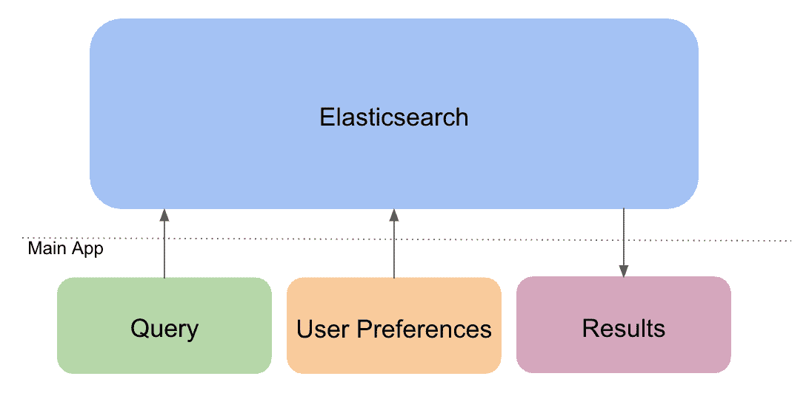
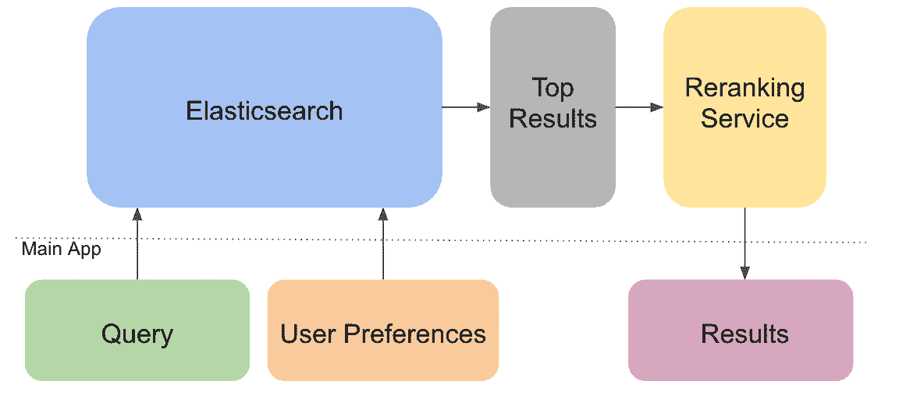

# 评估学习排序算法以提高求职相关性

> 原文：<https://medium.com/hackernoon/learning-to-rank-for-job-search-d1dc44d7070>

*我们从“智能”相关性排名实验中学到了什么。*

握手的使命是通过确保每个学生，无论他们在哪里上学或认识谁，都能找到有意义的职业，使机会民主化。Handshake 的学生产品的核心是一个工作搜索引擎，我们的 1400 万名学生和年轻校友可以在这里找到 30 多万名雇主的工作。

去年年底，我们的数据和平台团队决定尝试从根本上不同的方式来推动求职。在这里，我们将讨论我们是如何处理这个问题的，我们构建的服务，以及我们从这个过程中学到了什么。

# **我们目前如何找工作**

与典型的搜索引擎一样，我们对文档进行索引，在我们的例子中，这些文档是职位发布。文档存储在倒排索引中，这样可以进行快速的全文搜索。倒排索引将文档中的所有唯一标记映射到它们各自出现的文档列表中。我们将索引文档存储在 Elasticsearch 中。

当用户输入一个查询时，我们将该查询分解成记号，并在倒排索引中查找记号。在词干化和去除停用词之后，我们使用多种策略在倒排索引中查找标记，包括部分词和模糊词匹配。最后，搜索引擎对招聘信息进行排名并返回结果。

为了对帖子进行排名，我们使用 Elasticsearch 的 tf-idf 评分；然而，我们也试图利用我们所知道的关于学生的其他信息来提高这个排名。例如，当学生在握手时创建一个帐户时，我们要求他们选择他们喜欢的行业、地点和工作角色。然后，我们提高符合他们偏好的帖子的分数。

Current search architecture.

# **什么是学习排名？**

学习排序(LTR)是机器学习在相关性排序中的应用。LTR 通常用作现有搜索引擎之上的重新排序层，这意味着在搜索引擎返回顶部的 *x* 文档之后，LTR 服务只是在返回结果之前对这些 *x* 文档进行重新排序。

这种架构优于用机器学习模型取代整个搜索引擎，原因有二。首先，传统的搜索引擎通常在返回一组相关文档方面足够好(通过[召回和](https://towardsdatascience.com/precision-vs-recall-386cf9f89488)精确度来衡量)。我们的目标是改善文档的排名。我们不需要训练机器学习模型来完成这两项任务，所以我们使用 LTR 来专门提高相关性排名。使用 LTR 作为附加层的第二个原因是为了性能；对 500 或 1000 个帖子重新排序比对数万个帖子重新排序要快得多。

# **为求职实施 LTR**

我们考虑了 LTR 的两种不同实现:使用 [Elasticsearch LTR 插件](https://elasticsearch-learning-to-rank.readthedocs.io/en/latest/)和使用 [Ranklib](https://sourceforge.net/p/lemur/wiki/RankLib/) 创建我们自己的服务(Elasticsearch LTR 插件所基于的重排序算法库)。我们决定选择后者，因为它不会让我们依赖于特定版本的 Elasticsearch，并且允许更多的可配置性。

**数据和型号**

独立于整体架构，LTR 依赖于有监督的机器学习模型，该模型必须经过训练。我们使用 Ranklib 来训练模型，要求我们对训练集和要重新排序的数据都使用 QID (query-ID)文件格式。在 QID 文件中，我们为每个查询分配一个 ID，并为每个(一键编码)特征分配索引。在我们的例子中，查询不是由用户可能输入的关键字驱动的，而是由用户个人预先选择的工作偏好驱动的。为了建立训练集，我们根据学生看到作业时的行为为每项作业分配了一个相关性分数:

*   0 —无操作，
*   2 —单击作业，
*   3 —喜欢该工作，
*   4-应用于工作。

从理论上讲，使用用户的行为可以让模型发现我们无法发现的潜在模式。这些特征是工作或雇主和用户的特征，例如雇主是否属于用户的首选行业，或者雇主是否正在雇用用户学年的学生。我们使用这个训练集来训练使用 Ranklib 的八个重新排序算法实现中的每一个的模型，选定 LambdaMART 作为 MVP 重新排序服务，因为它具有最好的 [NDCG@10](https://en.wikipedia.org/wiki/Discounted_cumulative_gain) 分数。

**重新分级服务**

有了我们训练好的模型，我们开始做一个服务，我们可以用它作为我们搜索架构的重排序层。最初的想法是编写一个 Go 服务，为每次搜索执行 Ranklib bash 命令。然而，我们意识到这是多么的低效，因为每个请求都需要一个 jvm 来执行 Ranklib jar。

为了解决这个问题，我们决定编写一个 Java 服务。这不仅有助于提高效率，而且还允许我们进行一些定制，以便更容易地与我们的主应用程序集成。例如，编写我们自己的 API，而不是使用 Ranklib 的 rerank 方法，这允许我们将作业的 JSON 对象传递给 rerank，而不是 QID 格式的文件。

Search architecture with reranking service.

# **外卖**

要知道我们的重新排名服务是否比只使用 Elasticsearch 表现得更好，最好的方法是将其部署到生产中，看看是否有更多的学生点击并申请工作。我们目前正在评估这项服务的生产情况，并将其与我们认为性能更好的新选项进行比较(更多内容将在后面介绍！).

需要注意的是，机器学习并不能解决一切问题。虽然使用机器学习来解决相关性排名听起来很棒，但还有许多其他低投资的方法来改善我们向学生展示工作的方式。例如，我们可以确保从学生那里收集更准确和最新的偏好，这样我们就可以使用我们当前的框架向他们展示可能的最佳工作。或者，我们可以通过提供更有帮助的搜索关键词推荐，让用户能够进行更好的搜索，从而找到更好的结果。

这个项目最大的收获之一是，许多学生仍处于探索阶段，这将有助于了解握手搜索的未来。他们不确定他们在寻找什么，或者至少不确定如何将他们的目标转化为搜索关键词。事实上，59%的搜索不使用关键词，依靠过滤器和我们的工作排名。由于我们专门关注早期人才，因此 Handshake 在帮助这些用户方面具有独特的优势。在接下来的几个月里，我们将重新思考我们如何进行求职，以确定帮助我们所有用户找到并建立有意义的职业生涯的最佳方式。

# **延伸阅读**

[https://medium . com/@ purbon/learning-to-rank-101-5755 f 2797 a3a](/@purbon/learning-to-rank-101-5755f2797a3a)

【http://times.cs.uiuc.edu/course/598f14/l2r.pdf 

[https://www . ebay Inc . com/stories/blogs/tech/measuring-search-relevance/](https://www.ebayinc.com/stories/blogs/tech/measuring-search-relevance/)

[https://opensourceconnections . com/blog/2017/02/14/elastic search-learning-to-rank/](https://opensourceconnections.com/blog/2017/02/14/elasticsearch-learning-to-rank/)

[https://arxiv.org/pdf/1810.09591.pdf](https://arxiv.org/pdf/1810.09591.pdf)

*如果你对这里讨论的任何话题有想法，请随时联系(@samhitakarnati 在 Twitter 上)！*