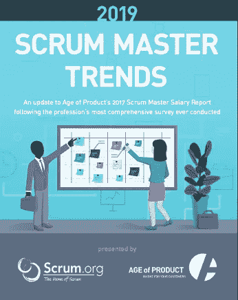
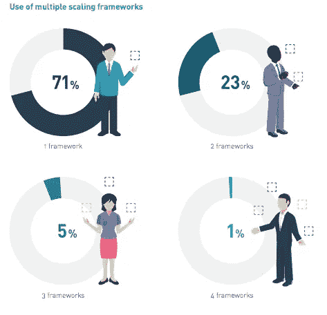
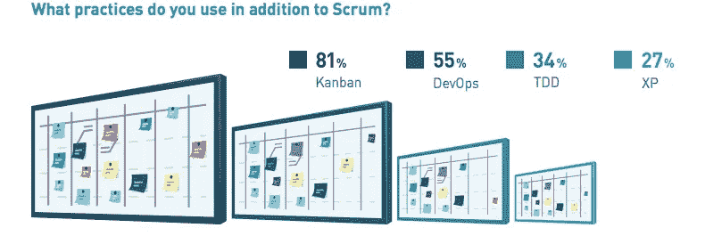

# 从 2019 Scrum Master Trends 报告中获得的经验

> 原文：<https://medium.com/hackernoon/learnings-from-2019-scrum-master-trends-report-b43a5368d68f>

> [作者:戴夫·韦斯特，首席执行官&产品负责人，Scrum.org](https://www.scrum.org/)

2018 年对于 Scrum Master 来说是重要的一年， [Glassdoor](https://venturebeat.com/2018/08/14/glassdoor-13-of-the-25-highest-paying-u-s-jobs-for-2018-are-in-tech/) 描述了这个角色的重要性，LinkedIn 将 Scrum Master 列为 2019 年[最有前途的工作之一](https://blog.linkedin.com/2019/january/10/linkedins-most-promising-jobs-of-2019)。慢慢地，Scrum 大师已经走出了极客的世界，被主流接受。这并不令人惊讶。越来越多的组织认识到敏捷性的重要性，能够更快地响应不断变化的市场条件。这种向敏捷的转变需要改变团队管理方式、工作结构以及从事工作的人和他们工作的组织之间的关系。这种变化的向导是 Scrum Master。

2019 [Scrum Master Trends 报告](https://www.scrum.org/resources/2019-scrum-master-trends-report)是对 2017 年进行的 [2017 Scrum Master Salary 报告](https://age-of-product.com/scrum-master-salary-report-2017/)的更新。通过合作，我们获得了更大的样本，扩大了研究范围，从 500 多名受访者增加到 2100 多名，并增加了更多的地理区域和更广泛的人口统计数据。我们还扩展了提问的问题，增加了关于扩展、敏捷变更、报告结构和实践的问题。

很难挑出我最喜欢的部分。整份调查报告都值得一读，但以下是我的一些要点。

# Scrum Master 是敏捷过渡中的一个关键角色

接受调查的 45%的 Scrum Masters 说他们是开启敏捷转变的人，看起来组织正期待这个角色来领导他们企业的变革。这支持了 Ken Schwaber 和 Jeff Sutherland 的观点，他们将 Scrum Master 定义为将 Scrum 和敏捷带入企业的人。它还强调了我们如何关注自下而上的变革，而不是传统的自上而下的方法。这并不是说你不需要创造一个自上而下进行变革的环境，而是说实际的工作正在团队和产品中进行，需要进行变革。这是一个非常积极的情况，因为来自那些从事工作的人的改变通常更有可能成功。

# 随着许多人专注于一个框架，而不是所有框架，可伸缩性继续上升

同样，由于敏捷性越来越重要，50%的被调查者表示他们正在使用扩展框架，这并不奇怪。有趣的是多框架的使用，29%的应答者说他们使用不止一个框架。现实是，伸缩是困难的，实践者需要查看许多不同的框架和想法来定义适合他们情况的方法。缩放确实突出了一种尺寸不能适合所有人。例如，Nexus 没有提供投资组合管理的指导，LeSS 在这方面提供了很多信息。重要的是，实践者从许多知识体中收集想法，理解使用特定想法的含义。扩展最终确实需要妥协，但这种妥协不应该不假思索地做出。任何教条式的扩展方法都是有问题的，很可能会失败。

# Scrum Master 角色在组织内部开始成熟

随着 Scrum 和敏捷思想的发展，Scrum Master 的角色也在发展和成熟。调查强调，三分之一的受访者拥有超过 3 年的工作经验。这与我们在 Scrum 看到的有越来越多的学生参加高级 Scrum 大师班和参加 PSM II 评估是一致的。当然，我们距离一个非常成熟的学科还有很长的路要走，但我们已经开始在荷兰、美国部分地区和西欧等更成熟的市场看到这种变化。

支持这一统计的是组织的日益成熟，43%的受访者表示他们对 Scrum 的采用正在增长。

# 看板是最流行的补充实践

Scrum 团队使用看板的事实是 Scrum.org 开发[专业 Scrum with Kanban](https://www.scrum.org/PSK) 类的动机，所以毫不奇怪，调查支持这一点，超过 80%的受访者说他们在 Scrum 中使用看板。Scrum 是一个框架，它要求团队采用正确的实践来使它在他们的问题域内工作。透明性以及检查和适应的能力是 Scrum 的基本要求。看板提供了一套很好的实践来帮助团队做到这一点。

# 培训和认证事宜

好的。我想说，评估和认证是 Scrum.org 实证学习策略的一个关键部分，但老实说，只有 15%的受访者年收入超过 10 万美元，却没有正式的认证，这一数字并不可信。

当然，光有证书并不能带来更高的工资，正规的培训和教育也很重要。年收入超过 75，000 美元的受访者中有 50%接受过正式的 Scrum 培训，而在同一范围内，只有 6%的人没有接受过正式的 Scrum 培训。

但是不要相信我的调查结果，你自己去读，然后得出你自己的结论。如果你对这些数据有任何疑问，请联系我们，我们会继续加深对 Scrum Master 角色的理解，以及它是如何帮助改变世界的。您可以点击查看完整报告[。](https://www.scrum.org/resources/2019-scrum-master-trends-report)

争分夺秒。

戴夫

*原文发布于*[*https://www . scrum . org/resources/blog/2019-scrum-master-trends-report*](https://www.scrum.org/resources/blog/2019-scrum-master-trends-report)*。*