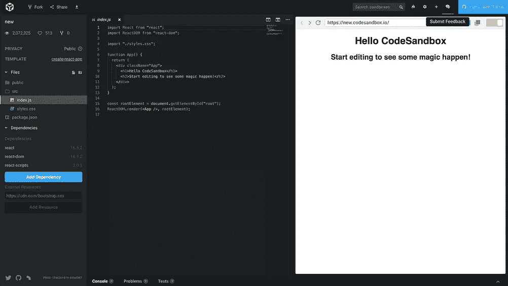
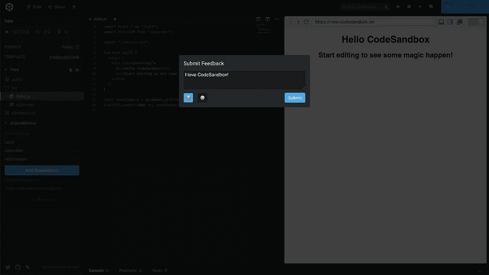
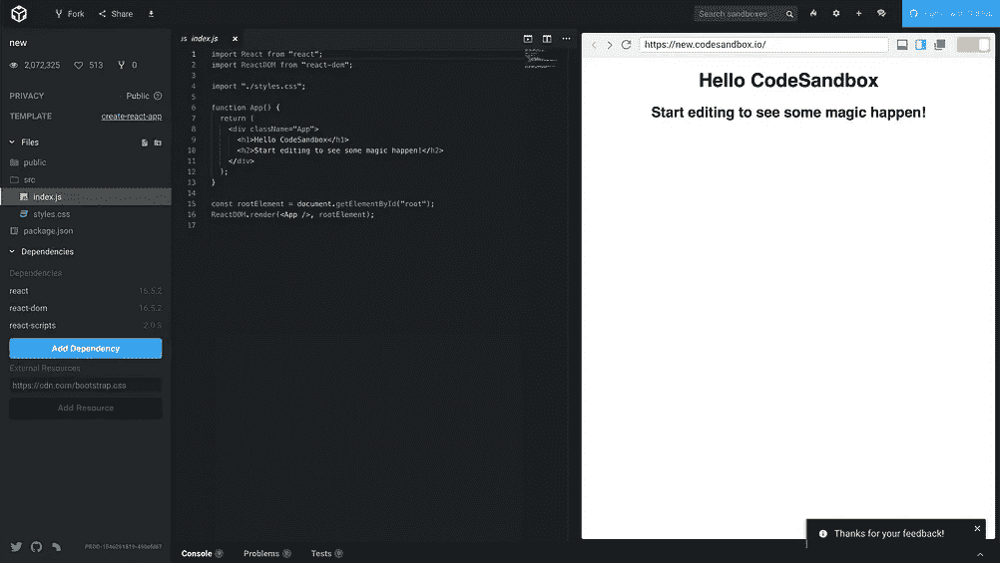

# CodeSandbox 的经验:使用 React 向 Airtable 发送用户反馈

> 原文：<https://medium.com/hackernoon/lessons-from-codesandbox-send-user-feedback-to-airtable-using-react-d15031a1e0fc>

[**CodeSandbox**](https://codesandbox.io) **牛逼。**

它是一个完整的 IDE(集成开发环境),用于运行在你的浏览器中的网络应用。

不过最棒的是，它是开源的。开源项目最大的好处是我们可以从他们的源代码中学习。

在这个系列中，我将分解使 CodeSandbox 变得伟大的代码，以便找到一些可以在您自己的项目中使用的技巧。有点像 ifixit，但是针对 JavaScript。


A series about taking code apart.

*   **第 1 部分:使用 React 向 Airtable 发送用户反馈**
*   第 2 部分:尊重你的用户不要在 React 中跟踪浏览器设置(即将推出)
*   第 3 部分:在 React 中使用 brain 和 MobX 管理复杂的应用程序逻辑(即将推出)
*   第 4 部分:使用“模板类”将数据和功能组合在一起(即将推出)

# 拆了它！

我们将查看 codesandbox-client 存储库(Github 链接[这里](https://github.com/CompuIves/codesandbox-client)如果你想在你自己的代码编辑器中跟随)。给人的第一印象是，这是一个相当大的 JavaScript 库。 [lerna](https://lernajs.io/) 用于将代码库分割成易于管理的小部分。

对于这个拆卸系列，我们将查看`app`包(位于[包/应用文件夹](https://github.com/CompuIves/codesandbox-client/tree/master/packages/app))。`app`包包含完整的 CodeSandbox 应用程序以及您可能在 Medium 或其他网站上看到的嵌入式应用程序。React 16.5.2 里写的。

撰写本文时的存储库提交散列是`450afd6`。

# 我们❤️用户反馈

良好的用户反馈很重要，因为它有助于我们开发人员优先考虑下一个要构建的功能或要修复的 bug。当用户使用你的应用程序时，获得反馈可能就像和他们坐在一起一样简单，但是在你的应用程序中建立反馈提交渠道*意味着你将获得一连串的错误报告和功能请求，而不需要花时间与人面谈。*

[**Airtable**](https://airtable.com)**真的很好收集反馈。**

如果你以前没有用过它，它有点像微软的 Excel 或者谷歌的 Sheets，但是使用了类固醇。它感觉有点不像电子表格应用程序，更像一个合适的数据库。

这有利于反馈，因为它是为不太懂技术的人设计的。您的产品经理或 UI 设计师可以轻松地访问数据，而不是像向 MongoDB 发送反馈那样，在那里您可能需要帮助他们。

CodeSandbox 收集用户反馈的方式如下:



Above: me sharing how much I love CodeSandbox ❤️

点击提交后，CodeSandbox 的 Airtable 中会生成一个新条目，包含您的反馈以及一些相关的用户信息。在下一节中，我将介绍它是如何构建的，以及如何在自己的应用程序中使用它。

# 向 Airtable 发送反馈

有三个独立的文件负责 Airtable 功能。

[setAirtable.js](https://github.com/CompuIves/codesandbox-client/blob/7c70c10d06ab573a58a568048eb7725790b3b4fa/packages/app/src/app/store/utils/setAirtable.js) 用指定的 API 键设置 [Airtable JavaScript API](https://www.npmjs.com/package/airtable) 。这很好，因为它将 API 密钥封装在存储库中的一个地方。

```
// packages/app/src/app/store/utils/setAirtable.jsimport Airtable from 'airtable';export default new Airtable({ apiKey: '<YOUR_AIRTABLE_API_KEY>' });
```

[pushToAirtable.js](https://github.com/CompuIves/codesandbox-client/blob/9f094be140bb188c5b6d2157929b261a946f2572/packages/app/src/app/store/utils/pushToAirtable.js) 连接到 Airtable base(他们对特定电子表格的术语)，并用与我们的反馈相关的应用程序特定的参数包装 Airtable 的“创建记录”函数。它还处理错误，将它们记录到控制台。请注意，该函数返回一个承诺，选择该承诺是为了能够在承诺链中调用该函数。

```
// packages/app/src/app/store/utils/pushToAirtable.jsimport Airtable from './setAirtable';const base = Airtable.base('<YOUR_AIRTABLE_BASE_KEY>');export default ({ feedback, emoji, sandboxId, username, email }) =>
  new Promise((resolve, reject) => {
    base('feedback').create(
      {
        feedback,
        emoji,
        sandboxId,
        username,
        email,
      },
      err => {
        if (err) {
          console.error(err);
          reject();
        } resolve();
      }
    );
  });
```

[Feedback.js](https://github.com/CompuIves/codesandbox-client/blob/9f094be140bb188c5b6d2157929b261a946f2572/packages/app/src/app/pages/common/Modals/FeedbackModal/Feedback.js) 是调用`pushToAirtable()`的 React 反馈模态组件。我也喜欢`props`和`user`在`sendFeedback()`内部被解构的方式。

```
// packages/app/src/app/pages/common/Modals/FeedbackModal/Feedback.js
// Some code has been omitted for brevity...import pushToAirtable from 'app/store/utils/pushToAirtable';function sendFeedback(props) {
  const { feedback, emoji, sandboxId, user } = props;
  const { username, email } = user || {}; return pushToAirtable({ feedback, emoji, sandboxId, username, email });
}class Feedback extends React.Component {
  ...
  onSubmit = evt => {
    const { id, user, signals } = this.props;
    const { feedback, emoji } = this.state;
    evt.preventDefault(); this.setState({ loading: true }, () => {
      sendFeedback({
        sandboxId: id,
        feedback,
        emoji,
        user,
      })
     ...
  };
  ...
  render() {
    return (
      <form onSubmit={this.onSubmit}>
        ...
      </form>
    );
  }
}
```

所以真的，没什么大不了的。这很简单，因为:

1.  创建一个文件来封装你的 Airtable API 密匙(`setAirtable.js`)
2.  为任何 Airtable 函数创建包装函数，使参数特定于应用程序(`pushToAirtable.js`)
3.  为表单调用`onSubmit()`中的函数，或者为 React 组件(`Feedback.js`)中的按钮调用`onClick()`

为什么 Airtable 不仅仅收集用户反馈呢？您还可以扩展这个方法来发送其他类型的数据，比如特定的应用程序事件或日志。我很想听听你是如何在自己的项目中使用它的。

# 这就是这次拆卸的全部！

在下一篇文章中，我们将从 CodeSandbox 中获取处理不要跟踪用户设置的技巧。

在 Twitter 上关注我吧，我会在那里发布我写的文章。

你自己通读过 CodeSandbox 源代码吗？如果你从中学到了什么有趣的东西，请在评论中告诉我🙌