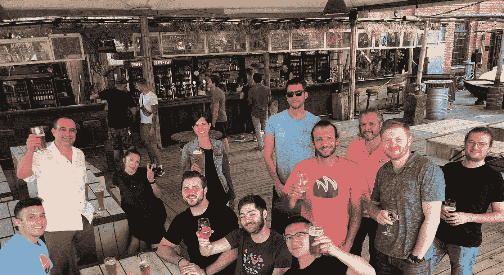

# 经验教训:使加密自行车与区块链供电的 ID

> 原文：<https://medium.com/hackernoon/lessons-learned-enabling-crypto-bikes-with-the-blockchain-powered-id-fddb441b8277>

## AirBie 和 uPort 试点项目

Photo by [Adli Wahid](https://unsplash.com/photos/A-RyxKDXm_0?utm_source=unsplash&utm_medium=referral&utm_content=creditCopyText) on [Unsplash](https://unsplash.com/search/photos/city-bike?utm_source=unsplash&utm_medium=referral&utm_content=creditCopyText)

你对区块链试点项目的进展感到好奇吗？与我们一起了解相关使用案例的幕后情况。 ***未来工作室*** *采访了来自*[***uPort***](https://www.uport.me/)*(谈到了*[***ConsenSys***](https://consensys.net/)*)的 Oliver Terbu 和 Alice Nawfal 以及来自密码自行车公司* [***AirBie【的 Philipp Zollinger (CMO)和 Christian Raemy(首席执行官/首席技术官)***](http://airbie.io/)

> ***项目描述:***

AirBie 已经制作了一个 **GPS 跟踪智能自行车**锁的原型，将安装在自行车上，用于**自由浮动自行车共享系统**。为了管理数字身份/管理访问权限，AirBie 依赖于 uPort——AirBie 的用户与 AirBie 移动应用程序共享凭据(存储在他们的 uPort 钱包中)，以验证他们的身份并访问该服务。

**项目开始日期:**2018 年 1 月

> ***当前项目状态:***

自 2018 年 11 月起在楚格进行试点，向楚格市所有获得 uPort 颁发的楚格身份证的公民开放。

> ***下一步:***

智能锁产业化，在全球销售(包括数字身份证)

> **:**

1.  *uPort 移动应用程序是英文的，但这个项目是为讲德语的观众实施的。本地化是关键，我们希望在我们的应用程序中加入其他语言选项。*
2.  *这个试点项目要求公民的简单身份证明(即 Zug ID)才能使用自行车。未来，AirBie 和 uPort 希望通过建立激励机制和奖励良好行为来提高声誉。*

> ****AirBie 如何选择 uPort 作为合适的合作伙伴:****

1.  *楚格市要求的，因为他们已经用完了。*
2.  *基于以太坊的 uPort 是最成熟、最好的基于区块链的数字身份证。*

> ****AirBie 是如何支持这个项目的:****

*AirBie 团队构建了智能锁原型，开发了相应的软件(后端和 app)，将 uPort 集成到他们的软件中，并额外营销了该项目。*

> ****从 AirBie 学到的关键知识:****

1.  *需要应对各种硬件挑战，即智能锁需要进一步开发*
2.  *用户体验是关键，尤其是与 uPort 合作时。*

**

*uPort team gathering in Berlin*