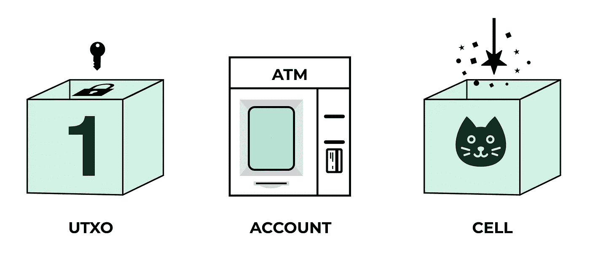
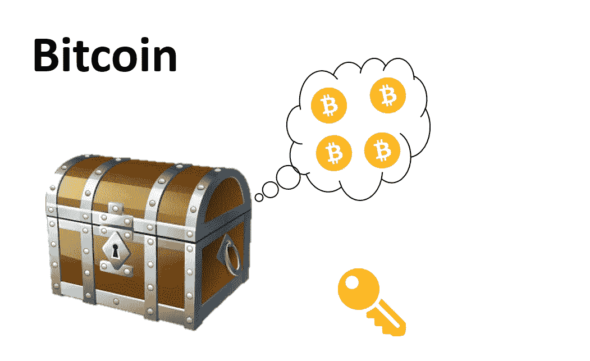
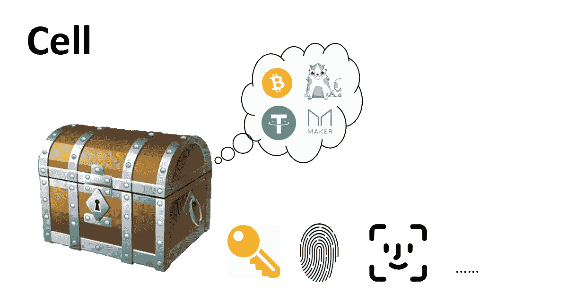

# 从比特币和以太坊的编程模型中吸取的教训

> 原文：<https://medium.com/hackernoon/lessons-learned-from-bitcoins-and-ethereum-s-programming-models-f9fdbe1a3fdb>

## 并简单解释了细胞模型如何结合两者的优点

作者[张亚宁](https://medium.com/u/5ee18604db20?source=post_page-----f9fdbe1a3fdb--------------------------------)

> 有了分层架构，就可以创建一个负担得起的通用基础设施，在我看来，这是区块链供电世界唯一可行的未来。

通过我的工作，我意识到人们很难理解细胞模型的概念。本文试图用一种简化的方式来解释细胞模型，以便大多数人都能理解。

首先，重要的是从历史向前看，从比特币开始。比特币是一种点对点电子支付系统，它使用一种叫做 UTXO 的编程模型。

把 UTXO 想成盒子最简单不过了。(没错，不是账本，是盒子。)盒子里有一个代表某种货币价值的数字，而且有一把锁。只有有相应钥匙的人才能打开箱子。转账时，有钥匙的主人/人用钥匙开锁，找到另一个空箱子，将新面额放入新箱子，并附上新主人的锁。

Bitcoin works like a locked box with some money inside: a person with a key could open that box and spend some money. Every time money is taken out, the old box gets destroyed and a new box is needed to store the remaining money.

整个交易可以概括为打开箱子，把里面的钱拿出来，把原来的箱子销毁，再放到另一个箱子里。

综上所述，**框代表存储数据的 UTXO 模型，锁代表所有权**。密码学是一项伟大的发明，它将物理世界中的锁的概念映射到了虚拟世界。

除了 UTXO 模型，还有账户模型。这种模式最著名的例子就是以太坊。除了数据，以太坊账户模型中还有计算逻辑。你可以把 ERC20 合约想象成一个盒子，里面装的不是钱，而是一组复杂的逻辑和数字。

与 UTXO 不同，帐户模型的盒子总是被重用的，并且在其生命周期内不能被打开。一套规则在生产出来的时候就已经被写入到盒子里，一些按钮被放在适当的位置，以便人们可以与盒子互动。例如，规则可能是这样的:如果一方想要转账，那么她或他或它需要出示一种形式的身份证明并输入 pin。一旦完成了前面的步骤，就需要下面的信息，转账金额，收款人，以及其他信息。一旦这些被输入，她或他或它需要点击转移按钮来完成转移。盒子收到信息后，会从你的金额中扣除，并更改对方的账户，然后更新所有内部数据。熟悉编程的人会很快发现，帐户模型类似于现实世界中的面向对象编程，按钮的思想类似于 API。(我妻子说账户模型听起来像 ATM 机。她是对的。)

Ethereum functions more like an ATM machine if we extend the box metaphor.

在帐户模型中，盒子保存逻辑和数据。在出厂设置中，逻辑被写入盒子后，就不能再改变了。只有在需要修改数据时，才能使用外部按钮。每个人的钱都记录在盒子里。要进行交易，只需输入交易信息。这个盒子根据规则处理请求和更新数据。

在单元模型中，我们也可以把单元想象成一个盒子，因为它非常类似于 UTXO 模型。人们可以在盒子上施一些魔法，并编写一组规则来指定盒子可以存储什么。通过这种方式，细胞内的数据可以像 CryptoKitties 一样代表金钱和/或资产。而且，UTXO 中的锁是同类的。然而，在单元模型中，用户可以自由地更改和使用定制的锁。(你可以想到简单的挂锁与指纹锁或数字锁)

Cell is like a box that can contain arbitrary objects with arbitrary locks.

总的来说，Cell model 在以下两个意义上是一个广义的 UTXO 模型:第一，锁是可定制的；其次，box 可以存储用户定义的数据。Nervos 的 CKB 有一个结合了比特币编程模型和以太坊编程模型优点的编程模型。有些人可能会好奇细胞模型在何种意义上是高级的，以及它的编程模型可以如何使用。

重要的是，我们首先要了解区块链系统的演变。比特币是点对点支付系统的诞生，后来出现了以太坊，一个更广义的去中心化应用平台。区块链的进一步发展导致了各种各样的新的和日益多样化的项目。

> 因为需要全网络共识的交易和存储是昂贵的，**区块链将不可避免地采用一种在共识范围内允许灵活性的架构**，允许他们提供大规模的低成本交易。

**两大路障**

继续阻碍区块链发展的一个障碍是可伸缩性的问题。如果我们不能缓解这一问题，区块链的能力将受到限制，我们将看不到能够释放分散经济真正潜力的强大的高级应用程序的开发。

可伸缩性是“区块链三难困境”的一部分，它还包括安全性和去中心化，并指出区块链系统最多只能拥有三难困境中的两三种。

第二个障碍是*交易成本*的问题。社会整体交易成本的降低是一项技术在规模上生存能力的最强指标之一。由于需要全网络共识的交易和存储成本高昂，**区块链将不可避免地采用一种在共识范围内允许灵活性的架构**，允许他们大规模交付低成本交易。

**解决方案:分层架构**

计算机爱好者知道他们的设备包含一个复杂的分层结构，包括内存、硬盘、多级缓存和各种寄存器。这种架构允许普通公众以低成本使用，并提供可扩展的功能，以应对不断增长的计算挑战。我们可以将同样的设计原则应用于区块链。有了分层架构，就可以创建一个负担得起的通用基础设施，在我看来，这是区块链供电世界唯一可行的未来。随着闪电、等离子和国家/支付渠道的兴起，我们已经可以看到这种类型的架构正在出现，以及它所促进的用例。

在探讨这种分层的区块链架构时，重要的是要考察支撑区块链系统的三种不同数据模型之间的关系:比特币的 UTXO 模型、账户模型和我们的贡献——细胞模型。

**验证与计算模型**

单元模型源自 UTXO 模型，因此是一个验证模型。相反，帐户模型是一个计算模型。

当前的第 2 层解决方案，如 Lightning Network，在资产从第 2 层返回到第 1 层时，利用证据提交和验证机制。由于第 1 层扮演验证角色，而不是计算角色，我们可以看到 UTXO 或单元模型是这类构造的合适方法。

**寻址状态爆炸**

目前，以太坊和“下一代”区块链面临着不断增长的国家规模的艰难挑战。虽然大规模采用仍在我们前面，但完整节点的数据存储成本已经很高，并且包括各种僵尸帐户，使事情变得更糟。

使用一个账户模型，所有用户的资产都存储在一个合同中。如果没有为每个用户划分状态的直接方法，就很难对每个用户占用状态的容量和持续时间进行收费。

这对状态费的实现提出了挑战，目前在以太坊，交易费是一次性支付，授予永久状态存储。鉴于区块链是公共基础设施，这种模式是不可持续的。我们可以看到，连续支付存储空间租金是一个更合理的方法。

在单元模型中，每个用户的数字资产分别存储在各自的单元中。如果用户不想继续持有资产，可以释放单元中的数据，并且可以将存储容量出售或借给另一个用户。这种设计确保了第 1 层不会无限期地存储废弃的资产，也为状态存储开辟了新的可能性。

**结论**

总的来说，很明显，当考虑到存储和验证需求时，单元模型最适合分层区块链架构的需求。

下一篇文章将演示如何使用单元模型进行编程，并介绍一些优点，以及编程模型的一些局限性。

参考资料:

 [## 白话 Cell 模型之一

### 由于工作原因，最近经常接触 Cell 模型，发现很多人对 Cell 模型的理解比较费力。所以我也在思考是否可以通过一种简单的方式向普通人解释清楚 Cell 模型，让更多人有更直观的理解，于是就有了这篇文章的尝试。…

talk.nervos.org](https://talk.nervos.org/t/cell/1686)  [## 白话 Cell 模型之二

### 上篇我们简单介绍了 Cell 模型，相信大家已经有了一个直观的认识，这篇主要介绍关于 Cell 模型设计初衷的一些个人看法和思考。 我们先简单回顾下区块链的发展历史，Bitcoin…

talk.nervos.org](https://talk.nervos.org/t/cell/1707)