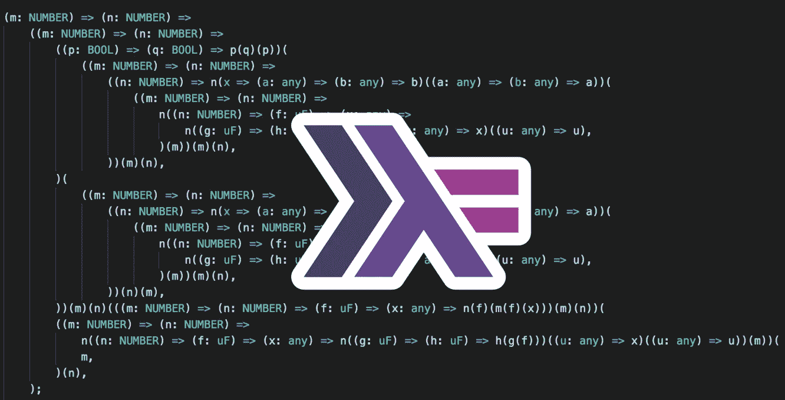
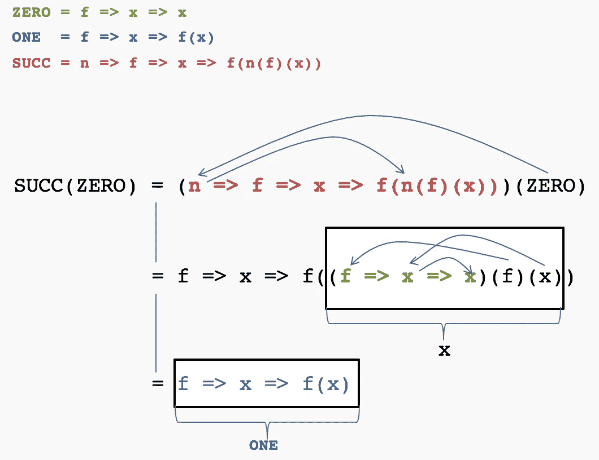

# 让我们编写函数式编程的根源:在 Typescript 中实现的 Lambda 演算

> 原文：<https://medium.com/hackernoon/lets-code-the-roots-of-functional-programming-lambda-calculus-implemented-in-typescript-36806ebc2857>



# 序幕

这是一篇关于类型脚本和函数式编程的文章。不是一篇关于 Lambda 微积分理论的文章。

我们将在 Typescript 中实现 Lambda 演算，作为练习函数式编程的一种方式。我们将只使用 Lambda 演算构造来解决一个简单的问题。

最终，也许理论的基础也会变得更加清晰。

# 问题和语言

要解决的问题很简单: ***如果 2 个数字*** `**n**` ***和*** `**m**` ***相等，则返回*** `**n + m**` ***否则返回*** `**m — n**`。

但是我们的语言只允许我们使用下面的结构

```
x => y  // anonymous function with 1 parameter (i.e. unary function) 
```

其中`x`和`y`可以是一切。`x`和`y`甚至可以是函数，所以在我们的语言中，以下也是有效的构造

```
x => y => z => z(x)(y)  // x is the parameter and the value returned is y => z => z(x)(y)
```

换句话说，要解决这个问题，我们只有匿名函数(也称为“胖箭头”函数)。没有 Javascript 原生`numbers`，没有`==`或`===`操作符，没有`if then else`。只是功能。请记住，在本文的其余部分

> 我们只有功能。

## λ演算

Lambda 演算为我们提供了仅使用函数来解决这个问题的理论基础。实际上，Lambda 演算只用函数就能解决任何可计算的问题。

什么是 Lambda 微积分？有许多资料提供了很好的描述。就本文的目的而言，Lambda 演算就是我们可以使用匿名函数来解决问题的简单事实。

在这里，我们想看看如何使这个概念具体化，用 Typescript 实现 Lambda 演算，并通过它解决我们的问题。在这个过程中，我们将广泛地，或者更好地，专门使用**函数式编程**技术，因为

> 我们只有功能。

考虑到 Lambda 演算也是函数式编程的基础，那么是的，我们可以说**我们要用 Typescript 编写根函数式编程。**

问题解决方案的完整代码和额外的 Lambda 演算构造可以在[这里](https://github.com/EnricoPicci/lambda-calculus-typescript)找到。

# 没有数字的数字

我们的问题从 2 个数字开始，但是我们不能使用 Javascript 数字，因为

> 我们只有功能。

所以我们需要发明一种方法来定义一个**的概念，一个*的数字*一个**的使用函数。

让我们开始说，数字零，一和二分别由

```
ZERO = f => x => x        // in lambda calculus this is ***λf.λx.x*** ONE = f => x => f(x)     // in lambda calculus this is ***λf.λx.fx*** TWO ***=*** f => x => f(f(x))  // in lambda calculus this is ***λf.λx.f(fx)***
```

如果`f`是一个函数，`x`是任意值，`ZERO` *返回* `*x*` ***从不*** *应用* `*f*` *而* `ONE` *返回应用* `*f*` *一次*`*x*`*`*TWO*`*的结果*所以基本上这是我们的约定:一个**数**由一个函数`f`被应用到自变量`x`的次数来表示。*

*所以机制是清楚的。一个数字 **n** 代表一个函数`f`对一个自变量`x` ***n 次*** 的应用。记住这个概念，我们后面会用到。对了，这叫数字的教会编码。这是λ演算的发明者阿隆佐·邱奇用来表示自然数的惯例。*

## *后继函数*

*到目前为止，我们已经对前 3 个数字进行了硬编码，但是我们需要找到一种更灵活、更智能的方式来定义数字。这种方式是由后继函数提供给我们的*

```
*SUCC = n => f => x => f(n(f)(x)) // equivalent to ***λn.λf.λx.f(nfx)****
```

*它看起来不是直接的，对吗？但是我们来推理一下。*

*先说`n`等于`ZERO`的情况。如果`n`是`ZERO`(记住`ZERO`已经被定义为`f => x => x`)那么将`SUCC(n)`应用于`ZERO`，即用`ZERO`的定义替换`n`，我们得到*

**

*Substitutions in SUCC(ZERO) to reach ONE*

*如果我们尝试`SUCC(ONE)`应用相同的机械替代，我们得到`TWO`。然后`SUCC(TWO)`就是`THREE`以此类推。*

## *关于奉承的几句话*

*我们刚刚定义了*

```
*SUCC = n => f => x => f(n(f)(x))*
```

*说得迂腐一点我们可以说`SUCC`是一个 ***函数*** 带 ***一个参数***`n`，返回一个 ***函数*** 带 ***一个参数***`f`，返回一个 ***函数*** 带 ***一个参数****

*因此，我们实际上可以说`SUCC`是三个参数`n` `f`和`x`的函数，并且一次应用一个参数。这种单参数的部分应用被称为*curry*。*

*从现在起，我们将自由地谈论 *m* 参数的函数，其中 *m ≥ 1* ，即使在这个概念后面总是有*curring*机制，因为 Lambda 函数根据定义是一元的，即只接受 1 个参数。*

## *让我们添加一些类型*

*如果我们按照惯例来看一个数的结构，我们会看到两件事*

*   *数字是一个函数，它有两个参数，`f`和`x`，并返回一些东西*
*   *第一个参数`f`本身必须是一元函数，因为它可以应用于每个数字体中的`x`*

*所以我们可以开始在 Typescript 中定义一些类型*

```
*type uF = (x: any) => any;                 // unary function
type NUMBER = (f: uF) => (x: any) => any;  // the type of numbers*
```

*然后也可以输入函数`SUCC`*

```
*SUCC = (n: NUMBER): NUMBER => (f: uF) => (x: any) => f(n(f)(x));*
```

*Typescript 为我们提供了向函数定义中添加类型的机会，这可以通过智能感知和类型检查为我们提供很大的帮助，特别是当我们想要解决的问题变得复杂时。*

## *但是如果这些是“数字”，我们能把它们看作正常的数字吗？*

*数字的 Church 编码是将一个函数应用于一个参数 n 次。这一切都很好，但是…*

*我们能把它们看成正常的数字吗，比如 0，1，2，36，49，112？*

*是的，我们可以。如果我们将一个 JavaScript 数字递增 1 的函数作为`f`传递，将 Javascript 数字 0 作为`x`传递，我们将获得对应于教堂编码数字的 Javascript 数字，如下例所示。*

*Get the Javascript encoding of Church number 2*

*同时，如果我们改变函数`f`和初始值，那么我们可以看到我们的教会用不同格式编码的数字。例如，在这里，一个教堂号码 **n** 被转换成一串 n 个字符`*`。*

# *没有布尔的布尔*

*对于布尔值，我们必须面对与数字相同的问题。我们需要用一种没有这些概念的语言来定义真和假，这种语言*

> *我们只有功能。*

*我们再次回到惯例。直觉:在 Javascript 三元运算符中，`condition ? first : second`、 **True** 表示选择第一个选项， **False** 表示选择第二个选项。*

*我们在这里使用相同的约定，教会对布尔的编码，即*

```
*// TRUE and FALSE are binary functions, they expect 2 parameters
TRUE  =  **x** => y => **x**   // TRUE returns the **first** parameter
FALSE =  x => **y** => **y**   // FALSE returns the **second** parameter*
```

*现在我们将看到这种约定实际上是如何适用于布尔运算符的。*

## *AND 函数*

*现在让我们看看如何构建一个行为类似于`AND`的函数，也就是说，它需要两个教会编码的布尔参数`p`和`q`，并且只有当两个参数都是`TRUE`时才返回`TRUE`。*

*`AND`必须有以下形式*

```
*AND = p => q => ....   // p and q are Church encoded booleans*
```

*`p`和`q`是我们仅有的东西，所以我们最好在函数体中使用它们。*

*我们尝试用`p`开始主体的实现，它本身是一个二进制函数，因为它是一个教会编码的布尔值。*

```
*AND = p => q => p(_)(_)  // p expects 2 arguments*
```

*如果`p`是`FALSE`，根据`FALSE`的定义，它选择第二个参数。但是如果`p`是`FALSE`，那么`AND`的结果必须是`FALSE`，因此`p`之后的第二个参数必须是`FALSE`。*

```
*AND = p => q => p(_)(FALSE) // if p is false it selects the 2nd arg*
```

*如果`p`是`TRUE`，那么根据`TRUE`的定义，选择`p`之后的第一个自变量。但是在这种情况下，`AND`的结果取决于`q`的值。如果`q`为`TRUE`，则结果为`TRUE`，否则为`FALSE`。但这意味着`p`之后的第一个参数是`q`本身。*

```
*AND = p => q => p(q)(FALSE) // if p is true it selects q as result*
```

*我们现在可以做最后的简化。`p`的第二个参数是`FALSE`，只有当`p`为`FALSE`时才选择。这意味着我们可以用`p`代替`FALSE`作为函数的最终版本*

```
*AND = p => q => p(q)(p)*
```

*甚至对称版本也能工作*

```
*AND = p => q => q(p)(q)*
```

*用类似的方法，可以找到所有其他布尔运算符。*

*我们可以向 Church 编码的布尔值添加类型，并测试我们的逻辑的正确性，如本例所示。*

*The AND function typed and tested*

# *没有比较运算符的比较*

*我们的问题要求我们比较两个数字，但是我们没有像`==`或`===`这样的比较运算符，*

> *我们只有功能。*

*我们需要找到不同的策略。请容忍我的旅程。*

*检查两个数`n`和`m`是否等于*的一种方法是检查`n`是否小于等于*到`m``m`是否小于等于*到`n`。假设我们有一个函数`LEQ(m)(n)`，如果`m`是 ***小于或等于*** `n`，它返回`TRUE`，那么我们可以将`EQ`函数定义为****

```
**EQ(m)(n) = AND (LEQ(m)(n)) (LEQ(m)(n))**
```

**现在我们需要定义`LEQ`。**

**假设我们有两个函数，SUB 和 ISZERO，定义如下:**

*   **`SUB(m)(n)`从`m`中减去`n`，这样，如果`n`大于`m`，结果总是`ZERO`，否则就是`m-n`**
*   **如果`n`是`ZERO`，则`ISZERO(n)`返回`TRUE`，否则返回`FALSE`**

**我们现在可以将`LEQ`表示为**

```
**LEQ(m)(n) = ISZERO(SUB(m)(n))**
```

**好了，我们现在只剩下定义`ISZERO`和`SUB`的问题了。**

## **检查数字是否为零**

**`ISZERO`是一个函数，它需要一个教堂编码的数字作为它的参数。教会编码的数字`n`本身就是一个二元函数，它是我们唯一被给予的东西，所以我们最好以某种方式使用它**

```
**ISZERO(n) = n(**x**)(**y**) // we need to find the right **x** and **y****
```

**先说`n`为`ZERO,`即`n = f => x => x`的情况。根据定义，`ZERO`总是返回第二个参数，因此`**y**`必须是`TRUE`。**

```
**ISZERO(n) = n(**x**)(TRUE) // we need to find the right **x** for n not ZERO**
```

**现在我们来考虑一下`n = ONE`，也就是`n = f => x => f(x)`。在这种情况下，对于`x`的任何值，`f`必须始终返回`FALSE`。也就是说`f = x => FALSE`。**

**所以最终`ISZERO`是**

```
**ISZERO(n) = n(x => FALSE)(TRUE)**
```

**我们可以用下面的代码对此进行测试**

## **从`m`中减去`n`**

**如果我们有一个返回`n`的前任的函数`PRED(n)`，那么我们可以说从`m`中减去`n`相当于将 n 倍的`PRED`函数应用于`m`。但是，如果你还记得我们在介绍数字的教会编码时说过的话，`***n***`本身代表了函数`f`对参数`x` ***n 次*** 的应用。换句话说**

```
**SUB(m)(n) = n(PRED)(m)**
```

**现在，让我们大胆地接受以下 PRED 的定义**

```
**const PRED = n => f => x => n(g => h => h(g(f)))(u => x)(u => u)**
```

**感兴趣的，本文末尾有对`PRED`的解释。**

## **n 到 m 的总和**

**与我们如何构造`SUB`类似，我们可以使用后继函数来构造`SUM`,如下所示**

```
**SUM(n)(m) = n(SUCC)(m)**
```

# **现在我们可以构建解决方案**

**我们还记得最初的问题吗？**

```
**if (n = m) {
  return n + m;  // return the sum if n and m are equal
} else {
  return n — m;  // return the difference if not equal
}**
```

**现在我们有了所有的工具来解决这个问题**

> **我们只有功能..**

**看看这个**

```
**EQ(n)(m)      // returns TRUE if n and m are equal, FALSE otherwise
(SUM(n)(m))   // argument picked if EQ returns TRUE
(SUB(n)(m))   // argument picked if EQ returns FALSE**
```

**这正是我们问题的解决方案，运行下面的代码可以证明这一点**

**更多细节和测试可以在[报告](https://github.com/EnricoPicci/lambda-calculus-typescript/blob/master/examples/problem-solution.ts)中看到。**

**顺便说一下，如果我们替换掉`EQ` `SUM` `SUB`和所有其他我们为了方便而添加的定义，我们的解决方案的代码是这样的**

**Solution code showing only anonymous functions**

# **最后:函数式程序员有什么好处？**

**我们一直在玩函数。我们已经定义了它们，将它们作为参数传递，期望作为参数，评估它们。在我们的法典中，他们被视为一等公民，这一点我们已经越来越熟悉了。**

**我们已经做了一些练习，这些练习帮助我们理解了在函数式编程方法中使用函数的动力学和力学。**

**例如，如果我们看到这个**

```
**FLIP = f => a => b => f(b)(a)**
```

**我们理解是使用`f`的一种方式，参数顺序颠倒。并且可以在 **lodash** 和 **rambda** 库中找到 FLIP 等价物。FP 库实现的其他魔法现在应该更清楚了。如果是这样，我们就达到了本文的目的。**

# **对于真正感兴趣的人:如何使用 Pairs 构建 PRED 函数**

**这是什么？**

```
**x => y => f => f(x)(y)**
```

**这是一个 ***对*** ，一个二维向量。，实际上这种方式编码一个 ***对一个*** 同功能。**

**考虑以下情况**

```
**const PAIR = x => y => f => f(x)(y);
const myPair = PAIR(1)(2);**
```

**`myPair`是一个包含`1`和`2`作为其不可变值的结构。我们只需要传递一个函数给`myPair`来指定我们想要用它的值做什么。**

**可以使用符号`**(n, m).**`定义一对`n`和`m`**

**如果我们想得到一个 ***对*** 的第二个值，我们只需将 FALSE 函数传递给 ***对*****

```
**SECOND = p => p(FALSE)    // where p is a ***pair*****
```

**我们可以用下面的代码进行测试**

**类似地，功能`FIRST`是**

```
**FIRST = = p => p(TRUE)    // where p is a ***pair*****
```

**我们现在可以定义另一个函数`PHI`，如下所示**

```
**PHI = p => PAIR(SECOND(p))(SUCCESSOR(SECOND(p)))  // p is a PAIR**
```

**PHI 将 ***对*** `(m, n)`转换成新的 ***对*** `(n, n + 1)`。**

**所以，**

*   **`PHI(0,0)`回报`(0,1)`**
*   **`PHI(PHI(0,0))`等于`PHI(0,1)`，返回`(1,2)`**
*   **`PHI(PHI(PHI(0,0)`等于`PHI(1,2)`，后者返回`(2,3)`**

**外推我们可以说`PHI`到`(0,0)`的`n`应用返回了 ***对*** `(n-1, n)`。这导致`PRED`的定义为**

```
**PRED = n => FIRST(n(PHI)(PAIR(ZERO)(ZERO)))**
```

**还有其他方法来构造 PRED 函数，但这可能是更自然的方法。**

## **感谢**

**本文从 Gabriel Lebec(@ glebec)[“Lambda Calculus”](https://www.youtube.com/watch?v=3VQ382QG-y4)和[“一群函数”](https://www.youtube.com/watch?v=pAnLQ9jwN-E)的两个伟大演讲中获得灵感。我真的建议任何对这个论点感兴趣的人仔细看看。**

****